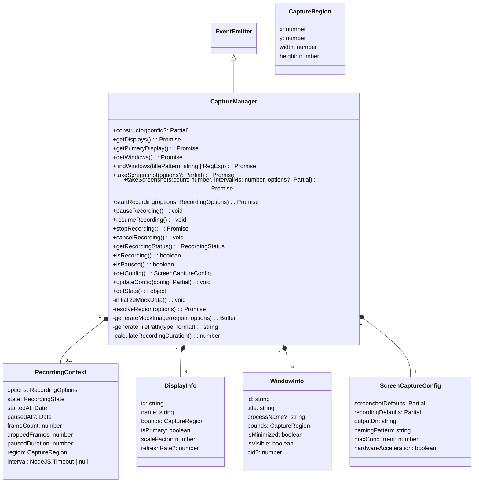

# src — screen-capture

The `src/screen-capture` module provides a comprehensive, event-driven API for programmatically taking screenshots and recording screen activity. It offers capabilities to discover available displays and windows, capture specific regions, and manage the lifecycle of recording sessions.

**Important Note:** This module currently implements a **mock** version of the screen capture functionality. It simulates operations like taking screenshots and recording, generating mock data and paths, but does not interact with the actual operating system's screen capture APIs. A real implementation would integrate with native modules or external tools (e.g., `ffmpeg`, `scrot`).

## 1. Core Concepts and Types

The module defines several key types to represent capture sources, options, and results. These are exported from `src/screen-capture/types.ts`.

### Capture Sources and Regions

-   **`CaptureType`**: `'screenshot' | 'recording'` - Denotes the type of capture operation.
-   **`CaptureSource`**: `'screen' | 'window' | 'region' | 'display'` - Specifies what part of the screen is being captured.
-   **`CaptureRegion`**: An interface defining a rectangular area with `x`, `y`, `width`, and `height` properties.

### Display and Window Information

-   **`DisplayInfo`**: An interface providing details about a connected display, including its `id`, `name`, `bounds` (as `CaptureRegion`), `isPrimary` status, `scaleFactor`, and `refreshRate`.
-   **`WindowInfo`**: An interface providing details about an open window, including its `id`, `title`, `processName`, `bounds`, `isMinimized` status, `isVisible` status, and `pid` (process ID).

### Screenshot Types

-   **`ScreenshotOptions`**: An interface to configure a screenshot operation. It includes properties like `path` (output file), `format`, `quality`, `source` (e.g., 'window', 'display'), `delayMs`, and `scale`.
    -   `DEFAULT_SCREENSHOT_OPTIONS` provides sensible default values for these options.
-   **`ScreenshotResult`**: An interface containing the outcome of a screenshot operation. It includes the captured `data` (as a `Buffer`), `format`, `width`, `height`, `path`, `timestamp`, and `source` information.

### Recording Types

-   **`RecordingOptions`**: An interface to configure a recording operation. It includes properties like `path`, `format`, `codec`, `fps`, `quality`, `bitrate`, `source`, `includeAudio`, and `maxDurationMs`.
    -   `DEFAULT_RECORDING_OPTIONS` provides sensible default values for these options.
-   **`RecordingResult`**: An interface summarizing a completed recording. It includes the `path`, `format`, `durationMs`, `frameCount`, `avgFps`, `size`, `startedAt`, `endedAt`, `source` information, and `resolution`.
-   **`RecordingState`**: A union type representing the current state of a recording: `'idle' | 'starting' | 'recording' | 'paused' | 'stopping' | 'stopped'`.
-   **`RecordingStatus`**: An interface providing real-time information about an ongoing recording, including its `state`, `durationMs`, `frameCount`, `currentFps`, `currentSize`, `droppedFrames`, `startedAt`, and `pausedAt`.

### Configuration

-   **`ScreenCaptureConfig`**: An interface for global configuration of the capture manager. It allows setting `screenshotDefaults`, `recordingDefaults`, `outputDir`, `namingPattern`, `maxConcurrent` captures, and `hardwareAcceleration` preferences.
    -   `DEFAULT_SCREEN_CAPTURE_CONFIG` defines the initial configuration.

### Events

-   **`ScreenCaptureEvents`**: An interface defining the custom events emitted by the `CaptureManager` during various stages of capture operations (e.g., `screenshot-start`, `recording-progress`, `recording-complete`).

## 2. `CaptureManager` Class

The `CaptureManager` class (`src/screen-capture/capture-manager.ts`) is the central interface for all screen capture and recording operations. It extends Node.js's `EventEmitter` to provide event-driven feedback on capture progress and status.



### 2.1. Initialization and Configuration

-   **`constructor(config: Partial<ScreenCaptureConfig> = {})`**: Initializes the manager with provided configuration, merging it with `DEFAULT_SCREEN_CAPTURE_CONFIG`. It also calls `initializeMockData()` to set up static display and window information.
-   **`getConfig(): ScreenCaptureConfig`**: Returns a copy of the current configuration.
-   **`updateConfig(config: Partial<ScreenCaptureConfig>): void`**: Merges new configuration settings into the existing configuration.

### 2.2. Display and Window Discovery (Mocked)

These asynchronous methods provide information about available screens and windows. In this mock implementation, they return predefined static data initialized by `initializeMockData()`.
-   **`getDisplays(): Promise<DisplayInfo[]>`**: Returns a list of all mock displays.
-   **`getPrimaryDisplay(): Promise<DisplayInfo | undefined>`**: Returns the primary mock display.
-   **`getDisplay(id: string): Promise<DisplayInfo | undefined>`**: Finds a mock display by its ID.
-   **`getWindows(): Promise<WindowInfo[]>`**: Returns a list of all visible, non-minimized mock windows.
-   **`getWindow(id: string): Promise<WindowInfo | undefined>`**: Finds a mock window by its ID.
-   **`findWindows(titlePattern: string | RegExp): Promise<WindowInfo[]>`**: Filters mock windows by title using a regular expression pattern.

### 2.3. Screenshot Functionality

The manager supports both single and multiple screenshot operations.
-   **`takeScreenshot(options: Partial<ScreenshotOptions> = {}): Promise<ScreenshotResult>`**:
    -   Takes a single screenshot based on the provided options, merging them with `DEFAULT_SCREENSHOT_OPTIONS` and `config.screenshotDefaults`.
    -   Emits `screenshot-start` before processing.
    -   Determines the target capture region using `resolveRegion` (prioritizing `region`, then `windowId`, then `displayId`, falling back to the primary display).
    -   Generates mock image data using `generateMockImage` and a mock file path using `generateFilePath`.
    -   Emits `screenshot-complete` upon success or `screenshot-error` if an error occurs.
-   **`takeScreenshots(count: number, intervalMs: number, options: Partial<ScreenshotOptions> = {}): Promise<ScreenshotResult[]>`**:
    -   Takes `count` screenshots with `intervalMs` delay between each.
    -   Internally calls `takeScreenshot` for each capture, adjusting the output path for sequential naming.

### 2.4. Recording Functionality

The manager provides a full lifecycle for screen recording, including start, pause, resume, and stop.
-   **`startRecording(options: RecordingOptions): Promise<void>`**:
    -   Initiates a recording session. Throws an error if a recording is already in progress.
    -   Merges options with `DEFAULT_RECORDING_OPTIONS` and `config.recordingDefaults`.
    -   Resolves the capture region using `resolveRegion`.
    -   Sets up an internal `setInterval` to simulate frame capture and progress updates, emitting `recording-progress` events.
    -   Emits `recording-start`.
    -   **Self-termination:** If `maxDurationMs` is set, the recording will automatically call `stopRecording()` when the active duration is reached.
-   **`pauseRecording(): void`**:
    -   Pauses an active recording. Throws an error if no recording is active or it's not in the `'recording'` state.
    -   Updates the internal `RecordingContext` state to `'paused'` and emits `recording-pause`.
-   **`resumeRecording(): void`**:
    -   Resumes a paused recording. Throws an error if no recording is paused.
    -   Updates the internal `RecordingContext` state to `'recording'`, accounts for the duration of the pause, and emits `recording-resume`.
-   **`stopRecording(): Promise<RecordingResult>`**:
    -   Stops the current recording session. Throws an error if no recording is active.
    -   Clears the internal frame capture interval.
    -   Calculates final metrics (duration, FPS, size) using `calculateRecordingDuration`.
    -   Emits `recording-stop` and `recording-complete`.
-   **`cancelRecording(): void`**:
    -   Immediately stops and discards the current recording without generating a result.
    -   Clears the interval and resets the recording state.
    -   Emits `recording-error` with a "Recording cancelled" message.
-   **`getRecordingStatus(): RecordingStatus`**:
    -   Returns the current state and metrics of the ongoing or last recording, calculated using `calculateRecordingDuration`.
-   **`isRecording(): boolean`**: Checks if a recording is currently active (state `'recording'`).
-   **`isPaused(): boolean`**: Checks if a recording is currently paused (state `'paused'`).

### 2.5. Private Helpers

The `CaptureManager` uses several private methods for internal logic:
-   **`initializeMockData(): void`**: Populates `this.displays` and `this.windows` with static mock data.
-   **`resolveRegion(options: Partial<ScreenshotOptions | RecordingOptions>): Promise<CaptureRegion>`**: Determines the `CaptureRegion` based on provided options, falling back to the primary display if no specific region, window, or display is specified.
-   **`generateMockImage(region: CaptureRegion, options: ScreenshotOptions): Buffer`**: Creates a `Buffer` of random bytes to simulate image data, scaled by `options.scale` and capped at 1MB.
-   **`generateFilePath(type: string, format: string): string`**: Constructs a file path based on the configured `outputDir` and `namingPattern`, incorporating the capture `type` and a timestamp.
-   **`calculateRecordingDuration(): number`**: Computes the active recording duration, accurately accounting for any paused periods.

### 2.6. Events Emitted

The `CaptureManager` emits the following events, which can be subscribed to using `manager.on()`:
-   `screenshot-start(options: ScreenshotOptions)`
-   `screenshot-complete(result: ScreenshotResult)`
-   `screenshot-error(error: Error)`
-   `recording-start(options: RecordingOptions)`
-   `recording-progress(status: RecordingStatus)`
-   `recording-pause()`
-   `recording-resume()`
-   `recording-stop()`
-   `recording-complete(result: RecordingResult)`
-   `recording-error(error: Error)`

## 3. Singleton Access

For convenience and to ensure a single point of control for screen capture operations, the module provides a singleton pattern:
-   **`getCaptureManager(config?: Partial<ScreenCaptureConfig>): CaptureManager`**:
    -   Returns the singleton instance of `CaptureManager`. If no instance exists, it creates one, optionally applying initial configuration. Subsequent calls return the same instance.
-   **`resetCaptureManager(): void`**:
    -   Resets the singleton instance. If a recording is active, it will be cancelled via `cancelRecording()`. This is primarily useful for testing or re-initialization scenarios.

## 4. Module Entry Point (`src/screen-capture/index.ts`)

This file serves as the public API for the screen capture module. It re-exports all necessary types, default options, and the `CaptureManager` class along with its singleton access functions, making them easily importable.

## 5. Usage Examples

### Getting the Manager and Configuration

```typescript
import { getCaptureManager, DEFAULT_SCREEN_CAPTURE_CONFIG } from './screen-capture/index.js';

// Get the singleton instance, optionally providing initial config
const manager = getCaptureManager({
  outputDir: './my-captures',
  namingPattern: 'capture_{type}_{timestamp}',
});

console.log('Current config:', manager.getConfig());

// Update configuration later
manager.updateConfig({ hardwareAcceleration: false });
```

### Discovering Displays and Windows

```typescript
import { getCaptureManager } from './screen-capture/index.js';

const manager = getCaptureManager();

async function discover() {
  const displays = await manager.getDisplays();
  console.log('Displays:', displays);

  const primaryDisplay = await manager.getPrimaryDisplay();
  console.log('Primary Display:', primaryDisplay);

  const windows = await manager.getWindows();
  console.log('Visible Windows:', windows);

  // Find windows by title pattern (case-insensitive regex)
  const terminalWindows = await manager.findWindows(/terminal/i);
  console.log('Terminal Windows:', terminalWindows);
}

discover();
```

### Taking a Screenshot

```typescript
import { getCaptureManager } from './screen-capture/index.js';

const manager = getCaptureManager();

// Listen for events
manager.on('screenshot-complete', (result) => {
  console.log(`Screenshot saved to: ${result.path}`);
  console.log(`Image size: ${result.width}x${result.height}, ${result.size} bytes`);
});

manager.on('screenshot-error', (error) => {
  console.error('Screenshot failed:', error.message);
});

async function takeMyScreenshot() {
  try {
    const primaryDisplay = await manager.getPrimaryDisplay();
    if (!primaryDisplay) {
      console.error('No primary display found.');
      return;
    }

    // Take a single screenshot of the primary display with a delay
    const result = await manager.takeScreenshot({
      displayId: primaryDisplay.id,
      format: 'jpeg',
      quality: 85,
      delayMs: 1000, // 1 second delay
    });
    console.log('Screenshot operation complete (promise resolved).');

    // Take multiple screenshots with an interval
    const results = await manager.takeScreenshots(3, 2000, {
      format: 'png',
      path: './my-captures/series.png' // Will generate series_0.png, series_1.png, etc.
    });
    console.log(`Captured ${results.length} screenshots in a series.`);

  } catch (error) {
    console.error('Error during screenshot:', error);
  }
}

takeMyScreenshot();
```

### Recording the Screen

```typescript
import { getCaptureManager } from './screen-capture/index.js';

const manager = getCaptureManager();

// Listen for recording events
manager.on('recording-start', (options) => console.log('Recording started with options:', options));
manager.on('recording-progress', (status) => {
  console.log(`Recording state: ${status.state}, Duration: ${status.durationMs}ms, Frames: ${status.frameCount}`);
});
manager.on('recording-pause', () => console.log('Recording paused.'));
manager.on('recording-resume', () => console.log('Recording resumed.'));
manager.on('recording-complete', (result) => {
  console.log(`Recording complete! Saved to: ${result.path}, Duration: ${result.durationMs}ms`);
});
manager.on('recording-error', (error) => console.error('Recording error:', error.message));

async function recordMyScreen() {
  try {
    const primaryDisplay = await manager.getPrimaryDisplay();
    if (!primaryDisplay) {
      console.error('No primary display found.');
      return;
    }

    await manager.startRecording({
      path: './my-captures/my-recording.mp4',
      displayId: primaryDisplay.id,
      fps: 25,
      maxDurationMs: 10000, // Record for 10 seconds of active time
    });

    console.log('Recording in progress...');

    // Simulate pausing after 3 seconds
    setTimeout(() => {
      if (manager.isRecording()) {
        manager.pauseRecording();
        console.log('Recording paused for 2 seconds.');
      }
    }, 3000);

    // Simulate resuming after 5 seconds (2 seconds after pause)
    setTimeout(() => {
      if (manager.isPaused()) {
        manager.resumeRecording();
        console.log('Recording resumed.');
      }
    }, 5000);

    // The recording will automatically stop after maxDurationMs (10 seconds total active recording)
    // You could also manually stop it:
    // setTimeout(async () => {
    //   if (manager.isRecording() || manager.isPaused()) {
    //     const result = await manager.stopRecording();
    //     console.log('Manually stopped recording.');
    //   }
    // }, 12000); // Stop after 12 seconds total elapsed time
  } catch (error) {
    console.error('Failed to start recording:', error);
  }
}

recordMyScreen();
```

## 6. Mock Implementation Details

It's crucial to understand that this module is a **mock**. This means:
-   **No Actual OS Interaction:** It does not capture pixels from the screen or interact with native windowing systems.
-   **Static Data:** `getDisplays()` and `getWindows()` return hardcoded `DisplayInfo` and `WindowInfo` objects defined in `initializeMockData()`.
-   **Simulated Output:** `generateMockImage()` creates a `Buffer` filled with random bytes, not actual image data. Recording "frames" are simulated by incrementing a counter and emitting progress events.
-   **File Paths Only:** While `path` properties are generated, no actual files are written to disk.
-   **Time-Based Simulation:** Delays, durations, and FPS are simulated using `setTimeout` and `setInterval`.

This mock implementation is valuable for:
-   **API Design and Validation:** Testing the API surface and ensuring it meets requirements.
-   **Integration Testing:** Allowing other parts of the application to integrate with the screen capture module without needing a full native implementation.
-   **Development Workflow:** Enabling development on platforms where native screen capture might be complex or unavailable.

A real implementation would replace the mock logic in methods like `initializeMockData`, `generateMockImage`, and the `setInterval` loop in `startRecording` with calls to native OS APIs or external tools (e.g., `scrot` for screenshots, `ffmpeg` for recordings).

## 7. Connections to the Wider Codebase

This module is designed to be a self-contained utility for screen capture.
-   **Primary Consumer:** The `capture.test.ts` file extensively uses `CaptureManager` and its methods to validate its functionality, demonstrating its intended usage.
-   **Internal Dependencies:** It relies on Node.js's built-in `events` module for `EventEmitter`, `crypto` for mock data generation, and `path` for file path manipulation.
-   **External Dependencies:** The `findWindows` method uses `RegExp.test` for pattern matching, which is a standard JavaScript feature.
-   **No Direct Outgoing Calls (beyond standard library):** The mock nature means it doesn't directly call out to other custom modules in the codebase for its core functionality, keeping it isolated.
-   **Type Definitions:** The `types.ts` file is a central point for defining interfaces used throughout the module, ensuring type safety and clarity across the API.

This module provides a robust, albeit mocked, foundation for screen capture and recording, ready for integration with native capabilities when required.