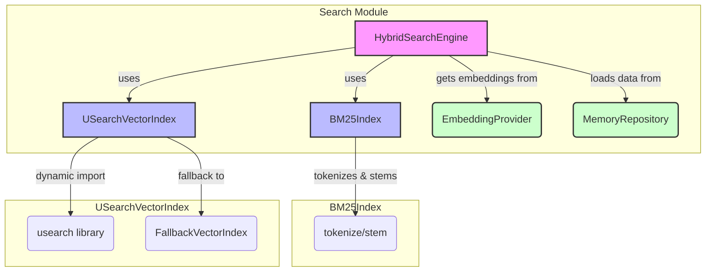

# src — search

The `src/search` module provides a robust and flexible search engine designed to combine the strengths of traditional keyword-based search with modern vector similarity search. This "hybrid search" approach aims to deliver superior recall and precision by understanding both the literal terms in a query and its semantic meaning.

It is built around three core components:
1.  **BM25Index**: An in-memory implementation of the BM25 (Best Match 25) ranking algorithm for keyword search.
2.  **USearchVectorIndex**: A high-performance vector index leveraging the `usearch` library for approximate nearest neighbor (ANN) search, enabling semantic similarity.
3.  **HybridSearchEngine**: An orchestrator that combines results from both BM25 and vector indexes, applies configurable weighting, and manages data sources and caching.

This module is designed to be developer-focused, offering clear APIs for indexing, searching, and managing search data across various application domains like user memories, code snippets, or messages.

## Architecture Overview

The `HybridSearchEngine` acts as the central coordinator. Upon initialization, it sets up dedicated `BM25Index` and `USearchVectorIndex` instances for each configured `SearchSource` (e.g., 'memories', 'code', 'messages'). When a search query is received, it dispatches the query to both the relevant BM25 and vector indexes, retrieves embeddings from an `EmbeddingProvider`, and then intelligently merges and ranks the results.



## Key Components

### 1. BM25 Keyword Search (`src/search/bm25.ts`)

This component provides an in-memory implementation of the BM25 ranking function, a standard for keyword-based full-text search.

#### Tokenization and Stemming

Before indexing or searching, text content is processed to extract meaningful terms.

*   `tokenize(text: string): string[]`: A simple tokenizer that converts text to lowercase, removes most punctuation, splits on whitespace, filters out very short tokens, and removes common English stopwords (defined in `STOPWORDS`).
*   `stem(word: string): string`: A simplified Porter stemmer that reduces words to their root form by stripping common suffixes. This helps match variations of a word (e.g., "running" -> "run").
*   `tokenizeAndStem(text: string): string[]`: A utility function that combines `tokenize` and `stem` for a complete text processing pipeline.

#### `BM25Index` Class

The `BM25Index` class manages the inverted index and calculates BM25 scores.

*   **`constructor(config: Partial<BM25Config>)`**: Initializes the index with configurable parameters like `k1` (term frequency saturation) and `b` (length normalization).
*   **`addDocument(doc: BM25Document)`**: Adds a document to the index. It first tokenizes and stems the document's `content`, then updates internal data structures:
    *   `documents`: Stores the original `BM25Document`.
    *   `documentLengths`: Stores the token count for each document.
    *   `termFrequencies`: An inverted index mapping `term -> docId -> frequency`.
    *   `documentFrequencies`: Maps `term -> count of documents containing the term`.
    *   `avgDocLength`: Recalculated after each addition/removal.
    If a document with the same `id` already exists, it's removed first (an upsert operation).
*   **`removeDocument(docId: string)`**: Removes a document and updates all related frequency counts.
*   **`search(query: string, limit: number)`**: The core search method.
    1.  Tokenizes and stems the `query`.
    2.  Iterates through all documents in the index.
    3.  For each document and each query term, it calculates the BM25 score using the formula:
        `score = IDF * TF_normalized`
        Where:
        *   `IDF` (Inverse Document Frequency) measures how rare a term is across all documents.
        *   `TF_normalized` (Term Frequency) measures how often a term appears in a document, normalized by document length and `k1`/`b` parameters.
    4.  Returns a sorted list of `{ id, score }` pairs, limited by `limit`.
*   **`static normalizeScores(results: Array<{ id: string; score: number }>)`**: A static helper to normalize search scores to a 0-1 range, useful for combining with other scoring methods.
*   **`getStats(): BM25Stats`**: Provides statistics about the index, such as total documents, unique terms, and average document length.
*   **`clear(): void`**: Empties the entire index.

#### Singleton Management

The `bm25.ts` module also provides functions to manage named `BM25Index` instances as singletons:
*   `getBM25Index(name: string, config?: Partial<BM25Config>)`: Retrieves an existing index or creates a new one.
*   `removeBM25Index(name: string)`: Disposes of a specific named index.
*   `clearAllBM25Indexes()`: Clears all managed BM25 indexes.

### 2. USearch Vector Search (`src/search/usearch-index.ts`)

This component integrates the `usearch` library for high-performance vector similarity search, enabling semantic search capabilities. It supports approximate nearest neighbor (ANN) search using the HNSW algorithm, offering `O(log n)` search complexity.

#### `USearchVectorIndex` Class

The `USearchVectorIndex` class wraps the native `usearch` index and manages vector data, IDs, and metadata.

*   **`constructor(config: USearchIndexConfig)`**: Initializes with parameters like `dimensions`, `metric` (e.g., 'cos', 'l2sq'), `connectivity`, and `expansion` factors for HNSW. It also supports `persistPath` for disk-based storage.
*   **`initialize(): Promise<void>`**: Dynamically imports the `usearch` library. If `usearch` is not installed or fails to load, it gracefully falls back to an in-memory `FallbackVectorIndex` (brute-force search).
*   **`add(vector: IndexableVector)`**: Adds a single vector. It maps string `id`s to numeric keys required by `usearch` and stores associated metadata. It handles upserts by attempting to remove existing vectors with the same ID.
*   **`addBatch(vectors: IndexableVector[])`**: Efficiently adds multiple vectors.
*   **`remove(id: string)`**: Removes a vector by its string ID.
*   **`search(query: number[] | Float32Array, k: number)`**: Performs an ANN search for the `k` nearest neighbors to the `query` vector. It converts the raw `usearch` distances into a normalized similarity `score` (0-1) based on the configured `metric`.
*   **`save(path?: string)` / `load(path: string)`**: Provides persistence for the `usearch` index and its internal ID-to-key mappings and metadata.
*   **`getStats(): USearchStats`**: Returns statistics like index size, dimensions, and estimated memory usage.
*   **`size(): number`**: Returns the number of vectors in the index.
*   **`clear(): void`**: Clears all vectors and associated mappings.
*   **`dispose(): void`**: Clears the index and attempts to delete any persisted files.

#### `FallbackVectorIndex`

This internal class provides a basic, brute-force vector search implementation. It is used automatically if the native `usearch` library cannot be loaded, ensuring the application can still function (albeit with reduced performance for large datasets). It implements `add`, `remove`, and `search` using standard distance calculations (cosine, L2 squared, inner product).

#### Singleton Management

Similar to `BM25Index`, `USearchVectorIndex` instances can be managed as singletons:
*   `getUSearchIndex(name: string, config?: USearchIndexConfig)`: Retrieves or creates a named index.
*   `removeUSearchIndex(name: string)`: Disposes of a specific named index.
*   `clearAllUSearchIndexes()`: Clears all managed USearch indexes.

### 3. Hybrid Search Engine (`src/search/hybrid-search.ts`)

The `HybridSearchEngine` is the primary API for performing searches. It orchestrates the `BM25Index` and `USearchVectorIndex` to provide a unified, configurable search experience.

#### `HybridSearchEngine` Class

*   **`constructor(config: Partial<HybridSearchConfig>)`**: Initializes with global configuration, including default weights for vector and BM25 search, result limits, and caching settings.
*   **`initialize(): Promise<void>`**:
    *   Initializes the `EmbeddingProvider` (e.g., `Xenova/all-MiniLM-L6-v2` for local embeddings) and `MemoryRepository`.
    *   Creates `BM25Index` and `USearchVectorIndex` instances for each `SearchSource` ('memories', 'code', 'messages', 'cache').
    *   Calls `rebuildIndexes()` to populate the indexes from existing data (e.g., `MemoryRepository`).
*   **`search(options: HybridSearchOptions): Promise<HybridSearchResult[]>`**:
    *   The main entry point for hybrid search.
    *   Handles query validation and caching (`enableCache`, `cacheTTL`).
    *   Dispatches the query to `searchSource` for each specified `source`.
    *   Combines results from all sources, sorts them by the calculated hybrid score, filters by `minScore`, and applies the `limit`.
    *   Emits events (`search:started`, `search:completed`, `search:error`) for monitoring.
*   **`private searchSource(...)`**:
    *   Performs BM25 search using the relevant `BM25Index`.
    *   Performs vector search using `vectorSearch` (which uses `USearchVectorIndex`).
    *   Merges results from both methods by document ID.
    *   Calculates a `combinedScore` using `vectorWeight` and `bm25Weight`. If one search method yields no results for a document, the weights are adjusted to give full weight to the other method.
*   **`private vectorSearch(...)`**:
    *   Generates an embedding for the `query` using the `embeddingProvider`.
    *   Searches the `USearchVectorIndex` for the given `source`.
    *   Retrieves the full content and metadata for vector search results from the corresponding `BM25Index` (as `USearchVectorIndex` only stores IDs and embeddings).
*   **Indexing and Removal**:
    *   `indexDocument(source, doc)`, `indexDocuments(source, docs)`: Adds documents to the specified `BM25Index`.
    *   `removeDocument(source, docId)`: Removes from `BM25Index`.
    *   `indexVector(source, id, embedding, metadata)`, `indexVectors(source, vectors)`: Adds vectors to the specified `USearchVectorIndex`.
    *   `removeVector(source, id)`: Removes from `USearchVectorIndex`.
*   **`rebuildIndexes(): Promise<void>`**: Clears and repopulates the 'memories' indexes (both BM25 and vector) by fetching all memories from the `MemoryRepository`.
*   **`getStats()`**: Provides comprehensive statistics for all managed BM25 and vector indexes, as well as cache size and provider availability.
*   **`clearCache()`**: Clears the internal search result cache.
*   **`dispose()`**: Cleans up all internal indexes and resources.
*   **Events**: Extends `EventEmitter` and emits various events like `search:started`, `search:completed`, `index:updated`, `cache:hit`, `cache:miss`.

#### Singleton Management

*   `getHybridSearchEngine(config?: Partial<HybridSearchConfig>)`: Retrieves the singleton instance of `HybridSearchEngine` or creates it if it doesn't exist.
*   `resetHybridSearchEngine()`: Disposes of the current singleton and sets it to `null`, allowing a new instance to be created.

### 4. Types (`src/search/types.ts`)

This file defines all the essential interfaces and types used across the search module, ensuring type safety and clarity.

*   **`HybridSearchResult`**: The structure of a combined search result, including `id`, `content`, `score` (hybrid), `vectorScore`, `bm25Score`, `source`, and `metadata`.
*   **`HybridSearchOptions`**: Defines parameters for a search query, such as `query`, `limit`, `minScore`, `vectorWeight`, `bm25Weight`, `sources`, and flags for `vectorOnly` or `bm25Only` search.
*   **`HybridSearchConfig`**: Configuration for the `HybridSearchEngine`, including default weights, limits, and caching settings.
*   **`SearchSource`**: A union type defining the supported data sources ('memories', 'code', 'messages', 'cache').
*   **`BM25Config` / `BM25Document` / `BM25Stats`**: Types specific to the BM25 implementation.
*   **`FTS5Config` / `FTS5MatchResult`**: Types related to SQLite FTS5, though the current implementation primarily uses the in-memory BM25.
*   **`DEFAULT_BM25_CONFIG` / `DEFAULT_HYBRID_CONFIG`**: Default values for configurations.
*   **`HybridSearchEvents`**: Interface for the events emitted by `HybridSearchEngine`.

## Integration Points

The `src/search` module integrates with other parts of the codebase:

*   **`src/embeddings/embedding-provider.ts`**: The `HybridSearchEngine` relies on `getEmbeddingProvider()` to obtain an `EmbeddingProvider` instance. This provider is responsible for generating vector embeddings from text, which are crucial for the vector search component.
*   **`src/database/repositories/memory-repository.ts`**: During its `initialize()` and `rebuildIndexes()` methods, the `HybridSearchEngine` uses `getMemoryRepository()` to fetch existing memories. These memories are then indexed into both the BM25 and USearch vector indexes for the 'memories' `SearchSource`.
*   **`src/utils/logger.js`**: Used throughout the module for logging informational messages, warnings (e.g., if `usearch` fails to load), and errors.

## Usage Examples

The `src/search/index.ts` file serves as the main entry point for consuming the search module and provides convenient exports.

```typescript
import { getHybridSearchEngine } from './search'; // Or from '@your-package/search'

async function runSearchExamples() {
  const engine = getHybridSearchEngine();
  await engine.initialize();

  // Add some example documents (these would typically come from your application's data layer)
  await engine.indexDocument('memories', {
    id: 'mem1',
    content: 'The user mentioned a new authentication flow using OAuth2.',
    metadata: { type: 'conversation', timestamp: Date.now() }
  });
  await engine.indexDocument('code', {
    id: 'code1',
    content: 'function handleOAuthCallback(code: string) { /* ... */ }',
    metadata: { language: 'typescript', file: 'auth.ts' }
  });
  await engine.indexDocument('memories', {
    id: 'mem2',
    content: 'Remember to implement rate limiting for API endpoints.',
    metadata: { type: 'task', timestamp: Date.now() }
  });

  // For vector search, you'd also index embeddings.
  // In a real app, these would be generated by the EmbeddingProvider.
  // For this example, we'll simulate it.
  const mockEmbedding1 = Array.from({ length: 384 }, () => Math.random());
  const mockEmbedding2 = Array.from({ length: 384 }, () => Math.random());
  await engine.indexVector('memories', 'mem1', mockEmbedding1, { type: 'conversation' });
  await engine.indexVector('memories', 'mem2', mockEmbedding2, { type: 'task' });


  console.log('--- Hybrid Search (default weights) ---');
  const results = await engine.search({
    query: 'how to handle user login securely',
    limit: 5,
    sources: ['memories', 'code'],
  });
  console.log(results);

  console.log('\n--- Vector-only Search ---');
  const vectorResults = await engine.search({
    query: 'semantic similarity search for API security',
    vectorOnly: true,
    limit: 3,
    sources: ['memories'],
  });
  console.log(vectorResults);

  console.log('\n--- BM25-only Search ---');
  const keywordResults = await engine.search({
    query: 'authentication flow',
    bm25Only: true,
    limit: 3,
    sources: ['memories', 'code'],
  });
  console.log(keywordResults);

  console.log('\n--- Custom Weights Search ---');
  const customResults = await engine.search({
    query: 'rate limiting implementation',
    vectorWeight: 0.5,
    bm25Weight: 0.5,
    limit: 3,
    sources: ['memories'],
  });
  console.log(customResults);

  console.log('\n--- Search Stats ---');
  console.log(engine.getStats());

  // Clean up
  engine.dispose();
}

runSearchExamples().catch(console.error);
```