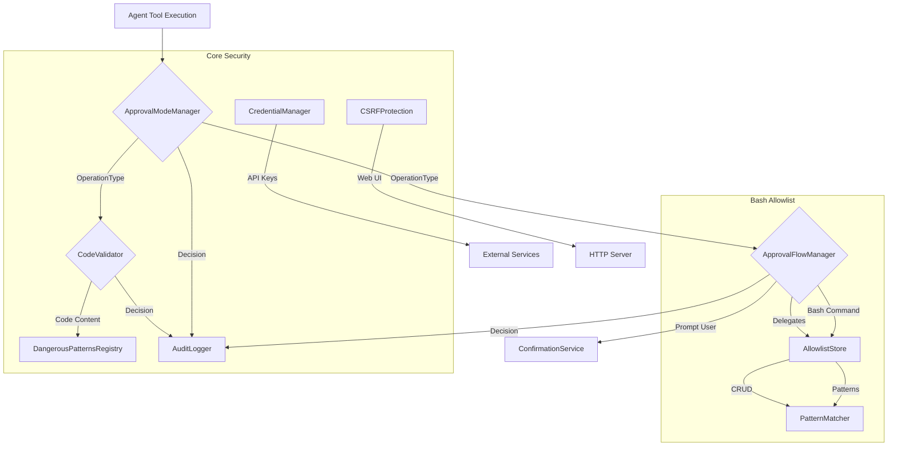
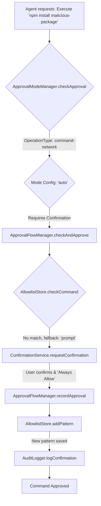

# src — security

The `src/security` module is the cornerstone of Code Buddy's safety mechanisms, designed to protect the user's system and data from unintended or malicious actions by the AI agent. It implements a multi-layered defense strategy, combining explicit user approval, pattern-based allowlisting, static code analysis, and secure credential management.

This documentation provides a comprehensive overview for developers looking to understand, extend, or contribute to Code Buddy's security features.

## Purpose and Core Principles

The primary goal of the `src/security` module is to ensure that the AI agent operates within defined boundaries and that any potentially dangerous operations are either automatically blocked, require explicit user confirmation, or are subject to rigorous validation.

Key principles guiding this module:

1.  **Least Privilege**: Agents should only have the minimum permissions necessary to perform their tasks.
2.  **User Confirmation**: Critical or ambiguous operations must be confirmed by the user.
3.  **Auditability**: All security-relevant decisions and actions are logged for review.
4.  **Defense in Depth**: Multiple layers of security (modes, allowlists, parsers, validators) are applied.
5.  **Transparency**: Users should understand *why* an action is blocked or requires confirmation.

## Architectural Overview

The security module is composed of several interconnected components, each addressing a specific aspect of agent safety. At a high level, operational modes (`ApprovalModeManager`) define the general posture, while specific tools like the `ApprovalFlowManager` (for bash commands) and `CodeValidator` handle granular checks. All significant events are recorded by the `AuditLogger`.

## Key Components

### 1. Approval Modes (`src/security/approval-modes.ts`)

This module defines a three-tier system for controlling the agent's operational permissions, inspired by common CLI permission models. It provides a high-level policy for various `OperationType`s.

*   **Purpose**: To set a global security posture for the agent, determining which types of operations are `auto-approved`, `require-confirmation`, or `blocked`.
*   **How it Works**:
    *   It defines `ApprovalMode`s: `read-only`, `auto`, `full-access`.
    *   Each mode has a predefined `ApprovalModeConfig` specifying `autoApproveTypes`, `requireConfirmTypes`, and `blockTypes` for various `OperationType`s (e.g., `file-read`, `command-safe`, `command-destructive`).
    *   The `ApprovalModeManager` class loads its current mode from a configuration file (`.codebuddy/approval-mode.json`) and provides methods to change it.
    *   When `checkApproval(request: OperationRequest)` is called, it classifies the operation using `classifyOperation` and `classifyCommand` (which leverages predefined lists like `SAFE_COMMANDS`, `NETWORK_COMMANDS`, `DESTRUCTIVE_PATTERNS`). It then consults the current mode's configuration to return an `ApprovalResult`.
    *   It also supports session-based approvals, allowing users to "remember" a decision for the current session.
*   **Key Classes/Functions**:
    *   `ApprovalModeManager`: Manages the current mode, loads/saves config, and performs approval checks.
    *   `classifyOperation(request: OperationRequest)`: Determines the `OperationType` based on the tool and command.
    *   `classifyCommand(command: string)`: Further refines `command` types (safe, network, system, destructive).
    *   `getApprovalModeManager()`: Singleton accessor for the manager.
*   **Configuration/Persistence**: The current `ApprovalMode` is persisted to `~/.codebuddy/approval-mode.json` via `saveConfig()`.
*   **Integration Points**:
    *   `loadConfig()` uses `parseJSONSafe` from `../utils/json-validator.js`.
    *   Emits events (`mode:changed`, `operation:auto-approved`, etc.) for other parts of the system to react.
    *   The `getSecurityModeManager` (from `src/security/security-modes.ts`, not provided in source but referenced in call graph) likely uses this manager.
    *   `updateConfig` (from `src/security/index.ts`) calls `getApprovalModeManager`.

### 2. Bash Command Allowlist (`src/security/bash-allowlist/`)

This sub-module provides a granular, pattern-based system for approving or denying shell commands executed by the agent. It's a critical component for preventing arbitrary command execution.

#### 2.1. Pattern Matching (`src/security/bash-allowlist/pattern-matcher.ts`)

*   **Purpose**: To accurately match a given bash command against various types of patterns.
*   **How it Works**:
    *   Supports `exact`, `prefix`, `glob`, and `regex` pattern types.
    *   `matchPattern(command, pattern, type)` is the core matching function.
    *   `findBestMatch(command, patterns)` selects the most specific matching pattern, prioritizing `deny` patterns. It uses a scoring system (`calculateMatchScore`) based on pattern length, type, and source.
    *   `globToRegex(glob)` converts glob patterns into regular expressions for matching.
    *   `validatePattern(pattern, type)` ensures patterns are well-formed and not overly broad (e.g., `*` or `.*` as a glob/regex).
    *   `suggestPattern(command)` provides intelligent suggestions for new patterns based on common command structures (e.g., `npm install foo` -> `npm install *`).
    *   `isPatternDangerous(pattern, type)` checks if a pattern itself contains or could match known dangerous commands or constructs.
*   **Key Classes/Functions**: `matchPattern`, `findBestMatch`, `validatePattern`, `suggestPattern`, `isPatternDangerous`.
*   **Integration Points**: `matchPattern` calls `matchRegex` which uses `RegExp.test()`.

#### 2.2. Pattern Storage (`src/security/bash-allowlist/allowlist-store.ts`)

*   **Purpose**: To persist, retrieve, and manage `ApprovalPattern`s.
*   **How it Works**:
    *   The `AllowlistStore` class manages a collection of `ApprovalPattern` objects, which include the pattern string, type, decision (`allow` or `deny`), description, and metadata.
    *   It loads patterns from and saves them to `~/.codebuddy/exec-approvals.json`.
    *   Provides CRUD operations (`addPattern`, `removePattern`, `updatePattern`, `getPattern`).
    *   `checkCommand(command)` is the primary method for querying the store, returning the best matching pattern and its decision. It also updates usage statistics and cleans expired patterns.
    *   `recordApproval(command, decision, options)` allows the system to create new patterns based on user confirmations.
    *   Includes `DEFAULT_SAFE_PATTERNS` and `DEFAULT_DENY_PATTERNS` as system-provided defaults.
*   **Key Classes/Functions**:
    *   `AllowlistStore`: Manages patterns, persistence, and command checks.
    *   `addPattern`, `removePattern`, `checkCommand`, `recordApproval`.
    *   `getAllowlistStore()`: Singleton accessor.
*   **Configuration/Persistence**: Patterns and configuration (`AllowlistConfig`) are stored in `~/.codebuddy/exec-approvals.json`. It handles config migrations.
*   **Integration Points**:
    *   Uses `fs` and `path` for file operations.
    *   Emits events (`pattern:added`, `pattern:matched`, `config:saved`, etc.).
    *   `checkCommand` calls `findBestMatch` from `pattern-matcher.ts`.
    *   `addPattern` calls `validatePattern` from `pattern-matcher.ts`.
    *   `migrateConfig` and `cleanExpiredPatterns` call `saveConfig`.
    *   `promptUser` (from `approval-flow.ts`) calls `getConfig`.
    *   `getStats` (from `approval-flow.ts`) calls `getStats`.
    *   `getAllPatterns` and `formatStatus` (from `approval-flow.ts`) call `getAllPatterns`.

#### 2.3. Approval Workflow (`src/security/bash-allowlist/approval-flow.ts`)

*   **Purpose**: Orchestrates the end-to-end approval process for bash commands, integrating pattern matching with user interaction.
*   **How it Works**:
    *   The `ApprovalFlowManager` first calls `AllowlistStore.checkCommand()` to see if a command is already `allow`ed or `deny`ed by a stored pattern.
    *   If no pattern matches and the fallback is `'prompt'`, it uses the `ConfirmationService` to ask the user for approval.
    *   During the prompt, it can suggest a pattern using `suggestPattern` from `pattern-matcher.ts`.
    *   If the user chooses "always allow" or "always deny", it calls `AllowlistStore.recordApproval()` to save a new pattern.
*   **Key Classes/Functions**:
    *   `ApprovalFlowManager`: The main entry point for bash command approval.
    *   `checkAndApprove(command, options)`: The core method that performs the check and prompts if necessary.
    *   `quickCheck(command)`: Performs a check without prompting.
    *   `promptUser(command, options)`: Handles user interaction via `ConfirmationService`.
    *   `getApprovalFlowManager()`: Singleton accessor.
*   **Integration Points**:
    *   Depends on `AllowlistStore` for pattern management.
    *   Depends on `ConfirmationService` (`src/utils/confirmation-service.ts`) for user prompts. The constructor calls `ConfirmationService.getInstance()`.
    *   Uses `suggestPattern` from `pattern-matcher.ts`.
    *   Emits events (`check:allowed`, `check:denied`, `check:prompted`).

### 3. Bash Command Parser (`src/security/bash-parser.ts`)

*   **Purpose**: To safely and accurately parse complex bash command strings into individual, executable command segments. This is crucial for security as it allows detection of dangerous commands even when hidden within pipelines, subshells, or command substitutions (e.g., `echo $(rm -rf /)`).
*   **How it Works**:
    *   Attempts to use `tree-sitter` and `tree-sitter-bash` for robust parsing if available (loaded asynchronously at module init).
    *   If `tree-sitter` is not available or fails, it falls back to a custom state-machine parser (`fallbackParse`). This parser handles quotes, escapes, parentheses, and common bash separators (`&&`, `||`, `|`, `;`).
    *   It extracts `ParsedCommand` objects, each containing the base command, arguments, raw text, and connector.
    *   Crucially, it identifies commands within subshells (`$(...)` or `(...)`) and command substitutions (`` `...` ``) by recursively parsing them.
*   **Key Classes/Functions**:
    *   `parseBashCommand(input: string)`: The main parsing function.
    *   `extractCommandsFromTree(node, source, isSubshell)`: Tree-sitter specific command extraction.
    *   `fallbackParse(input, depth)`: The state-machine parser.
    *   `containsCommand(input, commands)`: Checks if specific commands are present.
    *   `containsDangerousCommand(input)`: Checks for a predefined list of inherently dangerous commands (e.g., `rm`, `sudo`, `mkfs`).
*   **Integration Points**:
    *   `containsDangerousCommand` is called by `shouldSandbox` (`src/sandbox/auto-sandbox.ts`).
    *   `parseBashCommand` is called by `containsDangerousCommand` (internal) and `shouldSandbox`.
    *   `classifyCommand` (from `src/security/approval-modes.ts`) uses `test` (from `src/api/webhooks.ts` - likely a generic regex test utility, not the webhook itself).
    *   `parseBashCommand` also calls `setLanguage` (from `src/voice/speech-recognition.ts` - this seems like an unusual dependency, possibly a misinterpretation in the call graph or a very specific edge case).

### 4. Generated Code Validator (`src/security/code-validator.ts`)

*   **Purpose**: To perform static analysis on code generated by LLMs before it is written to the filesystem, identifying potential security vulnerabilities.
*   **How it Works**:
    *   `validateGeneratedCode(code, language, filePath)` is the main entry point.
    *   It first `detectLanguage` based on file extension or code heuristics.
    *   It then iterates through the code line by line, applying a set of `DangerousPattern`s (from `dangerous-patterns.ts`) and language-specific patterns (`LANGUAGE_PATTERNS`).
    *   It also checks for `SUSPICIOUS_PACKAGES` that might indicate typosquatting or malicious dependencies.
    *   Findings are categorized by `severity` (`critical`, `high`, `medium`, `low`, `info`) and `category`.
    *   A `CodeValidationResult` is returned, indicating if the code is `safe` (no critical/high findings) and listing all findings.
*   **Key Classes/Functions**:
    *   `validateGeneratedCode(code, language, filePath)`: Performs the validation.
    *   `detectLanguage(filePath, code)`: Heuristically determines the programming language.
    *   `formatValidationReport(result)`: Generates a human-readable report.
*   **Integration Points**:
    *   Relies heavily on `DANGEROUS_CODE_PATTERNS` from `dangerous-patterns.ts`.
    *   `logCodeValidation` (from `audit-logger.ts`) would record the results of this validation.

### 5. Audit Logger (`src/security/audit-logger.ts`)

*   **Purpose**: To provide a persistent, immutable audit trail of all security-relevant actions and decisions made by the agent and the security system.
*   **How it Works**:
    *   The `AuditLoggerImpl` class (exposed as a singleton `auditLogger`) records `AuditEntry` objects.
    *   Entries include `action` (e.g., `file_write`, `command_validation`, `confirmation_granted`), `decision` (`allow`, `block`, `warn`, `confirm`), `source`, `target`, and `details`.
    *   Entries are stored in an in-memory buffer and optionally appended to a daily JSONL log file (`audit-YYYY-MM-DD.jsonl`) in a configurable directory.
    *   It also logs a subset of audit data to the general `logger` for real-time debugging.
*   **Key Classes/Functions**:
    *   `AuditLoggerImpl`: The core logger class.
    *   `auditLogger`: The singleton instance.
    *   `init(options)`: Initializes the logger, including setting up the log file.
    *   `log(entry)`: Records a generic audit entry.
    *   `logCodeValidation`, `logCommandValidation`, `logFileOperation`, `logConfirmation`, `logPatternMatch`: Convenience methods for specific audit events.
    *   `getEntries()`, `getSummary()`, `formatSummary()`: For retrieving and summarizing audit data.
*   **Configuration/Persistence**: Configurable log directory and max in-memory entries. Persists to `.jsonl` files.
*   **Integration Points**:
    *   `initObservability` (`src/observability/index.ts`) calls `init` on `auditLogger`.
    *   Various security components (e.g., `ApprovalModeManager`, `ApprovalFlowManager`, `CodeValidator`) would call `auditLogger.log*` methods to record their decisions.

### 6. Credential Manager (`src/security/credential-manager.ts`)

*   **Purpose**: To securely store and retrieve sensitive API keys and other credentials, prioritizing environment variables and using machine-specific encryption for disk storage.
*   **How it Works**:
    *   The `CredentialManager` class (a singleton) manages credentials.
    *   When `getCredential(key)` is called, it first checks environment variables (e.g., `GROK_API_KEY`, `ANTHROPIC_API_KEY`) before looking at disk storage.
    *   Disk storage (`~/.codebuddy/credentials.enc`) is encrypted using AES-256-GCM with a machine-specific key derived from hostname, username, and platform (`getMachineKey()`).
    *   It handles decryption and encryption (`encrypt`, `decrypt`) and warns if encryption is disabled or if legacy plain-text files are detected.
    *   File permissions are strictly set to `0o600` for security.
*   **Key Classes/Functions**:
    *   `CredentialManager`: Manages credential lifecycle.
    *   `getCredential(key)`, `setCredential(key, value)`, `deleteCredential(key)`.
    *   `getApiKey()`, `setApiKey(apiKey)`: Convenience methods for the primary API key.
    *   `getMachineKey()`: Generates the deterministic encryption key.
    *   `encrypt(data)`, `decrypt(encryptedData)`: Core encryption/decryption logic.
    *   `getCredentialManager()`: Singleton accessor.
*   **Configuration/Persistence**: Credentials are stored in `~/.codebuddy/credentials.enc`. Encryption can be enabled/disabled.
*   **Integration Points**:
    *   `bootstrap` and `loadApiKey` (from `src/app/application-factory.ts` and `src/index.ts`) call `getCredentialManager` and `getApiKey`.
    *   `saveSettings` (from `src/app/application-factory.ts`) calls `setApiKey`.
    *   The `getMachineKey` function is part of the `Bootstrap → GetMachineKey` execution flow.

### 7. CSRF Protection (`src/security/csrf-protection.ts`)

*   **Purpose**: To protect web interfaces exposed by Code Buddy (e.g., REST API, webhooks) from Cross-Site Request Forgery attacks.
*   **How it Works**:
    *   The `CSRFProtection` class generates and validates CSRF tokens.
    *   It implements the double-submit cookie pattern: a token is sent in a cookie and also in a request header/body/query parameter. Both must match.
    *   Tokens have an expiry and can be session-bound.
    *   Provides an Express/Connect-compatible `middleware()` to automatically handle token generation for GET requests and validation for unsafe methods (POST, PUT, DELETE).
    *   Includes methods for token rotation, invalidation, and cleanup of expired tokens.
*   **Key Classes/Functions**:
    *   `CSRFProtection`: Manages CSRF tokens and middleware.
    *   `generateToken(sessionId)`, `validateToken(token, options)`.
    *   `middleware()`: Express/Connect middleware.
    *   `getCSRFProtection()`: Singleton accessor.
*   **Configuration/Persistence**: Configuration options for token length, expiry, cookie/header names, and `SameSite` attribute. Tokens are stored in-memory.
*   **Integration Points**:
    *   `createApp` (from `src/server/index.ts`) calls `CSRFProtection` to apply the middleware to the HTTP server.

### 8. Dangerous Patterns Registry (`src/security/dangerous-patterns.ts`)

*   **Purpose**: To centralize the definition of all known dangerous commands and code patterns used across various security checks. This ensures consistency and simplifies updates.
*   **How it Works**:
    *   Defines `DANGEROUS_COMMANDS`: a `Set` of base command names (e.g., `rm`, `sudo`) that are inherently risky.
    *   Defines `DANGEROUS_BASH_PATTERNS`: an array of `DangerousPattern` objects, each containing a `RegExp`, `severity`, `description`, `name`, `category`, and `appliesTo` array (indicating which subsystems use it). These cover more complex bash constructs like `rm -rf /` or `curl | sh`.
    *   Defines `DANGEROUS_CODE_PATTERNS`: similar to bash patterns, but for static analysis of generated code (e.g., SQL injection, XSS, prototype pollution).
*   **Key Data Structures**:
    *   `DANGEROUS_COMMANDS`: `ReadonlySet<string>`
    *   `DANGEROUS_BASH_PATTERNS`: `DangerousPattern[]`
    *   `DANGEROUS_CODE_PATTERNS`: `DangerousPattern[]`
*   **Integration Points**:
    *   `bash-parser.ts` uses `DANGEROUS_COMMANDS` in `containsDangerousCommand`.
    *   `approval-modes.ts` uses `DESTRUCTIVE_PATTERNS` (which likely mirrors or is derived from `DANGEROUS_BASH_PATTERNS`).
    *   `code-validator.ts` uses `DANGEROUS_CODE_PATTERNS`.
    *   `isDangerousCommand` (from `src/security/dangerous-patterns.ts`, referenced in call graph) is called by `validateCommand` (from `tools/bash/command-validator.ts`) and `shouldSandbox` (from `src/sandbox/auto-sandbox.ts`).
    *   `matchAllDangerousPatterns` (from `src/security/dangerous-patterns.ts`, referenced in call graph) is called by `test` (from `src/api/webhooks.ts` - again, likely a generic regex test utility).

## Integration and Execution Flow

The security components work in concert to enforce policies:

1.  **Agent Action Request**: When the agent attempts an operation (e.g., executing a bash command, writing a file), it first goes through the `ApprovalModeManager`.
2.  **Mode-Based Check**: `ApprovalModeManager.checkApproval()` classifies the operation and determines if it's auto-approved, blocked, or requires confirmation based on the current `ApprovalMode`.
3.  **Bash Command Flow**:
    *   If a bash command needs approval, `ApprovalFlowManager.checkAndApprove()` is invoked.
    *   It first consults the `AllowlistStore` to see if the command matches any pre-defined `allow` or `deny` patterns.
    *   If no pattern matches, the user is prompted via `ConfirmationService`.
    *   User decisions can lead to new patterns being added to the `AllowlistStore`.
    *   The `bash-parser.ts` is used upstream to break down complex commands for more accurate pattern matching and dangerous command detection.
4.  **Code Generation Flow**:
    *   Before writing generated code to a file, `CodeValidator.validateGeneratedCode()` is called.
    *   It scans the code against `DangerousPatternsRegistry` and language-specific rules.
    *   If critical vulnerabilities are found, the write operation can be blocked or flagged for user review.
5.  **Credential Handling**: `CredentialManager` ensures that API keys are loaded securely (preferring environment variables) and stored encrypted on disk.
6.  **Audit Trail**: Every significant decision and action (approvals, blocks, validations, confirmations) is recorded by the `AuditLogger` for transparency and post-mortem analysis.
7.  **Web Security**: `CSRFProtection` safeguards any web-facing components from common web vulnerabilities.

### Example Execution Flow: Bash Command Approval

## Contributing to Security Features

Developers contributing to the `src/security` module should be mindful of the following:

*   **Adding New Dangerous Patterns**:
    *   New patterns should be added to `src/security/dangerous-patterns.ts`.
    *   Carefully choose `severity`, `category`, and `appliesTo` to ensure the pattern is used by the correct validators (bash, code, skill, command).
    *   Ensure regex patterns are efficient and do not introduce performance bottlenecks.
    *   Consider if the pattern should also be added to `SAFE_COMMANDS`, `NETWORK_COMMANDS`, `SYSTEM_COMMANDS`, or `DESTRUCTIVE_PATTERNS` in `approval-modes.ts` for mode-based classification.
*   **Extending Approval Modes**:
    *   If new `OperationType`s are introduced, they must be added to the `OperationType` enum in `approval-modes.ts`.
    *   The `APPROVAL_MODE_CONFIGS` object must be updated to define how these new types are handled in `read-only`, `auto`, and `full-access` modes.
    *   The `classifyOperation` and `classifyCommand` methods in `approval-modes.ts` will need updates to correctly identify these new operation types.
*   **Allowlist Enhancements**:
    *   New `PatternType`s (e.g., more advanced matching logic) would require changes in `pattern-matcher.ts` and `types.ts`.
    *   Improvements to `suggestPattern` can enhance user experience when creating new allowlist entries.
    *   Ensure any changes to `AllowlistConfig` or `ApprovalPattern` are backward-compatible or include migration logic in `allowlist-store.ts`.
*   **Audit Logging**: Always ensure that security-relevant decisions and actions are logged using the `auditLogger` singleton. This includes:
    *   Any time an operation is allowed, blocked, or requires confirmation.
    *   Results of code validation or command parsing.
    *   User interactions related to security (e.g., granting/denying confirmation).
*   **Testing**: Comprehensive unit and integration tests are crucial for security features. Pay special attention to edge cases, obfuscation attempts, and malicious inputs.

## Conclusion

The `src/security` module is a vital part of Code Buddy, providing the necessary safeguards for agent operations. By understanding its components and their interactions, developers can effectively contribute to building a more secure and trustworthy AI assistant.