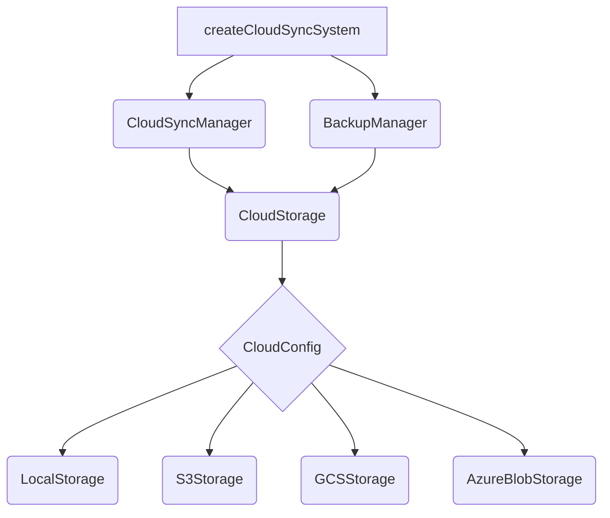

# src — sync

The `src/sync` module provides comprehensive capabilities for managing data synchronization and backup, primarily focusing on cloud integration but also offering a generic state synchronization framework. It is designed to ensure data consistency, handle conflicts, and provide robust backup and restore functionalities for application data.

This module is divided into two main parts:

1.  **`src/sync/cloud`**: Focuses on file-level synchronization and backup with various cloud storage providers (S3, GCS, Azure, Local).
2.  **`src/sync/index.ts`**: Offers a more abstract, state-based synchronization mechanism using vector clocks for conflict detection and resolution, suitable for synchronizing arbitrary application data structures.

---

## 1. Cloud Synchronization and Backup (`src/sync/cloud`)

This sub-module provides high-level APIs for managing file-based synchronization and backups to and from cloud storage. It abstracts away the complexities of interacting with different cloud providers, handling encryption, compression, and conflict resolution.

### 1.1 Architecture Overview

The cloud sync and backup system is built around a few core components:

*   **`CloudStorage`**: An abstract class defining the interface for cloud storage operations.
*   **Provider Implementations**: Concrete classes like `LocalStorage`, `S3Storage`, `GCSStorage`, and `AzureBlobStorage` that implement `CloudStorage` for specific providers.
*   **`CloudSyncManager`**: Handles file-level synchronization between local directories and cloud storage.
*   **`BackupManager`**: Manages the creation, restoration, and lifecycle of backups in cloud storage.
*   **`createCloudSyncSystem`**: A convenience factory function to instantiate and manage both `CloudSyncManager` and `BackupManager` together.



### 1.2 Cloud Storage Abstraction (`src/sync/cloud/storage.ts`)

The `CloudStorage` class provides a unified interface for interacting with various cloud storage services. It handles common concerns like client-side encryption and key derivation.

#### Key Features:

*   **Provider Agnostic**: The `createCloudStorage` factory function instantiates the correct storage implementation based on the `CloudConfig.provider`.
*   **Client-Side Encryption**: If `CloudConfig.encryptionKey` is provided, data is encrypted using AES-256-GCM before upload and decrypted after download. The key is derived using SHA256 from the passphrase.
*   **Path Prefixing**: Supports adding a `prefix` to all object keys, allowing for logical separation within a bucket.
*   **Core Operations**:
    *   `upload(key: string, data: Buffer, metadata?: Record<string, string>)`: Uploads data to a specified key.
    *   `download(key: string)`: Downloads data from a specified key.
    *   `delete(key: string)`: Deletes an object.
    *   `list(options?: ListOptions)`: Lists objects within a prefix.
    *   `exists(key: string)`: Checks if an object exists.
    *   `getMetadata(key: string)`: Retrieves object metadata.

#### Implementations:

*   **`LocalStorage`**: Stores data on the local filesystem. Useful for development, testing, or local-only backups. It simulates cloud behavior by creating directories and storing metadata in `.meta` files.
*   **`S3Storage`, `GCSStorage`, `AzureBlobStorage`**: These currently provide mock implementations. In a production environment, they would integrate with their respective cloud SDKs (e.g., `@aws-sdk/client-s3`). They log operations but do not perform actual cloud interactions in the provided code.

### 1.3 Cloud Sync Manager (`src/sync/cloud/sync-manager.ts`)

The `CloudSyncManager` is responsible for synchronizing local files and directories with cloud storage. It supports automatic synchronization, various sync directions, and conflict resolution strategies.

#### Configuration (`SyncManagerConfig`, `SyncConfig`, `SyncItem`):

*   **`cloud`**: `CloudConfig` for the underlying storage.
*   **`sync`**: `SyncConfig` defines sync behavior:
    *   `autoSync`: Enables/disables automatic sync on an interval.
    *   `syncInterval`: Frequency of automatic syncs.
    *   `direction`: `'push'`, `'pull'`, or `'bidirectional'`.
    *   `conflictResolution`: Strategy for handling conflicts (`'local'`, `'remote'`, `'newest'`, `'manual'`).
    *   `items`: An array of `SyncItem` objects, each specifying a local path, remote path, and type (e.g., 'sessions', 'memory').
    *   `excludePatterns`: Glob-like patterns to ignore files/directories.
    *   `compression`, `encryption`: Flags for data processing (encryption is handled by `CloudStorage`).

#### Core Synchronization Flow (`sync()` method):

1.  **State Management**: Updates internal `SyncState` and emits `sync_started` event.
2.  **Item Iteration**: Loops through all enabled `SyncItem`s.
3.  **Delta Calculation (`calculateDelta`)**:
    *   `scanLocalFiles`: Recursively scans local directories, computes checksums, and records modification times.
    *   `scanRemoteFiles`: Lists objects in cloud storage, fetches metadata (including checksums and modification times).
    *   Compares local and remote file lists to identify:
        *   `toUpload`: Local files that are new or newer than remote.
        *   `toDownload`: Remote files that are new or newer than local.
        *   `conflicts`: Files with same modification time but different content, or concurrent modifications.
4.  **Execution based on `direction`**:
    *   `'push'`: Only `uploadFiles` are processed.
    *   `'pull'`: Only `downloadFiles` are processed.
    *   `'bidirectional'`: Conflicts are resolved first, then `uploadFiles` and `downloadFiles` are processed in parallel.
5.  **Conflict Resolution (`resolveConflict`)**: Applies the configured `conflictResolution` strategy. For `'manual'`, conflicts are left for external handling via `resolveConflictManually`.
6.  **Data Transfer (`uploadFiles`, `downloadFiles`)**:
    *   Reads/writes files from/to the local filesystem.
    *   Applies compression (gzip) if enabled.
    *   Interacts with `CloudStorage` for actual cloud operations.
    *   Emits `item_uploaded` and `item_downloaded` events.
7.  **Cleanup**: Updates `lastSync` for each item.
8.  **Event Emission**: Emits `sync_completed` or `sync_failed` events.

#### Eventing:

`CloudSyncManager` extends `TypedEventEmitterAdapter<CloudSyncEvents>`, providing type-safe events for various sync lifecycle stages (e.g., `sync:started`, `sync:completed`, `sync:item_uploaded`, `sync:conflict_detected`). It also maintains backward compatibility by emitting generic `'sync-event'` and specific legacy events.

#### Versioning:

*   `getVersionHistory(path: string)`: Retrieves a list of available versions for a given remote path. This relies on the `CloudStorage` implementation providing versioning capabilities (currently mocked for S3/GCS/Azure).
*   `restoreVersion(path: string, versionId: string)`: Downloads and restores a specific version of a file to the local filesystem.

### 1.4 Cloud Backup Manager (`src/sync/cloud/backup-manager.ts`)

The `BackupManager` handles the creation, restoration, and management of application backups in cloud storage. It supports automatic backups, compression, and retention policies.

#### Configuration (`BackupManagerConfig`, `BackupConfig`):

*   **`cloud`**: `CloudConfig` for the underlying storage.
*   **`backup`**: `BackupConfig` defines backup behavior:
    *   `autoBackup`: Enables/disables automatic backups on an interval.
    *   `backupInterval`: Frequency of automatic backups.
    *   `maxBackups`: Maximum number of backups to retain.
    *   `items`: An array of local file/directory paths to include in the backup.
    *   `compressionLevel`: Zlib compression level (0-9).
    *   `splitSize`: Optional size threshold to split large backups into multiple parts.

#### Core Backup Flow (`createBackup()` method):

1.  **Backup ID Generation**: A unique ID is generated using date and UUID.
2.  **Item Collection (`collectItem`, `collectDirectory`)**:
    *   Recursively scans specified local paths.
    *   Reads file content, calculates checksums, and stores metadata (`BackupItem`).
    *   Combines all collected data into a single `Buffer`.
3.  **Compression (`compress`)**: Compresses the combined data using gzip.
4.  **Manifest Creation**: Generates a `BackupManifest` containing metadata about the backup (ID, creation time, items, sizes, checksums, encryption status).
5.  **Upload (`uploadBackup`, `uploadSplitBackup`)**:
    *   If `splitSize` is configured and the compressed data exceeds it, the backup is split into multiple parts and uploaded individually.
    *   Otherwise, the entire compressed data is uploaded as a single file (`backup.dat`).
    *   The `manifest.json` file is always uploaded alongside the data.
6.  **Cleanup (`cleanupOldBackups`)**: Deletes older backups based on the `maxBackups` retention policy.
7.  **Event Emission**: Emits `backup_started`, `backup_progress`, and `backup_created` events.

#### Other Operations:

*   **`listBackups()`**: Retrieves a list of available backups by downloading and parsing manifest files.
*   **`getBackupManifest(backupId: string)`**: Fetches a specific backup's manifest.
*   **`restoreBackup(backupId: string, targetPath: string, options?)`**:
    *   Downloads backup data (handling split parts).
    *   Verifies checksums for data integrity.
    *   Decompresses the data.
    *   Extracts individual items and writes them to the `targetPath`, respecting `overwrite` and `items` filters.
    *   Emits `restore_started`, `restore_progress`, `restore_completed`, or `restore_error` events.
*   **`deleteBackup(backupId: string)`**: Deletes all files associated with a backup (data parts and manifest).
*   **`verifyBackup(backupId: string)`**: Checks for the existence of manifest and data files/parts.
*   **`exportBackup(backupId: string, outputPath: string)`**: Downloads a backup and its manifest to local files.
*   **`importBackup(inputPath: string)`**: Reads a local backup file and its manifest, then uploads it to cloud storage.

### 1.5 Convenience Functions (`src/sync/cloud/index.ts`)

The `src/sync/cloud/index.ts` file serves as the main entry point for cloud-related sync and backup features. It re-exports all public APIs and provides a powerful factory function:

*   **`createCloudSyncSystem(config)`**: This function simplifies the setup by creating both a `CloudSyncManager` and a `BackupManager` with sensible default configurations. It returns an object with `sync` and `backup` properties, along with convenience methods like `startAll()`, `stopAll()`, and `dispose()`.
*   **Configuration Helpers**:
    *   `createLocalConfig(basePath?)`: Generates a `CloudConfig` for local storage.
    *   `createS3Config(options)`: Generates a `CloudConfig` for S3.
    *   `createDefaultSyncItems()`: Provides a standard set of items for `CloudSyncManager` (e.g., sessions, memory, settings).
    *   `createDefaultBackupItems()`: Provides a standard set of items for `BackupManager`.

---

## 2. Generic State Synchronization (`src/sync/index.ts`)

This module provides a lower-level, more abstract synchronization framework designed for arbitrary application states (e.g., JSON objects). It implements a distributed synchronization model using vector clocks to track causality and resolve conflicts.

### 2.1 Key Concepts

*   **`SyncState<T>`**: The fundamental unit of synchronization. It encapsulates the actual data (`T`), along with metadata like a unique `id`, `version`, `timestamp`, `hash` (for content integrity), `lastModifiedBy` (node ID), and crucially, a `vectorClock`.
*   **`VectorClock`**: A map where keys are node IDs and values are integers. It's used to track the causal history of a state across different nodes in a distributed system.
*   **`SyncOperation`**: Records local changes (create, update, delete) to `SyncState` objects, including the state ID, data, timestamp, node ID, and the vector clock at the time of the operation. These operations form a log of pending changes.
*   **`SyncConflict<T>`**: Represents a situation where local and remote states for the same ID have diverged concurrently, as determined by their vector clocks. It includes the `localState`, `remoteState`, and `conflictType`.
*   **`ConflictResolutionStrategy<T>`**: An interface for defining how conflicts should be automatically resolved.

### 2.2 Vector Clock Operations

The module provides a set of utility functions for working with vector clocks:

*   **`createVectorClock(nodeId: string)`**: Initializes a new vector clock for a given node.
*   **`incrementVectorClock(clock: VectorClock, nodeId: string)`**: Increments the count for a specific node in a vector clock. This is crucial for marking a state as "seen" by a node.
*   **`mergeVectorClocks(clock1: VectorClock, clock2: VectorClock)`**: Combines two vector clocks by taking the maximum value for each node ID. This represents the common knowledge of both clocks.
*   **`compareVectorClocks(clock1: VectorClock, clock2: VectorClock)`**: Compares two vector clocks to determine their causal relationship: `'before'`, `'after'`, `'concurrent'`, or `'equal'`.
*   **`isVectorClockDominated(clock1: VectorClock, clock2: VectorClock)`**: Checks if `clock1` is causally "before" or "equal" to `clock2`.

### 2.3 State Management

*   **`createSyncState<T>(data: T, nodeId: string, existingClock?: VectorClock)`**: Creates a new `SyncState` object. It generates a unique ID, initializes its version and timestamp, and sets up its vector clock (incrementing an `existingClock` if provided, or creating a new one).
*   **`updateSyncState<T>(state: SyncState<T>, data: T, nodeId: string)`**: Creates a new version of an existing `SyncState`. It increments the version, updates the timestamp, recomputes the hash, and increments the vector clock for the modifying node.
*   **`computeHash(data: unknown)`**: Generates a SHA256 hash of the state's data, used for quick content comparison.
*   **`generateId(prefix: string)`**: Utility for generating unique IDs.

### 2.4 Conflict Detection and Resolution

*   **`detectConflict<T>(localState: SyncState<T>, remoteState: SyncState<T>)`**: This core function determines if two states with the same ID are in conflict. It uses `compareVectorClocks` to check for concurrent updates (where neither state causally precedes the other).
*   **Conflict Resolution Strategies**:
    *   **`LastWriteWinsStrategy<T>`**: Resolves conflicts by choosing the state with the most recent `timestamp`.
    *   **`LocalWinsStrategy<T>`**: Always prefers the local state.
    *   **`RemoteWinsStrategy<T>`**: Always prefers the remote state.
    *   **`MergeStrategy<T extends object>`**: Attempts to merge two object states by combining their properties. For conflicting primitive values, it defaults to the local value. This strategy is only applicable to object types.

### 2.5 Sync Manager (`SyncManager<T>`)

The `SyncManager` class orchestrates the entire state synchronization process.

#### Configuration (`SyncConfig`):

*   **`nodeId`**: A unique identifier for the current node.
*   **`conflictStrategy`**: The default strategy to use for automatic conflict resolution.
*   **`autoSync`**: Enables/disables automatic synchronization.
*   **`syncInterval`**: Interval for auto-sync ticks.
*   **`persistPath`**: Local path to store the manager's state (states, pending operations).

#### Core Functionality:

1.  **State Storage**: Internally maintains a `Map<string, SyncState<T>>` for all local states.
2.  **Pending Operations**: Stores a list of `SyncOperation`s representing local changes that need to be synchronized with other nodes.
3.  **Persistence (`save()`, `load()`):** Uses `UnifiedVfsRouter` to persist the manager's internal state (all `SyncState` objects and `pendingOperations`) to a local JSON file. This ensures state is preserved across application restarts.
4.  **CRUD Operations**: Provides `createState()`, `getState()`, `updateState()`, and `deleteState()` methods for managing local `SyncState` objects. Each modification automatically adds a `SyncOperation` to `pendingOperations` and triggers a `save()`.
5.  **`applyRemoteState(remoteState: SyncState<T>)`**: This is the heart of reconciliation for a single state.
    *   If the `remoteState` is new, it's simply added.
    *   If a local state exists, `detectConflict` is called.
    *   If no conflict, vector clocks determine if local or remote is newer.
    *   If a conflict is detected, the configured `conflictStrategy` is applied. If the strategy cannot resolve it (e.g., 'manual' strategy), the conflict is reported, and the manager's status changes to `'conflict'`.
6.  **`reconcile(remoteStates: SyncState<T>[])`**: Orchestrates the application of multiple remote states, calling `applyRemoteState` for each. It returns a `ReconciliationResult` detailing applied states, conflicts, and pending operations.
7.  **`resolveConflict(conflict: SyncConflict<T>, resolution: ConflictResolution, customData?: T)`**: Allows for manual resolution of conflicts, providing options to choose local, remote, or a custom merged data.
8.  **Auto-Sync**: `startAutoSync()` and `stopAutoSync()` manage an interval timer that emits `auto-sync-tick` events, allowing external logic to trigger reconciliation.
9.  **Export/Import**: `exportState()` and `importState()` facilitate transferring the entire set of local states.
10. **Eventing**: Extends `EventEmitter` and emits events like `status-changed`, `state-created`, `state-updated`, `conflict-detected`, `conflict-resolved`, `saved`, `loaded`, etc.

### 2.6 Singleton Access

*   **`getSyncManager<T = unknown>(config?: SyncConfig)`**: Provides a singleton instance of `SyncManager`. If called multiple times, it returns the same instance, ensuring a single source of truth for state synchronization within the application.
*   **`resetSyncManager()`**: Disposes of the current singleton instance and allows a new one to be created.

---

## 3. Integration and Usage

The `src/sync` module offers two distinct but complementary synchronization paradigms:

*   **File-level sync/backup (`src/sync/cloud`)**: Ideal for synchronizing and backing up user data files, configuration directories, or any file-based assets to cloud storage. Use `createCloudSyncSystem` for a quick setup.
*   **Generic state sync (`src/sync/index.ts`)**: Best suited for synchronizing structured application data (e.g., settings objects, session states, internal models) across different instances of the application, especially in scenarios requiring robust conflict resolution and version tracking. Use `getSyncManager` to access the singleton.

Developers can choose the appropriate manager based on their data type and synchronization requirements. For example, a Code Buddy application might use `CloudSyncManager` to back up user-generated code files and `SyncManager` to synchronize internal application settings or session metadata across different devices.

The `src/sync/cloud/index.ts` module also provides `createDefaultSyncItems()` and `createDefaultBackupItems()` which define common paths for Code Buddy's internal data (e.g., `.codebuddy/sessions`, `.codebuddy/memory`, `.codebuddy/settings`), demonstrating how these modules are intended to be used within the application.

### Example Usage (Conceptual)

```typescript
import { createCloudSyncSystem, createS3Config, createDefaultSyncItems, createDefaultBackupItems } from './sync/cloud/index.js';
import { getSyncManager } from './sync/index.js';

async function setupSync() {
  // 1. Cloud File Sync & Backup
  const cloudConfig = createS3Config({
    bucket: 'my-codebuddy-data',
    region: 'us-east-1',
    accessKeyId: process.env.AWS_ACCESS_KEY_ID,
    secretAccessKey: process.env.AWS_SECRET_ACCESS_KEY,
    encryptionKey: 'my-super-secret-key',
  });

  const cloudSystem = createCloudSyncSystem({
    cloud: cloudConfig,
    sync: {
      autoSync: true,
      syncInterval: 60000, // Every minute
      direction: 'bidirectional',
      items: createDefaultSyncItems(),
    },
    backup: {
      autoBackup: true,
      backupInterval: 3600000, // Every hour
      maxBackups: 5,
      items: createDefaultBackupItems(),
    },
  });

  cloudSystem.sync.onTypedSyncEvent('sync:completed', (event) => {
    console.log(`Cloud sync completed: ${event.result.itemsSynced} items.`);
  });
  cloudSystem.backup.on('backup_created', (event) => {
    console.log(`Cloud backup created: ${event.backup.id}`);
  });

  cloudSystem.startAll();
  console.log('Cloud sync and backup started.');

  // 2. Generic State Synchronization
  interface AppSettings {
    theme: string;
    fontSize: number;
    lastOpenedFile: string;
  }

  const settingsSyncManager = getSyncManager<AppSettings>({
    nodeId: 'user-desktop-client',
    conflictStrategy: 'last-write-wins',
    persistPath: '.codebuddy/sync/settings',
  });

  settingsSyncManager.on('state-updated', (state) => {
    console.log(`Settings updated: ${state.id} - ${JSON.stringify(state.data)}`);
  });

  // Create or update a setting
  let mySettings = settingsSyncManager.getState('app-settings');
  if (!mySettings) {
    mySettings = settingsSyncManager.createState({
      theme: 'dark',
      fontSize: 14,
      lastOpenedFile: '/home/user/project/main.ts',
    });
  } else {
    settingsSyncManager.updateState(mySettings.id, {
      ...mySettings.data,
      fontSize: 16,
    });
  }

  // Simulate receiving remote states (e.g., from another client)
  const remoteSettings: AppSettings = {
    theme: 'light',
    fontSize: 14,
    lastOpenedFile: '/home/user/project/index.js',
  };
  const remoteSyncState = settingsSyncManager.createState(remoteSettings); // In a real scenario, this would come from a remote source

  // Reconcile with remote states
  const reconciliationResult = await settingsSyncManager.reconcile([remoteSyncState]);
  if (reconciliationResult.conflicts.length > 0) {
    console.warn('Conflicts detected during state reconciliation:', reconciliationResult.conflicts);
  }

  // Clean up on shutdown
  process.on('beforeExit', () => {
    cloudSystem.dispose();
    settingsSyncManager.dispose();
    console.log('Sync systems disposed.');
  });
}

setupSync().catch(console.error);
```