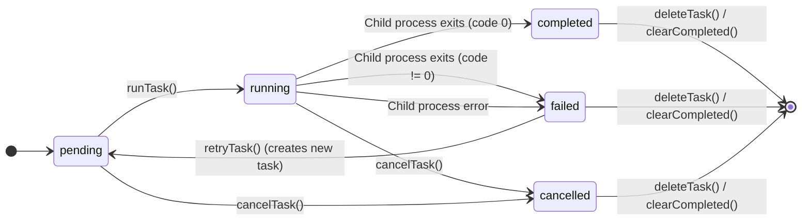

# src — tasks

The `src/tasks` module provides a robust system for managing long-running, asynchronous AI tasks in the background. Inspired by cloud-based task runners, it allows the application to initiate AI operations (like code generation or refactoring) without blocking the main thread, persist their state across restarts, and notify users upon completion or failure.

## Module Overview

The primary goal of this module is to enable "fire-and-forget" execution of AI prompts. When a user issues a command that might take a significant amount of time, it can be offloaded to the `BackgroundTaskManager`. This manager handles:

*   **Task Persistence**: Saving task state to disk, allowing tasks to resume or be tracked after application restarts.
*   **Concurrency Control**: Limiting the number of simultaneously running tasks.
*   **Asynchronous Execution**: Running AI operations in separate child processes.
*   **Status Tracking**: Providing real-time updates on task progress.
*   **Notifications**: Integrating with the `src/channels` module to send alerts on task completion or failure.
*   **CLI Integration**: Designed to be easily integrated with a command-line interface for task management.

## Core Concepts

### `BackgroundTask`

The central data structure representing an AI task.

```typescript
export interface BackgroundTask {
  id: string; // Unique identifier
  prompt: string; // The AI prompt to execute
  status: TaskStatus; // Current status (pending, running, completed, failed, cancelled)
  priority: TaskPriority; // Execution priority (low, normal, high)
  createdAt: Date;
  startedAt?: Date;
  completedAt?: Date;
  result?: TaskResult; // Outcome of the task
  workingDirectory: string; // Directory where the task should run
  model?: string; // Specific AI model to use
  maxToolRounds?: number; // Max tool calls for the AI
  tags?: string[]; // Optional tags for categorization
  notifyOn?: ('completed' | 'failed')[]; // Events to trigger notifications
  notifyChannel?: string; // Channel identifier for notifications (e.g., "telegram:chat-123")
}
```

### `TaskStatus`

Defines the possible states a task can be in: `'pending'`, `'running'`, `'completed'`, `'failed'`, `'cancelled'`.

### `TaskPriority`

Influences the order in which pending tasks are picked up: `'low'`, `'normal'`, `'high'`.

### `TaskResult`

Captures the outcome of a completed or failed task:

```typescript
export interface TaskResult {
  success: boolean;
  output?: string; // Standard output from the task
  error?: string; // Error message if failed
  filesModified?: string[]; // (Future use) List of files modified
  duration?: number; // Execution time in milliseconds
}
```

## `BackgroundTaskManager` Class

This class is the core of the module, responsible for all task management operations. It extends `EventEmitter` to allow other parts of the application to subscribe to task lifecycle events.

### Initialization and Persistence

The `BackgroundTaskManager` is initialized with a `maxConcurrent` limit (defaulting to 3).

*   **Constructor**:
    *   Sets up the `tasksDir` (defaulting to `~/.codebuddy/tasks`).
    *   Calls `ensureTasksDir()` to create the directory if it doesn't exist.
    *   Calls `loadTasks()` to load any previously persisted tasks from disk. Tasks found in a `'running'` state are reset to `'pending'` as they were interrupted.
    *   Wires up internal event listeners for `'task-completed'` and `'task-failed'` to trigger `notifyTaskEvent`.
*   **`tasksDir`**: All task metadata is stored as individual JSON files within this directory (e.g., `~/.codebuddy/tasks/task_123abc.json`).
*   **`saveTask(task: BackgroundTask)`**: Writes the current state of a task to its corresponding JSON file on disk. This is crucial for persistence.
*   **`loadTasks()`**: Reads all `.json` files from `tasksDir`, parses them, and populates the internal `tasks` map.
*   **`deleteTaskFile(taskId: string)`**: Removes a task's JSON file from disk.

### Task Lifecycle Management

The manager provides methods to control the entire lifecycle of a task.

#### `createTask(prompt: string, options: { ... })`

*   Generates a unique `id` using `generateId()`.
*   Initializes a new `BackgroundTask` with `status: 'pending'` and provided options.
*   Persists the task to disk via `saveTask()`.
*   Emits a `'task-created'` event.
*   If `options.runImmediately` is true, it calls `runTask()` to start execution.

#### `runTask(taskId: string)`

This is the core execution method.

1.  **Validation**: Checks if the task exists, is not already running, and if the `maxConcurrent` limit has not been reached.
2.  **State Update**: Sets `task.status = 'running'`, records `startedAt`, and calls `saveTask()`.
3.  **Event Emission**: Emits a `'task-started'` event.
4.  **Child Process Execution**:
    *   It spawns a new Node.js child process using `child_process.spawn()`.
    *   The child process executes the main `grok` CLI script (`process.argv[1]`) with specific arguments: `--prompt`, `--directory`, `--model`, `--max-tool-rounds`. This effectively runs a headless `grok` instance for the task.
    *   `stdio` is piped to capture `stdout` and `stderr`.
5.  **Output Handling**:
    *   `child.stdout.on('data')`: Appends output to an internal buffer and emits `'task-output'` events for real-time streaming.
    *   `child.stderr.on('data')`: Appends error output to an internal buffer.
6.  **Completion/Failure**:
    *   `child.on('close', (code) => ...)`: When the child process exits:
        *   Updates `task.status` to `'completed'` (if `code === 0`) or `'failed'` (if `code !== 0`).
        *   Records `completedAt` and `result` (including `output`, `error`, `duration`).
        *   Calls `saveTask()`.
        *   Emits `'task-completed'` or `'task-failed'` events.
    *   `child.on('error', (error) => ...)`: Handles errors during child process creation or execution, marking the task as `'failed'`.

#### `cancelTask(taskId: string)`

*   If the task is running, it sends a `SIGTERM` signal to the child process to terminate it.
*   Updates `task.status = 'cancelled'`, records `completedAt`, and calls `saveTask()`.
*   Emits a `'task-cancelled'` event.

#### `retryTask(taskId: string)`

*   Only applicable to tasks with `status: 'failed'`.
*   Creates a *new* task with the same prompt and options as the original failed task, adding a `'retry'` tag.
*   Immediately runs the new task.

#### `deleteTask(taskId: string)`

*   If the task is running, it first calls `cancelTask()`.
*   Removes the task from the internal `tasks` map.
*   Deletes the task's JSON file from disk using `deleteTaskFile()`.
*   Emits a `'task-deleted'` event.

#### `clearCompleted()`

*   Deletes all tasks with `status` of `'completed'`, `'cancelled'`, or `'failed'` from both memory and disk.

### Task State and Querying

*   **`getTask(taskId: string)`**: Retrieves a single task by its ID.
*   **`getTasks(options: TaskListOptions)`**: Returns a filtered, sorted, and optionally limited list of tasks. It sorts by priority (high first) and then by creation time (newest first). By default, it excludes completed/cancelled tasks.
*   **`getStats()`**: Provides a summary count of tasks by status (total, pending, running, completed, failed, cancelled).

### Notifications

*   **`notifyTaskEvent(task: BackgroundTask, event: 'completed' | 'failed')`**:
    *   This private method is called when a task completes or fails.
    *   It checks if the task has `notifyOn` configured for the specific event and a `notifyChannel`.
    *   It dynamically imports `getChannelManager` from `../channels/index.js` to avoid circular dependencies.
    *   It constructs a notification message and uses `manager.sendToUser()` to deliver it to the specified channel.
    *   Notification delivery is best-effort; errors are silently caught.

### Concurrency Control

The `maxConcurrent` property, set in the constructor, limits how many tasks can be in the `'running'` state simultaneously. `runTask()` enforces this limit, throwing an error if exceeded.

### Display Utilities

*   **`formatTask(task: BackgroundTask)`**: Generates a human-readable string representation of a single task, including status, ID, prompt snippet, creation time, and duration.
*   **`formatTasksList(options: TaskListOptions)`**: Formats a list of tasks (obtained via `getTasks()`) into a comprehensive display, including a header, individual task details, and overall statistics. It also provides helpful CLI command hints.

### Event Emitter

`BackgroundTaskManager` extends `EventEmitter` and emits the following events:

*   `'task-created'` (task: `BackgroundTask`)
*   `'task-started'` (task: `BackgroundTask`)
*   `'task-output'` ({ taskId: string, data: string })
*   `'task-completed'` (task: `BackgroundTask`)
*   `'task-failed'` (task: `BackgroundTask`, error?: Error)
*   `'task-cancelled'` (task: `BackgroundTask`)
*   `'task-deleted'` (taskId: string)

### Resource Cleanup

*   **`dispose()`**: Cleans up resources by cancelling all running tasks, clearing the internal task map, and removing all event listeners. This is important for graceful shutdown or testing.

## Task Status Lifecycle

The following diagram illustrates the transitions between different `TaskStatus` states:



## Usage and Integration

### Singleton Access

The module provides a singleton instance of `BackgroundTaskManager` to ensure consistent state across the application:

*   **`getBackgroundTaskManager(maxConcurrent?: number)`**: Returns the singleton instance, creating it if it doesn't already exist.
*   **`resetBackgroundTaskManager()`**: Disposes of the current singleton and sets it to `null`, allowing a new instance to be created on the next call to `getBackgroundTaskManager()`. This is primarily useful for testing or specific application lifecycle scenarios.

### CLI Integration

The `runTask` method's use of `spawn('node', [codebuddyPath, ...args])` indicates that this module is designed to integrate directly with the main `grok` CLI. When a background task is initiated, it essentially re-invokes the `grok` command-line tool in a separate process, passing the prompt and other parameters. This allows the background tasks to leverage the full capabilities of the `grok` CLI without needing to duplicate its logic.

### Channels Module Integration

The `notifyTaskEvent` method demonstrates a clear integration point with the `src/channels` module. By dynamically importing `getChannelManager`, the tasks module can send notifications to various communication channels (e.g., Telegram, Slack) based on the `notifyChannel` and `notifyOn` properties defined in the `BackgroundTask`. This decouples notification logic from task execution.

## Developer Notes

*   **Error Handling**: While task execution errors are captured in `TaskResult`, notification delivery is "best-effort" and errors during `sendToUser` are silently caught to prevent task completion from being blocked by notification failures.
*   **Persistence Format**: Tasks are stored as pretty-printed JSON files, making them human-readable and inspectable on disk.
*   **Child Process Management**: The module handles `stdout`, `stderr`, and `close`/`error` events from child processes, ensuring robust execution and result capture. `SIGTERM` is used for cancellation.
*   **Directory Structure**: The choice of `~/.codebuddy/tasks` for persistence aligns with common practices for application-specific user data.