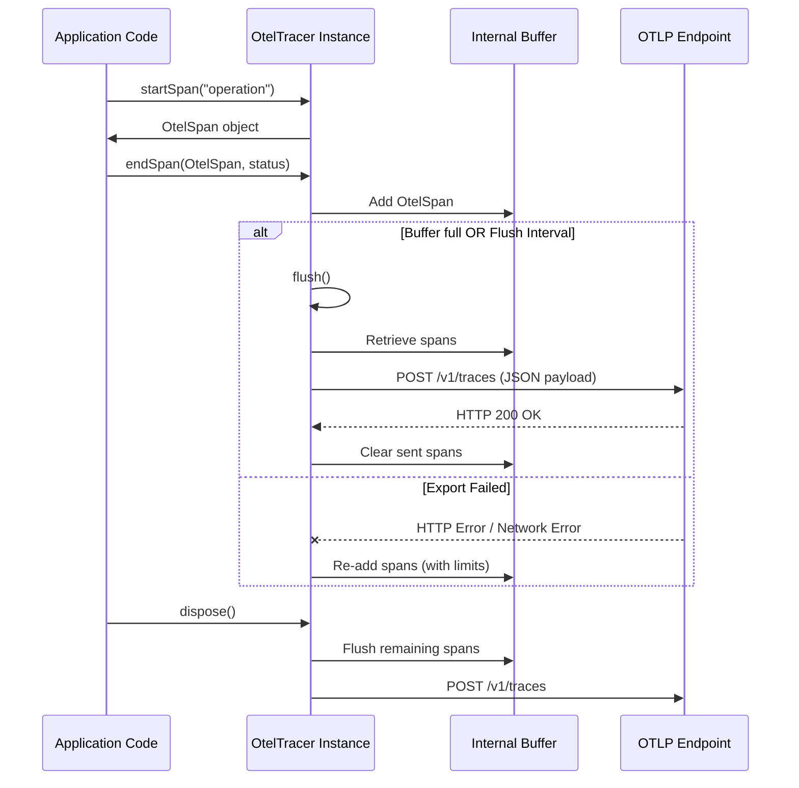

# src — telemetry

The `src/telemetry/otel-tracer.ts` module provides a lightweight, dependency-free implementation of an OpenTelemetry (OTel) tracer. Its primary purpose is to capture and export trace spans to an OTLP-compatible endpoint using HTTP JSON, without requiring the full `@opentelemetry/*` SDKs.

This module is designed for scenarios where:
*   Minimizing dependencies is crucial.
*   Fine-grained control over span creation and export is desired.
*   The tracing needs are primarily focused on spans (not metrics or logs).
*   Integration with existing OTLP collectors (like Jaeger, Tempo, or custom solutions) is required.

## Core Concepts

The module implements a subset of OpenTelemetry tracing concepts:

*   **Spans**: Represent a single operation within a trace. Each span has a name, start/end times, attributes (key-value pairs), and a status (OK, Error, Unset). Spans are identified by a `spanId` and belong to a `traceId`.
*   **OTLP (OpenTelemetry Protocol)**: The standard for transmitting telemetry data. This tracer specifically uses the OTLP/HTTP JSON format for exporting trace spans.

## `OtelTracer` Class

The `OtelTracer` class is the central component of this module, responsible for creating, buffering, and exporting spans.

### Initialization and Configuration

An `OtelTracer` instance is configured via the `OtelTracerConfig` interface, environment variables, or CLI flags.

```typescript
interface OtelTracerConfig {
  /** OTLP HTTP endpoint (e.g., http://localhost:4318/v1/traces) */
  endpoint?: string;
  /** Service name reported in telemetry */
  serviceName?: string;
  /** Enable/disable the tracer */
  enabled?: boolean;
  /** Flush interval in milliseconds (default: 30000) */
  flushIntervalMs?: number;
  /** Maximum buffer size before auto-flush (default: 100) */
  maxBufferSize?: number;
}
```

The constructor prioritizes configuration in the following order: `config` object > `OTEL_ENDPOINT` environment variable > default values.

```typescript
import { OtelTracer, getOtelTracer } from './telemetry/otel-tracer.ts';

// Via constructor config
const tracer = new OtelTracer({
  endpoint: 'http://localhost:4318/v1/traces',
  serviceName: 'my-app',
  flushIntervalMs: 10000,
});

// Via singleton (recommended for app-wide use)
const appTracer = getOtelTracer({
  endpoint: process.env.OTEL_ENDPOINT || 'http://localhost:4318/v1/traces',
  serviceName: 'codebuddy',
});
```

If an `endpoint` is provided and the tracer is `enabled`, a `setInterval` timer is started to periodically call `flush()` at the specified `flushIntervalMs`. This timer is `unref()`'d to prevent it from keeping the Node.js process alive.

### Span Lifecycle

The `OtelTracer` manages the creation, completion, and buffering of spans.

1.  **`startSpan(name, attributes?)`**:
    *   Creates a new `OtelSpan` object.
    *   Assigns a unique `spanId` and the current `traceId`.
    *   Records `startTimeUnixNano`.
    *   Initializes `kind` to `INTERNAL` (0) and `status` to `UNSET` (0).
    *   Returns the `OtelSpan` object. The caller is responsible for holding onto this object and calling `endSpan` when the operation completes.

2.  **`endSpan(span, status?)`**:
    *   Records `endTimeUnixNano` for the provided `span`.
    *   Updates the `span.status` if provided.
    *   If the tracer is enabled, the completed `span` is added to an internal `buffer`.
    *   If the `buffer.length` reaches `maxBufferSize`, an automatic `flush()` is triggered.

```typescript
import { getOtelTracer } from './telemetry/otel-tracer.ts';

const tracer = getOtelTracer();

async function performOperation() {
  const span = tracer.startSpan('my.operation', { 'operation.type': 'async' });
  try {
    // Simulate work
    await new Promise(resolve => setTimeout(resolve, 100));
    tracer.endSpan(span, { code: 1 }); // OK
  } catch (error) {
    tracer.endSpan(span, { code: 2, message: String(error) }); // ERROR
    throw error;
  }
}
```

### Data Export (`flush`)

The `flush()` method is responsible for sending buffered spans to the configured OTLP endpoint.



*   It constructs an OTLP-compliant JSON payload containing all buffered spans, along with `service.name` and `scope` attributes.
*   It uses `fetch` to send the payload via HTTP POST.
*   Error handling: If the `fetch` request fails (network error or non-2xx HTTP status), the spans are re-added to the buffer for a potential retry. To prevent unbounded memory growth, the buffer size is capped at `maxBufferSize * 2` during retries.
*   The `flush()` method is called periodically by a `setInterval` timer (if enabled) and automatically when the buffer reaches `maxBufferSize`. It can also be called manually.

### Convenience Tracing Methods

The `OtelTracer` provides specialized methods for common tracing patterns, which create, populate, and immediately buffer a span:

*   **`traceApiCall(model, tokens, duration)`**: Records an LLM API call.
    *   Sets `name` to `llm.api_call`.
    *   Adds attributes: `llm.model`, `llm.tokens`, `llm.duration_ms`.
    *   Sets `kind` to `CLIENT` (2) and `status` to `OK` (1).
*   **`traceToolExecution(toolName, duration, success)`**: Records a tool execution.
    *   Sets `name` to `tool.execute`.
    *   Adds attributes: `tool.name`, `tool.duration_ms`, `tool.success`.
    *   Sets `status` based on `success` (OK or ERROR).
*   **`traceConversation(sessionId, messageCount)`**: Records a conversation turn.
    *   Sets `name` to `conversation.turn`.
    *   Adds attributes: `session.id`, `conversation.message_count`.
    *   Sets `status` to `OK` (1).

These methods simplify tracing by handling `startSpan`, attribute setting, `endTimeUnixNano`, and `endSpan` (buffering) in a single call.

### Trace Management

*   **`newTrace()`**: Generates a new `traceId` and sets it as the `currentTraceId` for subsequent spans. This effectively starts a new trace.

### Properties

*   **`pendingSpans`**: A getter that returns the current number of spans in the internal buffer.
*   **`isEnabled`**: A getter that indicates whether the tracer is currently enabled.

### Disposal

*   **`dispose()`**: Clears the periodic `flushTimer` and performs a final `flush()` to ensure all remaining buffered spans are sent before the application exits or the tracer is no longer needed.

## Helper Functions

The module includes several internal helper functions:

*   **`generateId(bytes)`**: Generates cryptographically strong random hexadecimal strings, used for `traceId` (16 bytes) and `spanId` (8 bytes).
*   **`nowNano()`**: Returns the current time in nanoseconds since the Unix epoch. It combines `Date.now()` (milliseconds) with `process.hrtime()` (nanoseconds) for high precision.
*   **`toAttribute(key, value)`**: Converts a JavaScript primitive (`string`, `number`, `boolean`) into the `OtelAttribute` format required for OTLP.

## Singleton Access

To ensure consistent tracing across an application, the module provides a singleton pattern:

*   **`getOtelTracer(config?)`**: Returns the single, application-wide `OtelTracer` instance. If no instance exists, it creates one with the provided `config`. Subsequent calls return the same instance.
*   **`resetOtelTracer()`**: Primarily for testing or scenarios requiring a fresh tracer instance. It calls `dispose()` on the current instance and clears the singleton reference, allowing `getOtelTracer()` to create a new one.

### Example Usage

```typescript
import { getOtelTracer, OtelSpanStatus } from './telemetry/otel-tracer.ts';

// Get the singleton tracer instance
const tracer = getOtelTracer({
  endpoint: 'http://localhost:4318/v1/traces',
  serviceName: 'my-codebuddy-app',
});

async function processRequest(requestId: string) {
  // Start a new trace for this request
  tracer.newTrace();

  // Trace a high-level operation
  const requestSpan = tracer.startSpan('request.process', { 'request.id': requestId });

  try {
    // Trace an LLM API call using the convenience method
    tracer.traceApiCall('gpt-4', 1500, 2500); // 1500 tokens, 2500ms duration

    // Trace a tool execution
    const toolSuccess = Math.random() > 0.1; // 90% success rate
    tracer.traceToolExecution('search_tool', 500, toolSuccess);

    // Trace a conversation turn
    tracer.traceConversation('session-abc', 5);

    // End the main request span
    tracer.endSpan(requestSpan, { code: 1 }); // OK
  } catch (error) {
    tracer.endSpan(requestSpan, { code: 2, message: String(error) }); // ERROR
  }
}

// Example call
processRequest('req-123').catch(console.error);

// In a shutdown hook or before process exit, ensure all spans are flushed
process.on('beforeExit', async () => {
  console.log(`Flushing ${tracer.pendingSpans} pending spans...`);
  await tracer.dispose();
  console.log('Tracer disposed.');
});
```