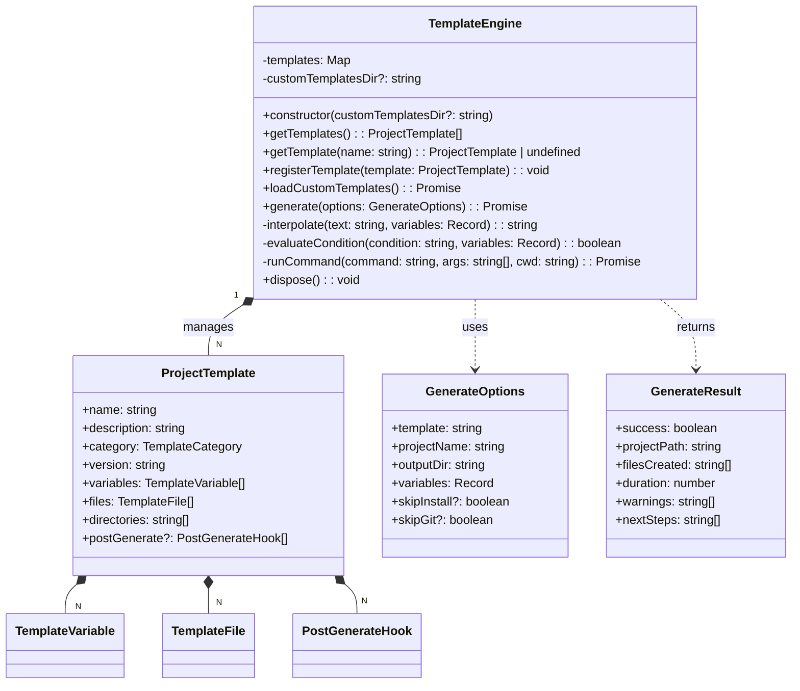

# src — templates

The `src/templates` module serves as a central hub for two distinct but related functionalities: generating formatted output for session data (export templates) and scaffolding new projects from predefined structures (project scaffolding). It provides flexible, customizable mechanisms for both content presentation and project initialization.

## 1. Export Templates

This sub-module is responsible for transforming structured session data into human-readable formats, primarily for export purposes. It currently supports HTML and Markdown outputs, with options for customization.

### 1.1 Purpose

The export templates allow users to generate comprehensive reports or summaries of their interactive sessions. This includes conversation history, metadata, and tool calls, formatted for easy sharing or archival.

### 1.2 Key Components

*   **`htmlTemplate(data: SessionData, options: ExportOptions): string`**:
    *   The main function for generating an HTML representation of a session.
    *   It constructs a full HTML document, including a default CSS stylesheet for styling, and dynamically inserts session metadata and messages.
    *   **`escapeHTML(str: string): string`**: A utility function used internally by `htmlTemplate` to prevent cross-site scripting (XSS) vulnerabilities by escaping special HTML characters in user-generated content.
    *   **`formatContent(content: string, _syntaxHighlight: boolean): string`**: Handles basic markdown-like formatting within message content for HTML output. It converts triple-backtick code blocks (` ``` `) into `<pre><code>` tags, inline code (` `` `) into `<code>` tags, and line breaks into paragraphs (`<p>`) and line breaks (`<br>`).
*   **`markdownTemplate(data: SessionData, options: ExportOptions): string`**:
    *   The main function for generating a Markdown representation of a session.
    *   It builds a Markdown string with appropriate headings, lists, and code blocks for session details and messages.
*   **`SessionData` Interface**:
    *   Defines the comprehensive structure of the session data provided to the templates. This includes session ID, name, project path, model, timestamps, token counts, cost, message count, tool call count, and an array of `MessageData`.
*   **`MessageData` Interface**:
    *   Defines the structure for individual messages within a session, including role (`user`, `assistant`, `system`, `tool`), content, timestamp, tool calls, and token count.
*   **`ExportOptions` Interface**:
    *   (Imported from `../../utils/export-manager.js`) Allows callers to customize the export output, including:
        *   `title`: Custom title for the export.
        *   `maxContentLength`: Truncates long message content.
        *   `includeMetadata`: Toggles inclusion of session-level and message-level statistics.
        *   `includeTimestamps`: Toggles inclusion of message timestamps.
        *   `includeToolCalls`: Toggles inclusion of tool call details.
        *   `syntaxHighlight`: (Currently unused in `formatContent` but present in `htmlTemplate` signature) Intended for future syntax highlighting integration.
        *   `customCss`: Allows overriding the default CSS in HTML exports.

### 1.3 How it Works

Both `htmlTemplate` and `markdownTemplate` follow a similar pattern:
1.  They receive `SessionData` and `ExportOptions`.
2.  They construct the output string by iterating through the `SessionData`.
3.  Metadata (session ID, model, token counts, etc.) is included or excluded based on `options.includeMetadata`.
4.  Each message is processed:
    *   Its role determines the styling/heading.
    *   Content is truncated if `options.maxContentLength` is set.
    *   Content is formatted (e.g., `formatContent` for HTML, direct Markdown for `markdownTemplate`).
    *   Tool calls are included if `options.includeToolCalls` is true, with arguments parsed and formatted.
    *   Message-specific token counts are included if `options.includeMetadata` is true.
    *   Timestamps are included if `options.includeTimestamps` is true.
5.  The final formatted string is returned.

The `htmlTemplate` includes a substantial default CSS block to ensure a visually appealing and readable output out-of-the-box, which can be overridden by `options.customCss`.

### 1.4 Connections

*   **`../../utils/export-manager.js`**: Provides the `ExportOptions` interface, indicating that this module is consumed by an export management system.
*   **`tests/unit/templates.test.ts`**: Contains unit tests verifying the correct behavior and output of both `htmlTemplate` and `markdownTemplate`.

## 2. Project Scaffolding

This sub-module provides a robust system for generating new project directories and files based on predefined templates. It supports built-in templates and allows for custom template definitions, variable substitution, and post-generation hooks.

### 2.1 Purpose

The project scaffolding system aims to streamline the creation of new projects by automating the setup of common project structures, boilerplate code, and initial dependencies. This reduces manual setup time and ensures consistency across projects.

### 2.2 Key Components

#### 2.2.1 `TemplateEngine` Class

The core of the scaffolding system, responsible for managing templates and executing the generation process.



*   **`constructor(customTemplatesDir?: string)`**: Initializes the engine with built-in templates and an optional directory for loading custom templates. It extends `EventEmitter` to emit `progress` and `error` events during generation.
*   **`getTemplates(): ProjectTemplate[]`**: Returns a list of all currently registered templates.
*   **`getTemplate(name: string): ProjectTemplate | undefined`**: Retrieves a specific template by its name.
*   **`registerTemplate(template: ProjectTemplate): void`**: Allows programmatic registration of new templates.
*   **`loadCustomTemplates(): Promise<void>`**: Asynchronously scans a specified `customTemplatesDir` for `template.json` files within subdirectories and registers them as custom templates.
*   **`generate(options: GenerateOptions): Promise<GenerateResult>`**: The core method for creating a new project. It performs variable validation, directory creation, file generation (with content interpolation and conditional logic), and executes post-generation hooks.
*   **`private interpolate(text: string, variables: Record<string, string | boolean>): string`**: Replaces `{{variableName}}` placeholders in template strings with actual variable values.
*   **`private evaluateCondition(condition: string, variables: Record<string, string | boolean>): boolean`**: Evaluates simple conditions (e.g., `variable == value`) to determine if a file or hook should be included.
*   **`private runCommand(command: string, args: string[], cwd: string): Promise<void>`**: Executes external shell commands (e.g., `npm install`, `git init`) in the context of the newly created project directory.
*   **`dispose(): void`**: Cleans up event listeners, important for managing singleton instances.

#### 2.2.2 Interfaces

*   **`ProjectTemplate`**: Defines the structure of a project template, including its metadata, required variables, directories to create, files to generate (with content and optional conditions/executability), and post-generation commands.
*   **`TemplateVariable`**: Describes a variable that a template can accept, including its name, description, type, default value, choices (for `choice` type), and validation regex.
*   **`TemplateFile`**: Specifies a file to be created, its path, content, an optional condition for inclusion, and whether it should be made executable.
*   **`PostGenerateHook`**: Defines a command to be run after files are generated, including its name, command, arguments, an optional condition, and whether its failure should be treated as a warning or an error.
*   **`GenerateOptions`**: The input object for the `generate` method, specifying the template name, project name, output directory, variable values, and flags to skip installation or Git initialization.
*   **`GenerateResult`**: The output object from the `generate` method, providing details about the success, created path, files, duration, warnings, and suggested next steps.

#### 2.2.3 Built-in Templates (`TEMPLATES` Map)

The module includes several predefined templates:
*   **`node-cli`**: A basic Node.js CLI application with TypeScript, `commander`, and `chalk`.
*   **`react-ts`**: A React application with TypeScript, using Vite for bundling.
*   **`express-api`**: An Express.js REST API with TypeScript, `cors`, `helmet`, `dotenv`, and `zod`.

#### 2.2.4 Factory Functions

*   **`getTemplateEngine(customTemplatesDir?: string): TemplateEngine`**: A singleton factory function that ensures only one instance of `TemplateEngine` exists, optionally initializing it with a custom templates directory.
*   **`resetTemplateEngine(): void`**: Resets the singleton instance, primarily used for testing or when a fresh engine is needed.
*   **`generateProject(options: GenerateOptions): Promise<GenerateResult>`**: A convenience function that uses the singleton `TemplateEngine` to quickly generate a project.

### 2.3 How it Works

1.  **Template Selection**: A user selects a template by name (e.g., `node-cli`).
2.  **Variable Collection**: The `generate` method collects user-provided variables and applies default values from the `ProjectTemplate` definition. It then validates required variables and any regex patterns.
3.  **Directory Creation**: The root project directory and any specified subdirectories are created.
4.  **File Generation**:
    *   The engine iterates through `TemplateFile` definitions.
    *   For each file, it evaluates its `condition` using `evaluateCondition` to decide if it should be created.
    *   File paths and content are processed using `interpolate` to substitute variable placeholders.
    *   The file is written to disk. If `executable` is true, file permissions are set.
5.  **Post-Generation Hooks**:
    *   After all files are created, the engine executes `PostGenerateHook` commands (e.g., `npm install`, `git init`).
    *   Hooks can also have conditions and can be marked as `optional`, meaning their failure will be logged as a warning instead of throwing an error.
    *   The `skipInstall` and `skipGit` options in `GenerateOptions` can bypass these hooks.
6.  **Result**: A `GenerateResult` object is returned, summarizing the operation and providing "next steps" instructions.

### 2.4 Connections

*   **Node.js Built-in Modules**: Heavily relies on `fs/promises` (for asynchronous file system operations), `path` (for path manipulation), `fs` (for synchronous `existsSync`), `events` (for `EventEmitter`), and `child_process` (for `spawn` to run external commands).
*   **`tests/project-templates.test.ts` & `tests/unit/templates.test.ts`**: These test files thoroughly exercise the `TemplateEngine` class, its methods, and the built-in templates, ensuring correct project generation and error handling.