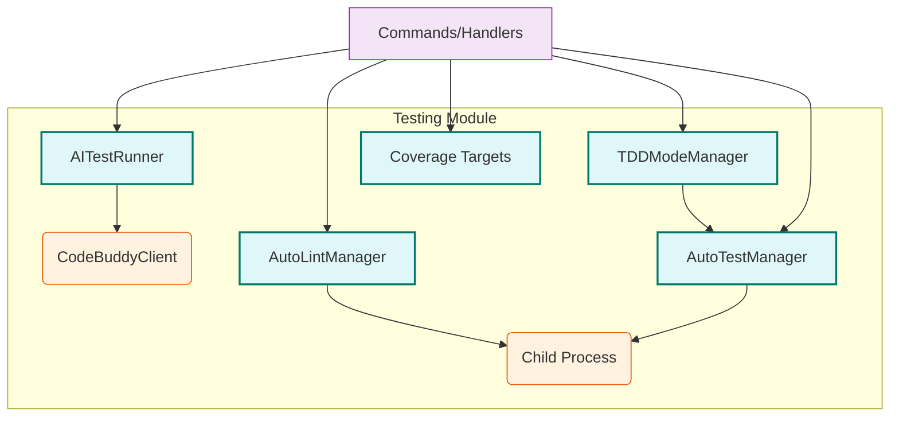

# src — testing

The `src/testing` module provides a comprehensive suite of tools for integrating testing and quality assurance directly into the development workflow, particularly when working with AI agents. It encompasses AI integration tests, automated linting, automated code testing, code coverage management, and a structured Test-Driven Development (TDD) mode.

The primary goal of this module is to enable AI agents to autonomously verify their code generation, adhere to coding standards, and follow development methodologies like TDD, thereby improving code quality and reducing iteration cycles.

## Core Components

The `src/testing` module is composed of several distinct but interconnected sub-modules:

1.  **AI Integration Tests (`ai-integration-tests.ts`)**: Validates the capabilities of the configured AI provider.
2.  **Auto-Lint Integration (`auto-lint.ts`)**: Automatically runs linters and formats code.
3.  **Auto-Test Integration (`auto-test.ts`)**: Automatically runs tests using various frameworks.
4.  **Coverage Targets (`coverage-targets.ts`)**: Manages and compares code coverage thresholds.
5.  **TDD Mode (`tdd-mode.ts`)**: Orchestrates a Test-Driven Development workflow.

---

### 1. AI Integration Tests (`ai-integration-tests.ts`)

This module is responsible for verifying the functionality and reliability of the currently configured AI provider by making real API calls. It covers essential AI capabilities such as basic completion, streaming responses, tool calling, and error handling.

#### `AITestRunner` Class

The `AITestRunner` is the central class for executing AI integration tests. It extends `EventEmitter` to provide real-time feedback on test progress.

*   **Purpose**: To run a suite of predefined tests against an `CodeBuddyClient` instance.
*   **Constructor**:
    *   `constructor(client: CodeBuddyClient, options: AITestOptions)`: Initializes the runner with a `CodeBuddyClient` (which abstracts the AI provider) and configuration options like `timeout`, `verbose`, `skipExpensive`, `testTools`, and `testStreaming`.
*   **Key Methods**:
    *   `async runAll(): Promise<AITestSuite>`: Orchestrates the execution of all defined tests. It iterates through a list of test functions, runs each with a timeout, collects results, and emits events.
        *   Emits `test:start`, `test:complete`, `test:skipped` for individual tests.
        *   Emits `suite:complete` once all tests are done, providing a summary.
    *   `private async runWithTimeout(fn: () => Promise<AITestResult>, timeout: number): Promise<AITestResult>`: A helper to execute any test function with a specified timeout, rejecting if the test exceeds the duration.
    *   `private async testBasicCompletion(): Promise<AITestResult>`: Verifies the AI can respond with a simple phrase.
    *   `private async testSimpleMath(): Promise<AITestResult>`: Checks basic arithmetic capabilities.
    *   `private async testJSONOutput(): Promise<AITestResult>`: Assesses the AI's ability to generate valid JSON.
    *   `private async testCodeGeneration(): Promise<AITestResult>`: Tests the AI's capacity to produce syntactically correct code.
    *   `private async testContextUnderstanding(): Promise<AITestResult>`: Evaluates if the AI can maintain context across multiple turns.
    *   `private async testStreaming(): Promise<AITestResult>`: Confirms the AI's ability to stream responses in chunks.
    *   `private async testToolCalling(): Promise<AITestResult>`: Verifies the AI can correctly identify and format tool calls based on provided tool definitions.
    *   `private async testErrorHandling(): Promise<AITestResult>`: Checks how the AI (or the client wrapper) handles invalid or empty inputs.
    *   `private async testLongContext(): Promise<AITestResult>`: An expensive test to ensure the AI can retrieve information from a large input context.
    *   `static formatResults(suite: AITestSuite): string`: A static utility method to format the entire test suite's results into a human-readable string, including a summary. It uses `stringWidth` for accurate padding with emojis.
*   **Data Structures**:
    *   `AITestResult`: Details for a single test (name, passed, duration, error, tokensUsed).
    *   `AITestSuite`: Aggregated results for all tests (provider, model, timestamp, duration, individual results, summary).
    *   `AITestOptions`: Configuration for the test runner.
*   **Integration Points**:
    *   **Outgoing**: Relies heavily on `CodeBuddyClient.chat()` and `CodeBuddyClient.chatStream()` for AI interactions. It also calls `CodeBuddyClient.getCurrentModel()` to report the model under test.
    *   **Incoming**: `commands/handlers/test-handlers.ts` uses `createAITestRunner` to instantiate and run tests. The `padStart` utility function is used by various other modules for string formatting.

---

### 2. Auto-Lint Integration (`auto-lint.ts`)

This module provides automated linting capabilities, detecting and optionally fixing code style and quality issues. It supports a range of languages and linters by abstracting their execution and output parsing.

#### `AutoLintManager` Class

The `AutoLintManager` is responsible for detecting available linters in a project, running them on specified files, and formatting their output. It also extends `EventEmitter`.

*   **Purpose**: To automate code quality checks and provide structured feedback.
*   **Constructor**:
    *   `constructor(workingDirectory: string, config: Partial<AutoLintConfig>)`: Initializes the manager with the project's root directory and configuration. It immediately calls `detectLinters()`.
*   **Key Methods**:
    *   `private detectLinters(): void`: Scans the `workingDirectory` for common linter configuration files (e.g., `.eslintrc`, `pyproject.toml`) or `package.json` entries to identify which `BUILTIN_LINTERS` are active in the project. Emits `linters:detected`.
    *   `private async runLinter(linter: LinterConfig, file: string, fix: boolean): Promise<LintResult>`: Executes a specific linter command using `child_process.spawn`. It captures `stdout` and `stderr`, handles timeouts and errors, and then uses the linter's `parseOutput` function to convert raw output into structured `LintError` objects.
    *   `async lintFile(file: string, autoFix: boolean): Promise<LintResult | null>`: Lints a single file, identifying the appropriate linter based on file extension. Emits `lint:start` and `lint:complete`.
    *   `async lintFiles(files: string[], autoFix: boolean): Promise<LintResult[]>`: Lints multiple files in parallel.
    *   `formatResultsForLLM(results: LintResult[]): string`: Formats the collected linting errors and warnings into a concise, LLM-friendly string.
    *   `refresh(): void`: Re-runs linter detection.
*   **Data Structures**:
    *   `LintError`: Represents a single linting issue (file, line, column, message, rule, severity, fixable).
    *   `LintResult`: Aggregated results for a linter run (success, errors, warnings, fixed count, duration, linter name).
    *   `LinterConfig`: Defines how to run and parse output for a specific linter (command, args, extensions, parseOutput, fixArgs, configFiles).
    *   `AutoLintConfig`: Overall configuration for the auto-lint manager (enabled, autoFix, failOnError, maxErrors, timeout).
*   **`BUILTIN_LINTERS`**: A constant object containing predefined configurations for popular linters like ESLint, Prettier, Ruff, Clippy, golangci-lint, and RuboCop.
*   **Integration Points**:
    *   **Outgoing**: Uses `child_process.spawn` to run external linter commands. Uses `fs` and `path` for file system operations.
    *   **Incoming**: `getAutoLintManager` and `initializeAutoLint` provide singleton access to the manager.

---

### 3. Auto-Test Integration (`auto-test.ts`)

This module automates the execution of tests, providing structured results and supporting various testing frameworks. It's designed to integrate Test-Driven Development (TDD) workflows and provide immediate feedback on code changes.

#### `AutoTestManager` Class

The `AutoTestManager` detects the project's testing framework, runs tests, and processes their output. It also extends `EventEmitter`.

*   **Purpose**: To automate test execution and provide structured results for AI agents.
*   **Constructor**:
    *   `constructor(workingDirectory: string, config: Partial<AutoTestConfig>)`: Initializes the manager with the project's root directory and configuration. It immediately calls `detectFramework()`.
*   **Key Methods**:
    *   `private detectFramework(): void`: Scans the `workingDirectory` for common test framework configuration files (e.g., `jest.config.js`, `pytest.ini`, `Cargo.toml`) or `package.json` entries to identify which `BUILTIN_FRAMEWORKS` is in use. Emits `framework:detected`.
    *   `private async runTests(args: string[]): Promise<TestResult>`: Executes the detected test framework's command using `child_process.spawn`. It captures `stdout` and `stderr`, handles timeouts and errors, and then uses the framework's `parseOutput` function to convert raw output into structured `TestCase` objects.
    *   `async runAllTests(): Promise<TestResult>`: Runs all tests in the project.
    *   `async runTestFiles(files: string[]): Promise<TestResult>`: Runs tests for specific files.
    *   `async runRelatedTests(sourceFiles: string[]): Promise<TestResult>`: Identifies and runs test files related to a given set of source files using the framework's `detectTestFile` logic.
    *   `formatResultsForLLM(result: TestResult): string`: Formats the test results into a concise, LLM-friendly string, highlighting failures.
    *   `getLastResults(): TestResult | null`: Returns the results of the most recent test run.
    *   `refresh(): void`: Re-runs framework detection.
*   **Data Structures**:
    *   `TestCase`: Details for a single test case (name, suite, file, status, duration, error).
    *   `TestResult`: Aggregated results for a test run (success, passed, failed, skipped, total, duration, individual tests, coverage, framework).
    *   `CoverageResult`: Code coverage metrics (lines, statements, functions, branches).
    *   `TestFrameworkConfig`: Defines how to run and parse output for a specific framework (command, args, filePattern, configFiles, parseOutput, detectTestFile).
    *   `AutoTestConfig`: Overall configuration for the auto-test manager (enabled, runOnSave, runRelatedTests, collectCoverage, timeout, maxTestFiles, watchMode).
*   **`BUILTIN_FRAMEWORKS`**: A constant object containing predefined configurations for popular test frameworks like Jest, Vitest, pytest, cargo test, go test, and RSpec.
*   **Integration Points**:
    *   **Outgoing**: Uses `child_process.spawn` to run external test commands. Uses `fs` and `path` for file system operations.
    *   **Incoming**: `getAutoTestManager` and `initializeAutoTest` provide singleton access to the manager. The `TDDModeManager` heavily relies on `getAutoTestManager` to run tests.

---

### 4. Coverage Targets (`coverage-targets.ts`)

This utility module helps in defining and comparing code coverage thresholds, typically read from project configuration files.

#### Key Functions

*   **`async getCoverageTargets(projectRoot: string): Promise<CoverageTarget>`**:
    *   **Purpose**: Reads coverage thresholds from common configuration files within a project (e.g., `package.json` for Jest/Vitest, `.nycrc`, `.c8rc`).
    *   **How it Works**: It attempts to read `package.json` first, looking for `jest.coverageThreshold.global` or `vitest.coverage.thresholds`. If not found, it checks for `.nycrc` or `.c8rc` files. If no configuration is found, it falls back to `DEFAULT_TARGETS` (80% lines, 70% functions, 60% branches).
*   **`compareCoverage(current: CoverageTarget, target: CoverageTarget): { met: boolean; gaps: string[] }`**:
    *   **Purpose**: Compares actual code coverage percentages against defined targets.
    *   **How it Works**: Iterates through `lines`, `functions`, `branches`, and `statements`, identifying any metrics that fall below their respective targets.
*   **`formatCoverageComparison(current: CoverageTarget, target: CoverageTarget): string`**:
    *   **Purpose**: Formats the coverage comparison results into a human-readable report.
    *   **How it Works**: Generates a detailed string indicating whether each target was met and listing any gaps.
*   **Data Structures**:
    *   `CoverageTarget`: Defines coverage percentages for lines, functions, branches, and statements.
*   **Integration Points**:
    *   **Outgoing**: Uses `fs/promises.readFile` and `path.join` to access project files.
    *   **Incoming**: `commands/handlers/coverage-handler.ts` uses `getCoverageTargets` and `formatCoverageComparison` to provide coverage reports.

---

### 5. TDD Mode (`tdd-mode.ts`)

This module implements a structured Test-Driven Development (TDD) workflow, guiding an AI agent through the "red-green-refactor" cycle. It aims to improve code quality by ensuring tests are written before implementation.

#### `TDDModeManager` Class

The `TDDModeManager` orchestrates the TDD cycle, managing its state, generating prompts for the LLM, and processing test results. It extends `EventEmitter`.

*   **Purpose**: To enforce and manage a Test-Driven Development workflow for AI agents.
*   **Constructor**:
    *   `constructor(workingDirectory: string, config: Partial<TDDConfig>)`: Initializes the manager with the project's root directory and TDD-specific configuration.
*   **Key Methods**:
    *   `getState(): TDDState`: Returns the current state of the TDD cycle.
    *   `private setState(state: TDDState): void`: Updates the internal state and emits a `state:changed` event.
    *   `startCycle(requirements: string): void`: Initiates a new TDD cycle with a given set of requirements. Emits `cycle:started`.
    *   `generateTestPrompt(): string`: Creates a detailed prompt for the LLM to generate tests based on the requirements and TDD configuration (e.g., coverage level, edge cases, mocks).
    *   `recordGeneratedTests(tests: string[], testFiles: string[]): void`: Stores the tests generated by the LLM and transitions the state to `reviewing-tests`. Emits `tests:generated`.
    *   `approveTests(): void`: Moves the cycle from test review to the implementation phase. Emits `tests:approved`.
    *   `generateImplementationPrompt(failedTests?: TestResult): string`: Creates a prompt for the LLM to implement the code. If `failedTests` are provided, it includes feedback on what needs fixing.
    *   `recordImplementation(sourceFiles: string[]): void`: Stores the implemented source files and transitions to `running-tests`. Emits `implementation:recorded`.
    *   `async processTestResults(results: TestResult): Promise<{ continue: boolean; complete: boolean }>`: Evaluates the results from `AutoTestManager`. If all tests pass, the cycle is `complete`. If tests fail and `maxIterations` is not reached, it transitions to `iterating`. Otherwise, it `completes` with errors. Emits `cycle:complete` or `iteration:failed`.
    *   `getCycleResult(): TDDCycleResult | null`: Provides a summary of the completed or cancelled TDD cycle.
    *   `cancelCycle(): void`: Aborts the current TDD cycle. Emits `cycle:cancelled`.
    *   `reset(): void`: Resets the manager to an idle state.
    *   `formatStatus(): string`: Provides a human-readable status of the TDD manager.
    *   `isActive(): boolean`: Checks if a TDD cycle is currently active.
*   **Data Structures**:
    *   `TDDState`: Enum-like type representing the current phase of the TDD workflow.
    *   `TDDCycleResult`: Summary of a TDD cycle (success, iterations, tests generated/passed/failed, files created/modified, duration, errors).
    *   `TDDConfig`: Configuration for the TDD manager (maxIterations, autoApproveTests, generateEdgeCases, generateMocks, testCoverage, language).
    *   `TestTemplate`: Defines templates for generating tests in different languages and frameworks.
*   **`TEST_TEMPLATES`**: A constant object containing predefined test templates for TypeScript (Jest), Python (pytest), Go (testing), and Rust (cargo test).
*   **Integration Points**:
    *   **Outgoing**: Depends on `getAutoTestManager()` to run tests and get the last test results.
    *   **Incoming**: `getTDDManager` and `initializeTDD` provide singleton access to the manager. `commands/handlers/research-handlers.ts` interacts with `startCycle` and `cancelCycle`.

---

## Module Architecture

The `src/testing` module is designed with a clear separation of concerns, with each manager (`AITestRunner`, `AutoLintManager`, `AutoTestManager`, `TDDModeManager`) handling a specific aspect of testing.

**Key Architectural Patterns:**

*   **Manager Classes**: Each core functionality (AI tests, linting, testing, TDD) is encapsulated within its own manager class.
*   **Event Emitters**: `AITestRunner`, `AutoLintManager`, `AutoTestManager`, and `TDDModeManager` all extend `EventEmitter`, allowing other parts of the system to subscribe to and react to testing events (e.g., test start/complete, linter detected, TDD state changes).
*   **Singleton Instances**: `AutoLintManager`, `AutoTestManager`, and `TDDModeManager` provide `get*Manager` and `initialize*` factory functions to ensure a single instance of each manager per working directory, facilitating consistent state management across the application.
*   **External Process Execution**: `AutoLintManager` and `AutoTestManager` rely on `child_process.spawn` to execute external command-line tools (linters and test runners), abstracting the complexities of process management and output parsing.
*   **Configuration-Driven**: All managers are highly configurable through dedicated configuration interfaces (`AITestOptions`, `AutoLintConfig`, `AutoTestConfig`, `TDDConfig`), allowing flexible adaptation to different project needs and AI agent strategies.
*   **LLM Integration**: The `formatResultsForLLM` methods in `AutoLintManager` and `AutoTestManager`, along with `generateTestPrompt` and `generateImplementationPrompt` in `TDDModeManager`, are specifically designed to produce concise, actionable feedback and instructions for AI agents.

## Contributing to the Module

When contributing to the `src/testing` module, consider the following:

*   **Extensibility**: If adding support for a new linter or test framework, follow the pattern established in `BUILTIN_LINTERS` or `BUILTIN_FRAMEWORKS`. This typically involves defining a `LinterConfig` or `TestFrameworkConfig` object with the command, arguments, file patterns, and a `parseOutput` function.
*   **Error Handling**: Ensure robust error handling, especially when dealing with external processes (`child_process.spawn`) and JSON parsing of their outputs.
*   **Eventing**: Utilize the `EventEmitter` pattern for significant state changes or progress updates, allowing for flexible integration with UI or other system components.
*   **Configuration**: Add new configuration options to the relevant `*Config` interface and ensure they are properly merged with `DEFAULT_*_CONFIG` values.
*   **LLM Feedback**: When modifying output formats, keep in mind the target audience (AI agents) and prioritize clarity, conciseness, and actionable information.
*   **Test Coverage**: Maintain high test coverage for any new features or bug fixes, particularly for the parsing logic of external tool outputs.