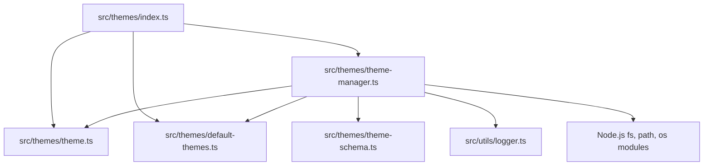

# src — themes

The `src/themes` module provides a robust and extensible system for managing the visual appearance of the Code Buddy application. It encompasses definitions for themes and avatars, a collection of built-in options, validation schemas, and a central manager for loading, saving, and applying user preferences.

## Purpose

The primary goal of this module is to allow users to customize the application's look and feel through:
1.  **Color Themes**: Defining a comprehensive set of colors for various UI elements, messages, and syntax highlighting.
2.  **Avatars**: Customizing the visual identifiers for different message sources (user, assistant, tool, system).
3.  **Persistence**: Ensuring that user-selected themes and custom preferences are saved and reloaded across sessions.
4.  **Extensibility**: Enabling the creation, import, and management of custom themes.

## Core Concepts

The module revolves around several key data structures:

*   **`ThemeColor`**: A type alias representing a color. This can be an Ink-compatible terminal color name (e.g., `'blueBright'`, `'gray'`) or a hexadecimal color string (e.g., `'#RRGGBB'`).
*   **`ThemeColors`**: An interface defining the complete color palette for a theme. It includes categories like primary, secondary, text, status, UI elements, chat messages, and code.
*   **`AvatarConfig`**: An interface defining the avatars for different message roles: `user`, `assistant`, `tool`, and `system`. Avatars are simple string characters.
*   **`Theme`**: The central interface for a complete theme, combining an `id`, `name`, `description`, `colors` (`ThemeColors`), `avatars` (`AvatarConfig`), and metadata like `isBuiltin`, `createdAt`, and `updatedAt`.
*   **`ThemePreferences`**: An interface for storing a user's active theme ID and any custom overrides for avatars or colors.
*   **`AvatarPreset`**: An interface for predefined sets of `AvatarConfig` that users can quickly apply.

## Module Structure

The `src/themes` module is organized into several files, each with a distinct responsibility:

*   **`theme.ts`**: Defines the core TypeScript interfaces and types (`Theme`, `ThemeColors`, `AvatarConfig`, etc.) and exports several built-in `AvatarConfig` presets (e.g., `DEFAULT_AVATARS`, `EMOJI_AVATARS`).
*   **`default-themes.ts`**: Contains the definitions for all built-in `Theme` objects, such as `DEFAULT_THEME`, `DARK_THEME`, `NEON_THEME`, and many popular community and editor-inspired themes. It also exports the `BUILTIN_THEMES` array and a utility function `getBuiltinTheme`.
*   **`theme-schema.ts`**: Provides Zod schemas (`themeSchema`, `themePreferencesSchema`, etc.) for validating theme data. This is crucial for ensuring the integrity of custom themes loaded from disk or imported by users.
*   **`theme-manager.ts`**: Implements the `ThemeManager` class, a singleton responsible for loading, managing, and persisting themes and user preferences. This is the central control point for the theme system.
*   **`index.ts`**: Serves as the public API entry point for the module, re-exporting all necessary types, constants, and the `ThemeManager` from the other files.

## Key Components

### `theme.ts`: Data Structures

This file is the foundation, defining the contracts for all theme-related data. It ensures consistency across built-in and custom themes. The `ThemeColor` type is flexible, supporting both standard terminal colors and hex codes, allowing for rich customization. The various `AvatarConfig` presets offer quick visual changes for message roles.

### `default-themes.ts`: Built-in Themes

This file is a large collection of predefined `Theme` objects. Each theme is a constant export (e.g., `DEFAULT_THEME`, `DRACULA_THEME`) and includes a unique `id`, `name`, `description`, a full `colors` palette, and a default `avatars` configuration. These themes are marked with `isBuiltin: true` to prevent accidental deletion by users. The `BUILTIN_THEMES` array aggregates all these themes for easy iteration and lookup.

### `theme-schema.ts`: Data Validation

Leveraging the Zod library, this file defines schemas to validate the structure and content of `Theme` and `ThemePreferences` objects. This is critical for:
*   **Robustness**: Preventing malformed custom theme files or preference files from crashing the application.
*   **Security**: Ensuring that loaded data conforms to expected types and constraints.
*   **Developer Experience**: Providing clear error messages when validation fails during theme import or loading.

For example, `themeColorSchema` ensures colors are either valid Ink names or hex codes, and `avatarConfigSchema` checks that avatar strings are within a reasonable length.

### `ThemeManager`: The Core Logic

The `ThemeManager` class is a singleton (`getInstance()`) that orchestrates the entire theme system.

**Initialization (`initializeThemes`):**
1.  Loads all `BUILTIN_THEMES` into its internal `themes` map.
2.  Calls `loadCustomThemes()` to discover and load any user-defined themes from `~/.codebuddy/themes/`.
3.  Calls `loadPreferences()` to load the user's last active theme, custom avatars, and custom colors from `~/.codebuddy/theme-preferences.json`.

**Persistence:**
*   **Custom Themes**: `createCustomTheme()` and `saveCustomTheme()` write theme definitions as JSON files to `~/.codebuddy/themes/`. `deleteCustomTheme()` removes them.
*   **User Preferences**: `savePreferences()` writes the `activeTheme`, `customAvatars`, and `customColors` to `~/.codebuddy/theme-preferences.json` whenever these settings are changed.
*   **Directory Management**: `ensureDirectoryExists()` is a utility to create necessary directories (`~/.codebuddy/themes/`, `~/.codebuddy/`) if they don't exist, ensuring smooth file operations.

**Theme and Avatar Management:**
*   `getAvailableThemes()`: Returns all loaded themes (built-in and custom).
*   `getCurrentTheme()`: Returns the currently active `Theme` object.
*   `getColors()`: Returns the effective `ThemeColors`, merging the current theme's colors with any user-defined `customColors`.
*   `getAvatars()`: Returns the effective `AvatarConfig`, merging the current theme's avatars with any user-defined `customAvatars`.
*   `setTheme(themeId: string)`: Changes the active theme and persists the preference.
*   `setCustomAvatars()`, `setCustomAvatar()`, `clearCustomAvatars()`: Methods to manage user-specific avatar overrides.
*   `setCustomColors()`, `setCustomColor()`, `clearCustomColors()`: Methods to manage user-specific color overrides.
*   `applyAvatarPreset(presetId: string)`: Applies one of the predefined `AVATAR_PRESETS` as custom avatars.

**Custom Theme Operations:**
*   `createCustomTheme()`: Creates a new theme and saves it to disk.
*   `cloneTheme()`: Duplicates an existing theme, allowing users to customize it.
*   `exportTheme()`: Serializes a theme to a JSON string.
*   `importTheme()`: Parses a JSON string into a `Theme` object, validates it using Zod, and saves it as a custom theme.

**Error Handling:**
The `ThemeManager` uses `src/utils/logger.ts` to log warnings for issues like invalid JSON in theme files or preferences, or failures during file system operations, ensuring the application remains stable even with corrupted user data.

## How it Works

1.  **Initialization**: When the application starts, `getThemeManager()` is called, which instantiates the `ThemeManager` singleton. The manager immediately loads all built-in themes, then scans `~/.codebuddy/themes/` for custom JSON theme files, validating them with Zod schemas. Finally, it loads `~/.codebuddy/theme-preferences.json` to determine the user's last active theme and any custom avatar/color overrides.
2.  **Active Theme Resolution**: The `currentTheme` property holds the active theme. `getColors()` and `getAvatars()` dynamically merge the `currentTheme`'s properties with any `customColors` or `customAvatars` stored in preferences, providing the final, effective styling.
3.  **Persistence**: Any changes made via `setTheme()`, `setCustomAvatars()`, `setCustomColors()`, `applyAvatarPreset()`, `createCustomTheme()`, `deleteCustomTheme()`, or `importTheme()` trigger a save operation to the respective JSON files in the user's `~/.codebuddy/` directory. This ensures that customizations persist across application restarts.

## Connections to the Codebase

The `src/themes` module is a foundational service, primarily consumed by UI components and command handlers:

*   **`ui/context/theme-context.tsx` (ThemeProvider)**: This React context provider is a major consumer. It uses `getThemeManager()` to access the current theme, colors, and avatars, making them available throughout the UI. It also calls `setCustomColor()`, `setCustomAvatar()`, `applyAvatarPreset()`, `clearCustomColors()`, and `clearCustomAvatars()` to update preferences based on user interactions in the UI.
*   **`commands/handlers/ui-handlers.ts` (handleTheme, handleAvatar)**: These command handlers allow users to change themes and avatar presets directly through application commands. They interact with `ThemeManager` methods like `setTheme()`, `applyAvatarPreset()`, `setCustomAvatar()`, `clearCustomAvatars()`, `getAvailableThemes()`, `getAvatarPresets()`, and `getCurrentTheme()`.
*   **`tests/themes/theme-manager.test.ts`**: The comprehensive test suite for `ThemeManager` directly calls almost all public methods to ensure correct behavior, persistence, and validation.

The module's reliance on Node.js `fs`, `path`, and `os` modules for file system interactions, and `src/utils/logger.ts` for internal logging, highlights its role as a backend service for managing user-specific configuration.