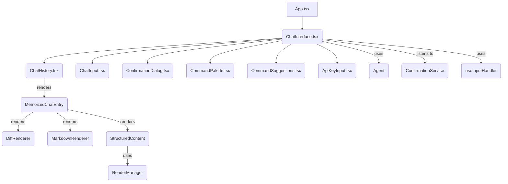

# src — ui

The `src/ui` module is the heart of the Code Buddy command-line interface, responsible for rendering the interactive chat experience and managing all user interactions within the terminal. It leverages the `ink` React framework to build a rich, dynamic, and responsive user interface.

## Purpose

The primary goals of the `src/ui` module are:

*   **Interactive Chat:** Provide a seamless conversational interface with the Code Buddy agent.
*   **User Input Management:** Handle keyboard input, command parsing, and autocomplete.
*   **Rich Output Display:** Render diverse content types, including plain text, Markdown, code blocks, diffs, structured data, and tool outputs.
*   **User Feedback:** Display processing states, confirmations, suggestions, and notifications.
*   **Accessibility:** Ensure the UI is usable and informative for all users, including those relying on screen readers.
*   **Extensibility:** Offer a framework for adding new UI features and components.
*   **Responsiveness:** Adapt the display to various terminal sizes and configurations.

## Core UI Architecture

The UI is built as a single-page application using `ink`, which allows React components to render to the terminal. The main entry point is `App.tsx`, which then orchestrates the `ChatInterface.tsx` and other components.

### `App.tsx` - The Ink Root Component

`src/ui/app.tsx` serves as the root component for the Ink application. It initializes the core state and handles global input events.

**Key Responsibilities:**

*   **State Management:** Manages the overall application state, including user input, chat history, processing status (`isProcessing`), and confirmation dialog options (`confirmationOptions`).
*   **Global Input Handling:** Uses `ink`'s `useInput` hook to capture keyboard events. It handles basic terminal interactions like `Ctrl+C` and `exit`/`quit` commands to terminate the application.
*   **Agent Interaction:** When the user presses `Enter`, it calls `agent.processCommand(input.trim())` to send the command to the Code Buddy agent and updates the `history` with the command and its `ToolResult`.
*   **Confirmation Service Integration:** Subscribes to `ConfirmationService.getInstance().on('confirmation-requested')` to display `ConfirmationDialog` when the agent requires user approval for an operation. It provides `handleConfirmation` and `handleRejection` callbacks to the service.
*   **Rendering:** Renders the main chat interface, including the input prompt, chat history, and the `ConfirmationDialog` when active.

### `ChatInterface.tsx` - The Chat Orchestrator

`src/ui/components/ChatInterface.tsx` is the central component that orchestrates the entire chat experience. It manages the conversation flow, integrates with the agent, and conditionally renders various UI elements.

**Key Responsibilities:**

*   **Agent Lifecycle:** Handles the initial API key input via `ApiKeyInput.tsx` and then instantiates and interacts with the `CodeBuddyAgent`.
*   **Chat History Management:** Maintains the `chatHistory` state, which is an array of `ChatEntry` objects. It includes optimized update functions (`appendStreamingContent`, `finalizeStreamingEntry`, `updateToolCallEntry`) to efficiently handle streaming responses from the agent without causing excessive re-renders.
*   **Streaming Response Handling:** Iterates through the `agent.processUserMessageStream` to update the UI in real-time as the agent reasons, calls tools, streams content, or asks for user input. This includes:
    *   Updating `currentActivity` (e.g., "Reasoning...", "Executing: bash").
    *   Appending `content` for `assistant` and `reasoning` entries.
    *   Adding `tool_call` and `tool_result` entries.
    *   Handling `plan_progress` and `steer` messages.
    *   Pausing for `ask_user` interactions using `TabbedQuestion.tsx`.
*   **Input Handling Integration:** Delegates complex input logic (autocomplete, command parsing, cursor movement) to the `useInputHandler` hook (from `src/hooks/use-input-handler.js`).
*   **Conditional UI Elements:** Renders various components based on application state:
    *   `LoadingSpinner.tsx` during processing.
    *   `CommandSuggestions.tsx` for autocomplete.
    *   `ModelSelection.tsx` for model switching.
    *   `ConfirmationDialog.tsx` for agent confirmations.
    *   `TabbedQuestion.tsx` for agent-initiated questions.
    *   `CommandPalette.tsx` (toggled by `Ctrl+K`).
    *   `KeyboardHelp.tsx` (toggled by `?`).
    *   `Sidebar.tsx` (toggled by `Ctrl+B` on wider terminals).
*   **Theming and Accessibility:** Wraps the entire interface with `ThemeProvider` and `ToastProvider`, and integrates with `useAccessibilitySettings` and `announceToScreenReader` for screen reader support.
*   **Initial Setup:** Clears the terminal and displays the Code Buddy ASCII banner on startup.

## Key UI Components

The `src/ui/components` directory contains a rich set of reusable Ink React components that build the interactive experience.

### `ChatHistory.tsx`

This component is responsible for rendering the entire conversation history. It's designed for performance and clarity, especially with streaming content and structured data.

*   **`MemoizedChatEntry`:** A memoized sub-component that renders individual `ChatEntry` objects. This prevents unnecessary re-renders of stable chat entries.
*   **Structured Data Rendering:** Uses `tryRenderStructuredData` and `StructuredContent` to detect and render known structured data types (e.g., test results, weather data, code structure) using the `RenderManager`.
*   **Diff Rendering:** Specifically handles `str_replace_editor` tool results to render code diffs using `DiffRenderer.tsx`.
*   **File Content Display:** Renders `view_file` and `create_file` tool results with proper indentation.
*   **Markdown Support:** Uses `MarkdownRenderer.tsx` to render assistant messages, supporting various Markdown elements including code blocks and tables.
*   **Performance Optimization:** Employs `ink`'s `Static` component for committed (non-streaming, finalized) chat entries. This writes them directly to stdout, improving performance by reducing the number of components Ink needs to manage in its live viewport. Dynamic (streaming or pending) entries are rendered normally.
*   **Windowing:** Applies a windowing mechanism to dynamic entries to limit the number of live-rendered components, further enhancing performance.

### `ChatInput.tsx`

Renders the interactive input line where the user types commands.

*   **Cursor Management:** Displays a blinking cursor (`█`) at the `cursorPosition`.
*   **Multiline Support:** Handles and renders multiline input correctly.
*   **Processing Indicators:** Changes border color and hides the cursor when `isProcessing` or `isStreaming`.
*   **Mode-Specific Prompts:** Displays different icons and colors based on the agent's current `mode` (e.g., `plan`, `code`, `ask`).
*   **Placeholder Text:** Shows a dim placeholder when the input is empty.

### `CommandSuggestions.tsx`

Provides real-time autocomplete suggestions as the user types slash commands.

*   **Filtering:** `filterCommandSuggestions` filters available commands based on the current input.
*   **Argument Suggestions:** `getArgumentSuggestions` provides context-aware suggestions for command arguments (e.g., `/ai-test quick`).
*   **Prioritization:** Prioritizes commonly used commands when only `/` is typed.
*   **Navigation:** Allows navigation through suggestions using arrow keys.

### `CommandPalette.tsx`

A more advanced, fuzzy-searchable command palette, similar to VS Code's command palette.

*   **`PaletteItem`:** Defines the structure for commands, models, and recent prompts.
*   **`buildPaletteItems`:** Aggregates commands from `getEnhancedCommandHandler()`, common models, and recent prompts from `getNavigableHistory()`.
*   **Fuzzy Matching:** Uses `fuzzyScore` for flexible search.
*   **Category Filtering:** Supports prefix-based filtering (e.g., `>cmd`, `@model`, `#recent`).
*   **Navigation:** Allows navigation and selection using arrow keys, `Enter`, and `Tab`.

### `AccessibleOutput.tsx`

A collection of components designed to improve the accessibility and semantic structure of terminal output.

*   **Semantic Headers:** `SectionHeader` provides consistent visual and semantic hierarchy.
*   **Status Indicators:** `StatusWithText` ensures status is conveyed with both color and text (e.g., `✓ Success`, `✗ Error`).
*   **Progress Bars:** `AccessibleProgress` offers visual and textual progress.
*   **Keyboard Shortcuts:** `KeyboardShortcut` and `HelpPanel` clearly display key combinations.
*   **Structured Lists and Tables:** `AccessibleList`, `DefinitionList`, and `AccessibleTable` provide structured output.
*   **Code Blocks:** `AccessibleCodeBlock` renders code with optional language labels and line numbers.
*   **Announcements:** `Announcement` components are intended for screen reader announcements.
*   **Structured Errors/Success:** `AccessibleError` and `AccessibleSuccess` provide consistent, detailed feedback.

### `ApiKeyInput.tsx`

A dedicated component for securely capturing and saving the user's API key.

*   **Input Masking:** Displays asterisks (`*`) for the API key input.
*   **Persistence:** Saves the API key to `~/.codebuddy/user-settings.json` using `getSettingsManager()`.
*   **Validation:** Basic validation for non-empty input.

## CLI Enhancements (`cli-enhancements.ts`)

This file contains a suite of utility classes that provide various CLI-related features and configurations, often exposed as flags or commands. While these classes define the *logic* and *state* for these enhancements, their *rendering* in the UI is handled by other components (e.g., `StatusBar`, `ChatHistory`, `CommandPalette`).

*   **`DebugCommand`**: Provides methods to gather and format debug information about the session, model, hooks, plugins, MCP, and performance.
*   **`AnnouncementManager`**: Manages a system for displaying priority-based announcements to the user, with support for expiration and dismissal.
*   **`AttributionManager`**: Configures and applies attribution footers to generated content (e.g., commit messages, PR bodies).
*   **`PRStatusIndicator`**: Manages and formats information about the current Pull Request status for display in the prompt or status bar.
*   **`MaxTurnsManager`**: Tracks the current turn count and enforces a configurable maximum number of turns for the agent.
*   **`SessionPersistenceConfig`**: Determines whether the current session should be persistent or ephemeral, affecting how conversation history and other data are saved.
*   **`BashHistoryAutocomplete`**: Manages a history of executed commands for bash-like autocomplete functionality.
*   **`StrictMCPConfig`**: Enforces strict configuration for Multi-Cloud Provider (MCP) servers, allowing only explicitly permitted servers.
*   **`PromptStash`**: Provides functionality to save and restore prompt drafts (e.g., via `Ctrl+S`).

## Clipboard Management (`clipboard-manager.ts`)

This module provides cross-platform clipboard functionality, including history and content type detection.

*   **`ClipboardManager` Class:** Manages clipboard operations.
*   **Cross-Platform Support:** Uses `child_process.exec` to interact with system clipboard tools (`pbcopy`/`pbpaste` on macOS, `clip` on Windows, `xclip`/`xsel` on Linux).
*   **Clipboard History:** Stores a history of copied items (`ClipboardEntry`), including content, timestamp, and detected type (`text`, `code`, `path`, `url`).
*   **Persistence:** Saves and loads clipboard history to/from `~/.codebuddy/clipboard-history.json` using `fs-extra`.
*   **Type Detection:** `detectType` uses heuristics (regex patterns) to infer the content type (URL, file path, code, or plain text).
*   **Singleton Pattern:** `getClipboardManager()` ensures a single instance is used throughout the application.

## Responsive Display (`compact-mode.ts`)

This module handles dynamic adjustments to the UI layout and content formatting based on the terminal's width.

*   **`DisplayMode`:** Defines three modes: `full`, `compact`, and `minimal`.
*   **`CompactModeManager` Class:**
    *   Detects `terminalSize` and listens for `process.stdout.on('resize')` events to update the mode dynamically.
    *   `determineMode()` logic switches between modes based on `fullModeMinWidth` and `compactModeMinWidth` thresholds.
    *   Provides utility methods for formatting content (`truncate`, `wrap`), headers (`formatHeader`), separators (`formatSeparator`), message previews (`formatMessagePreview`), tool output (`formatToolOutput`), status lines (`formatStatusLine`), lists (`formatList`), and tables (`formatTable`) according to the current `DisplayMode`.
    *   Offers `getPadding()` to adjust component padding.
*   **Singleton Pattern:** `getCompactModeManager()` ensures a single instance manages the display mode globally.

## Integration Points & Dependencies

The `src/ui` module is highly integrated with other parts of the Code Buddy codebase:

*   **`src/agent/codebuddy-agent.js`**: The core AI agent. The UI sends user input to the agent and processes its streaming responses.
*   **`src/utils/confirmation-service.ts`**: A singleton service that allows the agent to request user confirmation for sensitive operations, which the UI then displays via `ConfirmationDialog.tsx`.
*   **`src/hooks/use-input-handler.js`**: A custom React hook that centralizes complex input logic, including command parsing, history navigation, and autocomplete.
*   **`src/ui/context/theme-context.js`**: Provides theming capabilities, allowing UI components to access current colors and avatar configurations.
*   **`src/ui/utils/accessibility.ts`**: Offers utilities for screen reader announcements and managing keyboard shortcuts for accessibility.
*   **`src/renderers/render-manager.ts`**: Used by `ChatHistory.tsx` to render structured data (e.g., JSON output from tools) in a human-readable format.
*   **`src/commands/slash-commands.js`**: Provides the definitions for slash commands, used by `CommandSuggestions.tsx` and `CommandPalette.tsx`.
*   **`src/ui/navigable-history.js`**: Manages user command history, used by `CommandPalette.tsx` for recent prompts.
*   **`src/utils/settings-manager.js`**: Used by `ApiKeyInput.tsx` to persist user settings like the API key.
*   **`src/utils/logger.js`**: Used throughout the UI for internal logging and debugging.
*   **`src/input/text-to-speech.js`**: Integrated into `ChatInterface.tsx` for auto-speaking agent responses when enabled.

## Contributing to the UI

When contributing to the `src/ui` module:

1.  **Understand Ink/React:** Familiarity with React hooks, state management, and `ink`'s specific components (`Box`, `Text`, `useInput`, `Static`) is crucial.
2.  **Performance:** Be mindful of re-renders, especially in `ChatHistory.tsx`. Leverage `React.memo` and `useMemo`/`useCallback` where appropriate, and understand how `Static` works for long-running output.
3.  **Accessibility:** Always consider how your UI changes will impact screen reader users. Use `AccessibleOutput.tsx` components where possible and ensure information is not conveyed by color alone. Use `announceToScreenReader` for important events.
4.  **Theming:** Use `useTheme()` to access colors and avatars, ensuring your components adapt to different themes.
5.  **Responsiveness:** Consider how your components will render in `compact` and `minimal` modes. Use `getCompactModeManager()` for mode-aware formatting.
6.  **Modularity:** Break down complex UI features into smaller, reusable components within `src/ui/components`.
7.  **Testing:** Write unit tests for individual components and integration tests for larger flows to ensure stability and correctness.