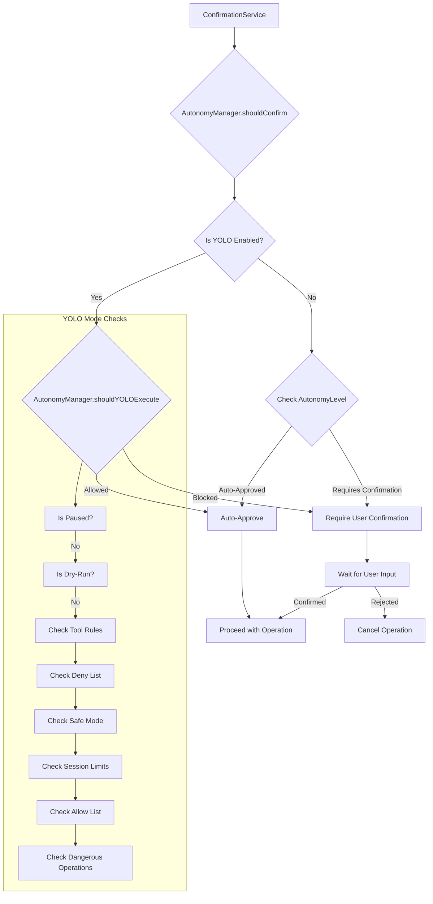

# src — utils

The `src/utils` module is a foundational collection of shared, reusable utilities that support various functionalities across the Code Buddy application. It encapsulates common patterns, external integrations, and core logic that would otherwise be duplicated throughout the codebase.

This document details the purpose, key components, and integration points for each utility within this module.

---

## Module Overview

The `src/utils` module provides:

*   **Configuration Management & Validation**: Tools for defining, loading, validating, and migrating application settings and environment variables.
*   **User Interaction & Autonomy**: Services for managing user confirmation flows, learning approval patterns, and controlling the AI's autonomy level (including "YOLO" mode).
*   **System Interaction**: Utilities for clipboard operations, managing the Code Buddy home directory, and safe command execution.
*   **Data Handling**: Generic caching mechanisms, text normalization, and parsing helpers.
*   **Presentation**: ASCII banner generation and color contrast checking for accessibility.

---

## Utilities Reference

### `approval-pattern-tracker.ts`

This utility implements a pattern-based learning system for user approvals. It observes repeated approvals of specific tool commands and, after a configurable threshold, can silently auto-approve them in the future. This enhances the user experience by reducing repetitive confirmation prompts for trusted actions.

**Key Components:**

*   **`ApprovalPattern` (Interface)**: Defines the structure for a learned pattern, including `tool`, `argsPattern`, `approvalCount`, and `lastApproved` timestamp.
*   **`ApprovalPatternTracker` (Class)**:
    *   Manages a collection of `ApprovalPattern` instances.
    *   Persists patterns to `.codebuddy/approval-patterns.json`.
    *   `normalizeArgs(args: Record<string, unknown> | string)`: Crucial for creating stable patterns by stripping variable parts (timestamps, UUIDs, temp paths) from tool arguments.
    *   `recordApproval(tool: string, args: Record<string, unknown> | string)`: Increments the approval count for a given pattern and returns `true` if the pattern has crossed the auto-approve threshold.
    *   `shouldAutoApprove(tool: string, args: Record<string, unknown> | string)`: Checks if a pattern has met the auto-approve threshold.
    *   `listPatterns()`, `clearPatterns()`: Management functions for the stored patterns.
*   **`getApprovalPatternTracker(cwd?: string)` (Function)**: Provides a singleton instance of `ApprovalPatternTracker`.

**How it Works:**

1.  When `recordApproval` is called, `normalizeArgs` converts the tool's arguments into a consistent string pattern.
2.  This pattern, combined with the tool name, forms a unique key.
3.  The `approvalCount` for this key is incremented. If it reaches `DEFAULT_THRESHOLD` (default 3), the pattern is considered "learned."
4.  Patterns are saved to a JSON file in the `.codebuddy` directory within the current working directory.
5.  `shouldAutoApprove` checks if a pattern exists and its `approvalCount` meets the threshold, indicating it can be silently approved.

**Integration:**

The `ApprovalPatternTracker` is primarily used by the `ConfirmationService` to decide whether a user action can be automatically approved without explicit user input.

### `ascii-banner.ts`

A simple utility for generating ASCII art banners, primarily used for displaying application branding or important messages in the terminal. It serves as a lightweight, MIT-licensed alternative to more complex ASCII art libraries.

**Key Components:**

*   **`BannerOptions` (Interface)**: Configures banner appearance (font, color, alignment).
*   **`BLOCK_FONT` (Constant)**: A `Record` mapping uppercase characters to their 5-line ASCII block art representations.
*   **`renderBanner(text: string, options?: BannerOptions)` (Function)**: The main function to render text as an ASCII banner using the specified font and alignment.
*   **`renderSimpleBanner(text: string)` (Function)**: Renders a basic single-line banner with a box border.
*   **`renderGrokBanner()` (Function)**: Renders the default "GROK" application banner, centered.
*   **`renderColorBanner(text: string, colors?: string[])` (Function)**: Applies a gradient of ANSI colors to a rendered banner.
*   **`default` (Export)**: An object providing `render` and `say` methods, allowing it to be used similarly to `cfonts`. `say` logs the banner using `logger.info`.

**How it Works:**

For block fonts, `renderBanner` iterates through the input text, looking up each character in `BLOCK_FONT`. It then concatenates the corresponding ASCII art lines horizontally to form the complete banner. Alignment is handled by calculating padding based on terminal width. `renderColorBanner` splits the banner into lines and applies ANSI color codes in a gradient.

**Integration:**

Used at application startup to display the "GROK" banner and potentially for other significant informational messages.

### `autonomy-manager.ts`

The `AutonomyManager` is a critical component for controlling the AI agent's level of autonomy and determining when user confirmation is required for operations. It supports various autonomy levels, including a "YOLO" mode with extensive guardrails.

**Key Components:**

*   **`AutonomyLevel` (Type)**: Defines the possible autonomy levels: `suggest`, `confirm`, `auto`, `full`, `yolo`.
*   **`YOLOConfig` (Interface)**: Configuration specific to YOLO mode, including `allowList`, `denyList`, `maxAutoEdits`, `maxAutoCommands`, `safeMode`, `allowedPaths`, `blockedPaths`, `dryRun`, and `toolRules`.
*   **`AutonomyConfig` (Interface)**: The overall configuration for autonomy, including the `level`, `dangerousOperations`, `safeOperations`, `sessionOverrides`, and `yolo` settings.
*   **`AutonomyManager` (Class)**:
    *   Manages loading and saving autonomy configuration from `.codebuddy/autonomy.json`.
    *   `getLevel()`, `setLevel(level: AutonomyLevel)`: Get/set the current autonomy level.
    *   `shouldConfirm(operation: string, toolName?: string)`: The core method for general autonomy, determining if an operation requires confirmation based on the current level, overrides, and dangerous/safe lists.
    *   **YOLO Mode Methods**:
        *   `enableYOLO()`, `disableYOLO()`, `isYOLOEnabled()`: Control YOLO mode.
        *   `shouldYOLOExecute(command: string, type: "bash" | "edit", toolName?: string)`: The central logic for YOLO mode, checking against deny/allow lists, session limits, safe mode, dry-run, and per-tool rules. Returns a `YOLOExecuteResult` indicating if execution is allowed and why.
        *   `isPathAllowedForYOLO(filePath: string)`: Checks if a file path is allowed for modification based on YOLO path rules.
        *   `recordYOLOExecution(type: "bash" | "edit")`: Increments session counters for edits/commands.
        *   `pauseYOLO()`, `resumeYOLO()`, `isPaused()`: Control the paused state of YOLO mode.
        *   `setYoloStartSnapshotId()`, `getYoloStartSnapshotId()`: Manages a snapshot ID for potential "undo-all" functionality in YOLO.
        *   `getSessionSummary()`, `getExecutionLog()`: Provide insights into YOLO session activity.
        *   `setDryRun()`, `isDryRun()`: Control dry-run mode for YOLO.
        *   `setToolRule()`, `removeToolRule()`, `getToolRules()`: Manage per-tool rules for YOLO.
    *   `formatYOLOStatus()`, `formatStatus()`, `formatHelp()`: Provide formatted output for status and help.
*   **`getAutonomyManager()` (Function)**: Provides a singleton instance of `AutonomyManager`.

**How it Works:**

1.  **Configuration Loading**: On instantiation, `AutonomyManager` loads its configuration from `.codebuddy/autonomy.json`, merging with `DEFAULT_YOLO_CONFIG` and `DEFAULT_DANGEROUS_OPERATIONS`/`DEFAULT_SAFE_OPERATIONS`.
2.  **General Autonomy (`shouldConfirm`)**:
    *   Checks `sessionOverrides` first.
    *   Then checks if the operation is in `dangerousOperations` (always confirm).
    *   Then checks `safeOperations` (never confirm in `auto`/`full` modes).
    *   Finally, applies the general `AutonomyLevel` logic.
3.  **YOLO Mode (`shouldYOLOExecute`)**:
    *   If YOLO is paused or in dry-run, it blocks execution.
    *   Checks `toolRules` for specific tool overrides.
    *   Prioritizes `denyList` (always blocks).
    *   Applies `safeMode` checks for destructive commands.
    *   Checks `maxAutoEdits` and `maxAutoCommands` session limits.
    *   Prioritizes `allowList` (fast-tracks approval).
    *   If none of the above, it defaults to allowing unless it's a `dangerousOperation`.
    *   All YOLO decisions are logged to an in-memory `executionLog`.
4.  **Path Validation (`isPathAllowedForYOLO`)**: Checks if a given file path matches any `blockedPaths` or is not within `allowedPaths` (if specified).

**Integration:**

The `AutonomyManager` is a core dependency of the `ConfirmationService`, which uses its `shouldConfirm` and `shouldYOLOExecute` methods to decide whether to prompt the user for approval or proceed automatically. It also uses `logger` for warnings and `fs-extra` for file operations.



### `base-url.ts`

Provides functionality to normalize and validate API base URLs, ensuring they conform to expected formats and security practices.

**Key Components:**

*   **`DEFAULT_BASE_URL` (Constant)**: The default API endpoint.
*   **`normalizeBaseURL(input: string)` (Function)**: Takes a string, trims it, validates it as a URL, and ensures it uses `http://` or `https://`, has no credentials, query parameters, or fragments. It also removes trailing slashes.

**How it Works:**

It leverages Node.js's built-in `URL` class for robust parsing and then applies a series of checks to enforce specific constraints suitable for an API base URL.

**Integration:**

Likely used by API client configurations or settings managers to ensure that any custom base URL provided by the user is valid before being used.

### `batch-review-service.ts`

This service consolidates multiple file changes (creations, edits, deletions) made by an AI agent into a single batch for user review. Instead of prompting for each individual file, it presents a unified diff view, allowing the user to approve or reject changes per file or in bulk.

**Key Components:**

*   **`PendingChange` (Interface)**: Describes a single file modification, including `filePath`, `type`, `diff`, `tool`, `callId`, and approval status.
*   **`BatchReviewResult` (Interface)**: The outcome of a batch review, listing `approved` and `rejected` changes.
*   **`BatchReviewService` (Class)**:
    *   `startBatch()`: Initializes a new batch, clearing previous changes.
    *   `addChange(change: Omit<PendingChange, 'approved' | 'rejected'>)`: Adds a change to the current batch. Returns `false` if not in batch mode.
    *   `getPendingChanges()`, `formatBatchSummary()`: Retrieve and format the list of changes for display.
    *   `approveAll()`, `rejectAll()`: Bulk actions for all pending changes.
    *   `approveChange(index: number)`, `rejectChange(index: number)`, `toggleChange(index: number)`: Actions for individual changes.
    *   `finalize(bulkApproved = false)`: Concludes the batch review, returning the `BatchReviewResult`.
    *   `isBatchMode()`, `hasPendingChanges()`, `getPendingCount()`: Status checks.
    *   `cancelBatch()`: Discards all pending changes.
*   **`getBatchReviewService()` (Function)**: Provides a singleton instance of `BatchReviewService`.

**How it Works:**

1.  An agent calls `startBatch()` at the beginning of a sequence of file modifications.
2.  For each file change, the agent calls `addChange()`, providing details like the file path, type of change, and a diff preview.
3.  Once all changes for a turn are collected, the UI can call `formatBatchSummary()` to display them to the user.
4.  The user interacts with the service via `approveAll()`, `rejectAll()`, or individual `approveChange()`/`rejectChange()`/`toggleChange()` calls.
5.  Finally, `finalize()` is called to get the results, and `batchMode` is deactivated.

**Integration:**

Tools that modify files (e.g., `text-editor` tools) would use this service to defer and consolidate confirmation prompts. It works in conjunction with the `ConfirmationService` to present a more user-friendly review experience for multi-file operations.

### `cache.ts`

A generic, in-memory cache implementation with Time-To-Live (TTL) support. It's designed for temporary storage of computed or fetched data to improve performance.

**Key Components:**

*   **`CacheEntry<T>` (Interface)**: Defines the structure of a cached item, holding the `value` and its `expiresAt` timestamp.
*   **`Cache<T>` (Class)**:
    *   `constructor(defaultTTL: number = 60000)`: Initializes the cache with a default TTL.
    *   `get(key: string)`: Retrieves a value, returning `undefined` if not found or expired.
    *   `set(key: string, value: T, ttl?: number)`: Stores a value with an optional custom TTL.
    *   `has(key: string)`: Checks for the existence of a non-expired key.
    *   `delete(key: string)`, `clear()`, `cleanup()`: Management functions.
    *   `getOrCompute(key: string, computeFn: () => Promise<T>, ttl?: number)`: Asynchronously retrieves a value from the cache or computes it if missing/expired, then caches and returns it.
    *   `getOrComputeSync(key: string, computeFn: () => T, ttl?: number)`: Synchronous version of `getOrCompute`.
*   **`createCacheKey(...parts: (string | number | boolean | undefined | null)[])` (Function)**: Generates a consistent string key from multiple parts.

**How it Works:**

The cache uses a JavaScript `Map` internally. Each entry stores the value and an `expiresAt` timestamp. When `get` is called, it checks `Date.now()` against `expiresAt` to determine if the entry is still valid. `getOrCompute` provides a convenient pattern for caching results of expensive operations.

**Integration:**

This is a general-purpose utility that can be used by any module needing to cache data, such as `semantic-cache` or `response-cache` (as seen in the call graph, though not directly in the provided source).

### `clipboard.ts`

Provides cross-platform functionality for interacting with the system clipboard (copy and paste). It gracefully handles cases where native clipboard tools might be missing.

**Key Components:**

*   **`copyToClipboard(text: string)` (Function)**: Copies the given text to the clipboard.
*   **`readFromClipboard()` (Function)**: Reads text from the clipboard.
*   **`isClipboardAvailable()` (Function)**: Checks if clipboard operations are likely to succeed on the current platform.

**How it Works:**

It uses Node.js's `child_process.execSync` to execute platform-specific commands:
*   **macOS**: `pbcopy` and `pbpaste`
*   **Windows**: `clip` and `powershell -command Get-Clipboard`
*   **Linux**: Tries `xclip`, `xsel`, and `wl-copy` (for Wayland) in sequence until one succeeds.

Error handling is included to prevent crashes if a command fails or is not found.

**Integration:**

Any feature that needs to interact with the user's system clipboard, such as copying code snippets, command outputs, or pasting input.

### `codebuddy-home.ts`

This module centralizes the management of the Code Buddy application's home directory (`GROK_HOME`), where all configuration, data, and persistent state are stored. It allows users to customize this location via an environment variable.

**Key Components:**

*   **`getCodeBuddyHome()` (Function)**: Returns the absolute path to the `GROK_HOME` directory. Prioritizes `GROK_HOME` environment variable, falls back to `~/.codebuddy`.
*   **`getGrokPath(...relativePath: string[])` (Function)**: Constructs an absolute path within `GROK_HOME`.
*   **`ensureCodeBuddyHome()` (Function)**: Ensures the `GROK_HOME` directory exists, creating it if necessary.
*   **`ensureGrokDir(...relativePath: string[])` (Function)**: Ensures a specific subdirectory within `GROK_HOME` exists.
*   **Various `get*Dir()`/`get*Path()` Functions**: Provide convenient access to common subdirectories like `agents`, `prompts`, `memory`, `sessions`, `checkpoints`, `cache`, `logs`, etc.
*   **`isCustomCodeBuddyHome()` (Function)**: Checks if `GROK_HOME` is set to a custom path.
*   **`formatCodeBuddyHomeInfo()` (Function)**: Returns a formatted string with `GROK_HOME` path and whether it's custom.

**How it Works:**

The module first checks `process.env.GROK_HOME`. If set, that path is used. Otherwise, it defaults to `.codebuddy` in the user's home directory (`os.homedir()`). All other path functions build upon this base path. `fs.mkdirSync` with `recursive: true` is used to create directories as needed.

**Integration:**

This is a fundamental utility used by almost every module that needs to store or retrieve persistent data, configuration files (like `settings.json`, `user-settings.json`), logs, or session information. It ensures a consistent and configurable location for all application data.

### `color-contrast.ts`

Provides a suite of utilities for calculating color contrast ratios and ensuring accessibility according to WCAG 2.1 guidelines. It helps developers create terminal interfaces that are readable for a wider audience.

**Key Components:**

*   **`hexToRgb(hex: string)` (Function)**: Converts a hex color string to an RGB object.
*   **`rgbToHex(r: number, g: number, b: number)` (Function)**: Converts RGB values back to a hex string.
*   **`getRelativeLuminance(r: number, g: number, b: number)` (Function)**: Calculates the relative luminance of a color, a key step in contrast calculation.
*   **`getContrastRatio(color1: { r: number; g: number; b: number }, color2: { r: number; g: number; b: number })` (Function)**: Calculates the contrast ratio between two RGB colors (1 to 21).
*   **`checkContrast(fg: string, bg: string)` (Function)**: High-level function to check contrast between two hex color strings.
*   **`getWcagLevel(ratio: number, isLargeText: boolean = false)` (Function)**: Determines the WCAG compliance level ("AAA", "AA", "AA-large", "fail") based on a contrast ratio.
*   **`suggestAccessibleColor(fg: string, bg: string, targetRatio: number = 4.5)` (Function)**: Attempts to adjust the lightness of a foreground color to meet a target contrast ratio against a background.
*   **`rgbToHsl()`, `hslToRgb()` (Functions)**: Conversions between RGB and HSL color spaces, useful for color manipulation.
*   **`TERMINAL_COLORS` (Constant)**: A map of common terminal color names to approximate hex values.
*   **`checkTerminalContrast(fg: string, bg: string = "black")` (Function)**: Checks contrast for named terminal colors.
*   **`validateThemeContrast(colors: Record<string, string>, backgroundColor: string = "black")` (Function)**: Validates a set of theme colors against a background for WCAG compliance.

**How it Works:**

The core logic follows WCAG 2.1 specifications:
1.  Colors are converted to RGB.
2.  `getRelativeLuminance` calculates the perceived brightness of each color.
3.  `getContrastRatio` uses the luminance values to determine the contrast.
4.  `getWcagLevel` then categorizes this ratio against WCAG thresholds.
`suggestAccessibleColor` uses HSL color space and a binary search approach to find a suitable lightness value for the foreground color.

**Integration:**

This utility is crucial for ensuring the accessibility of the terminal UI, especially when custom themes or color schemes are applied. It can be used by theme managers or rendering components to validate color choices and provide warnings or suggestions.

### `config-validation/index.ts`

This file serves as a barrel export for the configuration validation module, simplifying imports for other parts of the codebase.

**Key Components:**

*   Re-exports all types, constants, Zod schemas, and validator classes/functions from `schema.ts` and `validators.ts`.

**Integration:**

Any module needing to interact with configuration schemas or validation logic will import from this index file.

### `config-validation/schema.ts`

This module defines the authoritative schemas and type constants for all Code Buddy configuration files. It uses [Zod](https://zod.dev/) for robust schema definition and type inference, while also maintaining legacy JSON schemas for backward compatibility.

**Key Components:**

*   **`JSONSchema`, `ValidationError`, `ValidationResult` (Interfaces)**: Types for the legacy JSON schema validation system.
*   **Type Constants**:
    *   `AI_PROVIDERS`, `AUTONOMY_LEVELS`, `AGENT_MODES`, `HOOK_EVENTS`, `THEMES`: Arrays of literal strings defining valid options for various configuration fields.
*   **Zod Schema Definitions**:
    *   `SettingsSchema`: Defines project-level settings (`.codebuddy/settings.json`).
    *   `UserSettingsSchema`: Defines global user settings (`~/.codebuddy/user-settings.json`).
    *   `HookSchema`, `HooksConfigSchema`: Defines the structure for lifecycle hooks (`.codebuddy/hooks.json`).
    *   `MCPServerSchema`, `MCPConfigSchema`: Defines configurations for Multi-Client Protocol (MCP) servers (`.codebuddy/mcp.json`).
    *   `YoloConfigSchema`: Defines YOLO mode specific settings (`.codebuddy/yolo.json`).
    *   `EnvVarsSchema`: Defines and validates environment variables used by Code Buddy.
*   **`ZOD_SCHEMAS` (Constant)**: A map of schema names (e.g., `'settings.json'`) to their corresponding Zod schemas.
*   **`SCHEMAS` (Constant)**: A map of schema names to their legacy JSON schema definitions.

**How it Works:**

Zod schemas provide a declarative way to define the shape and validation rules for configuration objects. They allow for:
*   Type checking (e.g., `z.string()`, `z.number()`, `z.boolean()`).
*   Validation rules (e.g., `min()`, `max()`, `url()`, `regex()`, `enum()`).
*   Default values (`default()`).
*   Descriptions (`describe()`) for documentation.
*   Type inference (`z.infer<typeof Schema>`) to generate TypeScript types directly from the schemas.

**Integration:**

This module is the single source of truth for configuration structure. The `ZodConfigValidator` uses these schemas to perform validation, apply defaults, and infer types.

### `config-validation/validators.ts`

This module provides the actual validation logic for Code Buddy's configuration files. It includes both a legacy JSON schema validator and a modern, Zod-based validator, along with functions for comprehensive startup validation and command handling.

**Key Components:**

*   **`ConfigValidator` (Class - Legacy)**:
    *   Uses the `SCHEMAS` from `schema.ts` for validation.
    *   `validate(config: unknown, schemaName: string)`: Validates an object against a schema.
    *   `validateFile(filePath: string)`: Reads, parses, and validates a JSON file.
    *   `validateDirectory(dirPath: string)`: Validates all known config files in a directory.
    *   `formatResult(result: ValidationResult, fileName: string)`: Formats validation output for display.
*   **`ZodConfigValidator` (Class - Modern)**:
    *   Uses the `ZOD_SCHEMAS` from `schema.ts` for validation.
    *   `validate<T = unknown>(config: unknown, schemaName: string)`: Validates an object, returning `ValidationResult` and the validated `data` (with defaults applied). Converts `ZodError` into custom `ValidationError` format.
    *   `safeParse<T = unknown>(config: unknown, schemaName: string)`: Returns data or errors without throwing.
    *   `validateWithDefaults<T = unknown>(config: unknown, schemaName: string)`: Returns validated data with defaults, or `null` on error.
    *   `validateFile<T = unknown>(filePath: string)`: Reads, parses, and validates a JSON file, including a `migrateConfig` step.
    *   `validateDirectory(dirPath: string)`: Validates all known config files in a directory.
    *   `validateEnvVars()`: Extracts and validates relevant environment variables against `EnvVarsSchema`.
    *   `getDefaults<T = unknown>(schemaName: string)`: Retrieves default values for a schema.
    *   `generateDocs(schemaName: string)`: Generates markdown documentation for a schema.
    *   `migrateConfig(config: unknown, schemaName: string)`: Handles migration of old config formats to new ones (e.g., `security` to `autonomyLevel`).
*   **`getZodConfigValidator()` (Function)**: Provides a singleton instance of `ZodConfigValidator`.
*   **`StartupValidationResult` (Interface)**: Comprehensive result type for startup validation.
*   **`validateStartupConfigWithZod(projectDir: string, userDir?: string)` (Function)**: Orchestrates the validation of all project-level (`.codebuddy/`) and user-level (`~/.codebuddy/user-settings.json`) configuration files, as well as environment variables.
*   **`isConfigValid(projectDir: string)` (Function)**: A quick boolean check for overall config validity.
*   **`loadValidatedSettings(filePath: string)`, `loadValidatedUserSettings(filePath: string)` (Functions)**: Load specific config files, validate them, and return the validated data (or defaults if invalid/missing).
*   **`handleConfigValidateCommand(projectDir?: string)` (Function)**: Formats and returns a detailed validation report, typically used for the `/config validate` command.

**How it Works:**

1.  **Zod Validation**: The `ZodConfigValidator` is the primary validation mechanism. It uses Zod's `parse` method, which automatically applies defaults and throws a `ZodError` on invalid input. This error is then converted into a more user-friendly `ValidationError` format.
2.  **File Handling**: `validateFile` handles reading JSON files, parsing them, and includes a `migrateConfig` step to ensure compatibility with older configurations.
3.  **Startup Orchestration**: `validateStartupConfigWithZod` is called early in the application lifecycle. It scans the project and user config directories, validates each file, and also validates environment variables. It aggregates all errors and warnings.
4.  **Defaults**: `loadValidatedSettings` and `loadValidatedUserSettings` ensure that even if config files are missing or invalid, the application starts with a set of sensible default values.

**Integration:**

*   **Application Startup**: `src/index.ts` calls `validateStartupConfigWithZod` to ensure a healthy configuration environment.
*   **Settings Manager**: `SettingsManager` uses `loadValidatedSettings` and `loadValidatedUserSettings` to retrieve validated configuration data.
*   **CLI Commands**: The `/config validate` command uses `handleConfigValidateCommand` to provide detailed feedback to the user.

### `config-validator.ts`

This file is a simple re-export of the `config-validation/index.ts` module, providing an alias for easier access.

**Key Components:**

*   `export * from './config-validation/index.js';`

**Integration:**

Simplifies imports for other modules that need to use the configuration validation utilities.

### `confirmation-helper.ts`

This module provides a unified and simplified interface for requesting user confirmation across various operations (file edits, bash commands, etc.). It reduces boilerplate by centralizing the logic for checking session flags and delegating to the `ConfirmationService`.

**Key Components:**

*   **`OperationType` (Type)**: Defines categories of operations requiring confirmation (`file`, `bash`).
*   **`ConfirmationRequest` (Interface)**: Details for a confirmation request, including `operationType`, `operationDescription`, `targetName`, `content`, and `showVSCodeOpen`.
*   **`ConfirmationCheckResult` (Interface)**: The outcome of a confirmation check, indicating `confirmed`, `error`, and `feedback`.
*   **`checkConfirmation(request: ConfirmationRequest)` (Function)**: The core helper. It checks session flags (e.g., "approve all file operations") and, if confirmation is still needed, calls `ConfirmationService.requestConfirmation`.
*   **`withConfirmation(request: ConfirmationRequest, operation: () => Promise<ToolResult>)` (Function)**: A higher-order function that wraps an asynchronous operation. It first calls `checkConfirmation` and only executes the `operation` if confirmed.
*   **`createConfirmationChecker(operationType: OperationType)` (Function)**: A factory function to create specialized confirmation checkers for specific operation types.
*   **`checkFileConfirmation`, `checkBashConfirmation` (Constants)**: Pre-configured checkers for file and bash operations.
*   **`isConfirmationRequired(operationType: OperationType)` (Function)**: Checks if confirmation is currently required for a given operation type, considering session flags.
*   **`getCancellationError(operationDescription: string, feedback?: string)` (Function)**: Generates a standardized error message for cancelled operations.

**How it Works:**

1.  **Session Flags**: `checkConfirmation` first consults `ConfirmationService.getSessionFlags()` to see if the user has globally or category-specifically opted to skip confirmation for the current session.
2.  **Delegation**: If not skipped, it delegates the actual prompting to `ConfirmationService.requestConfirmation()`.
3.  **Wrapping Operations**: `withConfirmation` provides a clean way to integrate confirmation into tool logic, ensuring the operation only proceeds if approved.

**Integration:**

This module is widely used by tools (e.g., `text-editor`, `docker-tool`, `kubernetes-tool`) to standardize how they request user approval. It abstracts away the direct interaction with `ConfirmationService`, making tool development simpler and more consistent.

### `confirmation-service.ts`

The `ConfirmationService` is the central hub for all user confirmation prompts within Code Buddy. It orchestrates the decision-making process for whether an operation requires user approval, considering autonomy levels, learned patterns, and declarative security rules.

**Key Components:**

*   **`ConfirmationOptions` (Interface)**: Details for a confirmation prompt, including `operation`, `filename`, `showVSCodeOpen`, `content`, `diffPreview`, and `linesChanged`.
*   **`ConfirmationResult` (Interface)**: The outcome of a user confirmation (`confirmed`, `dontAskAgain`, `feedback`).
*   **`ConfirmationService` (Class)**:
    *   **Singleton**: `static instance: ConfirmationService;` and `static getInstance(): ConfirmationService;` ensure a single instance.
    *   `requestConfirmation(options: ConfirmationOptions, operationType: OperationType, toolName?: string)`: The core method. It determines if confirmation is needed and, if so, prompts the user.
    *   `confirm(result: ConfirmationResult)`: Called internally or by the UI to provide the user's response to a pending confirmation.
    *   `getSessionFlags()`: Returns the current session-level "don't ask again" flags.
    *   `setSessionFlag(flag: keyof SessionFlags, value: boolean)`: Sets a session flag.
    *   `clearSessionFlags()`: Resets all session flags.
    *   `openFileInVSCode(filePath: string)`: Opens a file in VS Code (if available).
*   **`spawnAsync(command: string, args: string[])` (Function)**: Safely executes a command using `child_process.spawn`, preventing injection.
*   **`commandExists(command: string)` (Function)**: Checks if a command is available in the system's PATH.
*   **`sanitizeFilename(filename: string)` (Function)**: Resolves and sanitizes a filename to prevent path traversal and null byte attacks.

**How it Works:**

1.  **Decision Flow**: When `requestConfirmation` is called:
    *   It first consults `getPermissionModeManager().checkPermission()` to apply declarative security rules.
    *   Then, it checks `AutonomyManager.shouldYOLOExecute()` if YOLO mode is active.
    *   Next, it checks `ApprovalPatternTracker.shouldAutoApprove()` for learned patterns.
    *   Finally, it checks `AutonomyManager.shouldConfirm()` for general autonomy rules.
2.  **User Prompt**: If none of the above auto-approve, the service enters a pending state, waiting for user input via the CLI. It emits events to signal the UI to display the prompt.
3.  **Session Flags**: Users can choose "don't ask again" for the current session, which sets flags (`allOperations`, `fileOperations`, `bashCommands`) to bypass future prompts.
4.  **VS Code Integration**: If `showVSCodeOpen` is true, it attempts to open the relevant file in VS Code for easier review.

**Integration:**

The `ConfirmationService` is a central orchestrator:
*   **Incoming Calls**: `confirmation-helper.ts` (and thus many tools) call `requestConfirmation`.
*   **Outgoing Calls**: It depends on `AutonomyManager`, `ApprovalPatternTracker`, `RemoteApprovalService`, and `PermissionModeManager` to make approval decisions. It uses `child_process` for `spawnAsync` and `commandExists`.

```mermaid
graph TD
    A[Tool/Agent Action] --> B[ConfirmationHelper.checkConfirmation];
    B --> C[ConfirmationService.requestConfirmation];

    C --> D{PermissionModeManager.checkPermission};
    D -- Denied --> E[Block Operation];
    D -- Allowed --> F{AutonomyManager.isYOLOEnabled};

    F -- Yes --> G{AutonomyManager.shouldYOLOExecute};
    G -- Blocked --> E;
    G -- Allowed --> H{ApprovalPatternTracker.shouldAutoApprove};

    F -- No --> I{AutonomyManager.shouldConfirm};
    I -- Requires Confirmation --> J[Prompt User];
    I -- Auto-Approved --> K[Auto-Approve];

    H -- Yes --> K;
    H -- No --> J;

    J --> L[User Input];
    L -- Confirmed --> K;
    L -- Rejected --> E;

    K --> M[Proceed with Operation];
    E --> N[Operation Cancelled];

    subgraph ConfirmationService Internal
        C --&gt; D;
        C --&gt; F;
        C --&gt; I;
        C --&gt; J;
        J --&gt; L;
    end
```