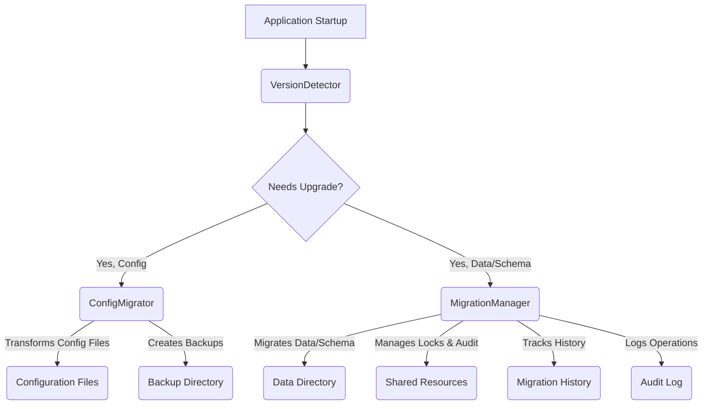

# src — versioning

The `src/versioning` module is a critical component responsible for managing the application's version lifecycle, including detecting current versions, migrating configuration files, and orchestrating complex data and schema migrations. It ensures that the application can gracefully evolve, handling changes in data structures, configuration schemas, and application logic across different releases.

This module provides robust mechanisms for:
*   **Version Detection:** Identifying the application's version from various sources (e.g., `package.json`, stored state, configuration files).
*   **Configuration Migration:** Applying structured transformations to user configuration files to adapt them to new schema versions.
*   **Data/Schema Migration:** Executing versioned `up` and `down` scripts for broader data and schema changes, complete with transactional safety, file-level locking, and an audit trail.

## Core Concepts

Before diving into the individual components, it's important to understand the foundational concepts that underpin this module:

*   **Semantic Versioning (SemVer):** All versioning within this module strictly adheres to SemVer (Major.Minor.Patch). This allows for clear comparison, ordering, and determination of upgrade paths. The `semver` library is used extensively.
*   **Configuration vs. Data Migrations:** The module distinguishes between two types of migrations:
    *   **Configuration Migrations:** Handled by `ConfigMigrator`, these focus on transforming JSON-based configuration files (e.g., `settings.json`). They involve schema changes, default value updates, and field renames/removals.
    *   **Data/Schema Migrations:** Handled by `MigrationManager`, these are more general-purpose and can involve changes to databases, file structures, or any persistent data. They are defined by `up` and `down` scripts.
*   **Idempotency:** Migration `up` and `down` functions are expected to be idempotent. Running them multiple times should produce the same result as running them once. This is crucial for reliability, especially during retries or rollbacks.
*   **Transactions & Rollbacks:** The `MigrationManager` provides transactional support by backing up files before modifications. If a migration fails, these backups are used to automatically revert the system to its previous state, ensuring data integrity.
*   **File-level Locking:** To prevent race conditions and ensure only one migration process runs at a time, the `MigrationManager` implements a file-based locking mechanism. This is vital in environments where multiple instances or processes might attempt to perform migrations concurrently.
*   **Audit Trail:** All significant migration operations are logged to an audit file, providing a comprehensive history of changes, successes, and failures.

## Module Architecture

The `versioning` module is composed of three main classes, each with a distinct responsibility:



### 1. `VersionDetector`

The `VersionDetector` class is responsible for identifying the current version of the application from various sources and providing utilities for version comparison and manipulation.

**Purpose:**
To provide a unified way to determine the application's current version, compare it against target versions, and understand if an upgrade is necessary.

**Key Methods & Concepts:**

*   **`initialize()`**: Asynchronously detects all available versions and caches them.
*   **`detectPackageVersion()`**: Reads the `version` field from the application's `package.json`.
*   **`detectStoredVersion()`**: Reads a dedicated `version.json` file (e.g., in the user's data directory) which stores the last known application version. This is often the "source of truth" for the application's internal state.
*   **`detectConfigVersion()`**: Reads the version from a configuration file (e.g., `settings.json`), looking for fields like `_version`, `version`, or `configVersion`. It can coerce non-SemVer strings to valid SemVer if possible.
*   **`getCurrentVersion()`**: Returns the most authoritative version, prioritizing `package.json` > `version.json` > `settings.json`. Defaults to `0.0.0` if no version is found.
*   **`storeVersion(version: string, metadata?: Record<string, unknown>)`**: Persists a given version to the `version.json` file. This is typically called after a successful migration or application update.
*   **`compareVersions(current: string, target: string)`**: Compares two SemVer strings and returns a `VersionComparison` object indicating their relation (`equal`, `older`, `newer`, `invalid`) and whether an upgrade is needed.
*   **`needsUpgrade()`**: A convenience method to check if the `getStoredVersion()` is older than the `getPackageVersion()`.
*   **`getUpgradePath(from: string, to: string)`**: Generates a list of intermediate major/minor versions between two given versions, useful for planning staged migrations.
*   **`isValidVersion(version: string)`, `coerceVersion(version: string)`, `parseVersion(version: string)`, `satisfiesRange(version: string, range: string)`**: Utility methods for SemVer string validation and manipulation.

**Usage Pattern:**

```typescript
import { getVersionDetector } from './version-detector.js';

async function checkAppVersion() {
  const detector = getVersionDetector();
  await detector.initialize();

  const packageVersion = detector.getPackageVersion();
  const storedVersion = detector.getStoredVersion();
  const configVersion = detector.getConfigVersion();
  const currentAppVersion = detector.getCurrentVersion();

  console.log(`Package Version: ${packageVersion}`);
  console.log(`Stored Version: ${storedVersion}`);
  console.log(`Config Version: ${configVersion}`);
  console.log(`Current App Version: ${currentAppVersion}`);

  if (detector.needsUpgrade()) {
    console.log('Application upgrade is needed!');
    const upgradePath = detector.getUpgradePath(storedVersion || '0.0.0', packageVersion!);
    console.log('Upgrade path:', upgradePath);
  }
}
```

### 2. `ConfigMigrator`

The `ConfigMigrator` class specializes in applying versioned transformations to configuration files, typically JSON-based settings.

**Purpose:**
To manage the evolution of configuration schemas, ensuring that user settings are automatically updated to match the latest application requirements. This includes adding new default fields, removing deprecated ones, renaming fields, and performing complex data transformations.

**Key Interfaces & Concepts:**

*   **`ConfigTransform`**:
    ```typescript
    export interface ConfigTransform {
      version: string; // The target version this transform applies to
      name: string;
      description?: string;
      transform: (config: Record<string, unknown>) => Record<string, unknown>; // The actual transformation logic
      validate?: (config: Record<string, unknown>) => boolean; // Optional validation after transform
    }
    ```
    Each `ConfigTransform` defines a single step in the migration process, associated with a specific target version.
*   **`ConfigMigrationResult`**: An object detailing the outcome of a migration, including success status, versions, applied transforms, detected changes, and any errors.
*   **`ConfigChange`**: Describes a specific change (`add`, `remove`, `modify`, `rename`) made to the configuration during a transform, including paths and old/new values.

**Key Methods:**

*   **`initialize()`**: Ensures the configuration and backup directories exist.
*   **`registerTransform(transform: ConfigTransform)`**: Adds a single transformation to the migrator. Transforms are ordered by version.
*   **`registerTransforms(transforms: ConfigTransform[])`**: Registers multiple transforms.
*   **`loadConfig()`**: Reads the configuration file (e.g., `settings.json`) from disk.
*   **`saveConfig(config: Record<string, unknown>)`**: Writes the (potentially migrated) configuration back to disk.
*   **`createBackup()`**: Creates a timestamped backup of the current configuration file before any changes are applied. This is crucial for rollback.
*   **`restoreFromBackup(backupPath: string)`**: Restores a configuration file from a specified backup.
*   **`getConfigVersion(config: Record<string, unknown>)`**: Extracts the version string from a configuration object, handling common field names (`_version`, `version`, `configVersion`).
*   **`setConfigVersion(config: Record<string, unknown>, version: string)`**: Updates the `_version` field in the configuration object.
*   **`migrate(targetVersion: string)`**: The core migration orchestrator.
    1.  Loads the current configuration.
    2.  Determines the current version.
    3.  Creates a backup if enabled.
    4.  Identifies all `ConfigTransform`s between the current and `targetVersion`.
    5.  Applies each transform sequentially, tracking changes and running optional validations.
    6.  Updates the configuration's internal version.
    7.  Saves the migrated configuration.
    8.  If any transform fails, it attempts to `restoreFromBackup()`.
*   **`detectChanges(before: Record<string, unknown>, after: Record<string, unknown>)`**: A private utility to compare two configuration objects and generate a list of `ConfigChange` entries.
*   **`validateConfig()`, `applyDefaults()`, `removeDeprecatedFields()`, `renameField()`**: Helper methods that can be used within `ConfigTransform.transform` functions to perform common migration tasks.

**Usage Pattern:**

```typescript
import { getConfigMigrator, ConfigTransform } from './config-migrator.js';
import * as path from 'path';
import * as os from 'os';

const migrator = getConfigMigrator({
  configDir: path.join(os.homedir(), '.my-app', 'config'),
  configFile: 'settings.json',
});

// Define a transform
const transformV1_1_0: ConfigTransform = {
  version: '1.1.0',
  name: 'Add new default setting',
  description: 'Adds a new `featureFlags.darkMode` setting with a default value.',
  transform: (config) => {
    // Use helper methods for common tasks
    let newConfig = migrator.applyDefaults(config, {
      featureFlags: {
        darkMode: false,
      },
    });
    newConfig = migrator.removeDeprecatedFields(newConfig, ['oldSetting']);
    return newConfig;
  },
  validate: (config) => 'featureFlags' in config && typeof (config as any).featureFlags.darkMode === 'boolean',
};

const transformV1_2_0: ConfigTransform = {
  version: '1.2.0',
  name: 'Rename user.name to user.fullName',
  transform: (config) => {
    if (config.user && typeof config.user === 'object' && 'name' in config.user) {
      const user = config.user as Record<string, unknown>;
      user.fullName = user.name;
      delete user.name;
    }
    return config;
  },
};

async function runConfigMigration() {
  await migrator.initialize();
  migrator.registerTransforms([transformV1_1_0, transformV1_2_0]);

  const targetVersion = '1.2.0';
  console.log(`Attempting to migrate config to ${targetVersion}...`);

  const result = await migrator.migrate(targetVersion);

  if (result.success) {
    console.log(`Config migrated successfully from ${result.fromVersion} to ${result.toVersion}.`);
    console.log(`Transforms applied: ${result.transformsApplied}`);
    console.log('Changes:', result.changes);
  } else {
    console.error('Config migration failed:', result.errors);
    if (result.backup) {
      console.log(`Configuration restored from backup: ${result.backup}`);
    }
  }
}
```

### 3. `MigrationManager`

The `MigrationManager` is the most comprehensive component, designed for managing broader data and schema migrations with robust transactional guarantees and concurrency control.

**Purpose:**
To provide a safe and auditable framework for evolving the application's persistent data structures. It's suitable for database schema changes, file system reorganizations, or any operation that modifies critical application data.

**Key Interfaces & Concepts:**

*   **`Migration`**:
    ```typescript
    export interface Migration {
      version: string;
      name: string;
      description?: string;
      up: (context: MigrationContext) => Promise<void>;   // Logic to apply the migration
      down: (context: MigrationContext) => Promise<void>; // Logic to revert the migration
      appliedAt?: Date;
    }
    ```
    Each `Migration` defines a pair of `up` and `down` functions for a specific version. The `up` function applies the changes, and the `down` function reverts them.
*   **`MigrationContext`**: An object passed to `up` and `down` functions, providing access to:
    *   `dataDir`, `configDir`: Paths to relevant directories.
    *   `logger`: A dedicated logger for migration output.
    *   `dryRun`: A flag indicating if changes should be simulated.
    *   `backupFile(filePath: string)`: A crucial function to back up a file *before* modification, enabling transactional rollback.
*   **`MigrationHistory`**: Records details of each applied migration (version, name, status, duration, transaction ID, checksum).
*   **`MigrationAuditEntry`**: A detailed log entry for every significant operation (lock acquired/released, migration start/complete/fail, rollback, state backup/restore).
*   **`StateBackup`**: An internal structure used to track files backed up during a transaction, allowing for precise restoration during rollback.

**Key Methods & Internal Mechanisms:**

*   **`initialize()`**: Ensures data and config directories exist, and loads existing migration history and audit logs.
*   **`registerMigration(migration: Migration)`**: Adds a migration to the manager.
*   **`getPendingMigrations()`, `getAppliedMigrations()`, `getCurrentVersion()`, `getLatestVersion()`, `hasPendingMigrations()`, `getStatus()`**: Methods to query the current state of migrations.
*   **`migrate()`**: The primary method to apply all pending migrations.
    *   **Locking (`acquireLock()`, `releaseLock()`):** Before starting, it attempts to acquire an exclusive file-based lock. This prevents multiple processes from running migrations simultaneously. It includes logic to detect and remove stale locks.
    *   **Transactions (`beginTransaction()`, `backupFile()`, `commitTransaction()`, `rollbackTransaction()`):** For each migration, a transaction is started. The `MigrationContext.backupFile()` function allows `up` and `down` scripts to mark files for backup. If a migration's `up` function fails, `rollbackTransaction()` is automatically called to restore all backed-up files to their original state.
    *   **Audit Trail (`writeAuditEntry()`):** Every step of the migration process (lock, transaction, migration start/complete/fail) is recorded in a persistent audit log.
    *   **History (`loadHistory()`, `saveHistory()`):** The status of each migration (success, failed, rolled_back) is recorded and persisted.
    *   **Checksums (`calculateMigrationChecksum()`):** A checksum of each migration's `up` and `down` functions is stored in the history, allowing detection of changes to migration scripts after they've been applied.
    *   **Signal Handlers (`installSignalHandlers()`, `emergencyCleanup()`):** Installs handlers for signals like `SIGINT` and `SIGTERM` to ensure the lock is released even if the process terminates unexpectedly.
*   **`migrateTo(targetVersion: string)`**: Migrates forward or backward to a specific version. If migrating backward, it internally calls `rollbackTo()`.
*   **`rollback()`**: Reverts the *last successfully applied* migration by executing its `down` function. This also uses the transaction mechanism for safety.
*   **`rollbackTo(targetVersion: string)`**: Repeatedly calls `rollback()` until the `getCurrentVersion()` is less than or equal to the `targetVersion`.
*   **`getAuditLog()`**: Retrieves entries from the audit log, with optional filtering.

**Usage Pattern:**

```typescript
import { getMigrationManager, Migration, MigrationContext } from './migration-manager.js';
import * as path from 'path';
import * as fs from 'fs-extra';
import * as os from 'os';

const manager = getMigrationManager({
  dataDir: path.join(os.homedir(), '.my-app'),
  configDir: path.join(os.homedir(), '.my-app', 'config'),
  verbose: true,
});

// Define a migration
const migrationV1_0_0: Migration = {
  version: '1.0.0',
  name: 'Initial database setup',
  description: 'Creates the initial user data file.',
  up: async (context: MigrationContext) => {
    const userFilePath = path.join(context.dataDir, 'users.json');
    context.logger.info(`Creating ${userFilePath}...`);
    await context.backupFile(userFilePath); // Backup if it exists, or mark as new
    await fs.writeJson(userFilePath, [{ id: 'admin', name: 'Administrator' }], { spaces: 2 });
  },
  down: async (context: MigrationContext) => {
    const userFilePath = path.join(context.dataDir, 'users.json');
    context.logger.info(`Removing ${userFilePath}...`);
    await context.backupFile(userFilePath); // Backup before removing
    await fs.remove(userFilePath);
  },
};

const migrationV1_1_0: Migration = {
  version: '1.1.0',
  name: 'Add settings file',
  description: 'Creates a default settings file.',
  up: async (context: MigrationContext) => {
    const settingsFilePath = path.join(context.configDir, 'app-settings.json');
    context.logger.info(`Creating ${settingsFilePath}...`);
    await context.backupFile(settingsFilePath);
    await fs.writeJson(settingsFilePath, { theme: 'dark', notifications: true }, { spaces: 2 });
  },
  down: async (context: MigrationContext) => {
    const settingsFilePath = path.join(context.configDir, 'app-settings.json');
    context.logger.info(`Removing ${settingsFilePath}...`);
    await context.backupFile(settingsFilePath);
    await fs.remove(settingsFilePath);
  },
};

async function runDataMigrations() {
  await manager.initialize();
  manager.registerMigrations([migrationV1_0_0, migrationV1_1_0]);

  console.log('Current migration status:', manager.getStatus());

  if (manager.hasPendingMigrations()) {
    console.log('Running pending migrations...');
    const result = await manager.migrate();

    if (result.success) {
      console.log(`Migrations completed successfully. Applied ${result.migrationsApplied} migrations.`);
    } else {
      console.error('Migrations failed:', result.errors);
    }
  } else {
    console.log('No pending migrations.');
  }

  console.log('Updated migration status:', manager.getStatus());

  // Example of rollback
  // console.log('Rolling back last migration...');
  // const rollbackResult = await manager.rollback();
  // if (rollbackResult.success) {
  //   console.log('Last migration rolled back successfully.');
  // } else {
  //   console.error('Rollback failed:', rollbackResult.errors);
  // }
}
```

## Integration Points

The `src/versioning` module is designed to be a foundational service for the application. Based on the provided call graph, here's how it integrates with other parts of the codebase:

*   **Application Startup/Initialization:** It's highly probable that `VersionDetector.initialize()`, `ConfigMigrator.initialize()`, and `MigrationManager.initialize()` are called early in the application's lifecycle to establish the current version and prepare for any necessary migrations.
*   **Configuration Management:** The `ConfigMigrator` is directly involved in managing `settings.json` or similar configuration files.
*   **Data Persistence:** The `MigrationManager` interacts with the `dataDir` and `configDir` to perform file-based operations, suggesting it's used for migrating application-specific data files or local databases.
*   **Resource Locking:** The `MigrationManager`'s `releaseLock()` method is called by several modules (`src/providers/local-llm-provider.ts`, `src/models/model-hub.ts`, `context/codebase-rag/ollama-embeddings.ts`, `src/providers/gemini-provider.ts`). This indicates that the `MigrationManager`'s file-based locking mechanism is leveraged not just for migrations, but potentially for any critical operation that requires exclusive access to shared resources (e.g., downloading models, managing LLM providers) to prevent conflicts. This is a powerful pattern for ensuring data integrity during sensitive operations.
*   **File System Operations:** Both `ConfigMigrator` and `MigrationManager` extensively use `fs-extra` for directory creation (`ensureDir`), file reading/writing (`readJson`, `writeJson`, `readFile`, `writeFile`), copying (`copy`), and deletion (`unlink`, `remove`).
*   **Process Management:** `MigrationManager.acquireLock()` uses `process.kill(pid, 0)` to check if a process holding a lock is still alive, demonstrating interaction with the operating system's process management.
*   **Testing:** The presence of `version-detector.test.ts` and `migration-manager.test.ts` indicates thorough unit testing of these components.

## Design Considerations & Best Practices for Contributors

*   **Migration Granularity:** Keep individual `ConfigTransform` and `Migration` units small and focused on a single version increment or a specific change. This makes them easier to understand, test, and debug.
*   **Idempotency is Key:** Always ensure your `up` and `down` functions (for `MigrationManager`) and `transform` functions (for `ConfigMigrator`) are idempotent. This means they can be run multiple times without causing unintended side effects.
*   **Thorough Testing:** Write unit tests for each `ConfigTransform` and `Migration` to verify their `up` and `down` logic works as expected, especially edge cases.
*   **Error Handling within Migrations:** While `MigrationManager` provides transactional rollback, individual `up` and `down` functions should still include robust error handling for their specific operations.
*   **Use `MigrationContext.backupFile()`:** When implementing `Migration.up` or `Migration.down`, always call `context.backupFile(filePath)` *before* modifying or deleting any critical file. This is essential for the automatic rollback mechanism to function correctly.
*   **Configuration:** Leverage the `ConfigMigratorConfig` and `MigrationManagerConfig` interfaces to customize paths, enable/disable backups, or set dry-run modes for testing.
*   **Singleton Awareness:** Be mindful that `getConfigMigrator()`, `getMigrationManager()`, and `getVersionDetector()` return singleton instances. For testing or specific scenarios where a fresh instance is needed, use `resetConfigMigrator()`, `resetMigrationManager()`, or `resetVersionDetector()` respectively.
*   **Audit Log Review:** Regularly review the audit log (`migration-audit.json`) to understand the history of migrations and diagnose any issues.
*   **Locking Implications:** Understand that the `MigrationManager`'s lock is a file-based lock. While robust, it relies on file system semantics and timeouts. Be aware of potential issues in highly distributed or unusual file system environments.