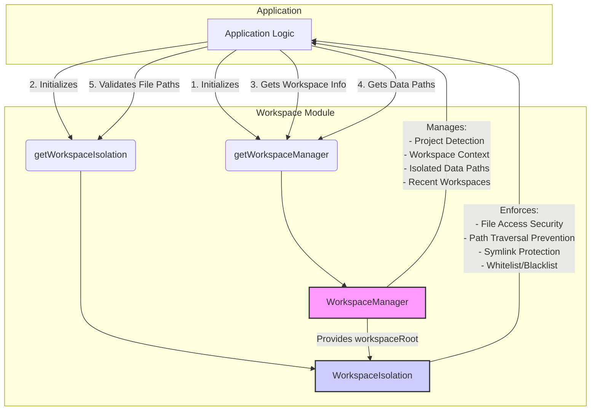

# src — workspace

The `src/workspace` module is a critical component for managing project contexts and ensuring secure file system interactions within the application. It comprises two distinct but complementary sub-modules: `WorkspaceIsolation` for enforcing file access security, and `WorkspaceManager` for detecting, tracking, and providing isolated data storage for different projects (workspaces).

## 1. Workspace Isolation (`workspace-isolation.ts`)

The `WorkspaceIsolation` module is designed to enhance the security of file operations by strictly controlling access to the file system. Its primary goal is to prevent unauthorized access to files outside the current project's workspace, mitigate path traversal vulnerabilities, and block access to sensitive system files.

### 1.1. Purpose

In an environment where code might execute user-provided scripts or interact with the file system based on user input, robust security is paramount. `WorkspaceIsolation` acts as a gatekeeper, ensuring that all file system operations initiated by the application adhere to a predefined security policy.

Key security features include:
*   **Workspace Confinement**: All file paths must resolve to a location within the configured `workspaceRoot`.
*   **Path Traversal Prevention**: Explicitly blocks attempts to use `../` or similar constructs to escape the workspace.
*   **Symlink Escape Protection**: Resolves symbolic links to their real paths and validates the real path against isolation rules, preventing escapes.
*   **System Whitelist**: Allows access to essential system directories (e.g., temporary directories, common tool caches) that are necessary for application functionality but are outside the workspace.
*   **Blocked Paths**: Explicitly denies access to highly sensitive directories (e.g., `.ssh`, `.aws/credentials`) even if they might otherwise fall under a whitelisted or workspace path.
*   **Logging**: Records all blocked access attempts for auditing and debugging.

### 1.2. `WorkspaceIsolation` Class

The `WorkspaceIsolation` class is the core of this module, responsible for enforcing the security policy. It extends `EventEmitter` to signal important state changes or blocked access attempts.

#### 1.2.1. Configuration (`WorkspaceIsolationConfig`)

The behavior of `WorkspaceIsolation` is controlled by the `WorkspaceIsolationConfig` interface:

```typescript
export interface WorkspaceIsolationConfig {
  enabled: boolean; // Global toggle for isolation (default: true)
  workspaceRoot: string; // The absolute path to the current workspace
  additionalAllowedPaths: string[]; // Custom paths to add to the whitelist
  logBlockedAccess: boolean; // Whether to log blocked attempts (default: true)
  strictMode: boolean; // If true, even whitelisted paths are blocked (default: false)
}
```

The `constructor` normalizes the `workspaceRoot` and initializes internal `Set`s for `systemWhitelist` and `blockedPaths` for efficient lookups.

#### 1.2.2. Key Methods

*   **`validatePath(filePath: string, operation: string = 'file access'): PathValidationResult`**
    This is the primary method for checking any file path before interaction. It performs a series of checks:
    1.  If isolation is `disabled`, it immediately returns `valid: true`.
    2.  Resolves the `filePath` to an absolute path.
    3.  Checks if the `resolved` path is in the `BLOCKED_PATHS` list (or a sub-path of one).
    4.  Checks if the `resolved` path is `isWithinWorkspace` or `isWhitelisted`.
    5.  If the file exists, it resolves its `fs.realpathSync` to detect symlink escapes and re-validates the real path.
    6.  If any check fails, it logs the attempt via `logBlockedAccess` and returns `valid: false` with a `reason` and `error` message.

    ```mermaid
    graph TD
        A[validatePath(filePath)] --> B{Isolation Enabled?}
        B -- No --> C[Return valid: true]
        B -- Yes --> D[Resolve filePath]
        D --> E{isBlockedPath(resolved)?}
        E -- Yes --> F[Log & Return valid: false, reason: 'blocked_path']
        E -- No --> G{isWithinWorkspace(resolved) OR isWhitelisted(resolved)?}
        G -- No --> H[Log & Return valid: false, reason: 'outside_workspace']
        G -- Yes --> I{File Exists?}
        I -- Yes --> J[Resolve realPath (fs.realpathSync)]
        J --> K{isBlockedPath(realPath)?}
        K -- Yes --> L[Log & Return valid: false, reason: 'blocked_path_via_symlink']
        K -- No --> M{isWithinWorkspace(realPath) OR isWhitelisted(realPath)?}
        M -- No --> N[Log & Return valid: false, reason: 'symlink_escape']
        M -- Yes --> O[Return valid: true]
        I -- No --> O
    ```

*   **`resolveOrThrow(filePath: string, operation: string = 'file access'): string`**
    A convenience method that calls `validatePath` and, if the path is invalid, throws an `Error`. This is useful for operations where an invalid path should immediately halt execution.

*   **`setEnabled(enabled: boolean): void`**
    Toggles the isolation feature on or off. Disabling isolation logs a warning. Emits `isolation:toggled`.

*   **`addAllowedPath(allowedPath: string): void`**
    Dynamically adds a path to the `systemWhitelist`.

*   **`setWorkspaceRoot(root: string): void`**
    Updates the `workspaceRoot` and emits `workspace:root-changed`.

#### 1.2.3. Security Policies

*   **`SYSTEM_WHITELIST`**: A predefined list of common system directories that are generally safe to access (e.g., `/tmp`, `os.homedir()/.npm`, `os.homedir()/.vscode`). These are typically read-only locations for caches or temporary files.
*   **`BLOCKED_PATHS`**: A critical list of directories containing sensitive user credentials or system files (e.g., `os.homedir()/.ssh`, `/etc/passwd`). Access to these paths is *always* denied, regardless of workspace or whitelist status.

#### 1.2.4. Events

The `WorkspaceIsolation` class emits the following events:
*   `workspace:root-changed`: When the `workspaceRoot` is updated.
*   `isolation:toggled`: When isolation is enabled or disabled.
*   `access:blocked`: When a file access attempt is blocked, providing a `BlockedAccessLog` entry.

### 1.3. Usage

`WorkspaceIsolation` is typically accessed via a singleton instance to ensure a consistent security policy across the application.

*   **`getWorkspaceIsolation(config?: Partial<WorkspaceIsolationConfig>): WorkspaceIsolation`**
    This function provides the singleton instance. The first call initializes it, and subsequent calls can optionally update its configuration (e.g., `workspaceRoot`, `enabled`).

*   **`initializeWorkspaceIsolation(options: { allowOutside?: boolean; directory?: string; additionalPaths?: string[]; }): WorkspaceIsolation`**
    A convenience function to initialize the singleton based on CLI options, often used at application startup.

*   **`validateWorkspacePath(filePath: string, operation?: string): PathValidationResult`**
    A global convenience function that calls `getWorkspaceIsolation().validatePath()`.

*   **`isPathInWorkspace(filePath: string): boolean`**
    A global convenience function that calls `getWorkspaceIsolation().isSafe()`.

### 1.4. Integration Points

The `WorkspaceIsolation` singleton is primarily used by file system interaction layers. For example, the `UnifiedVfsRouter` (if present) would use `getWorkspaceIsolation().validatePath()` before performing any read/write operations to ensure they are secure.

```typescript
// Example usage in another module (e.g., a VFS layer)
import { validateWorkspacePath, resolveOrThrow } from '../workspace/workspace-isolation.js';

async function readFileSecurely(filePath: string): Promise<string> {
  try {
    const resolvedPath = resolveOrThrow(filePath, 'read file');
    // Proceed with fs.readFile(resolvedPath, ...)
    return "file content"; // Placeholder
  } catch (error) {
    console.error(`Security error: ${error.message}`);
    throw error;
  }
}

function checkPathSafety(filePath: string): boolean {
  const result = validateWorkspacePath(filePath, 'safety check');
  if (!result.valid) {
    console.warn(`Path "${filePath}" is not safe: ${result.error}`);
  }
  return result.valid;
}
```

## 2. Workspace Management (`workspace-manager.ts`)

The `WorkspaceManager` module is responsible for identifying the current project context (the "workspace"), providing information about it, and managing isolated data directories for sessions, checkpoints, and memory specific to that workspace.

### 2.1. Purpose

Modern development often involves working on multiple projects. `WorkspaceManager` provides the infrastructure to:
*   **Automatically Detect Project Roots**: Identify the root directory of a project based on common markers (e.g., `.git`, `package.json`).
*   **Maintain Workspace Context**: Keep track of the currently active workspace.
*   **Isolate Data**: Provide distinct storage locations for application data (like sessions, checkpoints, AI memory) for each workspace, preventing data leakage or conflicts between projects.
*   **Manage Recent Workspaces**: Keep a history of recently accessed projects for quick switching.

### 2.2. `WorkspaceManager` Class

The `WorkspaceManager` class is the central component for handling workspace-related operations. It also extends `EventEmitter` to signal workspace changes.

#### 2.2.1. Configuration (`WorkspaceConfig`)

The `WorkspaceConfig` interface allows customization of workspace detection and data isolation:

```typescript
export interface WorkspaceConfig {
  useLocalStorage: boolean; // Prefer .grok/ in workspace root (default: true)
  autoCreateLocal: boolean; // Create .grok/ if not found (default: false)
  rootMarkers: WorkspaceRootMarker[]; // List of files/dirs to detect root
  maxSearchDepth: number; // Max directories to search upwards (default: 10)
  isolateSessions: boolean; // Isolate sessions per workspace (default: true)
  isolateCheckpoints: boolean; // Isolate checkpoints per workspace (default: true)
  isolateMemory: boolean; // Isolate AI memory per workspace (default: true)
}
```

The `constructor` initializes the configuration and ensures the global data directory (`~/.codebuddy/workspaces/`) exists.

#### 2.2.2. Core Concepts

*   **Workspace Root Detection**: The `detectWorkspaceRoot` method is crucial. It searches upwards from a starting directory for predefined `rootMarkers`. Markers like `.grok` (explicit application marker) have the highest priority, followed by version control directories (`.git`) and then project configuration files (`package.json`, `Cargo.toml`). This ensures the most relevant project root is identified.
*   **Local vs. Global Data**:
    *   **Local**: If `useLocalStorage` is true and a `.grok/` directory exists in the workspace root (or is created via `autoCreateLocal`), workspace-specific data (sessions, checkpoints, memory) is stored there. This keeps project data alongside the project itself.
    *   **Global**: If local storage is not used, data is stored in a global directory (`~/.codebuddy/workspaces/<workspace-hash>/`). This is useful for projects where modifying the project directory is undesirable.
*   **Data Isolation**: Configuration flags (`isolateSessions`, `isolateCheckpoints`, `isolateMemory`) control whether these data types are stored in workspace-specific directories or in a shared global location (e.g., `~/.codebuddy/sessions/`).

#### 2.2.3. Key Methods

*   **`detectWorkspaceRoot(startDir: string = process.cwd()): { root: string; marker: WorkspaceRootMarker } | null`**
    Identifies the project root by searching for `rootMarkers` with a defined `ROOT_MARKER_PRIORITY`.

*   **`initializeWorkspace(startDir: string = process.cwd()): Promise<WorkspaceInfo>`**
    Detects the workspace root, creates a `WorkspaceInfo` object (including a unique ID, name, detected marker, and `projectType`), caches it, sets it as the `currentWorkspace`, and saves it to the recent workspaces list. Emits `workspace:initialized`.

*   **`getWorkspaceDataDir(workspace?: WorkspaceInfo): string`**
    Returns the absolute path to the primary data directory for a given workspace, respecting `useLocalStorage` and the presence of a local `.grok/` directory.

*   **`getSessionsDir(workspace?: WorkspaceInfo): string`**, **`getCheckpointsDir(workspace?: WorkspaceInfo): string`**, **`getMemoryDir(workspace?: WorkspaceInfo): string`**
    These methods return the appropriate directory for storing sessions, checkpoints, or AI memory, respectively. They respect the `isolate*` configuration flags and ensure the directories exist.

*   **`initializeLocalConfig(workspace?: WorkspaceInfo): string`**
    Creates the `.grok/` directory and its standard subdirectories (`sessions`, `checkpoints`, `memory`) within the workspace root. It also attempts to add `.grok/` to the project's `.gitignore` file.

*   **`loadWorkspaceState(workspace?: WorkspaceInfo): WorkspaceState | null`**, **`saveWorkspaceState(state: WorkspaceState, workspace?: WorkspaceInfo): void`**, **`updateWorkspaceState(updates: Partial<WorkspaceState>, workspace?: WorkspaceInfo): void`**
    Manage the `state.json` file within a workspace's data directory, which can store arbitrary workspace-specific settings or metadata (e.g., `currentSessionId`, `lastModel`).

*   **`getRecentWorkspaces(): WorkspaceInfo[]`**
    Retrieves a list of recently accessed workspaces, filtering out any that no longer exist on the file system.

*   **`cleanupOrphanedWorkspaces(): number`**
    Periodically cleans up global workspace data directories that haven't been accessed in over 90 days, preventing accumulation of stale data.

#### 2.2.4. Workspace Info and State

*   **`WorkspaceInfo`**: Provides metadata about a workspace, including its `id` (a hash of the root path), `name`, `rootPath`, `detectedBy` marker, `hasLocalConfig` status, `lastAccessed` timestamp, and detected `projectType`.
*   **`WorkspaceState`**: A flexible interface for storing dynamic, user-specific settings or state related to a workspace (e.g., `currentSessionId`, `lastModel`, `securityMode`).

#### 2.2.5. Events

The `WorkspaceManager` class emits the following events:
*   `workspace:initialized`: When a new workspace is initialized.
*   `workspace:changed`: When the `currentWorkspace` is switched.
*   `workspace:local-init`: When a local `.grok/` directory is initialized.

### 2.3. Usage

Like `WorkspaceIsolation`, `WorkspaceManager` is typically accessed via a singleton instance.

*   **`getWorkspaceManager(config?: Partial<WorkspaceConfig>): WorkspaceManager`**
    Provides the singleton instance of `WorkspaceManager`.

*   **`initializeCurrentWorkspace(): Promise<WorkspaceInfo>`**
    A global convenience function to initialize the workspace based on the current working directory. This is often called at application startup.

*   **`getCurrentWorkspaceInfo(): WorkspaceInfo | null`**
    Returns the `WorkspaceInfo` object for the currently active workspace.

*   **`getWorkspaceSessionsDir(): string`**, **`getWorkspaceCheckpointsDir(): string`**, **`getWorkspaceMemoryDir(): string`**
    Global convenience functions to retrieve the appropriate isolated data directories for the current workspace.

### 2.4. Integration Points

`WorkspaceManager` is a foundational service. Other parts of the application would use it to:
*   Determine the current project context.
*   Store and retrieve project-specific data (e.g., a session management module would use `getWorkspaceSessionsDir()`).
*   Display workspace information to the user.

```typescript
// Example usage in a session management module
import { getWorkspaceSessionsDir, initializeCurrentWorkspace } from '../workspace/workspace-manager.js';

async function setupApplication() {
  const workspace = await initializeCurrentWorkspace();
  console.log(`Initialized workspace: ${workspace.name} at ${workspace.rootPath}`);

  const sessionsDir = getWorkspaceSessionsDir();
  console.log(`Sessions will be stored in: ${sessionsDir}`);
  // Now, the session manager can use sessionsDir for its operations.
}
```

## 3. Module Architecture Overview

The `src/workspace` module provides a robust foundation for managing project contexts and securing file system access.



This diagram illustrates how `Application Code` interacts with the singleton accessors (`getWorkspaceManager`, `getWorkspaceIsolation`) to obtain instances of `WorkspaceManager` and `WorkspaceIsolation`. The `WorkspaceManager` is responsible for identifying the project root, which is then used by `WorkspaceIsolation` to define its security boundary. Both modules provide essential services to the rest of the application: `WorkspaceManager` for context and data organization, and `WorkspaceIsolation` for security enforcement.