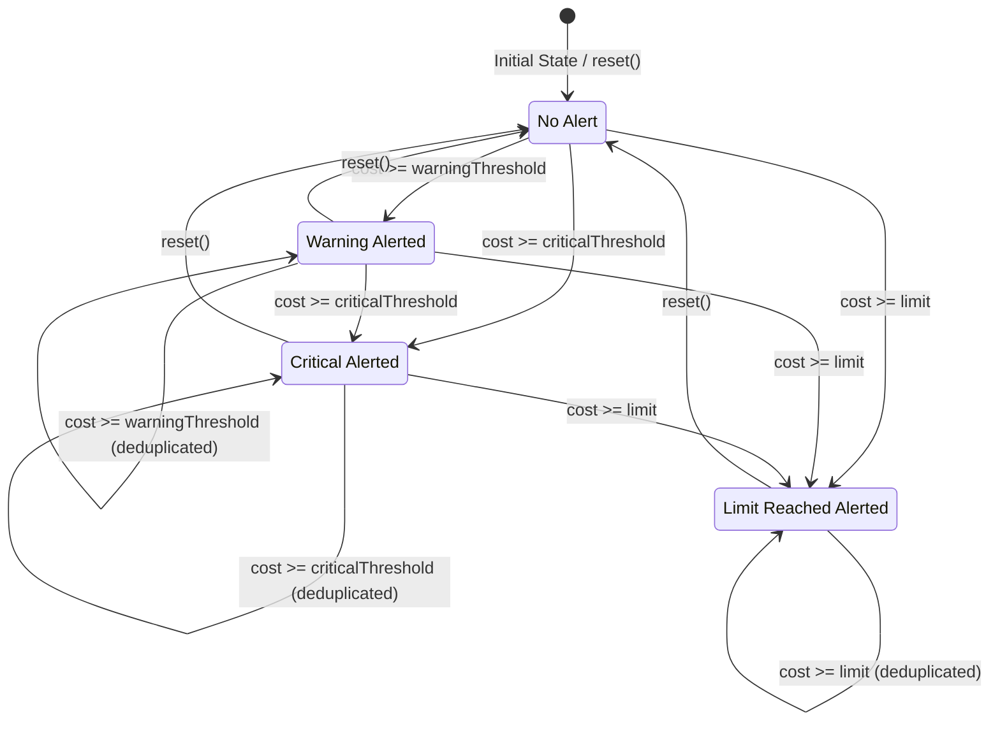

# tests — analytics

This document provides an overview of the analytics testing module, focusing on the `BudgetAlertManager` and `CostPredictor` components. These tests validate the core logic for managing budget alerts and predicting costs, ensuring the reliability and accuracy of the analytics features.

## Analytics Module Overview

The `src/analytics` module provides tools for monitoring and managing costs associated with AI model usage. It includes:
*   **`BudgetAlertManager`**: Responsible for tracking current costs against a defined budget and emitting alerts when thresholds are crossed.
*   **`CostPredictor`**: Estimates future costs and token usage for AI model requests based on message content and historical data.

The tests in `tests/analytics` ensure that these components behave as expected, covering various scenarios, edge cases, and configuration options.

## BudgetAlertManager Testing (`budget-alerts.test.ts`)

The `BudgetAlertManager` class (located at `src/analytics/budget-alerts.ts`) is designed to monitor spending against a budget and notify users when predefined thresholds are met or exceeded. The tests in `budget-alerts.test.ts` thoroughly validate its functionality.

### Core Functionality

The `BudgetAlertManager` operates by comparing a `currentCost` against a `limit` and triggering `BudgetAlert` objects when specific percentage thresholds are crossed.

#### Configuration
*   **`constructor(config?: BudgetAlertConfig)`**: Initializes the manager.
    *   Accepts an optional `BudgetAlertConfig` object to set custom `warningThreshold` (default: `0.7` or 70%) and `criticalThreshold` (default: `0.9` or 90%).
    *   Example: `new BudgetAlertManager({ warningThreshold: 0.5, criticalThreshold: 0.8 })`
*   **`getConfig(): BudgetAlertConfig`**: Returns a copy of the current configuration.
*   **`updateConfig(config: Partial<BudgetAlertConfig>)`**: Allows runtime modification of thresholds. Changes affect subsequent `check()` calls.

#### Alert Evaluation (`check()`)
The primary method for evaluating costs is `check(currentCost: number, limit: number)`.
*   It returns a `BudgetAlert` object if a new alert threshold is crossed, or `null` if no new alert is triggered or if the cost is below the warning threshold.
*   **Alert Types**:
    *   `'warning'`: Triggered when `currentCost` reaches or exceeds the `warningThreshold` of the `limit`.
    *   `'critical'`: Triggered when `currentCost` reaches or exceeds the `criticalThreshold` of the `limit`.
    *   `'limit_reached'`: Triggered when `currentCost` reaches or exceeds the `limit` itself.
*   **Deduplication**: The manager prevents duplicate alerts of the same type from being emitted consecutively. For example, once a `'warning'` alert is issued, subsequent `check()` calls that still fall within the warning range (but below critical) will return `null`.
*   **Escalation**: Alerts correctly escalate. A `'warning'` alert can be followed by a `'critical'` alert, and then a `'limit_reached'` alert, as the cost increases. Each escalation triggers a new alert.
*   **Edge Cases**: Tests cover scenarios like zero or negative limits (which should not trigger alerts) and zero cost.
*   **Alert Structure**: A `BudgetAlert` object includes:
    *   `type`: (`'warning'`, `'critical'`, `'limit_reached'`)
    *   `percentage`: The current cost as a percentage of the limit.
    *   `currentCost`: The cost at which the alert was triggered.
    *   `limit`: The budget limit.
    *   `message`: A human-readable description of the alert.

#### Alert Management
*   **`getAlerts(): BudgetAlert[]`**: Returns an array of all unique `BudgetAlert` objects that have been triggered since the last `reset()`. This array is a copy, ensuring immutability.
*   **`reset()`**: Clears all previously triggered alerts and resets the internal state, allowing alerts to be re-triggered from scratch. This is crucial for managing alerts across different budget periods or sessions.

#### Event Emission
The `BudgetAlertManager` extends `EventEmitter`, emitting an `'alert'` event whenever a *new* `BudgetAlert` is triggered (i.e., not for deduplicated checks). This allows other parts of the application to react to budget events asynchronously.

### BudgetAlertManager State Transitions

The `check()` method manages internal state to handle alert deduplication and escalation.

## CostPredictor Testing (`cost-predictor.test.ts`)

The `CostPredictor` class (located at `src/analytics/cost-predictor.js`) provides estimations for token usage and cost for potential AI model interactions. It leverages historical data from a `CostTracker` to improve accuracy. The tests in `cost-predictor.test.ts` validate its prediction logic and historical analysis.

### Dependencies
The `CostPredictor` is initialized with a `CostTracker` instance:
`constructor(tracker: CostTracker)`
This dependency allows the predictor to access `recentUsage` history for more accurate output token estimations and cost trend analysis.

### Core Functionality

#### Cost Prediction (`predict()`)
The central method is `predict(messages: ChatMessage[], model: string)`, which returns a `CostPrediction` object.
*   **`estimatedInputTokens`**: Calculated based on the content and structure of the input `messages`. Longer messages and more messages lead to higher input token estimates. Even empty message content contributes to token count due to role overhead.
*   **`estimatedOutputTokens`**:
    *   **Historical Average**: If the associated `CostTracker` has `recentUsage` history, the predictor calculates the average output tokens from this history for the specified model.
    *   **Default**: If no history is available, a default output token count (tests imply 500) is used.
*   **`estimatedCost`**: Calculated using the estimated input and output tokens, combined with model-specific pricing. The predictor uses default pricing for unknown models, ensuring a cost estimate is always provided.
*   **`model`**: The model name provided in the input.
*   **`confidence`**: An indicator of the reliability of the prediction, based on the amount of historical data:
    *   `'low'`: No historical usage data.
    *   `'medium'`: 1-4 historical usage entries.
    *   `'high'`: 5 or more historical usage entries.

#### Historical Cost Analysis
The `CostPredictor` also offers methods to analyze past spending patterns.

*   **`getAverageCostPerRequest(): number`**:
    *   Calculates the average cost of individual requests based on the `recentUsage` history from the `CostTracker`.
    *   Returns `0` if no history is available.
    *   Handles zero-cost entries correctly.

*   **`getCostTrend(): 'increasing' | 'decreasing' | 'stable'`**:
    *   Analyzes the trend of recent request costs.
    *   Requires at least 4 historical entries to determine a trend; otherwise, it returns `'stable'`.
    *   It divides the `recentUsage` history into two halves and compares their average costs.
    *   **`'increasing'`**: If the average cost of the second half is significantly higher (e.g., >20% increase) than the first half.
    *   **`'decreasing'`**: If the average cost of the second half is significantly lower (e.g., >20% decrease) than the first half.
    *   **`'stable'`**: If the cost difference is within a defined variance (e.g., 20%) or if there isn't enough data.
    *   Handles scenarios where one or both halves have zero cost.

### Mocking `CostTracker`

The `cost-predictor.test.ts` file includes helper functions like `createMockCostTracker` and `makeUsage` to create controlled `CostTracker` instances and `TokenUsage` entries. This allows tests to precisely control the historical data provided to the `CostPredictor` and verify its behavior under different historical contexts.

## Conclusion

The tests within `tests/analytics` are critical for ensuring the robustness and accuracy of the `BudgetAlertManager` and `CostPredictor` components. They cover a wide range of scenarios, from basic functionality and configuration to complex state management, event emission, and historical data analysis. Developers contributing to these analytics modules should refer to these tests to understand the expected behavior and to guide the implementation of new features or bug fixes.