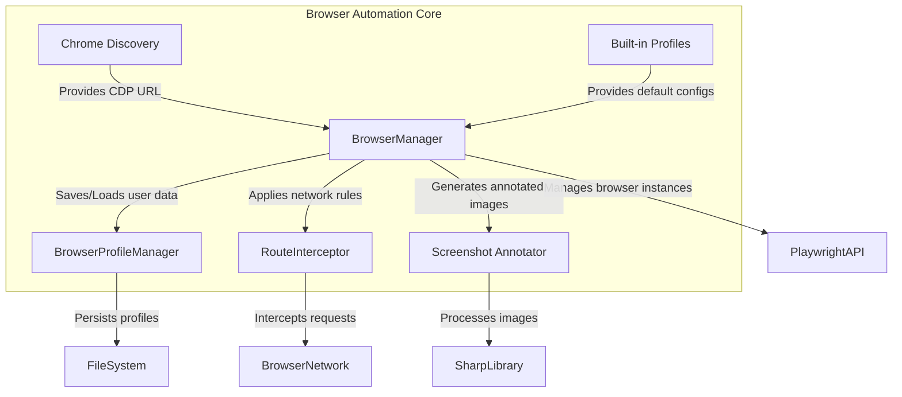

# tests — browser-automation

This documentation covers the core browser automation capabilities provided by the system, as revealed and verified by the `tests/browser-automation` module. These components enable programmatic control, data management, and network interaction with web browsers, primarily for testing, scraping, or automated workflows.

The browser automation suite is designed to be modular, allowing different aspects of browser control to be managed independently.

## Core Capabilities

The `browser-automation` module provides the following key functionalities:

1.  **Browser Instance Management**: Orchestrates browser launches, connections, and lifecycle, including managing unique references for interactive elements.
2.  **Browser Profile Management**: Handles saving and loading browser-specific user data (cookies, local storage, session storage) to persist browser state across sessions.
3.  **Network Request Interception**: Allows defining rules to block, mock, modify, or log network requests made by the browser.
4.  **Screenshot Annotation**: Adds visual overlays to screenshots, typically to highlight and number interactive elements.
5.  **Chrome Endpoint Discovery**: Automatically detects a running Chrome instance's debugging endpoint.
6.  **Built-in Profiles**: Provides predefined browser configurations for common use cases.

## Architecture Overview

The `BrowserManager` acts as the central orchestrator for browser interactions. It leverages other specialized modules for specific tasks like profile persistence, network control, and visual feedback.

## Key Components

### 1. Browser Instance Management (`src/browser-automation/browser-manager.ts`)

The `BrowserManager` class is responsible for managing browser instances and their associated state.

*   **Purpose**: To provide a consistent interface for interacting with a browser, including assigning unique references to elements and managing the browser's lifecycle.
*   **`getNextRef()`**: This method provides a monotonically increasing integer, used to assign unique identifiers (`ref`) to interactive elements on a page. This counter is persistent across operations like `takeSnapshot()`, ensuring continuity of references.
*   **Ref Counter Fix**: Historically, the `takeSnapshot()` method might have inadvertently reset the `nextRef` counter. The tests confirm that this issue has been addressed, and `getNextRef()` continues to increment without reset, which is crucial for stable element referencing.

### 2. Browser Profile Management (`src/browser-automation/profile-manager.ts`)

The `BrowserProfileManager` handles the persistence of browser user data, allowing for consistent browser sessions.

*   **Purpose**: To save, load, list, and delete browser profiles, which include cookies, local storage, and session storage. This enables scenarios where a user's session or preferences need to be maintained across different automation runs.
*   **`BrowserProfileManager(profilesDir?: string)`**: The constructor allows specifying a custom directory for storing profiles. If not provided, it defaults to a system-specific location (e.g., within `.codebuddy/browser-profiles`).
*   **`save(name: string, data: BrowserProfileData)`**:
    *   Persists the provided `BrowserProfileData` (cookies, localStorage, sessionStorage) to a JSON file.
    *   Automatically adds a `savedAt` timestamp.
    *   Sanitizes the `name` for safe use as a filename (e.g., replacing `/` with `_`) but preserves the original name within the profile data.
    *   Creates the profiles directory if it doesn't exist.
*   **`load(name: string)`**:
    *   Retrieves and parses a profile from its JSON file.
    *   Converts the `savedAt` string back into a `Date` object.
    *   Returns `null` if the profile doesn't exist or the file is corrupted.
    *   Applies the same name sanitization as `save` when constructing the file path.
*   **`list()`**: Returns an array of all available profile names by scanning the profiles directory for `.json` files. Handles directory access errors gracefully by returning an empty array.
*   **`delete(name: string)`**: Removes a profile's JSON file from the file system. Returns `true` on success, `false` if the file doesn't exist or an error occurs.
*   **Name Sanitization**: All file operations (`save`, `load`, `delete`) sanitize the profile name to prevent path traversal vulnerabilities and ensure valid filenames.

### 3. Network Request Interception (`src/browser-automation/route-interceptor.ts`)

The `RouteInterceptor` provides a mechanism to control and observe network requests made by the browser. It's built on top of Playwright's routing capabilities.

*   **Purpose**: To define and manage rules that dictate how specific network requests should be handled (e.g., blocking ads, mocking API responses, modifying headers, or logging traffic).
*   **`RouteInterceptor()`**: Initializes the interceptor, ready to manage rules.
*   **`addRule(page: Page, rule: RouteRule)`**:
    *   Registers a new `RouteRule` with the provided Playwright `page` object.
    *   Each rule is identified by a unique `id` and a `urlPattern`.
    *   If a rule with the same `id` already exists, the old rule is automatically unregistered (`page.unroute()`) and replaced by the new one.
    *   The rule's `action` determines its behavior:
        *   **`block`**: Aborts the request with a `'blockedbyclient'` error.
        *   **`mock`**: Fulfills the request with a custom `mockResponse` (status, body, headers, contentType). If `mockResponse` is not provided, the request continues normally.
        *   **`modify`**: Continues the request after merging `modifyHeaders` into the existing request headers. Existing headers with the same key are overridden. If `modifyHeaders` is not provided, the request continues without modification.
        *   **`log`**: Logs the request method and URL to the console, then continues the request normally.
*   **`removeRule(page: Page, id: string)`**: Unregisters the route handler associated with the given rule `id` from the `page` and removes the rule from the interceptor's internal list. Does nothing if the rule ID doesn't exist.
*   **`listRules()`**: Returns an array of all currently active `RouteRule` objects.
*   **`clearRules(page: Page)`**: Removes all active rules and unregisters all associated route handlers from the `page`.

### 4. Screenshot Annotation (`src/browser-automation/screenshot-annotator.ts`)

The `annotateScreenshot` function enhances browser screenshots by adding visual markers.

*   **Purpose**: To overlay numbered badges onto a screenshot, corresponding to interactive `WebElement`s, making it easier to identify and reference elements in visual outputs.
*   **`annotateScreenshot(buffer: Buffer, elements: WebElement[], options?: AnnotationOptions)`**:
    *   Takes a screenshot `buffer` (PNG) and an array of `WebElement`s.
    *   **Dependencies**: Relies on the `sharp` library for image processing. If `sharp` is not available (e.g., due to installation issues), the function gracefully falls back to returning the original screenshot buffer unchanged, logging a warning.
    *   **Filtering**: Only `WebElement`s that are `visible: true` and have a valid `boundingBox` are annotated.
    *   **Badge Styles**: Supports `circle` (default) and `pill` (rounded rectangle) badge styles.
    *   **Customization**: `AnnotationOptions` allow customizing the badge `color`, `textColor`, and `fontSize`.
    *   **Position Clamping**: Ensures that badges are drawn entirely within the image boundaries, adjusting their position if an element is too close to the edge.
    *   **Error Handling**: If `sharp` encounters an error during the composite operation (e.g., invalid image data), the original buffer is returned, preventing crashes.

### 5. Chrome Endpoint Discovery (`src/browser-automation/chrome-discovery.ts`)

This module helps locate a running Chrome instance for remote debugging.

*   **Purpose**: To automatically find the Chrome DevTools Protocol (CDP) endpoint of a running Chrome browser, which is essential for connecting automation tools like Playwright in a remote or managed setup.
*   **`discoverChromeEndpoint()`**:
    *   First, checks the `CDP_URL` environment variable. If set, it uses that URL directly. This provides a high-priority override.
    *   If `CDP_URL` is not set, it attempts to discover a running Chrome instance's CDP endpoint. The exact discovery mechanism might involve querying common ports or using OS-specific commands.
    *   Returns the discovered CDP URL (e.g., `http://127.0.0.1:9222`) or `null` if no Chrome instance with an accessible CDP endpoint is found.

### 6. Built-in Profiles (`src/browser-automation/builtin-profiles.ts`)

This module defines standard, pre-configured browser profiles.

*   **Purpose**: To provide readily available browser configurations for common automation scenarios, simplifying setup for developers.
*   **`BUILTIN_PROFILES`**: An object containing predefined profile configurations.
    *   **`user`**: A `remote` type profile, typically configured to connect to a local Chrome instance's default CDP port (`http://127.0.0.1:9222`). This is useful for connecting to a user's already running browser.
    *   **`chrome-relay`**: A `managed` type profile, which implies the system will manage the browser instance itself, often with a dedicated `userDataDir` (e.g., within `.codebuddy/browser-data`) to ensure a clean or specific browser state.
*   **`getBuiltinProfile(name: string)`**: Retrieves a specific built-in profile by its name. Returns `undefined` if the name is not found.
*   **`listBuiltinProfiles()`**: Returns an array of all available built-in profiles.

## How to Contribute

When contributing to the `browser-automation` module:

*   **Understand the Role**: Each component has a distinct responsibility. Ensure changes align with the module's intended purpose.
*   **Test Thoroughly**: The existing test suite (`tests/browser-automation/`) provides excellent examples of how each module is expected to behave. Add new tests for any new functionality or bug fixes.
*   **Playwright Integration**: Many of these modules interact with a browser automation library (like Playwright). Be mindful of how your changes affect or are affected by this integration.
*   **Error Handling**: Pay attention to edge cases, such as file system errors in `BrowserProfileManager` or `sharp` unavailability in `ScreenshotAnnotator`, and ensure graceful degradation or informative error messages.
*   **Security**: For modules like `BrowserProfileManager` that interact with the file system, ensure proper input sanitization to prevent vulnerabilities.