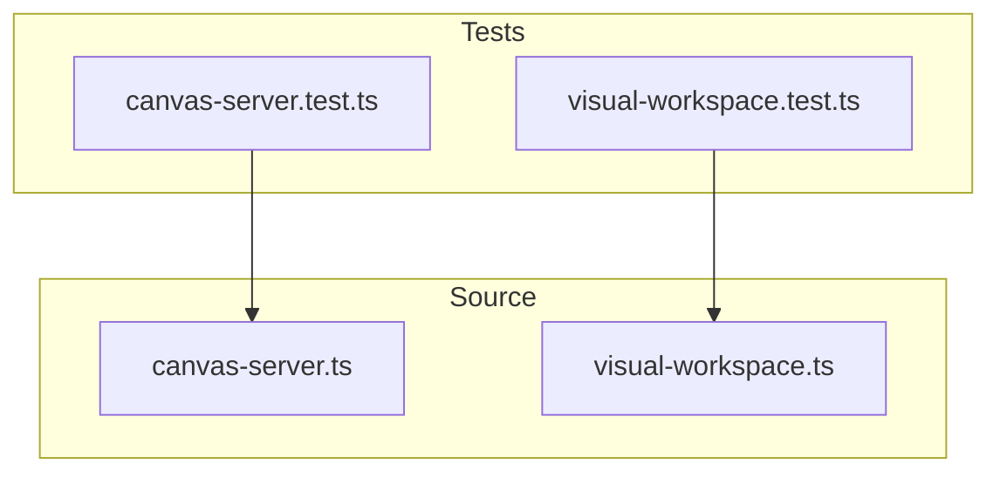

# tests — canvas

This document describes the `tests/canvas` module, which is dedicated to ensuring the correctness and reliability of the core Canvas-related functionalities within the system. It covers tests for both the `CanvasServer` responsible for content history and real-time updates, and the `VisualWorkspaceManager` which handles interactive visual workspaces.

## Module Purpose

The `tests/canvas` module serves as the primary validation suite for the backend components that power the interactive canvas and content display features. It verifies:

1.  The `CanvasServer`'s ability to manage a history of content, handle client connections (conceptually, as the tests don't involve actual network connections), and emit relevant events.
2.  The `VisualWorkspaceManager`'s comprehensive capabilities, including workspace creation, element manipulation, undo/redo, rendering, and serialization.

By thoroughly testing these components, the module ensures that the canvas features behave as expected, providing a stable foundation for visual and interactive development.

## Key Components and Their Tests

The `tests/canvas` module comprises two main test files, each targeting a specific core Canvas component.

### 1. `CanvasServer` Tests (`canvas-server.test.ts`)

This test file focuses on the `CanvasServer` class, which is responsible for maintaining a chronological history of `CanvasContent` and notifying subscribers of updates.

**Core Functionality Verified:**

*   **Initialization:**
    *   Ensures `CanvasServer` instances correctly initialize with default or custom `port` and `maxHistory` values.
    *   Verifies initial state: `isRunning()` is `false`, `getClientCount()` is `0`, and `getHistory()` is empty.
*   **Content Management:**
    *   **`push(content: CanvasContent)`:** Tests that new content entries are added to the history, including `type`, `content`, `title`, and a `timestamp`.
    *   **History Trimming:** Confirms that `maxHistory` is respected, and older entries are removed when the history size exceeds the limit.
    *   **`reset()`:** Verifies that the history can be completely cleared.
    *   **History Immutability:** Ensures `getHistory()` returns a *copy* of the history array, preventing external modification of the server's internal state.
    *   **Content Types:** Validates that `push` correctly handles various `CanvasContent` types (e.g., `html`, `markdown`, `json`).
*   **Event Emission:**
    *   **`on('push', handler)`:** Confirms that a `'push'` event is emitted whenever new content is added, passing the new content to registered handlers.
    *   **`on('reset', handler)`:** Verifies that a `'reset'` event is emitted when the history is cleared.

**Relationship to Source:**
This test file directly interacts with and validates the `CanvasServer` class defined in `src/canvas/canvas-server.ts`.

### 2. `VisualWorkspaceManager` Tests (`visual-workspace.test.ts`)

This test file provides comprehensive coverage for the `VisualWorkspaceManager` class, which manages multiple interactive visual workspaces, their configurations, and the elements within them. It also tests the singleton access pattern for the manager.

**Core Functionality Verified:**

*   **Workspace Lifecycle:**
    *   **`createWorkspace(config?)`:** Tests the creation of new workspaces with default or custom configurations (e.g., `name`, `width`, `height`, `snapToGrid`, `gridSize`).
    *   **`getWorkspace(id)`:** Verifies retrieval of workspaces by their unique ID.
    *   **`getAllWorkspaces()`:** Ensures all active workspaces can be retrieved.
    *   **`deleteWorkspace(id)`:** Confirms workspaces can be removed, and the manager correctly reports success/failure.
*   **Element Management:**
    *   **`addElement(workspaceId, type, content, position, size)`:** Tests adding various types of elements to a workspace, including position and size. Verifies grid snapping if enabled.
    *   **`updateElement(workspaceId, elementId, updates)`:** Ensures elements can be modified (e.g., content, label, locked status).
    *   **`deleteElement(workspaceId, elementId)`:** Confirms elements can be removed from a workspace.
    *   **`moveElement(workspaceId, elementId, newPosition)`:** Verifies elements can be repositioned, respecting locked status.
    *   **`resizeElement(workspaceId, elementId, newSize)`:** Tests resizing elements.
*   **Undo/Redo System:**
    *   **`undo(workspaceId)`:** Validates that actions (like adding an element) can be undone, reverting the workspace state.
    *   **`redo(workspaceId)`:** Confirms that undone actions can be redone, restoring the state.
    *   Tests edge cases where no actions are available for undo/redo.
*   **Rendering:**
    *   **`renderToTerminal(workspaceId, width, height)`:** Verifies that a textual representation of a workspace can be generated, suitable for terminal display.
*   **Serialization:**
    *   **`exportToJSON(workspaceId)`:** Tests the ability to serialize a workspace's state into a JSON string.
    *   **`importFromJSON(jsonString)`:** Confirms that a workspace can be reconstructed from a JSON string, creating a new, independent workspace.
*   **Event Emission:**
    *   **`on('workspace-created', handler)`:** Emitted when a new workspace is created.
    *   **`on('workspace-deleted', handler)`:** Emitted when a workspace is deleted.
    *   **`on('element-added', handler)`:** Emitted when an element is added to a workspace.
    *   **`on('element-updated', handler)`:** Emitted when an element's properties are changed.
    *   **`on('element-deleted', handler)`:** Emitted when an element is removed.
*   **Singleton Pattern:**
    *   **`getVisualWorkspaceManager()`:** Ensures that calling this function always returns the same instance of `VisualWorkspaceManager`.
    *   **`resetVisualWorkspaceManager()`:** Verifies that the singleton instance can be reset, providing a fresh manager instance on subsequent calls.

**Relationship to Source:**
This test file directly interacts with and validates the `VisualWorkspaceManager` class and its associated singleton functions (`getVisualWorkspaceManager`, `resetVisualWorkspaceManager`) defined in `src/canvas/visual-workspace.ts`.

## Module Architecture

The `tests/canvas` module is structured to mirror the `src/canvas` module, with each test file directly targeting its corresponding source file. This clear separation of concerns makes it easy to locate tests for specific functionalities.

This structure ensures that changes to a source file are immediately reflected in its dedicated test suite, promoting robust development and maintainability.