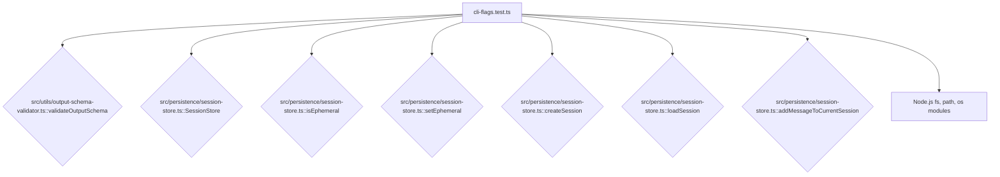

# tests — cli

This document describes the `tests/cli/cli-flags.test.ts` module, which contains unit and integration tests for various command-line interface (CLI) flag functionalities and their impact on core application logic.

## Overview

The `cli-flags.test.ts` module is a critical part of the test suite, focusing on verifying the correct behavior of specific CLI flags. It ensures that:

1.  The `--output-schema` flag correctly triggers JSON schema validation for command output.
2.  The `--add-dir` flag's arguments are parsed and resolved as expected.
3.  The `--ephemeral` flag correctly alters the `SessionStore`'s persistence behavior, preventing session data from being saved to disk.

These tests are designed to be developer-focused, using temporary file systems and mocked environments where necessary to isolate the tested components.

## Key Test Suites

The module is organized into `describe` blocks, each targeting a distinct CLI flag or related feature.

### 1. Output Schema Validation (`--output-schema`)

This suite tests the `validateOutputSchema` utility function, which is responsible for validating JSON output against a user-provided JSON schema file.

**Purpose:** To ensure that the application can correctly enforce a schema on its output, providing robust error reporting for invalid data.

**How it Works:**
The tests in this suite perform the following steps:
1.  **Setup:** A temporary directory is created using `fs.mkdtempSync` in `beforeEach` to store schema files, ensuring tests are isolated and clean up after themselves.
2.  **Schema Creation:** The internal helper function `writeSchema(schema: object)` is used to write a JSON schema object to a temporary file, returning its path.
3.  **Validation:** `validateOutputSchema(output, schemaPath)` is called with various JSON outputs and schema files.
4.  **Assertions:** Tests assert the `valid` property of the result and inspect the `errors` array for expected messages when validation fails.

**Tested Schema Features:**
The tests cover a wide range of JSON schema keywords and scenarios:
*   Basic object validation (`type: 'object'`, `properties`, `required`).
*   Type checking (`type: 'string'`, `type: 'number'`).
*   Enum validation (`enum`).
*   String patterns (`pattern`).
*   String length constraints (`minLength`, `maxLength`).
*   Array item validation (`type: 'array'`, `items`).
*   Disallowing additional properties (`additionalProperties: false`).
*   Number range constraints (`minimum`, `maximum`).
*   Error handling for non-existent or invalid schema files.

**Connections:**
This suite directly interacts with and tests the `validateOutputSchema` function located in `src/utils/output-schema-validator.ts`.

### 2. Add Directory Flag Parsing (`--add-dir`)

This suite verifies the expected parsing and resolution behavior for the `--add-dir` CLI flag.

**Purpose:** To confirm that the CLI framework (Commander.js, implicitly) correctly handles multiple directory paths provided to `--add-dir` and that these paths are properly resolved.

**How it Works:**
Instead of executing the full CLI, these tests focus on the expected data structure and path manipulation that would occur after Commander.js parses the arguments:
*   It asserts that multiple paths provided to `--add-dir` are received as an `Array<string>`.
*   It uses `path.resolve` and `path.isAbsolute` to confirm that relative paths are correctly resolved to absolute paths, which is crucial for consistent directory access.

**Connections:**
This suite implicitly tests the integration with the underlying CLI parsing library (e.g., Commander.js) and the Node.js `path` module.

### 3. Ephemeral Session Behavior (`--ephemeral`)

This suite tests the functionality of the `SessionStore` when operating in "ephemeral" mode, typically activated by the `--ephemeral` CLI flag.

**Purpose:** To ensure that when ephemeral mode is enabled, session data (sessions and messages) is not persisted to disk, providing a clean, temporary execution environment.

**How it Works:**
The tests simulate the ephemeral flag's effect on the `SessionStore`:
1.  **Setup:** In `beforeEach`, a temporary directory is set as the `CODEBUDDY_SESSIONS_DIR` environment variable. This redirects the `SessionStore` to use a temporary location, preventing pollution of actual user session data. A new `SessionStore` instance is created.
2.  **Ephemeral Control:** `store.setEphemeral(true)` is used to programmatically enable ephemeral mode, mimicking the effect of the `--ephemeral` flag.
3.  **Persistence Verification:**
    *   When `store.isEphemeral()` is `true`, `store.createSession()` is called, but subsequent `store.loadSession()` calls for that ID are expected to return `null`, indicating no persistence.
    *   Similarly, `store.addMessageToCurrentSession()` is called in ephemeral mode, and then the session is loaded (after temporarily disabling ephemeral mode to allow loading), expecting the message list to be empty.
4.  **Non-Ephemeral Comparison:** Tests also verify that when `store.setEphemeral(false)` (the default), sessions and messages *are* persisted and can be loaded successfully.
5.  **Cleanup:** In `afterEach`, the temporary session directory is removed, and the `CODEBUDDY_SESSIONS_DIR` environment variable is unset.

**Connections:**
This suite extensively tests the `SessionStore` class and its methods: `SessionStore`, `isEphemeral`, `setEphemeral`, `createSession`, `loadSession`, and `addMessageToCurrentSession`, all located in `src/persistence/session-store.ts`.

## Module Interactions

The `cli-flags.test.ts` module primarily acts as a consumer and validator of core application utilities and services.

*   **`src/utils/output-schema-validator.ts`**: Directly called to test JSON schema validation.
*   **`src/persistence/session-store.ts`**: Instantiated and manipulated to test ephemeral session behavior.
*   **Node.js Built-ins (`fs`, `path`, `os`)**: Used for temporary file system operations (creating/deleting directories and files) and path resolution, essential for isolating tests.

## Contributing and Extending

When adding new CLI flags or modifying the behavior of existing ones, consider the following:

*   **New Flag Behavior:** If a new flag introduces specific logic (e.g., changes how data is processed, stored, or displayed), create a new `describe` block in this file or a new test file under `tests/cli/` if the feature is substantial.
*   **Schema Validation:** If a command's output needs to conform to a specific JSON schema, ensure `validateOutputSchema` is used and add tests here to cover various valid and invalid outputs against that schema.
*   **Persistence Changes:** If a flag affects how `SessionStore` or other persistence mechanisms operate, extend the "Ephemeral session behavior" suite or create a new one to verify the persistence/non-persistence.
*   **Temporary Resources:** Always use `fs.mkdtempSync` and `fs.rmSync` with `beforeEach`/`afterEach` to manage temporary files and directories, ensuring tests are clean and isolated.
*   **Environment Variables:** If a flag interacts with environment variables (like `CODEBUDDY_SESSIONS_DIR`), ensure they are set and unset appropriately in `beforeEach`/`afterEach` to avoid side effects.