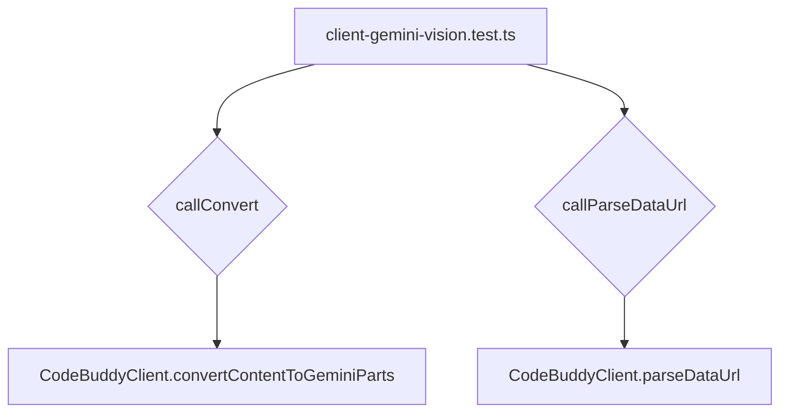

# tests — codebuddy

This document provides an overview of the `tests/codebuddy/client-gemini-vision.test.ts` module, detailing its purpose, structure, and how it validates the content conversion logic within the `CodeBuddyClient` for Gemini Vision API interactions.

## Module Purpose

The primary purpose of `client-gemini-vision.test.ts` is to thoroughly unit test the content conversion mechanisms implemented in the `CodeBuddyClient` class, specifically those responsible for preparing user input (text, images, mixed content) into the format required by the Google Gemini Vision API.

It focuses on two key private methods:
1.  `convertContentToGeminiParts`: Transforms various input content types into an array of Gemini-compatible `Part` objects.
2.  `parseDataUrl`: Extracts MIME type and base64 data from data URLs, with a fallback for non-data URLs.

By testing these methods, the module ensures that the `CodeBuddyClient` can correctly handle diverse user prompts, including those with inline images, before sending them to the Gemini API.

## Module Structure and Key Components

This test module is structured using standard testing framework constructs (`describe`, `it`, `beforeEach`) to organize tests logically.

### Test Setup

Each test suite initializes a new instance of `CodeBuddyClient` using a `beforeEach` hook:

```typescript
import { CodeBuddyClient } from '../../src/codebuddy/client.js';

describe('Gemini Vision - convertContentToGeminiParts', () => {
  let client: CodeBuddyClient;

  beforeEach(() => {
    client = new CodeBuddyClient('test-key');
  });
  // ... tests ...
});
```

### Private Method Access Helpers

Since `convertContentToGeminiParts` and `parseDataUrl` are private methods of `CodeBuddyClient`, the tests employ type assertion to access them for direct testing. This pattern allows for isolated unit testing of internal logic.

```typescript
  const callConvert = (client: CodeBuddyClient, content: unknown) =>
    (client as unknown as { convertContentToGeminiParts: (c: unknown) => unknown[] }).convertContentToGeminiParts(content);

  const callParseDataUrl = (client: CodeBuddyClient, url: string) =>
    (client as unknown as { parseDataUrl: (u: string) => { mimeType: string; data: string } }).parseDataUrl(url);
```

### `convertContentToGeminiParts` Test Suite

This suite covers various scenarios for converting different content types into Gemini API parts:

*   **Basic Text Conversion**: Ensures plain strings, `null`, and `undefined` inputs are correctly converted to a single text part.
*   **`MessageContentPart` Array Handling**: Verifies that arrays containing `type: 'text'` parts are processed correctly.
*   **Image Data URL Conversion**: Tests the conversion of `image_url` parts containing `data:` URLs into `inlineData` objects with extracted `mimeType` and `data`.
*   **Mixed Content**: Validates that arrays with both text and image parts are correctly transformed into a sequence of Gemini text and `inlineData` parts.
*   **Non-Data URL Fallback**: Confirms that `image_url` parts with standard HTTP/HTTPS URLs are treated as `inlineData` with a fallback `mimeType` of `image/png`, using the URL itself as the data.

### `parseDataUrl` Test Suite

A nested `describe` block specifically tests the `parseDataUrl` helper method:

*   **Valid Data URL Parsing**: Asserts that a well-formed `data:` URL is correctly parsed into its `mimeType` and `data` components.
*   **Non-Data URL Fallback**: Verifies that non-data URLs (e.g., `https://...`) are handled by returning a default `mimeType` of `image/png` and the original URL as `data`.

## Tested Production Code

This test module directly targets and validates the following components within `src/codebuddy/client.ts`:

*   **`CodeBuddyClient` class**: The instance on which the private methods are called.
*   **`CodeBuddyClient.convertContentToGeminiParts` (private)**: The core logic for transforming diverse input into Gemini-compatible content parts.
*   **`CodeBuddyClient.parseDataUrl` (private)**: A utility method used by `convertContentToGeminiParts` to handle data URLs.

## Execution Flow

The tests instantiate `CodeBuddyClient` and then use the `callConvert` and `callParseDataUrl` helper functions to invoke the private methods under test. These helpers act as a bridge to the internal logic of the `CodeBuddyClient`.



## Contribution Guidelines

When contributing to this module:

*   **Add new test cases** for any new content types or edge cases introduced in the `CodeBuddyClient`'s Gemini content conversion logic.
*   **Maintain the private method access pattern** (`callConvert`, `callParseDataUrl`) if you need to test other private methods.
*   **Ensure comprehensive coverage** for any modifications to `convertContentToGeminiParts` or `parseDataUrl` to prevent regressions.
*   **Keep test descriptions clear and concise**, accurately reflecting the behavior being tested.