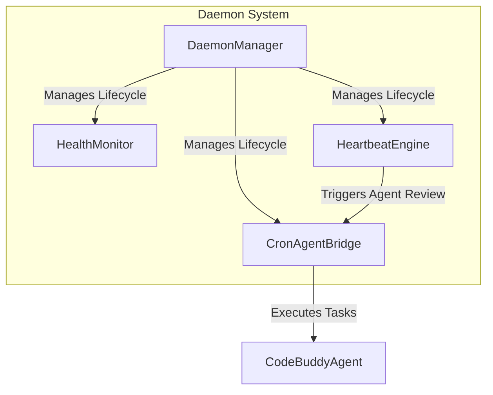

# tests — daemon

This document provides an overview of the test suite for the daemon-related modules, located in `tests/daemon`. These tests are crucial for ensuring the stability, reliability, and correct behavior of the core background processes that power the application, including job scheduling, health monitoring, and system management.

The `tests/daemon` module focuses on validating the functionality of several key components within `src/daemon`, ensuring they operate as expected under various conditions, including edge cases and error scenarios.

## Core Daemon Components Under Test

The `tests/daemon` suite verifies the following critical daemon components:

*   **`CronAgentBridge`**: Manages the execution of scheduled `CronJob` tasks, bridging them to the `CodeBuddyAgent` for processing and handling result delivery.
*   **`DaemonManager`**: Responsible for the overall lifecycle management of the daemon process, including PID file handling, logging, and process status reporting.
*   **`HealthMonitor`**: Actively monitors the health of the daemon, detecting staleness, tracking unhealthy states, and managing restart limits to ensure continuous operation.
*   **`HeartbeatEngine`**: Periodically performs a "heartbeat" check by having an AI agent review a checklist, managing active hours, and handling suppression logic.

*This diagram illustrates the primary daemon components and their high-level interactions. The tests in `tests/daemon` validate the individual functionalities and interactions of these components.*

## Test Suite Breakdown

Each test file within `tests/daemon` is dedicated to a specific component, employing various strategies like mocking and event listening to thoroughly validate its behavior.

### `cron-agent-bridge.test.ts`

This test file validates the `CronAgentBridge` class (`src/daemon/cron-agent-bridge.js`), which is responsible for executing scheduled `CronJob` tasks and delivering their results.

*   **Component Verified**: `CronAgentBridge`
*   **Purpose of Tests**: To ensure that the bridge correctly creates task executors, tracks job counts, handles job cancellation, emits lifecycle events during job execution, and manages result delivery (e.g., webhooks).
*   **Key Test Scenarios**:
    *   **Task Executor Creation**: Verifies that `createTaskExecutor()` returns a function.
    *   **Job Tracking**: Checks `getActiveJobCount()` increments and decrements correctly (though not explicitly shown in the provided snippet, it's implied by the `expect(bridge.getActiveJobCount()).toBe(0);` test).
    *   **Cancellation**: Ensures `cancelJob()` gracefully handles non-existent jobs.
    *   **Event Emission**: Tests that `job:start` and `job:error` events are emitted during `executeJob()` lifecycle, even if the underlying agent call fails.
    *   **Result Delivery**: Validates `deliverResult()` attempts webhook delivery when configured and correctly reports `delivered: false` when no delivery configuration is present.
*   **Mocking & Setup**:
    *   The `CodeBuddyAgent` (`src/agent/codebuddy-agent.js`) is mocked using `vi.mock` to prevent actual API calls and control its `processUserMessage` behavior, returning a predictable mock response. This isolates the `CronAgentBridge` logic from external agent dependencies.
    *   `resetCronAgentBridge()` is called in `beforeEach` to ensure a clean state for each test.

### `daemon-manager.test.ts`

This test file focuses on the `DaemonManager` class (`src/daemon/daemon-manager.js`), which handles the core operational aspects of the daemon process.

*   **Component Verified**: `DaemonManager`
*   **Purpose of Tests**: To validate the manager's ability to handle PID files, determine process status, manage log files, retrieve configuration, and prevent multiple daemon instances from running.
*   **Key Test Scenarios**:
    *   **PID File Management**: Tests `readPid()` for both valid and invalid PID file content, and `status()` when no PID file exists.
    *   **Process Status**: `isProcessRunning()` is tested against the current process PID (`process.pid`) and a non-existent PID.
    *   **Configuration**: Verifies `getConfig()` returns the expected configuration.
    *   **Log Management**: Tests `logs()` for reading existing log files and returning a default message when no log file is present.
    *   **Restart Tracking**: Confirms `status().restartCount` is initialized correctly.
    *   **Start Prevention**: Ensures `start()` throws an error if the daemon is already running (detected via PID file).
*   **Mocking & Setup**:
    *   `fs/promises` and `path`/`os` are used to create and manage temporary directories and files (`tmpDir`, `test.pid`, `test.log`) for isolated testing of file system interactions.
    *   `resetDaemonManager()` is called in `beforeEach` to ensure a fresh manager instance for each test.
    *   `afterEach` cleans up the temporary directory using `fs.rm`.

### `health-monitor-stale.test.ts`

This test file specifically targets the stale event detection and restart limit features of the `HealthMonitor` class (`src/daemon/health-monitor.js`).

*   **Component Verified**: `HealthMonitor`
*   **Purpose of Tests**: To ensure the monitor accurately detects when events become stale, triggers restart mechanisms when service checks fail repeatedly, and respects maximum restart limits.
*   **Key Test Scenarios**:
    *   **Stale Event Detection**: Verifies that the `stale` event is emitted when `lastEventTime` exceeds `staleEventThresholdMs` and that `recordEvent()` prevents staleness.
    *   **Max Restarts Exceeded**: Tests that the `max-restarts-exceeded` event is emitted and the monitor stops running (`isRunning()`) after the configured `maxTotalRestarts` is surpassed due to continuous unhealthy service checks.
    *   **Restart Tracking**: Confirms `getTotalRestarts()` accurately reflects the number of restarts triggered.
    *   **Service Checks**: Uses `registerServiceCheck()` to simulate unhealthy service states.
*   **Mocking & Setup**:
    *   The internal `logger` (`src/utils/logger.js`) is mocked using `vi.mock` to suppress console output during tests.
    *   `beforeEach` initializes a new `HealthMonitor` instance with a short `staleEventThresholdMs` for faster testing.
    *   `afterEach` ensures `monitor.stop()` is called to clean up any running intervals.

### `heartbeat.test.ts`

This comprehensive test file validates the `HeartbeatEngine` class (`src/daemon/heartbeat.js`), covering its configuration, active hours logic, suppression mechanisms, lifecycle, and singleton pattern.

*   **Component Verified**: `HeartbeatEngine`
*   **Purpose of Tests**: To ensure the heartbeat mechanism functions correctly, including its scheduling, agent interaction, handling of active hours, suppression logic, and proper lifecycle management. It also verifies the singleton implementation.
*   **Key Test Scenarios**:
    *   **Configuration**: Tests default values, merging partial configurations, and dynamic updates via `updateConfig()`.
    *   **Active Hours Filtering**: Validates `isWithinActiveHours()` for various times, including wrap-around scenarios (e.g., 22-6), and confirms `tick()` skips execution when outside active hours.
    *   **Suppression Counting**: Checks `consecutiveSuppressions` and `totalSuppressions` are correctly incremented, reset, and that the `heartbeat:suppression-limit` event is emitted when the limit is reached.
    *   **Start/Stop Lifecycle**: Verifies `start()`, `stop()`, `isRunning()`, and the emission of `started`/`stopped` events. It also tests that the engine does not start if disabled or already running.
    *   **Tick Behavior**: Ensures `tick()` skips when disabled or the heartbeat file is missing, emits `heartbeat:wake` on success, includes checklist content, and updates `totalTicks` and `lastResult`.
    *   **Singleton Pattern**: Confirms `getHeartbeatEngine()` returns the same instance unless `resetHeartbeatEngine()` is called, and that `resetHeartbeatEngine()` stops the existing instance.
*   **Mocking & Setup**:
    *   `mockAgentReview` is a `jest.fn()` mock that simulates the AI agent's response, allowing tests to control whether the heartbeat is "OK" or indicates an issue.
    *   `fs/promises` is used to create a temporary `HEARTBEAT.md` file for the engine to read.
    *   `beforeEach` and `afterEach` manage temporary directories, file creation, and ensure the engine is reset and stopped for each test.

## Key Testing Patterns

Across these daemon test suites, several common testing patterns are observed:

*   **Isolation with Mocks**: External dependencies like `CodeBuddyAgent`, `logger`, and the `agentReviewFn` are consistently mocked to isolate the component under test and ensure predictable behavior.
*   **File System Simulation**: For components interacting with the file system (e.g., `DaemonManager`, `HeartbeatEngine`), temporary files and directories are created and cleaned up to provide a controlled testing environment without affecting the actual system.
*   **Event-Driven Assertions**: Many daemon components emit events (`job:start`, `stale`, `heartbeat:suppression-limit`). Tests often subscribe to these events using `vi.fn()` or `jest.fn()` to assert that events are emitted at the correct times with the expected data.
*   **Lifecycle Management**: Tests thoroughly cover the `start()`, `stop()`, and `reset()` methods of the components, ensuring they transition between states correctly and clean up resources.
*   **Edge Case Handling**: Scenarios like missing files, invalid input, already running processes, or exceeding limits are explicitly tested to ensure robust error handling and graceful degradation.
*   **Configuration Validation**: Tests verify that components correctly apply default configurations, merge partial configurations, and allow dynamic updates.