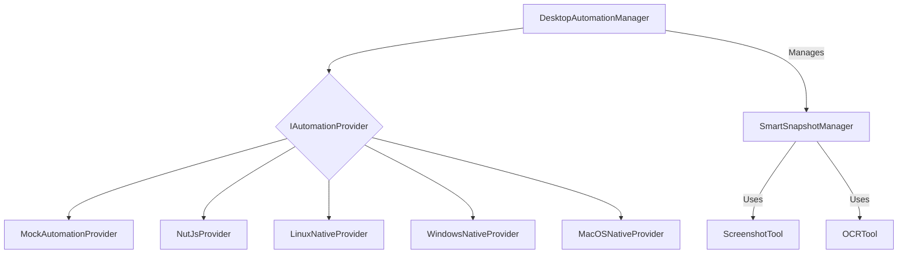

# tests — desktop-automation

The `desktop-automation` module provides a robust, cross-platform API for interacting with the desktop environment, including mouse, keyboard, window, application, and screen operations. It abstracts away platform-specific implementations, allowing developers to write automation scripts that can run on Linux, Windows, and macOS. Additionally, it includes a "Smart Snapshot" system for intelligent UI element detection, combining accessibility and OCR capabilities.

This documentation focuses on the core components, their interactions, and how to leverage them for desktop automation tasks.

## Core Concepts

The module is built around three primary concepts:

1.  **`DesktopAutomationManager`**: The central facade that provides a unified API for all desktop automation tasks. It manages the underlying automation providers and offers configuration, event handling, and safety features.
2.  **`IAutomationProvider`**: An interface (or abstract class in practice) that defines the contract for platform-specific or library-based automation implementations. The `DesktopAutomationManager` delegates actual operations to an active `IAutomationProvider`.
3.  **`SmartSnapshotManager`**: A system for taking "snapshots" of the UI, detecting elements using either accessibility APIs or Optical Character Recognition (OCR), and providing a structured view of the interactive elements on the screen.

### Architecture Overview

The `DesktopAutomationManager` acts as a central orchestrator. It can be configured to use a specific `IAutomationProvider` or automatically select the most suitable one based on the operating system and available tools. All high-level automation commands (e.g., `click`, `type`, `focusWindow`) are routed through the manager to the currently active provider. The `SmartSnapshotManager` operates in conjunction, providing intelligent element detection capabilities that can be integrated into automation workflows.



## DesktopAutomationManager

The `DesktopAutomationManager` is the primary entry point for developers. It provides a comprehensive set of methods for desktop interaction and manages the lifecycle and configuration of automation providers.

### Getting an Instance

The manager is designed as a singleton, accessible via `getDesktopAutomation()`. This ensures that only one instance manages desktop automation resources at a time.

```typescript
import { getDesktopAutomation } from '../../src/desktop-automation/index.js';

const manager = getDesktopAutomation();
await manager.initialize(); // Initialize the underlying provider
// ... perform automation ...
await manager.shutdown(); // Clean up resources
```

You can reset the singleton instance using `resetDesktopAutomation()` for testing or specific scenarios. The first call to `getDesktopAutomation()` can also accept an initial configuration.

```typescript
import { getDesktopAutomation, resetDesktopAutomation } from '../../src/desktop-automation/index.js';

resetDesktopAutomation(); // Clear any existing instance
const manager = getDesktopAutomation({ debug: true, provider: 'nutjs' });
await manager.initialize();
```

### Initialization and Provider Selection

Upon `initialize()`, the manager attempts to find and initialize an `IAutomationProvider`. By default, it prioritizes `native` providers (platform-specific tools), then `nutjs`, and finally `mock` (for testing). You can explicitly specify a provider in the configuration.

*   `initialize()`: Initializes the selected automation provider.
*   `shutdown()`: Shuts down the active provider and releases resources.
*   `registerProvider(provider: IAutomationProvider)`: Allows registering custom or additional providers.
*   `getProviderStatus()`: Returns the status of the currently active provider.
*   `getAllProviderStatuses()`: Returns the status of all registered providers.

### Configuration

The manager's behavior can be configured via `updateConfig()` and retrieved with `getConfig()`.

```typescript
const config = manager.getConfig();
console.log(config.provider); // e.g., 'native'

manager.updateConfig({
  defaultDelays: {
    mouseMove: 50,
    keyPress: 20,
  },
  safety: {
    failSafe: false, // Disable fail-safe for specific scenarios
  },
});
```

**Safety Features**: The manager includes built-in safety mechanisms:
*   `failSafe`: Enabled by default, this feature allows stopping automation by moving the mouse to a corner of the screen.
*   `minActionDelay`: A minimum delay between automation actions to prevent overwhelming the system or making actions too fast for human observation.
*   `resetFailSafe()`: Resets the fail-safe state.

### Event System

The `DesktopAutomationManager` emits events for various desktop interactions, allowing for monitoring or reactive automation.

```typescript
manager.on('mouse-move', (pos) => {
  console.log(`Mouse moved to: ${pos.x}, ${pos.y}`);
});

manager.on('key-press', (key, modifiers) => {
  console.log(`Key pressed: ${key} with modifiers: ${modifiers.join(',')}`);
});

manager.on('window-focus', (windowInfo) => {
  console.log(`Window focused: ${windowInfo.title} (${windowInfo.handle})`);
});
```

Key events include:
*   `mouse-move`, `mouse-click`
*   `key-press`, `key-type`
*   `window-focus`, `window-change`
*   `app-launch`, `app-close`

### Core Automation Methods

The manager exposes a comprehensive API for desktop interaction, mirroring the `IAutomationProvider` interface:

**Mouse Operations**:
*   `getMousePosition()`: Get current mouse coordinates.
*   `moveMouse(x, y)`: Move mouse to absolute coordinates.
*   `click(x?, y?, options?)`: Perform a click (left by default).
*   `doubleClick(x?, y?, options?)`: Perform a double click.
*   `rightClick(x?, y?, options?)`: Perform a right click.
*   `drag(startX, startY, endX, endY)`: Drag the mouse from one point to another.
*   `scroll(options)`: Scroll the mouse wheel.

**Keyboard Operations**:
*   `keyPress(key, options?)`: Press and release a single key.
*   `keyDown(key)`: Press down a key.
*   `keyUp(key)`: Release a key.
*   `type(text)`: Type a string of text.
*   `hotkey(...keys)`: Execute a hotkey combination (e.g., `ctrl+c`).

**Window Operations**:
*   `getActiveWindow()`: Get information about the currently focused window.
*   `getWindows(filter?)`: Get a list of all open windows, optionally filtered by title.
*   `getWindow(handle)`: Get information for a specific window by its handle.
*   `findWindow(query)`: Find a window by title (string or regex).
*   `focusWindow(handle)`: Bring a window to the foreground.
*   `minimizeWindow(handle)`: Minimize a window.
*   `maximizeWindow(handle)`: Maximize a window.
*   `restoreWindow(handle)`: Restore a minimized/maximized window.
*   `closeWindow(handle)`: Close a window.
*   `moveWindow(handle, x, y)`: Move a window to new coordinates.
*   `resizeWindow(handle, width, height)`: Resize a window.
*   `setWindow(handle, options)`: Set window position and/or size.

**Application Operations**:
*   `getRunningApps()`: Get a list of all running applications.
*   `findApp(query)`: Find an application by name (string or regex).
*   `launchApp(path)`: Launch an application from its executable path.
*   `closeApp(pid)`: Close an application by its process ID.

**Screen Operations**:
*   `getScreens()`: Get information about all connected displays.
*   `getPrimaryScreen()`: Get information about the primary display.
*   `getPixelColor(x, y)`: Get the RGB color of a pixel at specified coordinates.

**Clipboard Operations**:
*   `getClipboard()`: Get the current clipboard content (text, image, etc.).
*   `getClipboardText()`: Get only the text content from the clipboard.
*   `setClipboard(content)`: Set the clipboard content.
*   `copyText(text)`: Convenience method to set clipboard text.
*   `clearClipboard()`: Clear the clipboard.

## IAutomationProvider Interface

The `IAutomationProvider` interface defines the contract for any desktop automation implementation. Each provider must implement these methods and declare its capabilities.

```typescript
interface IAutomationProvider {
  name: string;
  capabilities: {
    mouse: boolean;
    keyboard: boolean;
    windows: boolean;
    apps: boolean;
    clipboard: boolean;
    ocr: boolean;
    screenshots?: boolean;
    colorPicker?: boolean;
  };
  isAvailable(): Promise<boolean>;
  initialize(): Promise<void>;
  shutdown(): Promise<void>;
  // ... methods for mouse, keyboard, window, app, screen, clipboard operations ...
}
```

### Concrete Automation Providers

The module includes several concrete implementations of `IAutomationProvider`:

#### 1. `MockAutomationProvider`

*   **Purpose**: Primarily used for testing the `DesktopAutomationManager` and other components without requiring actual desktop interaction.
*   **Capabilities**: Reports `true` for most capabilities (mouse, keyboard, windows, apps, clipboard) but `false` for `ocr`.
*   **Behavior**: Simulates desktop actions with predictable, hardcoded responses (e.g., mouse position starts at 500,500; a fixed set of mock windows and apps).

#### 2. `NutJsProvider`

*   **Purpose**: Integrates with the `nut.js` library, providing cross-platform automation capabilities.
*   **Capabilities**: Supports mouse, keyboard, windows, clipboard, and screen operations.
*   **Limitations**: Has limited support for application operations (`getRunningApps` returns an empty array, `launchApp` and `closeApp` throw "not supported" errors).
*   **Availability**: Checks if `nut.js` is installed and functional.

#### 3. Native Providers

These providers leverage platform-specific command-line tools or APIs for optimal performance and deeper integration. They are typically preferred when available.

##### `LinuxNativeProvider`

*   **Platform**: Linux (specifically X11-based desktop environments).
*   **Dependencies**: Relies on external tools like `xdotool`, `xclip`, `wmctrl`, and `xrandr`. These must be installed on the system.
*   **Limitations**:
    *   **Wayland**: Does not function on Wayland-based desktop environments (e.g., modern GNOME, KDE Plasma on Wayland) due to its reliance on X11 tools. `isAvailable()` will return `false` if `XDG_SESSION_TYPE` is `wayland`.
    *   Requires `xdotool` for core functionality; `initialize()` will throw if it's not found.
*   **Key Operations**:
    *   Mouse: Uses `xdotool mousemove`, `xdotool click`.
    *   Keyboard: Uses `xdotool key`, `xdotool type`.
    *   Windows: Uses `xdotool getactivewindow`, `wmctrl`, `xdotool windowactivate`, `xdotool windowminimize`, etc.
    *   Clipboard: Uses `xclip`.
    *   Screens: Parses output from `xrandr --query`.

##### `WindowsNativeProvider`

*   **Platform**: Windows (including WSL environments).
*   **Dependencies**: Primarily uses PowerShell scripts executed via `child_process`.
*   **WSL Support**: Can operate within a Windows Subsystem for Linux (WSL) environment by targeting the host Windows PowerShell. The constructor accepts a `wsl: true` option.
*   **Capabilities**: Supports mouse, keyboard, windows, clipboard, and includes `screenshots`.
*   **Key Operations**: Executes PowerShell commands for all automation tasks.

##### `MacOSNativeProvider`

*   **Platform**: macOS.
*   **Dependencies**: Leverages macOS-specific commands and tools.
    *   `cliclick`: Used for some mouse and keyboard actions. It's optional; the provider can still initialize without it, but some capabilities might be limited.
    *   `pbpaste`/`pbcopy`: For clipboard operations.
    *   `system_profiler`: For screen information.
*   **Limitations**:
    *   `getPixelColor()`: Currently throws a "not supported" error, as it requires screenshot analysis which is not directly implemented in this provider.
*   **Key Operations**:
    *   Clipboard: Uses `pbpaste` to get text.
    *   Screens: Parses JSON output from `system_profiler SPDisplaysDataType`.

## SmartSnapshotManager

The `SmartSnapshotManager` provides capabilities for intelligent UI element detection, allowing automation scripts to interact with elements based on their visual or accessibility properties rather than just coordinates.

### Getting an Instance

The `SmartSnapshotManager` is typically instantiated directly, often configured with a detection `method` and `defaultTtl`.

```typescript
import { SmartSnapshotManager } from '../../src/desktop-automation/smart-snapshot.js';

const snapshotManager = new SmartSnapshotManager({
  method: 'ocr', // or 'accessibility'
  defaultTtl: 30_000, // Snapshots are valid for 30 seconds
});
```

### Snapshot Creation

*   `takeSnapshot()`: Captures the current screen state and processes it to identify UI elements.
    *   If `method: 'ocr'`, it uses `ScreenshotTool` to capture an image and `OCRTool` to extract text blocks and their bounding boxes. It attempts to infer roles (button, link, text-field) from the text content.
    *   If `method: 'accessibility'`, it would use platform-specific accessibility APIs (not fully detailed in the provided tests, but implied).
*   `getCurrentSnapshot()`: Retrieves the most recently taken snapshot.
*   `getElement(ref)`: Retrieves a specific element from the current snapshot using its unique reference number.

### Element Referencing

*   `getNextRef()`: Provides a monotonically increasing integer to serve as a unique reference (`ref`) for UI elements. Each `SmartSnapshotManager` instance maintains its own counter.

### Injecting Browser Elements

A powerful feature of the `SmartSnapshotManager` is its ability to combine desktop-level UI elements with elements sourced from a browser context. This is crucial for hybrid automation scenarios.

*   `injectBrowserElements(elements: UIElement[], sourceName?: string)`: Adds a list of `UIElement` objects (e.g., from a browser's DOM inspection) to the current desktop snapshot.
    *   Injected elements are tagged with an `attributes.source` property, defaulting to `'browser-accessibility'` if `sourceName` is not provided.
    *   This allows the `DesktopAutomationManager` to find and interact with elements that might not be visible or detectable via desktop-level accessibility/OCR, but are known from a browser's internal state.

```typescript
// Example: Injecting elements from a browser automation tool
const browserElements = [
  {
    ref: snapshotManager.getNextRef(),
    role: 'button',
    name: 'Submit Form',
    bounds: { x: 100, y: 200, width: 150, height: 40 },
    center: { x: 175, y: 220 },
    interactive: true,
    focused: false,
    enabled: true,
    visible: true,
  },
];

snapshotManager.injectBrowserElements(browserElements, 'my-browser-plugin');

// Now, a subsequent call to manager.findUIElement() could find 'Submit Form'
// even if it's within a browser window that desktop OCR/accessibility can't fully parse.
```

## Developer Guide

### Basic Usage Flow

1.  **Get the Manager**: Obtain the singleton instance.
2.  **Initialize**: Prepare the underlying automation provider.
3.  **Perform Actions**: Use the manager's methods for mouse, keyboard, window, etc.
4.  **Shutdown**: Release resources when done.

```typescript
import { getDesktopAutomation } from '../../src/desktop-automation/index.js';

async function automateTask() {
  const automation = getDesktopAutomation();
  await automation.initialize();

  try {
    // Move mouse and click
    await automation.moveMouse(100, 100);
    await automation.click();

    // Type text
    await automation.type('Hello, Desktop!');

    // Find and focus a window
    const terminalWindow = await automation.findWindow('Terminal');
    if (terminalWindow) {
      await automation.focusWindow(terminalWindow.handle);
      console.log(`Focused: ${terminalWindow.title}`);
    }

    // Get clipboard content
    await automation.copyText('Copied from automation');
    const clipboardText = await automation.getClipboardText();
    console.log(`Clipboard: ${clipboardText}`);

  } catch (error) {
    console.error('Automation failed:', error);
  } finally {
    await automation.shutdown();
  }
}

automateTask();
```

### Using Smart Snapshots for Intelligent Interaction

```typescript
import { getDesktopAutomation, SmartSnapshotManager } from '../../src/desktop-automation/index.js';

async function interactWithUI() {
  const automation = getDesktopAutomation();
  await automation.initialize();

  const snapshotManager = new SmartSnapshotManager({ method: 'ocr' }); // Use OCR for element detection

  try {
    // Take a snapshot of the current screen
    const snapshot = await snapshotManager.takeSnapshot();
    console.log(`Snapshot taken with ${snapshot.elements.length} elements.`);

    // Find an element by name (e.g., a button detected by OCR)
    const submitButton = snapshot.elements.find(e => e.name === 'Submit' && e.role === 'button');

    if (submitButton) {
      console.log(`Found 'Submit' button at ${submitButton.center.x}, ${submitButton.center.y}`);
      await automation.click(submitButton.center.x, submitButton.center.y);
    } else {
      console.log("Submit button not found.");
    }

  } catch (error) {
    console.error('UI interaction failed:', error);
  } finally {
    await automation.shutdown();
  }
}

interactWithUI();
```

### Extending with a New Automation Provider

To add support for a new platform or library:

1.  **Create a new class** that implements the `IAutomationProvider` interface.
2.  **Implement all required methods** (mouse, keyboard, window, etc.) using the new platform's APIs or tools.
3.  **Define `name` and `capabilities`** for your provider.
4.  **Implement `isAvailable()`** to check if the necessary tools/libraries are present on the system.
5.  **Register your provider** with the `DesktopAutomationManager` using `manager.registerProvider(yourNewProviderInstance)`. You can then configure the manager to use it.

This modular design ensures that the `desktop-automation` module can be easily extended to support new environments or integrate with different automation backends.