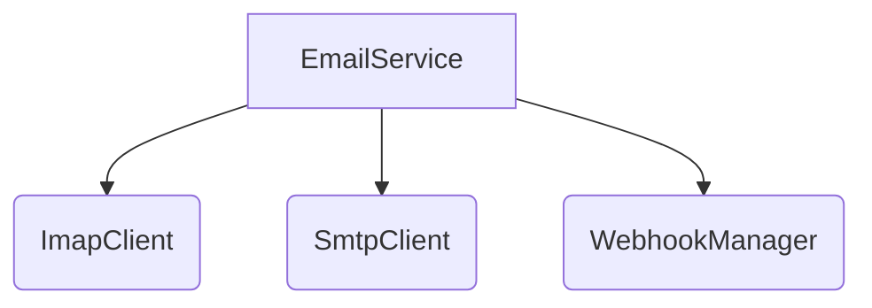

# tests — email

This document provides developer-focused documentation for the core email module, located at `src/email/index.js` and its related files. While the request specifically mentions `tests/email/email.test.ts`, this test file serves as the most accurate and comprehensive specification for the public API and expected behavior of the `src/email` module. Therefore, this documentation describes the `src/email` module's functionality, using the tests as a guide to its design and usage.

## Email Module Overview

The `src/email` module provides a robust set of tools for interacting with email services. It encapsulates functionalities ranging from basic email address parsing to full-fledged IMAP and SMTP client implementations, and a higher-level `EmailService` that integrates these components with webhook capabilities and operational statistics.

Its primary goals are:
*   To provide low-level clients for IMAP and SMTP protocols.
*   To offer a unified, high-level service for common email operations (send, receive, manage).
*   To support event-driven integrations via webhooks.
*   To manage email account state and provide operational statistics.

## Key Components and Functionality

The module is composed of several distinct classes and utility functions, each serving a specific purpose.

### 1. Email Utilities

These are standalone functions for common email-related tasks.

#### `parseEmailAddress(address: string | { name?: string; address: string }): { name?: string; address: string }`
Parses a string email address into an object with `name` and `address` properties. It can also handle already-parsed objects, returning them as-is.

**Examples from tests:**
```typescript
parseEmailAddress('test@example.com'); // Returns { address: 'test@example.com' }
parseEmailAddress('John Doe <john@example.com>'); // Returns { name: 'John Doe', address: 'john@example.com' }
```

#### `formatEmailAddress(address: { name?: string; address: string }): string`
Formats an email address object back into a string, optionally including the name.

**Examples from tests:**
```typescript
formatEmailAddress({ address: 'test@example.com' }); // Returns 'test@example.com'
formatEmailAddress({ name: 'John', address: 'john@example.com' }); // Returns 'John <john@example.com>'
```

#### `generateMessageId(domain?: string): string`
Generates a unique message ID suitable for email headers, following RFC 5322. By default, it uses `@codebuddy.local` as the domain, but a custom domain can be provided.

**Examples from tests:**
```typescript
generateMessageId(); // Returns something like '<a1b2c3d4e5f6@codebuddy.local>'
generateMessageId('custom.domain'); // Returns something like '<a1b2c3d4e5f6@custom.domain>'
```

### 2. IMAP Client (`ImapClient`)

The `ImapClient` class provides a low-level interface for interacting with an IMAP server. It handles connection management, folder operations, and message manipulation.

**Constructor:**
```typescript
new ImapClient(config: ImapClientConfig);
```
`ImapClientConfig` includes `host`, `port`, `secure`, `user`, and `password`.

**Key Methods:**

*   **Connection Management:**
    *   `connect(): Promise<void>`: Establishes a connection to the IMAP server.
    *   `disconnect(): Promise<void>`: Closes the connection.
    *   `isConnected(): boolean`: Checks if the client is currently connected.
    *   **Events:** Emits `connected` and `disconnected` events.

*   **Folder Management:**
    *   `listFolders(): Promise<Folder[]>`: Retrieves a list of all folders.
    *   `selectFolder(folderName: string): Promise<Folder>`: Selects a specific folder for operations.
    *   `getSelectedFolder(): string | null`: Returns the name of the currently selected folder.
    *   `createFolder(folderName: string): Promise<void>`: Creates a new folder.
    *   `deleteFolder(folderName: string): Promise<void>`: Deletes an existing folder.

*   **Message Management:**
    *   `search(criteria: SearchCriteria): Promise<string[]>`: Searches the currently selected folder for messages matching the criteria and returns their UIDs.
        *   `SearchCriteria` supports `all`, `unseen`, `subject`, `from`, etc.
    *   `fetch(uids: string[]): Promise<EmailMessage[]>`: Fetches full message details for given UIDs.
    *   `fetchOne(uid: string): Promise<EmailMessage | null>`: Fetches a single message by UID.
    *   `addFlags(uid: string, flags: string | string[]): Promise<void>`: Adds flags (e.g., 'seen') to a message.
    *   `removeFlags(uid: string, flags: string | string[]): Promise<void>`: Removes flags from a message.
    *   `move(uid: string, destinationFolder: string): Promise<void>`: Moves a message to another folder.
    *   `copy(uid: string, destinationFolder: string): Promise<void>`: Copies a message to another folder.
    *   `delete(uid: string): Promise<void>`: Marks a message for deletion (typically moves to Trash).

*   **Mocking (for testing/development):**
    *   `addMockMessage(folder: string, message: Partial<EmailMessage>): string`: Adds a mock message to a specified folder, returning its UID. Used extensively in tests.

### 3. SMTP Client (`SmtpClient`)

The `SmtpClient` class provides a low-level interface for sending emails via an SMTP server.

**Constructor:**
```typescript
new SmtpClient(config: SmtpClientConfig);
```
`SmtpClientConfig` includes `host`, `port`, `secure`, `user`, and `password`.

**Key Methods:**

*   **Connection Management:**
    *   `connect(): Promise<void>`: Establishes a connection to the SMTP server.
    *   `disconnect(): Promise<void>`: Closes the connection.
    *   `isConnected(): boolean`: Checks if the client is currently connected.

*   **Sending Emails:**
    *   `send(mailOptions: MailOptions): Promise<SendResult>`: Sends an email.
        *   `MailOptions` includes `from`, `to`, `cc`, `bcc`, `subject`, `text`, `html`, `attachments`, etc.
        *   `SendResult` contains `messageId`, `accepted`, `rejected`, etc.
    *   **Events:** Emits a `sent` event upon successful email transmission.

### 4. Webhook Manager (`WebhookManager`)

The `WebhookManager` handles the registration, removal, and triggering of webhooks based on defined events.

**Constructor:**
```typescript
new WebhookManager();
```

**Key Methods:**

*   `addWebhook(webhook: WebhookConfig): void`: Registers a new webhook. `WebhookConfig` includes `url` and `events` (an array of event names).
*   `removeWebhook(url: string): void`: Removes a webhook by its URL.
*   `getWebhooks(): WebhookConfig[]`: Returns all currently registered webhooks.
*   `trigger(event: string, payload: any): Promise<void>`: Triggers all webhooks subscribed to the given `event` with the provided `payload`.
    *   **Events:** Emits `webhook-sent` when a webhook is successfully triggered.

### 5. Email Service (`EmailService`)

The `EmailService` is the central orchestrator, integrating `ImapClient`, `SmtpClient`, and `WebhookManager` to provide a comprehensive email management solution. It also maintains operational statistics.

**Constructor:**
```typescript
new EmailService(config: EmailServiceConfig);
```
`EmailServiceConfig` can include `imap` and `smtp` client configurations.

**Key Methods:**

*   **Lifecycle & Connection:**
    *   `connect(): Promise<void>`: Connects both IMAP and SMTP clients (if configured).
    *   `disconnect(): Promise<void>`: Disconnects both clients.
    *   `isConnected(): boolean`: Reports if the service is connected (at least IMAP or SMTP).
    *   **Events:** Emits `connected` and `disconnected` events.

*   **IMAP Operations (delegated to `ImapClient`):**
    *   `listFolders(): Promise<Folder[]>`
    *   `selectFolder(folderName: string): Promise<Folder>`
    *   `search(criteria: SearchCriteria): Promise<string[]>`
    *   `fetchMessages(uids: string[], folder?: string): Promise<EmailMessage[]>`
    *   `fetchMessage(uid: string, folder?: string): Promise<EmailMessage | null>`
    *   `markAsRead(uid: string, folder?: string): Promise<void>`
    *   `addMockMessage(folder: string, message: Partial<EmailMessage>): string`: For testing/development.

*   **SMTP Operations (delegated to `SmtpClient`):**
    *   `sendEmail(mailOptions: MailOptions): Promise<SendResult>`

*   **Webhook Integration (delegated to `WebhookManager`):**
    *   `addWebhook(webhook: WebhookConfig): void`
    *   `removeWebhook(url: string): void`
    *   `getWebhooks(): WebhookConfig[]`
    *   **Events:** Re-emits `webhook-sent` events from the `WebhookManager`.

*   **Synchronization:**
    *   `syncFolder(folderName: string): Promise<number>`: Connects to the IMAP server, selects the specified folder, fetches new messages, and triggers `message.received` webhooks. Returns the count of new messages.

*   **Statistics:**
    *   `getStats(): EmailServiceStats`: Returns an object containing operational statistics like `connected`, `messagesReceived`, `messagesSent`, `errors`, `uptime`, `lastSync`.
    *   `resetStats(): void`: Resets all collected statistics.

### 6. Singleton Access

The `EmailService` can be accessed as a singleton, ensuring only one instance exists application-wide, especially useful for managing a single email account's connection and state.

*   #### `getEmailService(config?: EmailServiceConfig): EmailService`
    Retrieves the singleton instance of `EmailService`. If an instance doesn't exist, it creates one using the provided `config`. If an instance already exists, it returns the existing one, ignoring any new `config`.

*   #### `resetEmailService(): void`
    Resets the singleton instance, allowing a new `EmailService` to be created with different configurations on the next call to `getEmailService`. This is primarily used in testing to ensure isolation between test suites.

## Architectural Overview

The `EmailService` acts as a facade, orchestrating the underlying clients and managers.



*   `EmailService` handles the overall lifecycle, connection state, and statistics.
*   It delegates IMAP-specific tasks to `ImapClient`.
*   It delegates SMTP-specific tasks to `SmtpClient`.
*   It integrates `WebhookManager` to dispatch events based on email activities (e.g., `message.received`, `message.sent`).

## How to Contribute

When contributing to the `src/email` module, consider the following:

1.  **Understand the Separation of Concerns**:
    *   `ImapClient` and `SmtpClient` are low-level protocol clients. Changes here should focus on protocol-specific details or adding new IMAP/SMTP commands.
    *   `WebhookManager` is purely for webhook management and triggering.
    *   `EmailService` is the integration layer. New features that combine IMAP/SMTP/Webhooks or manage overall state should go here.

2.  **Leverage Existing Tests**: The `tests/email/email.test.ts` file is comprehensive.
    *   **Adding New Features**: Always start by writing new tests that define the expected behavior of your feature.
    *   **Modifying Existing Features**: Ensure existing tests still pass, and add new tests if the behavior changes or new edge cases are handled.
    *   The `ImapClient` and `SmtpClient` have mock implementations that are heavily used in tests. Familiarize yourself with `addMockMessage` and how client events are tested.

3.  **Eventing**: Both `ImapClient`, `SmtpClient`, and `WebhookManager` emit events. `EmailService` can listen to these and re-emit or trigger further actions (like webhooks). When adding new asynchronous operations, consider if new events should be emitted to inform higher-level components.

4.  **Error Handling**: Ensure robust error handling, especially for network operations in `ImapClient` and `SmtpClient`. Propagate meaningful errors up to the `EmailService`.

5.  **Singleton Pattern**: Be mindful of the `getEmailService` and `resetEmailService` functions. If you need to manage multiple email accounts concurrently, the current singleton pattern for `EmailService` might need re-evaluation or a different approach (e.g., a factory that returns named instances). For single-account scenarios, it works well.

By following these guidelines and using the existing test suite as a blueprint, you can effectively understand, extend, and maintain the email module.