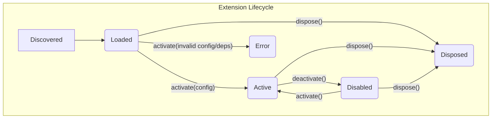

# tests — extensions

This document describes the `ExtensionLoader` module, which is comprehensively tested by `tests/extensions/extension-loader.test.ts`. While the provided source code is the test file itself, the documentation focuses on the `ExtensionLoader` class and its associated types and behaviors, as defined and validated by these tests.

The `ExtensionLoader` is a core component responsible for discovering, loading, managing, and orchestrating the lifecycle of extensions within the system.

---

## `ExtensionLoader` Module Documentation

### Purpose

The `ExtensionLoader` module (`src/extensions/extension-loader.ts`) provides the foundational capabilities for managing extensions. It enables the application to:

*   **Discover** available extensions in specified directories.
*   **Parse and validate** extension manifests (`extension.json`).
*   **Load** extensions into memory, making their metadata accessible.
*   **Activate** and **deactivate** extensions, managing their operational state.
*   **Validate configuration** against defined schemas.
*   **Check dependencies** between extensions.
*   **Manage the lifecycle** of loaded extensions, including disposal.
*   **Emit events** for key lifecycle changes.

The `extension-loader.test.ts` file serves as the primary specification for the `ExtensionLoader`'s expected behavior, covering its API, error handling, and lifecycle management.

### Key Concepts

*   **Extension Manifest (`ExtensionManifest`)**: A JSON object (`extension.json`) located at the root of an extension directory. It defines an extension's metadata (name, version, description, type, entry point) and optional properties like `configSchema` and `dependencies`.
*   **Extension Type**: Categorizes extensions (e.g., `tool`, `channel`, `provider`). This allows for filtering and specific handling based on an extension's role.
*   **Extension Instance**: An object representing a loaded extension, containing its `manifest`, current `status`, `loadedAt` timestamp, and potentially an `error` message if loading or activation failed.
*   **Extension Lifecycle**: Extensions transition through various states: `loaded`, `active`, `disabled`, `error`, `disposed`.

### `ExtensionLoader` Class

The `ExtensionLoader` class is the central API for extension management.

#### Constructor

`new ExtensionLoader(searchPaths: string[])`

Initializes the loader with an array of directory paths to search for extensions. These paths are scanned during the `discover` phase.

#### Static Methods

##### `ExtensionLoader.parseManifest(dir: string): ExtensionManifest | null`

Parses the `extension.json` file within the given directory.

*   **Returns**: The parsed `ExtensionManifest` object if valid, otherwise `null`.
*   **Behavior**:
    *   Returns `null` if `extension.json` is missing.
    *   Returns `null` if the JSON is malformed.
    *   Returns `null` if required fields (`name`, `version`, `type`, `entryPoint`) are missing or if `type` is invalid.

#### Instance Methods

##### `discover(): ExtensionManifest[]`

Scans the `searchPaths` provided during construction to find all valid extension manifests.

*   **Returns**: An array of `ExtensionManifest` objects for all discovered and valid extensions.
*   **Behavior**:
    *   Recursively searches subdirectories within `searchPaths`.
    *   Skips directories that do not contain a valid `extension.json`.
    *   Returns an empty array if no valid extensions are found or if search paths are non-existent.

##### `load(name: string): ExtensionInstance | { error: string }`

Loads a specific extension by its name. This makes the extension's metadata available but does not activate its functionality.

*   **Parameters**:
    *   `name`: The unique name of the extension as defined in its manifest.
*   **Returns**: An `ExtensionInstance` object with `status: 'loaded'` on success, or an object with an `error` property if the extension is not found or the name is invalid.
*   **Behavior**:
    *   Emits a `"loaded"` event upon successful loading.
    *   Rejects names containing `..` or starting with invalid characters to prevent path traversal vulnerabilities.

##### `loadAll(): ExtensionInstance[]`

Discovers all extensions in the configured `searchPaths` and attempts to load them.

*   **Returns**: An array of `ExtensionInstance` objects for all successfully loaded extensions. Invalid extensions are skipped.

##### `list(type?: ExtensionManifest['type']): ExtensionInstance[]`

Retrieves a list of all currently loaded extensions, optionally filtered by type.

*   **Parameters**:
    *   `type` (optional): Filters the list to only include extensions of this specific type.
*   **Returns**: An array of `ExtensionInstance` objects.

##### `get(name: string): ExtensionInstance | undefined`

Retrieves a specific loaded extension by its name.

*   **Parameters**:
    *   `name`: The name of the extension.
*   **Returns**: The `ExtensionInstance` if found, otherwise `undefined`.

##### `validateConfig(name: string, config: Record<string, unknown>): { valid: boolean; errors: string[] }`

Validates a given configuration object against an extension's `configSchema` defined in its manifest.

*   **Parameters**:
    *   `name`: The name of the extension.
    *   `config`: The configuration object to validate.
*   **Returns**: An object indicating `valid` status and an array of `errors` if any.
*   **Behavior**:
    *   Checks for missing required fields.
    *   Checks for type mismatches (e.g., expecting `number` but receiving `string`).
    *   Returns `valid: false` for unknown extensions.
    *   Returns `valid: true` if the extension has no `configSchema` defined, accepting any configuration.

##### `checkDependencies(name: string): { satisfied: boolean; missing: string[] }`

Checks if all dependencies declared by an extension are currently loaded.

*   **Parameters**:
    *   `name`: The name of the extension.
*   **Returns**: An object indicating `satisfied` status and an array of `missing` dependency names.
*   **Behavior**:
    *   Returns `satisfied: true` if the extension has no declared dependencies.

##### `activate(name: string, config?: Record<string, unknown>): Promise<boolean>`

Activates a loaded extension, making it operational. This involves validating its configuration and checking its dependencies.

*   **Parameters**:
    *   `name`: The name of the extension.
    *   `config` (optional): Configuration to apply during activation.
*   **Returns**: `true` if activation is successful, `false` otherwise.
*   **Behavior**:
    *   If config validation fails, the extension's status is set to `'error'`, and `error` property is populated.
    *   If dependencies are missing, the extension's status is set to `'error'`, and `error` property is populated.
    *   Emits an `"activated"` event on success.
    *   Returns `false` for unknown extensions.

##### `deactivate(name: string): Promise<boolean>`

Deactivates an active extension, transitioning its status to `'disabled'`.

*   **Parameters**:
    *   `name`: The name of the extension.
*   **Returns**: `true` if deactivation is successful, `false` otherwise.
*   **Behavior**:
    *   Emits a `"deactivated"` event on success.
    *   Returns `false` for unknown extensions.

##### `dispose(): Promise<void>`

Clears all loaded extensions and performs any necessary cleanup.

*   **Returns**: A Promise that resolves when all extensions are disposed.
*   **Behavior**:
    *   Emits a `"disposed"` event.
    *   Handles errors gracefully if an extension's `onDispose` lifecycle hook throws an exception, ensuring the overall disposal process completes.

#### Event Emission

The `ExtensionLoader` extends `EventEmitter` and emits the following events:

*   `"loaded"`: Emitted when an extension is successfully loaded. The event payload is the `ExtensionInstance`.
*   `"activated"`: Emitted when an extension is successfully activated. The event payload is the `ExtensionInstance`.
*   `"deactivated"`: Emitted when an extension is successfully deactivated. The event payload is the `ExtensionInstance`.
*   `"disposed"`: Emitted when the `ExtensionLoader` itself is disposed.

### Test Utilities (`extension-loader.test.ts`)

The test file includes several helper functions to facilitate testing the `ExtensionLoader` in isolation:

*   `createTempDir(): string`: Creates a unique temporary directory for each test suite or test case, ensuring a clean environment.
*   `writeManifest(dir: string, manifest: Record<string, unknown>): void`: Writes a given manifest object to `extension.json` within the specified directory.
*   `validManifest(overrides: Partial<ExtensionManifest> = {}): Record<string, unknown>`: Generates a basic, valid `ExtensionManifest` object. It accepts `overrides` to easily create manifests with specific properties for different test scenarios (e.g., invalid types, missing fields, custom names).

These utilities are crucial for setting up controlled test environments and simulating various extension configurations without relying on actual file system structures.