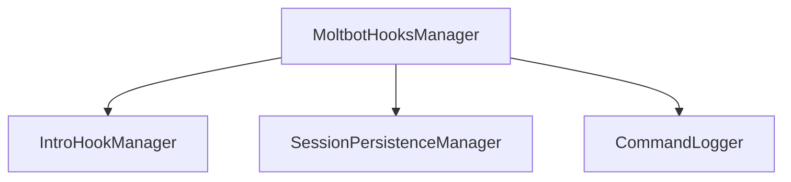

# tests — hooks

This documentation covers the various hook systems and related input handling features within the application, as revealed by their respective test suites. These modules provide extensibility points, control mechanisms, and specialized functionalities for managing application lifecycle events, AI agent behavior, and user interactions.

## 1. Advanced Hooks System (`src/hooks/advanced-hooks.ts`)

The Advanced Hooks system provides a granular, event-driven mechanism for intercepting and influencing core application actions. It allows for custom logic to be executed at specific points, enabling decisions (allow, deny, ask) and even modification of input parameters.

### Purpose

To offer fine-grained control over critical application events, such as tool usage, bash command execution, and session lifecycle, allowing for custom validation, logging, or modification of behavior.

### Key Concepts

*   **`HookEvent`**: An enum defining the specific points in the application lifecycle where hooks can be triggered.
    ```typescript
    enum HookEvent {
      PreToolUse = 'PreToolUse',
      PostToolUse = 'PostToolUse',
      PreBash = 'PreBash',
      PostBash = 'PostBash',
      PreEdit = 'PreEdit',
      PostEdit = 'PostEdit',
      SessionStart = 'SessionStart',
      SessionEnd = 'SessionEnd',
      PreCompact = 'PreCompact',
      Notification = 'Notification',
      SubagentStart = 'SubagentStart',
      SubagentStop = 'SubagentStop',
      PermissionRequest = 'PermissionRequest',
      TaskCompleted = 'TaskCompleted',
      ConfigChange = 'ConfigChange',
    }
    ```
*   **`AdvancedHook`**: The type definition for a hook, specifying its name, event, type (command, prompt, agent), an optional regex `matcher` for tool names, and execution options like `async` and `once`.
*   **`HookContext`**: The data object passed to a hook when it's executed, containing relevant information about the event (e.g., `event`, `toolName`, `input`, `output`).
*   **`HookDecision`**: The return type for synchronous hooks, indicating the action to take (`allow`, `deny`, `ask`) and potentially `updatedInput` for `PreToolUse` hooks.

### Core Components

#### `HookRegistry`

Manages the registration, storage, and retrieval of `AdvancedHook` instances.

*   **`addHook(hook: AdvancedHook)`**: Registers a new hook. If a hook with the same name already exists, it will be overwritten.
*   **`removeHook(name: string)`**: Unregisters a hook by its name.
*   **`getHook(name: string)`**: Retrieves a registered hook by name.
*   **`listHooks()`**: Returns an array of all registered hooks.
*   **`getHooksForEvent(event: HookEvent, toolName?: string)`**: Retrieves all hooks that match the given `event` and optionally a `toolName` (if the hook has a `matcher`). It also filters out `once` hooks that have already fired.
*   **`markFired(hookName: string)`**: Marks a `once: true` hook as having been executed, preventing it from firing again.
*   **`clear()`**: Removes all registered hooks.

#### `AdvancedHookRunner`

Responsible for executing individual `AdvancedHook` instances and interpreting their results.

*   **`matchesEvent(hook: AdvancedHook, event: HookEvent, toolName?: string)`**: Determines if a given hook's `event` and optional `matcher` (if `toolName` is provided) align with the current event context.
*   **`runHook(hook: AdvancedHook, context: HookContext)`**: Executes a synchronous hook.
    *   For `command` type hooks, it spawns a subprocess defined by `hook.command`. The subprocess's stdout is expected to be JSON, which is parsed to determine the `HookDecision`. If the command fails, outputs non-JSON, or has no command, the default decision is `allow`.
    *   For `prompt` and `agent` type hooks, it currently defaults to `allow` if `GROK_API_KEY` is not present.
    *   Returns a `HookDecision` object.
*   **`runHookAsync(hook: AdvancedHook, context: HookContext)`**: Executes an asynchronous hook. These hooks do not return a `HookDecision` and are typically used for side effects like logging or notifications. Errors in async hooks do not propagate.

### Singleton Access

The system provides singleton helpers to ensure consistent access to the `HookRegistry` and `AdvancedHookRunner` instances across the application.

*   **`getHookRegistry()`**: Returns the singleton `HookRegistry` instance.
*   **`getAdvancedHookRunner(workingDirectory?: string, timeout?: number)`**: Returns the singleton `AdvancedHookRunner` instance. Providing a `workingDirectory` or `timeout` will create a new instance if the current one doesn't match, allowing for context-specific runners.
*   **`resetAdvancedHooks()`**: Clears and resets both singleton instances, useful for testing or re-initialization.

### Execution Flow

The Advanced Hooks system integrates into the application's event pipeline.

```mermaid
graph TD
    A[Application Event Triggered] --> B{getHooksForEvent(event, toolName)};
    B --> C{For each matching AdvancedHook};
    C --> D[AdvancedHookRunner.runHook(hook, context)];
    D --> E{Hook Type?};
    E -- "command" --> F[Execute Subprocess];
    E -- "prompt/agent" --> G[Evaluate AI Logic];
    F --> H{Parse Subprocess Output};
    G --> H;
    H --> I[Return HookDecision];
    I --> J{Application Action};
    J -- "allow" --> K[Continue Operation];
    J -- "deny" --> L[Abort Operation];
    J -- "ask" --> M[Request User Permission];
    J -- "updatedInput" --> N[Modify Input & Continue];
```

## 2. Lifecycle Hooks System (`src/hooks/lifecycle-hooks.ts`)

The Lifecycle Hooks system provides a structured way to define and execute hooks at predefined stages of the application's operational flow, such as before/after edits or bash commands.

### Purpose

To enable custom actions (e.g., linting, formatting, testing, logging) to be automatically performed at specific points in the application's workflow, enhancing automation and developer experience.

### Key Concepts

*   **`HookType`**: A set of string literals defining the specific lifecycle events.
    ```typescript
    type HookType =
      | 'pre-edit'
      | 'post-edit'
      | 'pre-bash'
      | 'post-bash'
      | 'pre-commit'
      | 'post-commit'
      | 'pre-prompt'
      | 'post-response'
      | 'on-error'
      | 'on-tool-call';
    ```
*   **`HookDefinition`**: The structure for defining a lifecycle hook, including its `name`, `type`, `command` (shell command), `script` (path to a JS/TS script), or an inline `handler` function. It also includes configuration like `enabled`, `timeout`, `failOnError`, and optional `filePatterns` or `commandPatterns` for conditional execution.
*   **`HookContext`**: The data object passed to a lifecycle hook, containing context-specific information such as `file`, `content`, `command`, `output`, `toolName`, `sessionId`, etc.
*   **`HookResult`**: The outcome of a lifecycle hook execution, indicating `success`, `output`, `duration`, and optionally `error`, `modified` content, or an `abort` flag.

### Core Component

#### `HooksManager`

The central component for managing and executing lifecycle hooks.

*   **`constructor(workingDirectory: string, config?: Partial<HooksConfig>)`**: Initializes the manager with a working directory and optional custom configuration.
*   **`registerHook(hook: HookDefinition)`**: Adds a new hook definition to the manager. Emits a `hook:registered` event.
*   **`unregisterHook(name: string)`**: Removes a hook by its name.
*   **`setHookEnabled(name: string, enabled: boolean)`**: Enables or disables a specific hook.
*   **`hasHook(name: string)`**: Checks if a hook with the given name is registered.
*   **`getHooks()`**: Returns a `Map` of all registered hooks.
*   **`getHooksByType(type: HookType)`**: Returns an array of hooks registered for a specific `HookType`.
*   **`executeHooks(type: HookType, context: HookContext)`**: Executes all enabled hooks of the specified `type`. It emits `hook:executing` and `hook:executed` events. Hooks are executed in the order they were registered.
*   **`updateConfig(config: Partial<HooksConfig>)`**: Updates the manager's configuration (e.g., `timeout`, `enabled` status for all hooks).
*   **`getConfig()`**: Retrieves the current configuration.
*   **`formatStatus()`**: Generates a formatted string showing the status of the lifecycle hooks.

### Built-in Hooks

The system includes a set of predefined hooks (`BUILTIN_HOOKS`) that can be enabled or disabled:

*   `lint-on-edit` (post-edit)
*   `format-on-edit` (post-edit)
*   `test-on-edit` (post-edit)
*   `pre-commit-lint` (pre-commit)
*   `pre-commit-test` (pre-commit)

### Singleton Access

*   **`getHooksManager(workingDirectory: string)`**: Returns the singleton `HooksManager` instance for the given working directory.
*   **`initializeHooks(workingDirectory: string, config?: Partial<HooksConfig>)`**: Initializes or retrieves the singleton `HooksManager` with a specific configuration.

## 3. Moltbot-Inspired Features (`src/hooks/moltbot-hooks.ts`)

This module provides a suite of features inspired by Moltbot, focusing on AI agent configuration, session management, and command logging. It acts as an orchestrator for several sub-managers.

### Purpose

To enhance the AI agent's capabilities by providing persistent context (intro hooks), session memory, and detailed logging of interactions and actions.

### Core Component

#### `MoltbotHooksManager`

The main manager that composes and coordinates the `IntroHookManager`, `SessionPersistenceManager`, and `CommandLogger`.

*   **`constructor(projectDir: string, config?: Partial<MoltbotConfig>)`**: Initializes the manager with a project directory and optional configuration, setting up its sub-managers.
*   **`initializeSession(sessionId?: string)`**: Starts a new session or resumes an existing one. It loads the intro content and sets up the session persistence.
*   **`resumeLastSession()`**: Attempts to resume the most recently active session.
*   **`endSession()`**: Ends the current session and saves its state.
*   **`getIntroManager()`**: Returns the `IntroHookManager` instance.
*   **`getSessionManager()`**: Returns the `SessionPersistenceManager` instance.
*   **`getCommandLogger()`**: Returns the `CommandLogger` instance.
*   **`saveConfig(path: string)`**: Saves the current Moltbot configuration to a JSON file.
*   **`loadConfig(path: string)`**: Loads configuration from a JSON file.
*   **`formatStatus()`**: Provides a formatted status report for all Moltbot features.
*   **`dispose()`**: Cleans up resources held by sub-managers.

### Sub-Managers



#### `IntroHookManager`

Manages the "intro" content provided to the AI agent, which typically defines its role, rules, and context.

*   **`loadIntro()`**: Asynchronously loads and combines intro content from configured sources (inline strings, `.codebuddy/intro_hook.txt`, `.codebuddy/README.md`). It respects source `priority`, `enabled` status, and `maxLength` for truncation. Caches the loaded content.
*   **`addSource(source: IntroSource)`**: Adds a new intro content source.
*   **`removeSource(id: string)`**: Removes an intro content source by its ID.
*   **`updateConfig(config: Partial<IntroConfig>)`**: Updates the intro manager's configuration, clearing the cache.
*   **`getCachedIntro()`**: Retrieves the currently cached intro content.
*   Emits an `intro-loaded` event when content is successfully loaded.

#### `SessionPersistenceManager`

Handles the storage and retrieval of chat session history, including user messages and tool calls.

*   **`constructor(projectPath: string, config?: Partial<SessionPersistenceConfig>)`**: Initializes with a project path and configuration, including `storagePath` and `autoSaveInterval`.
*   **`startSession(sessionId?: string)`**: Creates a new session or loads an existing one by ID.
*   **`addMessage(message: ChatMessage)`**: Adds a new message to the current session's history.
*   **`addToolCall(toolCall: ToolCall)`**: Appends a tool call to the last assistant message in the session.
*   **`saveSession()`**: Persists the current session's state to disk.
*   **`loadSession(id: string)`**: Loads a specific session by ID.
*   **`listSessions()`**: Returns a list of all available sessions for the project.
*   **`getMostRecentSession()`**: Retrieves the most recently updated session.
*   **`cleanupOldSessions()`**: Deletes older sessions if the `maxSessions` limit is exceeded.
*   **`updateConfig(config: Partial<SessionPersistenceConfig>)`**: Updates the session manager's configuration (e.g., `maxMessagesPerSession`, `maxSessions`).
*   Emits `session-started`, `session-saved`, and `session-ended` events.

#### `CommandLogger`

Records detailed logs of commands executed by the AI agent, including tool calls, bash commands, and file edits.

*   **`constructor(config?: Partial<CommandLogConfig>)`**: Initializes with configuration for `logPath`, `logLevel`, `redactSecrets`, and `rotateDaily`.
*   **`logToolCall(name: string, args: any, result: any, duration?: number)`**: Logs a tool call with its arguments and result.
*   **`logBashCommand(command: string, result: any, duration?: number)`**: Logs a bash command execution.
*   **`logFileEdit(filePath: string, type: 'create' | 'edit' | 'delete', success: boolean)`**: Logs file modification events.
*   **`setSessionId(sessionId: string)`**: Associates subsequent logs with a specific session ID.
*   **`updateConfig(config: Partial<CommandLogConfig>)`**: Updates the logger's configuration.
*   **`flush()`**: Ensures all pending logs are written to disk.
*   **`getStats()`**: Returns statistics about the logged entries and log file size.
*   **Redaction**: Automatically redacts sensitive information (e.g., API keys, passwords) from logged commands and arguments if `redactSecrets` is enabled.
*   Emits a `logged` event for each entry.

### Setup Utilities

A set of helper functions simplify the initial setup and management of Moltbot-inspired features within a project.

*   **`checkMoltbotSetup(projectDir: string)`**: Checks if Moltbot intro hooks and configuration files exist in the project's `.codebuddy` directory.
*   **`setupMoltbotHooks(projectDir: string, options: SetupOptions)`**: Creates the necessary `.codebuddy` directory, `intro_hook.txt` (using `DEFAULT_INTRO_HOOK_TEMPLATE` or custom content), and `moltbot-hooks.json` configuration file based on provided options.
*   **`enableMoltbotHooks(projectDir: string)`**: Enables all Moltbot features by creating/updating the configuration.
*   **`disableMoltbotHooks(projectDir: string)`**: Disables all Moltbot features in the configuration.
*   **`getIntroHookContent(projectDir: string)`**: Reads the content of `intro_hook.txt`.
*   **`setIntroHookContent(content: string, projectDir: string)`**: Writes content to `intro_hook.txt`, creating the file if it doesn't exist.
*   **`formatSetupStatus(projectDir: string)`**: Provides a human-readable status of the Moltbot setup.
*   **`DEFAULT_INTRO_HOOK_TEMPLATE`**: A predefined template for the `intro_hook.txt` file, guiding users on how to configure the AI's role, personality, and rules.

### Singleton Access

*   **`getMoltbotHooksManager(projectDir?: string)`**: Returns the singleton `MoltbotHooksManager` instance. If a `projectDir` is provided and differs from the current manager's, a new instance is created.
*   **`resetMoltbotHooksManager()`**: Resets the singleton instance, useful for testing.

## 4. Input Handling Features (Inferred from `tests/hooks/input-handler.test.ts`)

This module provides utilities for processing user input, specifically for persistent instructions and UI interaction.

### Purpose

To enhance user interaction by allowing persistent instructions and enabling special UI actions based on input patterns.

### Key Features

#### `# Instruction Capture`

Allows users to define persistent instructions for the AI agent directly from the input prompt.

*   **`saveInstructionToCodeBuddyRules(instruction: string, codebuddyrulesPath: string)`**:
    *   Reads an existing `.codebuddyrules` YAML file (or creates one if it doesn't exist).
    *   Adds the provided `instruction` to the `instructions` array within the YAML, ensuring no duplicates.
    *   Preserves any other existing YAML keys and values.
    *   Writes the updated YAML back to the file.
    *   Returns a status message indicating success or failure.
*   **`parseHashInput(input: string)`**:
    *   Detects if a user's `input` starts with `#`.
    *   If so, it extracts the instruction text (trimming leading/trailing whitespace) and marks it as an instruction.
    *   Example: `"# Always use TypeScript"` becomes `"Always use TypeScript"`.

#### `Double Escape Detection`

A mechanism to detect rapid consecutive escape key presses, typically used to trigger special UI actions like editing the previous prompt.

*   **`DoubleEscapeDetector` class**:
    *   **`detectDoubleEscape()`**: Records the current timestamp and compares it to the `lastEscapeTime`. If the time difference is below a `DOUBLE_ESCAPE_THRESHOLD` (e.g., 500ms), it returns `true`.
    *   **`reset()`**: Clears the `lastEscapeTime`, effectively resetting the detection sequence.

#### `Get Last User Message`

A utility function to retrieve the most recent user-provided message from a chat history.

*   **`getLastUserMessage(chatHistory: ChatEntry[])`**:
    *   Iterates through the `chatHistory` array in reverse order.
    *   Returns the `content` of the first entry found with `type: 'user'`.
    *   Returns `null` if no user messages are found.

## Relationship and Integration

These hook systems and input handling features work together to provide a robust and extensible AI agent experience:

*   The **Advanced Hooks System** provides the fundamental event-driven architecture for intercepting and making decisions at critical points, such as before a tool is used or a bash command is executed. This allows for security, validation, or dynamic modification of actions.
*   The **Lifecycle Hooks System** builds upon this concept (or runs in parallel) by offering a more structured way to define and manage hooks for common development workflow events (e.g., linting after an edit, running tests before a commit). These hooks can be configured with commands, scripts, or inline handlers.
*   The **Moltbot-Inspired Features** module integrates AI-specific functionalities:
    *   `IntroHookManager` ensures the AI agent receives consistent role and instruction context.
    *   `SessionPersistenceManager` provides the AI with memory of past interactions, crucial for coherent conversations.
    *   `CommandLogger` offers transparency and debugging capabilities by recording all agent actions.
    *   These features might internally leverage the Advanced or Lifecycle hook systems (e.g., `CommandLogger` could be triggered by `PostToolUse` or `PostBash` events).
*   The **Input Handling Features** enhance the user interface by allowing users to easily define persistent instructions (`# Instruction Capture`) and trigger special UI modes (`Double Escape Detection`). The captured instructions can then be fed into the `IntroHookManager` or directly influence the AI's behavior.

Together, these modules create a powerful and flexible framework for building intelligent agents that are both controllable and adaptable to user and project requirements.