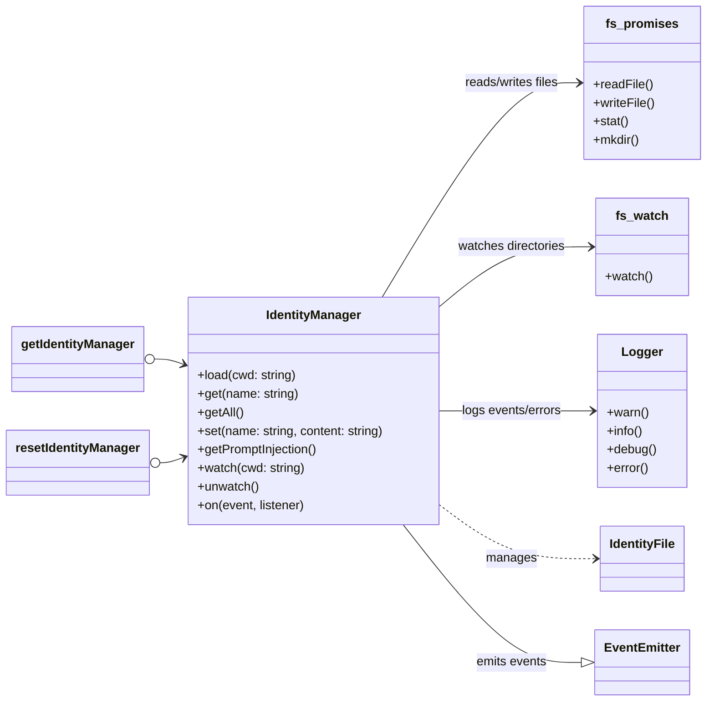

# tests — identity

This document provides an overview of the `IdentityManager` module, as revealed and validated by its comprehensive test suite located at `tests/identity/identity-manager.test.ts`. The tests cover the core functionality, configuration, and behavior of the `IdentityManager` class, which is responsible for loading, managing, and providing identity-related files for the application.

## IdentityManager Module Overview

The `IdentityManager` module (`src/identity/identity-manager.js`) is a central component for managing contextual identity files. These files (e.g., `SOUL.md`, `USER.md`, `AGENTS.md`, `TOOLS.md`, `IDENTITY.md`) provide crucial information, instructions, or context that can be injected into prompts for AI models or used by other parts of the application.

The module handles:
*   **Discovery and Loading**: Locating identity files in both project-specific and global directories.
*   **Priority Management**: Ensuring project-level files override global ones.
*   **Content Management**: Storing, retrieving, and updating file contents.
*   **Prompt Formatting**: Preparing identity content for direct injection into AI prompts.
*   **Hot-Reloading**: Monitoring files for changes and updating its internal state.
*   **Singleton Pattern**: Providing a consistent, globally accessible instance.

## Key Concepts

### Identity Files
The `IdentityManager` primarily deals with a predefined set of Markdown files, though this list is configurable. By default, it looks for:
*   `SOUL.md`: Core identity or persona.
*   `USER.md`: User-specific preferences or context.
*   `AGENTS.md`: Definitions or instructions for agents.
*   `TOOLS.md`: Descriptions or usage instructions for available tools.
*   `IDENTITY.md`: A general-purpose identity file.

### Project vs. Global Scope
Identity files can exist in two locations:
1.  **Project-level**: Within a `.codebuddy` (or configurable) directory inside the current working directory (`CWD`).
2.  **Global-level**: Within a `.codebuddy` (or configurable) directory in a global configuration path (e.g., `~/.codebuddy`).

The `IdentityManager` prioritizes project-level files. If a file (e.g., `SOUL.md`) exists in both the project and global directories, the project version is used, and the global version is ignored. If a project file exists but is empty or contains only whitespace, the global fallback is used.

### Prompt Injection Formatting
The module provides a method to concatenate all loaded identity files into a single string, formatted for direct injection into a prompt. Each file's content is prefixed with a Markdown heading (e.g., `## SOUL.md`) and separated by horizontal rules (`---`) for clear delineation within the prompt.

### Hot-Reloading
When enabled, the `IdentityManager` can watch the project and global identity directories for file changes. Upon detecting a change to a relevant identity file, it reloads that specific file and emits an event, allowing the application to react (e.g., update its AI context).

### Singleton Pattern
The `IdentityManager` is designed as a singleton, ensuring that only one instance manages identity files across the application. This is exposed via `getIdentityManager()` and can be reset with `resetIdentityManager()`.

## Core Functionality

The `IdentityManager` class exposes several methods for interacting with identity files.

### `IdentityManager` Class

#### Constructor
`new IdentityManager(options: { globalDir: string; fileNames?: string[]; projectDir?: string; watchForChanges?: boolean; })`
Initializes the manager with configuration options:
*   `globalDir`: The absolute path to the global identity directory.
*   `fileNames`: An optional array of file names to look for (defaults to `['SOUL.md', 'USER.md', 'AGENTS.md', 'TOOLS.md', 'IDENTITY.md']`).
*   `projectDir`: An optional name for the project-level configuration directory (defaults to `.codebuddy`).
*   `watchForChanges`: A boolean indicating whether to enable file watching (defaults to `false`).

#### `load(cwd: string): Promise<IdentityFile[]>`
Discovers and loads identity files from both project and global directories based on the configured `fileNames`.
*   It clears any previously loaded files before a new load operation.
*   It reads file content, trims whitespace, and skips files with empty or whitespace-only content.
*   It determines the `source` (project or global) and `lastModified` timestamp for each file.
*   Emits an `identity:loaded` event with the array of loaded files upon successful completion.
*   **Precondition**: Must be called before `set()` to establish the current working directory (`cwd`).

#### `get(name: string): IdentityFile | undefined`
Retrieves a specific loaded identity file by its name (e.g., `'SOUL.md'`). Returns `undefined` if the file is not found.

#### `getAll(): IdentityFile[]`
Returns an array of all currently loaded identity files.

#### `set(name: string, content: string): Promise<void>`
Writes or updates an identity file.
*   Always writes to the project-level directory (e.g., `CWD/.codebuddy/SOUL.md`).
*   Creates the project directory if it doesn't exist.
*   Updates the in-memory representation of the file.
*   Emits an `identity:changed` event with the updated file.
*   Emits an `identity:error` event and throws if the write operation fails (e.g., permission denied).
*   **Precondition**: `load()` must have been called at least once to establish the `cwd`.

#### `getPromptInjection(): string`
Generates a formatted string suitable for prompt injection, concatenating all loaded identity files.
*   Each file is presented with a Markdown heading (e.g., `## SOUL.md`).
*   Files are separated by `\n\n---\n\n`.
*   Returns an empty string if no files are loaded.

#### `watch(cwd: string): void`
Sets up file system watchers on the project and global identity directories.
*   Monitors for `change` events.
*   When a change is detected for a configured identity file, it reloads that specific file and emits an `identity:changed` event.
*   Ignores changes to non-identity files or events with null filenames.
*   Handles directory not found errors gracefully without throwing.
*   Calling `watch()` multiple times will close previous watchers and set up new ones.

#### `unwatch(): void`
Closes all active file system watchers. This is automatically called when `resetIdentityManager()` is invoked.

#### Event Emitter
The `IdentityManager` extends Node.js's `EventEmitter`, exposing the following events:
*   `identity:loaded(files: IdentityFile[])`: Emitted after `load()` successfully completes.
*   `identity:changed(file: IdentityFile)`: Emitted when a file is updated via `set()` or detected by a watcher.
*   `identity:error(error: Error)`: Emitted when an error occurs during file operations (e.g., `set()` failure).

### Singleton Access

#### `getIdentityManager(): IdentityManager`
Returns the singleton instance of `IdentityManager`. If no instance exists, it creates one with default configuration.

#### `resetIdentityManager(): void`
Resets the singleton instance. This closes any active watchers via `unwatch()` and ensures that the next call to `getIdentityManager()` will return a new instance.

## Architecture Diagram

## Integration with the Codebase

The `IdentityManager` module (`src/identity/identity-manager.js`) is a foundational utility. Other parts of the application, particularly those interacting with AI models, will use `getIdentityManager()` to retrieve the singleton instance. They can then call `load()` to initialize the identity context for a given project, `getPromptInjection()` to retrieve formatted context for AI prompts, or `on('identity:changed')` to react to real-time updates to identity files. The `set()` method allows the application to programmatically create or modify identity files, for example, through a user interface.