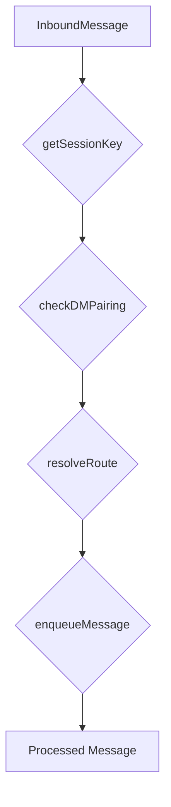

# tests — integration

This document provides a detailed overview of the `tests/integration` module, which is crucial for verifying the interaction and correct functioning of multiple core components within the Code Buddy system.

## 1. Overview and Purpose

The `tests/integration` module contains tests designed to validate the end-to-end flow and inter-module communication of key Code Buddy functionalities. Unlike unit tests, which isolate individual components, integration tests ensure that different parts of the system work together as expected, covering critical paths like message processing, identity management, workflow execution, and security.

These tests are vital for:
*   **System Cohesion**: Confirming that modules integrate correctly.
*   **Flow Validation**: Verifying complete operational sequences (e.g., a message from reception to processing).
*   **Concurrency and Stability**: Stress-testing shared resources and concurrent operations.
*   **Security Posture**: Ensuring critical security mechanisms are effective.

## 2. General Characteristics

### What's Real vs. What's Mocked

To focus on the integration points and avoid external dependencies, these tests carefully select what to mock and what to run as real components:

**What's Real:**
*   Session isolation, identity linking, and DM pairing logic (`src/channels`).
*   `LaneQueue` concurrency control (`src/concurrency`).
*   Pipeline compositor transforms (`src/workflows`).
*   Sandbox `vm.runInNewContext` evaluation (`src/sandbox`).

**What's Mocked:**
*   **LLM API calls**: All external Large Language Model interactions are stubbed. Tool executors are mocked to return predefined results or simulate delays.
*   **File system**: Minimal interaction; only static analysis tests directly read source files.
*   **Network**: No external network connections are made.

### Running the Tests

To execute all integration tests, use the following command:

```bash
npm test -- tests/integration/
```

## 3. Core Integration Test Suites

This section details each integration test file, outlining its purpose, the specific components it integrates, and key scenarios it validates.

### 3.1. Channel System E2E (`channel-system-e2e.test.ts`)

This suite provides an end-to-end verification of the channel message processing pipeline, from initial reception to final serialization in the `LaneQueue`. It ensures that the core channel components correctly interact to manage message flow.

**Key Integrations & Components:**
*   `getSessionKey` (from `src/channels/session-isolation.js`)
*   `checkDMPairing` (from `src/channels/dm-pairing.js`)
*   `resolveRoute` (from `src/channels/peer-routing.js`)
*   `enqueueMessage` (from `src/channels/lane-queue.js`)

**Execution Flow:**



**Validated Scenarios:**
*   **Full Message Flow**: A single message is passed through `getSessionKey`, `checkDMPairing`, `resolveRoute`, and `enqueueMessage`, verifying each step's output.
*   **Session Key Isolation**: Confirms that messages from different channels or different users receive distinct session keys, while messages from the same channel/user pair receive the same key.
*   **Lane Queue Serialization**: Demonstrates that tasks for the *same* session are processed serially, while tasks for *different* sessions can be processed in parallel, ensuring correct concurrency control.

### 3.2. Multi-Channel Identity (`multi-channel-identity.test.ts`)

This suite focuses on the `IdentityLinker` and its interaction with the `SessionIsolator`, ensuring that user identities can be correctly linked across different communication channels and that this linking impacts session key convergence as expected.

**Key Integrations & Components:**
*   `IdentityLinker` (from `src/channels/identity-links.js`)
*   `SessionIsolator` (from `src/channels/session-isolation.js`)
*   `link`, `unlink` methods of `IdentityLinker`
*   `getSessionKey` method of `SessionIsolator`

**Validated Scenarios:**
*   **Unlinked Identities**: Verifies that messages from different channels, even if from the same conceptual user, produce distinct session keys if their identities are not linked.
*   **Linked Identities**: Confirms that after linking two channel-specific identities (e.g., Telegram Alice and Discord Alice), messages from either channel result in the *same* converged session key.
*   **Unlinking Identities**: Ensures that unlinking previously linked identities restores their separate session keys.
*   **Multi-way Linking**: Tests the ability to link more than two identities (e.g., Telegram, Discord, and Slack) to a single converged session key.

### 3.3. Pipeline and Skill Flow (`pipeline-skill-flow.test.ts`)

This suite validates the `PipelineCompositor`, which orchestrates the execution of multi-step workflows involving various tools and transforms. It ensures that pipelines are executed correctly, handle failures, and provide necessary metadata.

**Key Integrations & Components:**
*   `PipelineCompositor` (from `src/workflows/pipeline.js`)
*   `setToolExecutor`, `execute`, `validateDefinition` methods of `PipelineCompositor`

**Validated Scenarios:**
*   **Ordered Execution**: Confirms that a pipeline with multiple tool steps executes them in the defined sequence.
*   **Pipeline Validation**: Tests the `validateDefinition` method to ensure it correctly identifies valid and invalid pipeline structures.
*   **Transform Execution**: Verifies that `transform` steps within a pipeline are executed and produce expected outputs.
*   **Tool Failure Handling**: Ensures that the pipeline gracefully handles failures during tool execution, reporting the failure status.
*   **Execution Duration Tracking**: Checks that the `totalDurationMs` is accurately reported after pipeline execution.

### 3.4. Security Sandbox (`security-sandbox.test.ts`)

This suite is critical for verifying the security posture of Code Buddy's code evaluation mechanisms. It tests the `safeEval` functions and performs static analysis on sensitive source files to prevent common security vulnerabilities.

**Key Integrations & Components:**
*   `safeEval`, `safeEvalCondition` (from `src/sandbox/safe-eval.js`)
*   Direct file system access (`fs`, `path`) for static analysis.

**Validated Scenarios:**
*   **Safe Expression Evaluation**: Confirms that basic math, string operations, and boolean conditions can be evaluated correctly within the sandbox, including the use of context variables.
*   **Dangerous Operation Blocking**: Crucially, it verifies that attempts to access sensitive global objects or functions like `process`, `require`, or `globalThis.process` are blocked, preventing sandbox escapes.
*   **Timeout Protection**: Ensures that infinite loops or long-running scripts within `safeEval` are terminated by a configurable timeout.
*   **Source Code Static Analysis**: Scans critical files (`src/interpreter/computer/skills.ts`, `src/orchestration/orchestrator.ts`) to ensure they do not contain `new Function()` or `eval()` calls, which could introduce dynamic code execution vulnerabilities.

### 3.5. Concurrency Stress (`concurrency-stress.test.ts`)

This suite rigorously tests the `LaneQueue` module, which is responsible for managing concurrent tasks and ensuring serialization within specific "lanes" (e.g., per session). It's designed to detect deadlocks, race conditions, and ensure robust performance under load.

**Key Integrations & Components:**
*   `LaneQueue` (from `src/concurrency/lane-queue.js`)
*   `enqueue`, `pause`, `resume`, `cancelPending`, `clear`, `getGlobalStats` methods of `LaneQueue`

**Validated Scenarios:**
*   **High Concurrency & No Deadlock**: Submits 50 concurrent tasks across 10 lanes, verifying that all tasks complete without deadlocks and return correct values.
*   **Serial Ordering within Lane**: Confirms that tasks enqueued to the *same* lane are executed strictly in the order they were added.
*   **Mixed Serial/Parallel Tasks**: Tests the `LaneQueue`'s ability to handle a mix of serial and parallel tasks within a lane, ensuring serial tasks complete before parallel ones start (if paused/resumed).
*   **Rapid Cycles**: Simulates rapid enqueue/dequeue operations to ensure stability under fluctuating load.
*   **Cancellation**: Verifies that pending tasks within a lane can be effectively cancelled.
*   **Global Stats**: Checks that `getGlobalStats()` accurately reports the total, completed, and failed tasks.

### 3.6. Plugin CLI Integration (`plugin-cli.test.ts`)

This suite verifies the integration between the command-line interface (CLI) handler for plugins and the underlying plugin management modules. It ensures that CLI commands correctly interact with the `PluginMarketplace` and `PluginManager`.

**Key Integrations & Components:**
*   `handlePlugins` (from `src/commands/handlers/plugin-handlers.js`)
*   `getPluginMarketplace` (from `src/plugins/marketplace.js`)
*   `getPluginManager` (from `src/plugins/plugin-manager.js`)

**Validated Scenarios:**
*   **Listing Plugins**: Tests the `list` command to ensure it correctly aggregates and displays both installed (legacy marketplace) and loaded (new system) plugins.
*   **Enabling/Disabling Plugins**: Verifies that `enable` and `disable` commands correctly call `activatePlugin` and `deactivatePlugin` on the `PluginManager` and report success or failure.
*   **Status Reporting**: Checks that the `status` command provides a comprehensive overview, combining information from both the `PluginMarketplace` and `PluginManager`.

### 3.7. Multi-Agent Coordination (`multi-agent.test.ts`)

This suite explores conceptual aspects of multi-agent coordination, context compression, and model routing. It's important to note that this file primarily uses **mock implementations** defined within the test file itself for agents, coordinators, and related logic. While located in `tests/integration`, it functions more as a detailed unit test for these *concepts* rather than integrating with actual Code Buddy agent/coordinator implementations.

**Key Concepts & Mocked Components:**
*   `MockAgent`, `MockCoordinator` (internal to test file)
*   `addAgent`, `assignTask`, `getAgentStatus`, `coordinateHandoff` methods (internal to test file)
*   `compressContext` function (internal to test file)
*   `routeModel` function (internal to test file)
*   `mockWorkflow`, `mockErrorWorkflow` (internal to test file)

**Validated Scenarios (Conceptual):**
*   **Agent Registration & Task Assignment**: Verifies that mock agents can be registered and tasks assigned, respecting agent status.
*   **Agent Handoff**: Tests the logic for transferring tasks and context between mock agents.
*   **Context Compression**: Validates a simple context compression algorithm, ensuring messages are removed when exceeding a token limit while preserving critical messages.
*   **Model Routing**: Tests a basic model routing logic based on task type and context length.
*   **End-to-End Workflow Simulation**: A high-level simulation of a workflow, demonstrating request processing and error handling.

## 4. Key Integrations and Dependencies

The integration tests demonstrate how various `src` modules are designed to work together. Here's a summary of the most significant connections:

*   **`src/channels/*`**: Heavily integrated by `channel-system-e2e.test.ts` and `multi-channel-identity.test.ts` to validate the entire message processing and identity management pipeline.
*   **`src/concurrency/lane-queue.js`**: The core of concurrency control, thoroughly tested by `concurrency-stress.test.ts` and implicitly used by `channel-system-e2e.test.ts` via `enqueueMessage`.
*   **`src/workflows/pipeline.js`**: The central orchestrator for complex operations, validated by `pipeline-skill-flow.test.ts`.
*   **`src/sandbox/safe-eval.js`**: Critical for secure code execution, directly tested by `security-sandbox.test.ts`.
*   **`src/plugins/*` and `src/commands/handlers/plugin-handlers.js`**: Integrated by `plugin-cli.test.ts` to ensure the CLI interacts correctly with the plugin system.

These tests collectively provide confidence that the Code Buddy system's interconnected modules function reliably and securely.