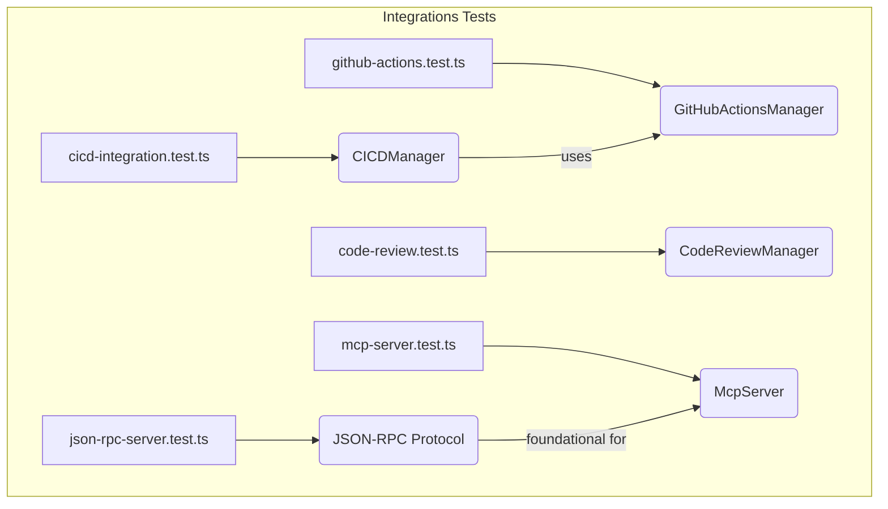

# tests — integrations

This document provides an overview of the `tests/integrations` module, which is dedicated to validating the functionality and adherence to protocols of various integration components within the codebase. These tests ensure that the system interacts correctly with external services (like CI/CD providers, AI models) and internal protocols (like JSON-RPC, MCP).

## Module Purpose

The `tests/integrations` module serves as a critical validation layer for the system's integration points. Unlike unit tests that focus on individual functions or classes in isolation, integration tests verify that different components, especially those interacting with external systems or complex protocols, work together as expected. This includes:

*   **External Service Integrations:** Ensuring correct communication and data handling with services like GitHub Actions for CI/CD, or AI models for code review.
*   **Internal Protocol Implementations:** Validating the adherence to defined communication protocols (e.g., JSON-RPC, Model Context Protocol) for inter-process communication or client-server interactions.
*   **Configuration and Defaults:** Confirming that default configurations are sensible and that custom configurations are applied correctly.
*   **Type Safety and Structure:** Verifying the structure and values of key data types used across integration boundaries.

## Integration Areas and Their Tests

The module is structured around distinct integration areas, each with its own test file.

### 1. CI/CD Integration

**Test File:** `tests/integrations/cicd-integration.test.ts`

This test suite focuses on the core `CICDManager` and its general capabilities for managing CI/CD workflows, independent of a specific provider. It validates the foundational aspects of CI/CD integration.

**Key Components Tested:**

*   **`CICDManager`**:
    *   **Constructor & Configuration**: Ensures proper initialization with `DEFAULT_CICD_CONFIG` and the ability to accept custom `CICDConfig`.
    *   **Workflow Management**: Tests `getWorkflows()`, `getTemplates()`, `validateWorkflow(workflow: string)`, `suggestWorkflow()`.
    *   **Status & Configuration**: Validates `formatStatus()` output and `updateConfig()` functionality.
    *   **Workflow Runs**: Checks `getWorkflowRuns()` (acknowledging external dependencies like `gh CLI`).
    *   **Events**: Verifies that `workflows:detected` events are emitted correctly.
*   **Constants & Types**:
    *   `DEFAULT_CICD_CONFIG`: Ensures sensible default values.
    *   `CICDProvider`: Validates the list of supported CI/CD providers.
    *   `WORKFLOW_TEMPLATES`: Checks for the presence and basic structure of various workflow templates (e.g., `node-ci`, `python-ci`, `docker-build`, `release`).
    *   `WorkflowStatus`, `WorkflowRun`, `WorkflowDefinition`: Verifies the structure and expected values of these critical data types.
*   **Singleton Pattern**: Tests `getCICDManager()` and `initializeCICD()` to ensure correct singleton behavior and initialization.

**Execution Flow Notes:**
Tests for `CICDManager` methods like `getWorkflows`, `getTemplates`, `validateWorkflow`, `suggestWorkflow`, `formatStatus`, `updateConfig`, and `getWorkflowRuns` directly call these methods on a `CICDManager` instance. The `detectWorkflows` method is specifically tested for event emission.

### 2. GitHub Actions Integration

**Test File:** `tests/integrations/github-actions.test.ts`

This suite specifically validates the `GitHubActionsManager`, which is a concrete implementation for interacting with GitHub Actions. It covers the lifecycle of GitHub Actions workflows, from template management to analysis.

**Key Components Tested:**

*   **`GitHubActionsManager`**:
    *   **Templates**: Tests `getTemplates()`, `getTemplate(name: string)` for listing and retrieving specific workflow templates.
    *   **Workflow Lifecycle**: Validates `createFromTemplate(templateName: string, filename?: string)`, `createWorkflow(config: object, filename: string)`, `listWorkflows()`, `readWorkflow(filename: string)`, and `deleteWorkflow(filename: string)`.
    *   **Validation & Analysis**: Checks `validateWorkflow(config: object)` for detecting common YAML errors and `analyzeWorkflow(config: object)` for suggesting improvements (e.g., security, caching).
    *   **Summary**: Tests `formatSummary()` for generating human-readable summaries of existing workflows.
*   **Singleton Pattern**: Verifies `getGitHubActionsManager()` and `resetGitHubActionsManager()` for correct instance management.

**Execution Flow Notes:**
These tests heavily rely on file system operations (`fs.mkdtempSync`, `fs.mkdirSync`, `fs.existsSync`, `fs.readFileSync`, `fs.rmSync`) to simulate a project's `.github/workflows` directory. This allows for isolated testing of workflow creation, reading, and deletion without affecting the actual project.

### 3. AI Code Review Integration

**Test File:** `tests/integrations/code-review.test.ts`

This module validates the `CodeReviewManager` responsible for integrating with AI models to perform automated code reviews. It ensures that the review process, configuration, and result formatting work as expected.

**Key Components Tested:**

*   **`CodeReviewManager`**:
    *   **Constructor & Configuration**: Ensures proper initialization with `DEFAULT_REVIEW_CONFIG` and the ability to accept custom `CodeReviewConfig`.
    *   **Configuration Updates**: Tests `updateConfig()` to modify review settings.
    *   **AI Interaction**: Validates `generateReviewPrompt(diff: string)` for creating AI-ready prompts from code diffs.
    *   **Result Handling**: Checks `formatResults(result: ReviewResult)` for presenting review outcomes clearly.
    *   **Review Execution**: Tests `reviewStagedChanges()` (acknowledging that actual AI calls might be mocked or skipped in a test environment).
    *   **Events**: Verifies that `review:start` events are emitted.
*   **Constants & Types**:
    *   `DEFAULT_REVIEW_CONFIG`: Ensures sensible default settings for code review.
    *   `IssueSeverity`, `IssueType`: Validates the defined severity levels and issue categories.
    *   `ReviewResult`, `ReviewIssue`: Verifies the structure and expected fields for review outcomes and individual issues.
*   **Singleton Pattern**: Tests `getCodeReviewManager()` and `initializeCodeReview()` for correct instance management.

**Execution Flow Notes:**
The `reviewStagedChanges` method is called, which would typically involve interacting with a Git client to get diffs and then an AI service. The tests focus on the manager's ability to initiate this process and handle the results, rather than the full end-to-end AI interaction.

### 4. JSON-RPC Protocol & Server Runner

**Test File:** `tests/integrations/json-rpc-server.test.ts`

This suite validates the fundamental JSON-RPC protocol implementation, which is used for inter-process communication, and the server argument parsing logic. It ensures messages are correctly formatted and parsed.

**Key Components Tested:**

*   **JSON-RPC Protocol Functions**:
    *   `createRequest(id, method, params)`: Ensures valid JSON-RPC request objects are generated.
    *   `createResponse(id, result)`: Validates the creation of success responses.
    *   `createErrorResponse(id, code, message, data?)`: Checks for correct error response formatting, including custom error data.
    *   `isRequest(obj)`, `isNotification(obj)`: Verifies type guards for distinguishing requests and notifications.
*   **Constants & Types**:
    *   `ErrorCodes`: Ensures standard and custom JSON-RPC error codes are correctly defined and within valid ranges.
    *   `JsonRpcRequest`, `JsonRpcResponse`: Validates the structure of these core message types.
*   **Server Runner Utilities**:
    *   `parseServerArgs(args: string[])`: Tests the parsing of command-line arguments to detect server modes (`--json-rpc`, `--mcp-server`, `--server json-rpc/mcp`) and other options (`--verbose`, `--workdir`, `--api-key`).
    *   `isServerMode(args: string[])`: Checks for correct detection of server mode from arguments.
*   **Message Serialization**: Tests that JSON-RPC messages can be correctly serialized to JSON strings and deserialized back, handling unicode and large payloads.
*   **Method Types**: Verifies that a range of expected method names (e.g., `initialize`, `ai/complete`, `tools/list`, `git/status`) are supported.
*   **Request/Response Matching**: Ensures that responses can be correctly matched to their originating requests via their `id`.

**Execution Flow Notes:**
The tests for JSON-RPC protocol functions are pure, operating on JavaScript objects. The `Server Runner` tests directly call `parseServerArgs` and `isServerMode` with various mock argument arrays. Mock `Readable` and `Writable` streams are provided as examples for how a full server integration test might be implemented, though not fully utilized in the provided snippet.

### 5. Model Context Protocol (MCP) Server

**Test File:** `tests/integrations/mcp-server.test.ts`

This suite validates the `McpServer` implementation, which provides a structured way for AI models to interact with the development environment through tools, resources, and prompts. It ensures the server's extensibility and protocol adherence.

**Key Components Tested:**

*   **`McpServer`**:
    *   **Creation**: Tests `createMcpServer()` with default and custom options.
    *   **Extensibility**: Validates `registerTool()` and `registerResource()` for adding custom functionality.
    *   **Built-in Capabilities**: Confirms the presence of expected built-in tools (e.g., `grok_ask`, `read_file`, `fcs_execute`), resources (e.g., `grok://cwd`, `grok://git`), and prompts (e.g., `code_review`, `explain_code`).
*   **MCP Protocol Messages**:
    *   **`initialize`**: Validates the structure of `initialize` requests and responses, including `clientInfo`, `serverInfo`, and `capabilities`.
    *   **`tools`**: Checks `tools/list` responses (tool definitions with schemas) and `tools/call` requests/responses (including error responses).
    *   **`resources`**: Validates `resources/list` responses and `resources/read` requests/responses.
    *   **`prompts`**: Checks `prompts/list` responses and `prompts/get` requests/responses.
*   **Tool Schemas**: Specifically validates the JSON Schema definitions for key built-in tools like `grok_ask`, `read_file`, `fcs_execute`, and `execute_shell`, ensuring required fields and correct types.
*   **Error Handling**: Verifies that MCP adheres to standard JSON-RPC error formats.
*   **Integration Scenarios**: Confirms that the MCP server exposes the necessary tools and protocol structures to support integrations like FileCommander (VFS-like operations, FCS script execution) and Claude Desktop (server configuration).

**Execution Flow Notes:**
The `McpServer` is instantiated, and its `registerTool` and `registerResource` methods are called to verify their functionality. The tests then construct and inspect mock MCP protocol messages (requests and responses) to ensure they conform to the expected structure and content.

## How to Contribute and Extend

When contributing to or extending the integration modules, consider the following:

1.  **New Integration:**
    *   Create a new test file in `tests/integrations/` (e.g., `new-service.test.ts`).
    *   Import the manager/module from `src/integrations/`.
    *   Follow the pattern of existing tests: `describe` blocks for the main component, nested `describe` blocks for methods or specific features, and `it` blocks for individual assertions.
    *   Focus on the public API of the integration manager and its interaction with the simulated external environment.
    *   If the integration involves a new protocol, ensure its message structures and error handling are thoroughly tested, similar to `json-rpc-server.test.ts` and `mcp-server.test.ts`.

2.  **Extending Existing Integration:**
    *   Locate the relevant test file (e.g., `cicd-integration.test.ts` for general CI/CD, `github-actions.test.ts` for GitHub Actions specifics).
    *   Add new `describe` or `it` blocks to cover new methods, configuration options, or edge cases.
    *   Ensure that any new types or constants introduced are also validated for their structure and values.
    *   If adding a new workflow template or a new AI review check, ensure its presence and basic functionality are tested.

3.  **Mocking and Isolation:**
    *   For tests involving file system interactions (like `github-actions.test.ts`), use temporary directories (`os.tmpdir`, `fs.mkdtempSync`) to ensure tests are isolated and clean up after themselves.
    *   For tests involving external API calls (e.g., `getWorkflowRuns`, `reviewStagedChanges`), consider mocking the underlying network requests or CLI commands to ensure deterministic and fast test execution. The current tests often acknowledge these external dependencies but might not fully mock them in the provided snippets.

By adhering to these guidelines, we maintain a robust and reliable set of integration tests that provide confidence in the system's ability to interact with its environment.