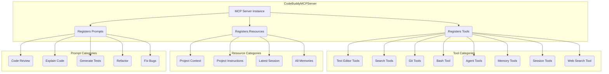

# tests — mcp

The `tests/mcp` module contains comprehensive unit and integration tests for the Model Context Protocol (MCP) client and server implementations within the CodeBuddy project. These tests are crucial for ensuring the reliability, correctness, and adherence to the MCP specification for both interacting with external MCP servers and exposing CodeBuddy's internal capabilities as an MCP server.

This documentation will cover:
*   The purpose and scope of the tests.
*   The key components under test: `MCPManager`, `MCPClient`, and `CodeBuddyMCPServer`.
*   Specific areas of functionality validated by the tests.
*   Common mocking strategies employed.

## Purpose and Scope

The tests in this module validate the core functionality of CodeBuddy's MCP integration:

1.  **Client-side Interaction (`client.test.ts`)**: Ensures CodeBuddy can correctly connect to, manage, and interact with external MCP servers using both the modern SDK-based `MCPManager` and the legacy `MCPClient`. This includes server lifecycle, tool discovery, tool execution, error handling, and health checks.
2.  **Server-side Exposure (`mcp-server.test.ts`, `mcp-agent-server.test.ts`)**: Verifies that `CodeBuddyMCPServer` correctly registers and exposes CodeBuddy's internal tools (e.g., file editing, Git, Bash), agent intelligence capabilities (e.g., chat, task planning), memory, sessions, and project context as MCP tools, resources, and prompts. It also validates the server's lifecycle and the schemas of its exposed APIs.

These tests collectively guarantee that CodeBuddy can seamlessly integrate with the MCP ecosystem, both as a consumer of external tools and as a provider of its own intelligent services.

## MCP Client Tests (`client.test.ts`)

`client.test.ts` focuses on testing how CodeBuddy interacts with external MCP servers. It covers two distinct client implementations: `MCPManager` (the recommended SDK-based approach) and `MCPClient` (a legacy, manual client).

### `MCPManager` (SDK-based Client)

The `MCPManager` is designed to manage multiple MCP server connections using the `@modelcontextprotocol/sdk/client` library. Its tests cover:

*   **Initialization & Lifecycle**:
    *   `addServer`: Connects to a server using various transport configurations (e.g., `stdio`, `http`), including legacy top-level `command`/`args` support. It verifies that `createTransport` and the SDK's `Client.connect` are called.
    *   `removeServer`: Disconnects clients, closes transports, and removes associated tools.
    *   `shutdown` / `dispose`: Ensures all servers are disconnected and resources (like event listeners) are cleaned up.
*   **Tool Discovery & Execution**:
    *   Tools discovered from a server are registered with a prefixed name (e.g., `mcp__server-name__tool_name`) to avoid conflicts.
    *   `callTool`: Correctly routes tool calls to the appropriate server, translating the prefixed name back to the original tool name for the SDK.
    *   Error handling for missing tools or disconnected servers.
*   **Server Status & Health**:
    *   `getServerStatus`, `getTransportType`, `getServers`: Provide accurate information about managed servers.
    *   Health checks: Verifies that `MCPManager` periodically calls `listTools` on connected servers to ensure they are responsive and stops checks when servers are removed.
    *   Error events: Emits `serverError` on connection or health check failures.

### `MCPClient` (Legacy Manual Client)

The `MCPClient` represents an older, more manual way of interacting with MCP servers, primarily via `stdio` transport and `child_process`. Its tests validate:

*   **Configuration Management**:
    *   `loadConfig`: Reads server configurations from project-level `.codebuddy` files, handling various scenarios like missing files, invalid JSON, or malformed data.
    *   `saveConfig`: Writes server configurations, including directory creation if necessary, and handles write failures.
*   **Connection Lifecycle**:
    *   `connect`: Spawns a child process for the server, performs the MCP initialization handshake, and emits `server-connected` events.
    *   `disconnect` / `disconnectAll`: Terminates server processes and emits `server-disconnected` events.
*   **Tool Discovery & Execution**:
    *   `getAllTools`: Discovers tools from connected servers by simulating server responses to `tools/list` requests.
    *   `callTool`: Sends tool execution requests to the correct server process and parses responses.
*   **Utility Functions**: `getConnectedServers`, `isConnected`, `formatStatus` provide accurate server information.
*   **Singleton Pattern**: `getMCPClient` and `resetMCPClient` ensure the client operates as a singleton and can be reset for testing purposes.

### Common Mocking Strategies

`client.test.ts` heavily relies on mocking to isolate the client logic:

*   **Logger**: All `../../src/utils/logger` methods are mocked to prevent console spam and allow assertion of log calls.
*   **MCP SDK (`@modelcontextprotocol/sdk/client`)**: The `Client` class is mocked to control `listTools`, `callTool`, `connect`, and `close` behavior, simulating server responses and errors.
*   **Transports (`../../src/mcp/transports`)**: `createTransport` is mocked to return controlled `connect` and `disconnect` promises.
*   **Child Process (`child_process`)**: `spawn` is mocked to return a custom `EventEmitter` (`spawnedProcess`) that simulates `stdin`, `stdout`, and `stderr` events, allowing precise control over the server's I/O.
*   **File System (`fs`)**: `existsSync`, `readFileSync`, `writeFileSync`, `mkdirSync` are mocked to control config file loading and saving without actual disk access.

## MCP Server Tests (`mcp-server.test.ts`, `mcp-agent-server.test.ts`)

These two test files collectively validate the `CodeBuddyMCPServer`, which exposes CodeBuddy's internal capabilities as an MCP server.

### `CodeBuddyMCPServer` (Core Tools - `mcp-server.test.ts`)

`mcp-server.test.ts` focuses on the fundamental aspects of `CodeBuddyMCPServer`, particularly the registration and execution of its core development tools.

*   **Tool Definitions (`getToolDefinitions`)**:
    *   Verifies that `CodeBuddyMCPServer.getToolDefinitions()` returns a complete list of all 15 expected tools (7 core tools + 8 agent/intelligence tools).
    *   Ensures each tool has a description and a well-defined `inputSchema`.
*   **Tool Schema Validation**:
    *   Tests the `inputSchema` for each core tool (e.g., `read_file`, `write_file`, `edit_file`, `bash`, `search_files`, `list_files`, `git`).
    *   Confirms required parameters and correct data types (e.g., `path` for file operations, `command` for `bash`, `subcommand` with enum for `git`).
*   **Tool Execution Mapping**:
    *   Accesses the internally registered tool handlers (via a mock of `McpServer`) to directly invoke them.
    *   Verifies that each MCP tool call correctly maps to the corresponding CodeBuddy internal tool method (e.g., `read_file` calls `TextEditorTool.view`, `git` subcommands map to `GitTool` methods).
    *   Checks that arguments are correctly passed and results are formatted as expected.
    *   Includes tests for error conditions, such as missing required arguments for `git commit` or `git checkout`.
*   **Server Lifecycle**:
    *   `start()`: Ensures the server can be started successfully and sets its running status.
    *   `stop()`: Verifies the server can be stopped, cleaning up resources.
    *   Handles edge cases like starting an already running server or stopping a non-running server.

### `CodeBuddyMCPServer` (Agent & Intelligence Layer - `mcp-agent-server.test.ts`)

`mcp-agent-server.test.ts` extends the server testing to cover the integration of CodeBuddy's AI agent, memory, session management, and web search capabilities as MCP tools, resources, and prompts.

*   **Tool Registration**:
    *   Confirms the registration of 8 agent-related tools: `agent_chat`, `agent_task`, `agent_plan`, `memory_search`, `memory_save`, `session_list`, `session_resume`, `web_search`.
*   **Resource Registration**:
    *   Verifies the registration of 4 resources: `project_context`, `project_instructions`, `sessions_latest`, `memory_all`, each with its specific `codebuddy://` URI.
*   **Prompt Registration**:
    *   Ensures 5 prompts are registered: `code_review`, `explain_code`, `generate_tests`, `refactor`, `fix_bugs`.
*   **Agent Tool Handlers**:
    *   `agent_chat`: Tests interaction with `CodeBuddyAgent.processUserMessage`.
    *   `agent_task`: Validates conditional use of `processUserMessage` or `executePlan` based on `needsOrchestration`.
    *   `agent_plan`: Tests plan generation without execution.
    *   Includes error handling for agent failures.
*   **Memory Tool Handlers**:
    *   `memory_search`: Maps to `searchAndRetrieve` and formats results.
    *   `memory_save`: Maps to `getMemoryManager().remember`, passing category and scope.
*   **Session Tool Handlers**:
    *   `session_list`: Maps to `getSessionStore().getRecentSessions`.
    *   `session_resume`: Maps to `getSessionStore().loadSession`.
*   **Web Search Tool Handler**:
    *   `web_search`: Maps to `WebSearchTool.search`, passing query and provider options.
*   **Resource Handlers**:
    *   Tests that `project_context`, `project_instructions`, `sessions_latest`, and `memory_all` handlers return correctly formatted content, including JSON for sessions.
*   **Prompt Handlers**:
    *   Validates that prompt handlers (e.g., `code_review`, `explain_code`) generate appropriate `PromptMessage` structures with correct content based on input parameters.
*   **Agent Lazy Initialization**:
    *   Crucially, tests that the `CodeBuddyAgent` is *not* initialized on `CodeBuddyMCPServer` construction but only on the *first call* to an agent-related tool.
    *   Verifies that agent initialization fails if no API key is configured.
*   **Concurrency Lock**:
    *   Tests that concurrent calls to agent tools are serialized using an internal lock, ensuring only one agent operation runs at a time.
*   **`formatAgentResponse` Utility**:
    *   Tests the utility function for formatting various agent message types (assistant, tool call/result, reasoning) into a human-readable string.
*   **Agent Cleanup**:
    *   Ensures `CodeBuddyAgent.dispose()` is called when the `CodeBuddyMCPServer` is stopped, cleaning up agent resources.

### Common Mocking Strategies

Both server test files employ extensive mocking:

*   **All CodeBuddy Tools**: `TextEditorTool`, `SearchTool`, `GitTool`, `BashTool`, `WebSearchTool` are mocked to control their method return values and assert calls.
*   **Agent Components**: `CodeBuddyAgent`, `ConfirmationService`, `searchAndRetrieve`, `getMemoryManager`, `getSessionStore`, `loadContext`, `formatContextForPrompt` are all mocked to isolate the server's integration logic.
*   **MCP SDK (`@modelcontextprotocol/sdk/server`)**: `McpServer` and `StdioServerTransport` are mocked to prevent actual server startup and allow inspection of registered tools, resources, and prompts. The mock `McpServer` exposes internal maps (`_registeredTools`, etc.) to allow tests to retrieve and invoke the registered handlers directly.

## Architecture Overview of `CodeBuddyMCPServer` Registrations

The `CodeBuddyMCPServer` acts as a facade, registering various CodeBuddy functionalities with the underlying MCP SDK.

This diagram illustrates how the `CodeBuddyMCPServer` orchestrates the exposure of CodeBuddy's capabilities through the MCP. Each box represents a category of functionality that is registered with the MCP server, making it discoverable and callable by MCP clients.

## Relationship to Production Code

These tests directly validate the behavior of the following production modules:

*   `src/mcp/client.ts`: Implements `MCPManager`.
*   `src/mcp/mcp-client.ts`: Implements `MCPClient` and its singleton.
*   `src/mcp/mcp-server.ts`: Implements `CodeBuddyMCPServer`.
*   `src/mcp/mcp-agent-tools.ts`: Defines agent-related MCP tools, resources, and prompts, and the `formatAgentResponse` utility.
*   `src/mcp/types.ts`: Defines shared MCP types.
*   `src/mcp/transports.ts`: Provides transport creation logic.
*   Various `src/tools/*` modules (e.g., `text-editor`, `search`, `git-tool`, `bash`) whose methods are exposed as MCP tools.
*   `src/agent/codebuddy-agent.ts`: The core AI agent, whose methods are exposed via MCP tools.
*   `src/memory/semantic-memory-search.ts`, `src/memory/persistent-memory.ts`: Memory management, exposed via MCP tools and resources.
*   `src/persistence/session-store.ts`: Session management, exposed via MCP tools and resources.
*   `src/context/context-files.ts`: Project context loading, exposed via MCP resources.

By thoroughly testing these components, the `tests/mcp` module ensures that CodeBuddy's integration with the Model Context Protocol is robust, functional, and correctly exposes its powerful features to other MCP-compatible clients.