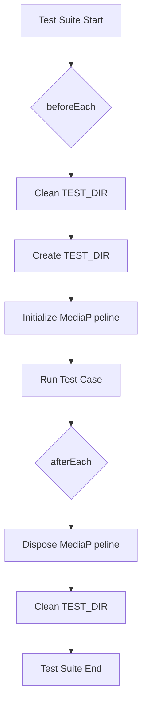

# tests — media

This document describes the `tests/media/media-pipeline.test.ts` module, which contains the comprehensive test suite for the `MediaPipeline` class. Its primary purpose is to ensure the robustness, correctness, and expected behavior of the media processing and management functionalities provided by `MediaPipeline`.

## Module Purpose

The `media-pipeline.test.ts` module serves as the validation layer for the `MediaPipeline` class located in `src/media/media-pipeline.ts`. It employs a series of unit and integration tests to cover various aspects of media file handling, including type detection, ingestion, storage management, lifecycle hooks, and cleanup.

By running these tests, developers can confirm that:
*   Media files are correctly identified and processed.
*   Resource limits (file size, total storage) are enforced.
*   Temporary files are managed and cleaned up effectively.
*   Custom processing hooks can be registered and executed.
*   The `MediaPipeline` instance behaves predictably throughout its lifecycle.

## Test Environment Setup

The tests utilize a dedicated temporary directory structure to isolate test runs and prevent interference with the actual file system.

*   **`TEST_DIR`**: `__test-tmp__` within the test file's directory. This is the root for all temporary files created during tests.
*   **`TEMP_DIR`**: `__test-tmp__/pipeline-tmp`. This is the specific directory where `MediaPipeline` stores its ingested files.
*   **`createTestFile(name, sizeBytes)`**: A utility function to quickly create dummy files within `TEST_DIR` for testing ingestion scenarios.

**Lifecycle Hooks (`beforeEach`, `afterEach`)**:
*   **`beforeEach`**:
    *   Ensures `TEST_DIR` is clean by recursively removing it if it exists.
    *   Recreates `TEST_DIR` and its subdirectories.
    *   Initializes a new `MediaPipeline` instance with specific configuration:
        *   `tempDir`: `TEMP_DIR`
        *   `maxFileSizeMb`: 1 MB
        *   `maxTotalSizeMb`: 2 MB
        *   `autoCleanupMs`: 60 seconds
*   **`afterEach`**:
    *   Calls `pipeline.dispose()` to ensure all temporary files managed by the pipeline are removed.
    *   Recursively removes `TEST_DIR` to clean up any remaining test artifacts.

## Core Functionality Tested

The tests are organized into `describe` blocks, each focusing on a specific method or aspect of the `MediaPipeline` class.

### `detectType`

This suite verifies the static method `MediaPipeline.detectType(path)`, which infers a generic `MediaType` (e.g., 'image', 'audio', 'video', 'document', 'unknown') based on the file extension.

*   **Verification**: Uses `it.each` to test a wide range of common file extensions (e.g., `.png`, `.mp3`, `.mp4`, `.pdf`, `.xyz`) and asserts that the correct `MediaType` is returned.

### `detectMimeType`

Similar to `detectType`, this suite tests the static method `MediaPipeline.detectMimeType(path)`, which infers the standard MIME type (e.g., 'image/png', 'audio/mpeg') from the file extension.

*   **Verification**: Employs `it.each` to check various extensions and their corresponding expected MIME types, including a fallback to `application/octet-stream` for unknown types.

### `ingest`

This is a critical suite, testing the `pipeline.ingest(srcPath)` method responsible for bringing external files into the pipeline's management.

*   **Successful Ingestion**: Verifies that a valid source file is copied to the `TEMP_DIR`, and the returned object is a `MediaFile` with correct `id`, `type`, `mimeType`, `sizeBytes`, and `tempPath`.
*   **Error Handling**:
    *   Asserts that ingesting a non-existent file returns an error object.
    *   Confirms that files exceeding `maxFileSizeMb` are rejected with an appropriate error message.
    *   Tests the `maxTotalSizeMb` limit, ensuring that subsequent ingestions are rejected once the total managed size is exceeded.
*   **Event Emission**: Uses `jest.fn()` to verify that the `ingested` event is emitted upon successful file ingestion, passing the `MediaFile` object as an argument.

### `get`

Tests the `pipeline.get(id)` method for retrieving a `MediaFile` by its unique identifier.

*   **Retrieval**: Verifies that a previously ingested file can be retrieved using its ID, and the returned object matches the original `MediaFile`.
*   **Unknown ID**: Asserts that `undefined` is returned for non-existent IDs.

### `list`

This suite checks the `pipeline.list(type?)` method, which provides a way to enumerate managed files.

*   **All Files**: Verifies that `list()` without arguments returns all currently managed `MediaFile` objects.
*   **Filtered by Type**: Asserts that `list(type)` correctly filters files by their `MediaType` (e.g., `list('image')`).

### `remove`

Tests the `pipeline.remove(id)` method, which deletes a managed file from the pipeline and the file system.

*   **Successful Removal**: Verifies that `remove()` returns `true` for a valid ID, the file is no longer retrievable via `get()`, its temporary file is deleted from disk, and the `totalSize` tracked by the pipeline is updated.
*   **Unknown ID**: Asserts that `remove()` returns `false` for non-existent IDs.

### `hooks`

This suite validates the mechanism for registering and processing custom logic via `MediaPipelineHook`s.

*   **Hook Registration and Execution**:
    *   Registers hooks for different `mediaTypes`.
    *   Verifies that `pipeline.processHooks(fileId)` correctly identifies and executes only the hooks matching the `MediaType` of the specified file.
    *   Asserts that the results of the `process` function are returned.
*   **Unknown File**: Confirms that `processHooks()` returns an empty array for non-existent file IDs.
*   **Nullable Hooks**: Ensures that hooks returning `null` are filtered out from the results.

### `cleanup`

Tests the `pipeline.cleanup()` method, which removes files that have exceeded their `autoCleanupMs` retention period.

*   **Expired File Removal**:
    *   Ingests a file.
    *   Manually backdates the `createdAt` timestamp of the ingested file to simulate expiration.
    *   Initializes a new pipeline (to avoid interfering with the main test pipeline's state) and transfers the expired file reference.
    *   Calls `cleanup()` and asserts that the expired file is removed and the count of removed files is correct.

### `dispose`

This suite verifies the `pipeline.dispose()` method, which is responsible for cleaning up all resources managed by the pipeline.

*   **Full Cleanup**:
    *   Ingests a file.
    *   Calls `dispose()`.
    *   Asserts that the temporary file is removed from disk, `pipeline.list()` returns an empty array, and `pipeline.getTotalSize()` is zero.

## Connections to the Codebase

This test module directly interacts with:
*   `../../src/media/media-pipeline.js`: The `MediaPipeline` class, `MediaFile` interface, and `MediaType` enum are imported and thoroughly tested.
*   `fs` and `path` (Node.js built-in modules): Used for creating, writing, checking existence, and removing files and directories in the test environment.
*   `jest`: The testing framework providing `describe`, `it`, `expect`, `beforeEach`, `afterEach`, and `jest.fn()`.