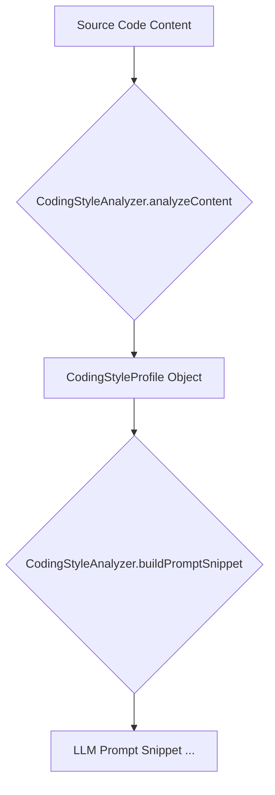

# tests — memory

The `tests/memory` module contains unit and integration tests for the core memory components of the Code Buddy agent. These components are crucial for the agent's ability to understand project context, learn coding styles, and retain architectural decisions across sessions.

This documentation covers the functionality of the modules being tested, as inferred from their respective test suites.

---

## 1. `CodingStyleAnalyzer`

The `CodingStyleAnalyzer` is responsible for detecting and profiling the coding style conventions used within a codebase. This allows the agent to adapt its code generation to match the existing project style, ensuring consistency.

### Purpose

To automatically identify common coding style patterns (e.g., quote style, indentation, naming conventions, import styles) from source code content and format this information for use in LLM prompts.

### Key Concepts

*   **`CodingStyleProfile`**: An object representing the detected style characteristics of a given code snippet or project. It includes properties like:
    *   `quoteStyle`: `'single'` or `'double'`
    *   `semicolons`: `true` or `false`
    *   `indentation`: `'2-spaces'`, `'4-spaces'`, or `'tabs'`
    *   `importStyle`: `{ style: 'named' | 'default', extensionsInImports: boolean, usesBarrelFiles: boolean }`
    *   `namingConventions`: Array of `{ scope: 'variable' | 'class' | 'constant', convention: 'camelCase' | 'PascalCase' | 'SCREAMING_SNAKE', confidence: number }`
    *   `errorHandlingPattern`: `'try-catch'` or `'promise-catch'`
    *   `testingPattern`: `'describe-it'` or `'test-only'`
    *   `typeAnnotationDensity`: `'strict'` or `'minimal'`

### Core Functionality

#### `analyzeContent(content: string, filename: string): CodingStyleProfile`

This is the primary method for analyzing a single file's content. It takes the source code as a string and the filename (which can influence certain detections, e.g., test file patterns) and returns a `CodingStyleProfile` object.

**Example Usage (from tests):**

```typescript
const analyzer = new CodingStyleAnalyzer();
const content = `const name = 'hello';`;
const result = analyzer.analyzeContent(content, 'test.ts');
expect(result.quoteStyle).toBe('single');
```

The analyzer can detect:
*   Quote style (single/double)
*   Semicolon usage (present/absent)
*   Indentation (2-spaces, 4-spaces, tabs)
*   Import styles (named/default, with/without `.js` extensions)
*   Naming conventions for variables, classes, and constants (camelCase, PascalCase, SCREAMING_SNAKE)
*   Error handling patterns (try-catch, promise-catch)
*   Testing patterns (describe/it, test-only)
*   Type annotation density (strict/minimal)
*   It gracefully handles empty or whitespace-only content, returning an empty profile.

#### `buildPromptSnippet(profile: CodingStyleProfile): string`

This method takes a `CodingStyleProfile` object and formats it into a human-readable string, wrapped in `<coding_style>` XML tags, suitable for inclusion in an LLM prompt. This allows the agent to be explicitly aware of the project's style guidelines.

**Example Output Snippet:**

```xml
<coding_style>
Project coding conventions (auto-detected):
- Quotes: single quotes
- Semicolons: yes
- Indentation: 2 spaces
- Imports: named imports with .js extensions
- Naming:
  - camelCase for variables
  - PascalCase for classs
- Error handling: try-catch
- Testing: describe/it blocks
</coding_style>
```

#### Singleton Management

The `CodingStyleAnalyzer` is managed as a singleton to ensure consistent state and avoid redundant initialization.

*   `getCodingStyleAnalyzer(): CodingStyleAnalyzer`: Returns the singleton instance.
*   `resetCodingStyleAnalyzer(): void`: Resets the singleton instance, useful for testing or re-initialization.

### Architecture



---

## 2. `DecisionMemory`

The `DecisionMemory` module is designed to capture, store, and recall architectural and design decisions made during the agent's operation. This allows the agent to maintain context and consistency in its choices over time.

### Purpose

To enable the AI agent to explicitly record and retrieve significant decisions, their rationale, alternatives, and context, making these decisions available for future reasoning and prompt generation.

### Key Concepts

*   **`Decision`**: A structured object representing a single architectural or design choice. It includes:
    *   `id`: Unique identifier for the decision.
    *   `timestamp`: When the decision was recorded.
    *   `choice`: The chosen option (e.g., "Use PostgreSQL").
    *   `alternatives`: Other options considered (e.g., `['MySQL', 'SQLite']`).
    *   `rationale`: The reasoning behind the choice.
    *   `context`: The specific area or problem the decision addresses.
    *   `confidence`: A numerical value (0-1) indicating the certainty of the decision.
    *   `tags`: Keywords for categorization and retrieval (e.g., `['database', 'backend']`).

### Core Functionality

#### `extractDecisions(input: string): { decisions: Decision[], rawText: string }`

This method parses raw text (typically LLM output) to identify and extract structured decision blocks. Decisions are expected to be formatted within `<decision>` XML tags, with sub-tags for `choice`, `alternatives`, `rationale`, `context`, `confidence`, and `tags`. It generates a unique ID and timestamp for each extracted decision.

**Example Input (from tests):**

```xml
<decision>
  <choice>Use PostgreSQL</choice>
  <alternatives>MySQL, SQLite</alternatives>
  <rationale>Better JSON support</rationale>
  <context>Database selection</context>
  <confidence>0.85</confidence>
  <tags>database, backend</tags>
</decision>
```

*   Handles multiple decision blocks.
*   Gracefully handles missing optional tags, providing default values (e.g., empty arrays for alternatives/tags, 0.5 for confidence).
*   Clamps confidence values to the 0-1 range.
*   Skips malformed blocks or those missing a `<choice>` tag.

#### `persistDecisions(decisions: Decision[]): Promise<void>`

Takes an array of `Decision` objects and stores them in the underlying `EnhancedMemory` system. Each decision is stored as a memory item with `type: 'decision'` and relevant tags.

#### `findRelevantDecisions(query: string, limit: number = 5): Promise<Decision[]>`

Queries the `EnhancedMemory` for decisions relevant to the given `query`. It retrieves memory items of `type: 'decision'` and maps them back into `Decision` objects.

#### `buildDecisionContext(query: string): Promise<string | null>`

This method combines `findRelevantDecisions` with formatting. It queries for relevant decisions and, if any are found, formats them into an XML block (`<decisions_context>...</decisions_context>`) suitable for inclusion in an LLM prompt. If no relevant decisions are found, it returns `null`.

**Example Output Snippet:**

```xml
<decisions_context>
  <decision>
    <choice>Use REST</choice>
    <alternatives>GraphQL, gRPC</alternatives>
    <rationale>Simplicity</rationale>
    <context>API design</context>
    <confidence>0.8</confidence>
  </decision>
</decisions_context>
```

#### `getDecisionPromptEnhancement(): string`

Returns a string containing instructions for the LLM on how to format new decisions using the `<decision>` XML structure. This guides the LLM to produce parsable output.

### Integration with `EnhancedMemory`

`DecisionMemory` relies heavily on `EnhancedMemory` for its persistence and retrieval capabilities. It acts as an abstraction layer, translating structured `Decision` objects into generic memory items for storage and vice-versa.

```mermaid
graph TD
    A[LLM Output (Raw Text)] --> B{DecisionMemory.extractDecisions}
    B --> C[Decision Objects]
    C --> D{DecisionMemory.persistDecisions}
    D -- Stores --> E[EnhancedMemory]

    F[User Query] --> G{DecisionMemory.findRelevantDecisions}
    G -- Recalls from --> E
    E --> H[Memory Items]
    H --> I[Decision Objects]
    I --> J{DecisionMemory.buildDecisionContext}
    J --> K[LLM Prompt Context <decisions_context>...</decisions_context>]
```

### Singleton Management

Similar to `CodingStyleAnalyzer`, `DecisionMemory` is managed as a singleton.

*   `getDecisionMemory(): DecisionMemory`: Returns the singleton instance.
*   `resetDecisionMemory(): void`: Resets the singleton instance.

---

## 3. `PersistentMemoryManager`

The `PersistentMemoryManager` provides a simple, file-based key-value store for general project and user-specific information. This allows the agent to remember arbitrary facts, configurations, or preferences across different runs.

### Purpose

To store and retrieve simple key-value pairs persistently in Markdown files, categorized by scope (project/user) and optionally by category, making this information available to the agent.

### Key Concepts

*   **Memory Scope**: Memories can be stored in two scopes:
    *   `project`: Specific to the current project (e.g., build commands, framework choices). Stored in `project_memory.md`.
    *   `user`: General preferences or facts about the user (e.g., preferred indentation, API keys). Stored in `user_memory.md`.
*   **Memory Category**: Within each scope, memories can be further organized into Markdown headings (e.g., "Project Context", "User Preferences").
*   **Markdown Storage**: Memories are stored as bullet points in Markdown files, making them human-readable and easily editable.

### Core Functionality

#### `initialize(): Promise<void>`

Ensures that the `project_memory.md` and `user_memory.md` files exist at their configured paths. If they don't, it creates them with a basic template structure.

#### `remember(key: string, value: string, options: { scope: 'project' | 'user', category?: string }): Promise<void>`

Stores a `key-value` pair in the specified `scope` and optional `category`. If the key already exists, its value is updated. The memory is written to the corresponding Markdown file.

**Example:**

```typescript
await manager.remember('build-cmd', 'npm run build', { scope: 'project', category: 'Project Context' });
```

#### `recall(key: string): string | null`

Retrieves the value associated with a given `key` from either the project or user memory. Returns `null` if the key is not found.

#### `forget(key: string, scope: 'project' | 'user'): Promise<boolean>`

Removes a `key-value` pair from the specified `scope`. Returns `true` if the memory was found and deleted, `false` otherwise.

#### `getRelevantMemories(keyword: string): { key: string, value: string, scope: 'project' | 'user' }[]`

Searches through all stored memories (both project and user) and returns an array of memory objects whose `key` or `value` contains the specified `keyword`.

#### `getContextForPrompt(): string`

Aggregates all stored memories (project and user) into a single formatted string, wrapped in `--- PERSISTENT MEMORY ---` delimiters, suitable for inclusion in an LLM prompt. This provides the LLM with a comprehensive overview of known facts.

**Example Output Snippet:**

```
--- PERSISTENT MEMORY ---
Project Context:
- framework: React
User Preferences:
- indent: 2 spaces
--- END PERSISTENT MEMORY ---
```

### Architecture

```mermaid
graph TD
    A[PersistentMemoryManager] --> B{initialize}
    B --> C[project_memory.md]
    B --> D[user_memory.md]

    E[remember(key, value, scope, category)] --> A
    A -- Writes to --> C
    A -- Writes to --> D

    F[recall(key)] --> A
    A -- Reads from --> C
    A -- Reads from --> D
    A --> G[Value | null]

    H[getContextForPrompt] --> A
    A -- Reads all from --> C
    A -- Reads all from --> D
    A --> I[Formatted Prompt String]
```