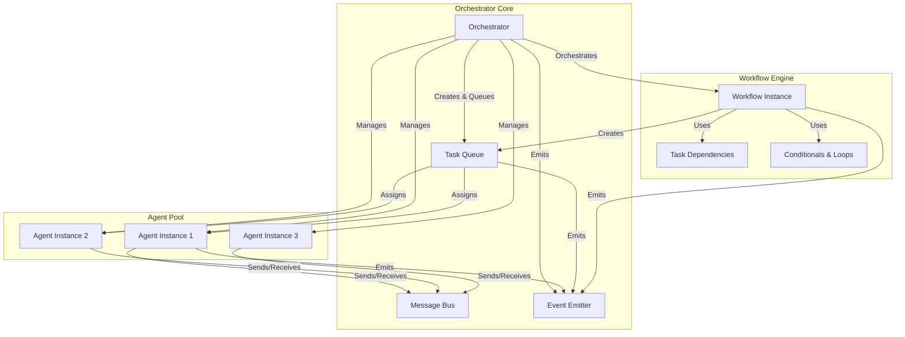

# tests — orchestration

This document provides a comprehensive overview of the multi-agent orchestration system, as defined and validated by the `tests/orchestration/orchestrator.test.ts` module. While this file is a test suite, it effectively serves as a living specification, outlining the core components, their interactions, and the expected behaviors of the orchestration engine.

Developers looking to understand, extend, or contribute to the orchestration logic should treat this test suite as the primary source of truth for system design and functionality.

## 1. Purpose of the Module

The `orchestrator.test.ts` module defines the fundamental principles and expected behaviors of a multi-agent orchestration system. It covers:

*   **Agent Management**: How agents are registered, their states, and how they are matched to tasks.
*   **Task Management**: The lifecycle of tasks, including creation, queuing, prioritization, assignment, completion, and retry mechanisms.
*   **Workflow Execution**: The structure and execution flow of complex, multi-step workflows, including dependencies, conditionals, and parallel processing.
*   **Inter-Agent Communication**: Mechanisms for agents to send and receive messages, including broadcast capabilities.
*   **System Observability**: Tracking of operational statistics and emission of lifecycle events.
*   **Default Components**: Specification of pre-defined agents and workflow templates.

This test suite acts as a blueprint, detailing the conceptual models and interactions that the actual orchestration implementation must adhere to.

## 2. Key Orchestration Capabilities

The tests are organized into logical `describe` blocks, each focusing on a distinct aspect of the orchestration system.

### 2.1. Agent Management

This section defines how agents are managed within the system.

*   **Registration**: Agents are registered with a unique `id` and a `definition` that includes `name`, `role`, `description`, and `capabilities` (e.g., `tools`, `maxConcurrency`, `taskTypes`). An `AgentInstance` tracks its `status` (e.g., `'idle'`, `'busy'`), `completedTasks`, `failedTasks`, and timestamps.
    *   **Prevention of Duplicates**: The system prevents registering agents with an already existing `id`.
*   **Unregistration**: Only `'idle'` agents can be unregistered. Busy agents cannot be removed.
*   **Availability**: The system can find an available agent based on its `status` and `definition.role` matching a task's `requiredRole`. If no suitable agent is available, the search returns null/undefined.

**Agent Instance Structure (Conceptual)**:
```typescript
interface AgentDefinition {
  id: string;
  name: string;
  role: string; // e.g., 'coder', 'researcher'
  description: string;
  capabilities: {
    tools: string[]; // e.g., 'file_write', 'web_search'
    maxConcurrency: number;
    taskTypes: string[]; // e.g., 'coding', 'research'
  };
}

interface AgentInstance {
  definition: AgentDefinition;
  status: 'idle' | 'busy' | 'waiting';
  completedTasks: number;
  failedTasks: number;
  createdAt: Date;
  lastActivity: Date;
  currentTask?: string; // ID of the task currently assigned
}
```

### 2.2. Task Management

This section details the lifecycle and properties of tasks.

*   **Creation**: Tasks are created with a `definition` (including `id`, `type`, `name`, `description`, `input`, `priority`, `maxRetries`, `dependsOn`, `requiredRole`) and an initial `status` of `'pending'`.
*   **Queuing**: Tasks transition from `'pending'` to `'queued'` and are added to a processing queue.
*   **Priority Ordering**: The queue maintains tasks in priority order, using `PRIORITY_WEIGHTS` (critical > high > medium > low) to sort.
*   **Assignment**: A `'queued'` task can be assigned to an `'idle'` agent. Upon assignment, the task's `status` becomes `'assigned'`, `assignedAgent` is set, and the agent's `status` becomes `'busy'`, with `currentTask` updated.
*   **Completion**: A task in `'in_progress'` can be marked `'completed'`, with its `output` and `completedAt` timestamp recorded.
*   **Retries**: If a task fails, it can be retried by transitioning back to `'queued'`, incrementing its `retries` count, provided `retries` is less than `definition.maxRetries`.
*   **Failure**: If `retries` reaches `definition.maxRetries`, the task's `status` becomes `'failed'`, and an `error` message is recorded.

**Task Instance Structure (Conceptual)**:
```typescript
interface TaskDefinition {
  id: string;
  type: string; // e.g., 'coding', 'research'
  name: string;
  description: string;
  input: Record<string, unknown>;
  priority: 'critical' | 'high' | 'medium' | 'low';
  maxRetries: number;
  dependsOn?: string[]; // IDs of tasks that must complete first
  requiredRole?: string; // Role of agent required for this task
}

interface TaskInstance {
  definition: TaskDefinition;
  status: 'pending' | 'queued' | 'assigned' | 'in_progress' | 'completed' | 'failed';
  retries: number;
  createdAt: Date;
  assignedAgent?: string; // ID of the assigned agent
  output?: Record<string, unknown>;
  completedAt?: Date;
  error?: string;
}
```

### 2.3. Task Dependencies

Tasks can declare dependencies on other tasks.

*   **Dependency Check**: A task can only proceed if all tasks listed in its `definition.dependsOn` array have a `status` of `'completed'`.
*   **Blocking**: Tasks with incomplete dependencies remain blocked until all prerequisites are met.

### 2.4. Workflow Execution

Workflows orchestrate sequences of tasks and logic.

*   **Workflow Instance Creation**: A `WorkflowDefinition` (with `id`, `name`, `description`, `steps`) is instantiated into a `WorkflowInstance`, which tracks its `instanceId`, `status` (e.g., `'pending'`), `input`, `completedSteps`, and associated `tasks`.
*   **Sequential Steps**: Workflows can execute steps in a defined order, ensuring each step completes before the next begins.
*   **Parallel Branches**: Workflows support parallel execution of independent branches, typically managed using `Promise.all` or similar concurrency primitives.
*   **Conditional Steps**: Workflow steps can be executed conditionally based on evaluating expressions against a `context`. The `evaluateCondition` helper function demonstrates this logic.
*   **Loop Steps**: Workflows can include looping constructs, allowing steps to repeat based on a condition or iteration count.
*   **Variable Resolution**: Task inputs within a workflow can reference variables from the workflow's `context` (e.g., `$feature`, `$codebase`), which are resolved before task execution.

**Workflow Instance Structure (Conceptual)**:
```typescript
interface WorkflowDefinition {
  id: string;
  name: string;
  description: string;
  steps: any[]; // Array of step definitions (can be complex: task, conditional, parallel, loop)
}

interface WorkflowInstance {
  definition: WorkflowDefinition;
  instanceId: string;
  status: 'pending' | 'in_progress' | 'completed' | 'failed';
  input: Record<string, unknown>;
  completedSteps: string[]; // IDs of completed steps
  tasks: Map<string, TaskInstance>; // Tasks created by this workflow
  startedAt: Date;
  // ... other context/state for conditionals, loops
}
```

### 2.5. Inter-Agent Messaging

The system facilitates communication between agents.

*   **Message Sending**: Agents can send messages, which are added to a `messageQueue`. Messages include `id`, `type`, `from`, `to` (recipient agent ID or `null` for broadcast), `content`, and `timestamp`.
*   **Message Filtering**: Agents can filter messages from the queue, retrieving those specifically addressed to them (`m.to === agentId`) or broadcast messages (`m.to === null`).
*   **Broadcast**: Messages with `to: null` are considered broadcast messages and are intended for all agents (excluding the sender).

**Message Structure (Conceptual)**:
```typescript
interface Message {
  id: string;
  type: string; // e.g., 'task_request', 'status_update'
  from: string; // Sender agent ID
  to: string | null; // Recipient agent ID, or null for broadcast
  content: Record<string, unknown>;
  timestamp: Date;
}
```

### 2.6. System Observability (Statistics & Events)

The orchestrator provides mechanisms for monitoring its operation.

*   **Statistics**:
    *   **Completed Tasks**: Tracks the total number of completed tasks and their aggregate duration to calculate average duration.
    *   **Throughput**: Calculates the rate of completed tasks over a given time period (e.g., tasks per minute).
    *   **Agent States**: Counts agents in different `status` states (e.g., `'idle'`, `'busy'`, `'waiting'`).
*   **Events**: The system emits events for key lifecycle changes, allowing external systems or monitoring tools to react.
    *   **Agent Lifecycle**: `agent_created`, `agent_status_changed`, `agent_destroyed`.
    *   **Task Lifecycle**: `task_created`, `task_assigned`, `task_completed`.
    *   **Workflow Lifecycle**: `workflow_started`, `workflow_step_completed`, `workflow_completed`.

## 3. Pre-defined Components

The system comes with a set of default agents and workflow templates to provide immediate utility and demonstrate capabilities.

### 3.1. Default Agents

*   **Coordinator**: `role: 'coordinator'`, `capabilities: { tools: ['task_create', 'task_assign'] }`. Responsible for overall task and workflow management.
*   **Researcher**: `role: 'researcher'`, `capabilities: { tools: ['web_search', 'file_read'] }`. Specializes in information gathering.
*   **Coder**: `role: 'coder'`, `capabilities: { tools: ['file_write', 'file_edit'] }`. Specializes in code generation and modification.

### 3.2. Workflow Templates

*   **Code Review**: `id: 'code-review'`, `steps: ['analyze', 'review', 'summarize']`.
*   **Feature Implementation**: `id: 'feature-implementation'`, `steps: ['plan', 'implement', 'test', 'review', 'document']`.
*   **Bug Fix**: `id: 'bug-fix'`, `steps: ['investigate', 'fix', 'verify']`.

These templates provide reusable patterns for common development tasks.

## 4. Architectural Overview

The orchestration system revolves around the interaction of Agents, Tasks, and Workflows, managed by a central Orchestrator component.



## 5. Connection to the Rest of the Codebase

The `orchestrator.test.ts` module, being a test file, does not directly implement the orchestration logic. Instead, it defines the *contract* and *expected behavior* for the actual implementation.

*   **Implementation Target**: The actual orchestration logic (e.g., classes like `Orchestrator`, `Agent`, `Task`, `Workflow`) would reside in a separate `src/orchestration` directory. This test suite ensures that the implementation adheres to the defined behaviors.
*   **API Definition**: The structures and interactions demonstrated in these tests (e.g., `AgentDefinition`, `TaskInstance` properties, `evaluateCondition` logic) implicitly define the public and internal APIs of the orchestration system.
*   **Tooling Integration**: The `capabilities.tools` property in `AgentDefinition` suggests integration with a `src/tools` module, where actual tool implementations (like `file_write`, `web_search`) would reside.
*   **Event-Driven Architecture**: The `Events` section indicates that the system is designed to be event-driven, allowing for loose coupling and extensibility through event listeners and subscribers.

By thoroughly understanding this test suite, developers gain a clear picture of the orchestration system's design, enabling them to contribute effectively to its development and maintenance.