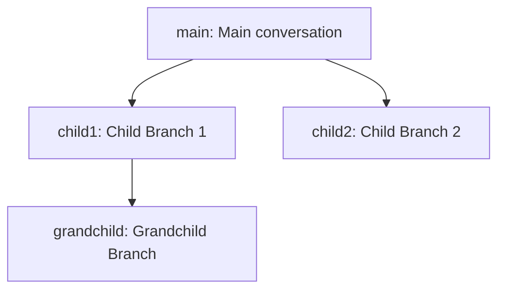

# tests — persistence

This document describes the `persistence` module, which is responsible for managing conversation state and ensuring data integrity within the application. It comprises two primary components: `ConversationBranchManager` for handling multiple conversation threads, and `SessionLock` for preventing concurrent access to session data.

## 1. Conversation Branch Management

The `ConversationBranchManager` module provides a robust system for managing conversation history, inspired by version control systems like Git. It allows users to create, switch between, merge, and fork different conversation paths, enabling exploration of alternative responses without losing previous context.

### 1.1 Purpose

The `ConversationBranchManager` is designed to:
*   Store and retrieve conversation messages associated with specific branches.
*   Enable users to create new conversation branches from any point in an existing conversation.
*   Allow seamless switching between different conversation branches.
*   Support merging messages from one branch into another using various strategies.
*   Provide a clear overview of the conversation history and branch structure.
*   Persist conversation state to disk, ensuring data is saved across sessions.

### 1.2 Core Concepts

*   **`ConversationBranch`**: The fundamental unit of conversation. Each branch has a unique `id`, a human-readable `name`, a list of `messages`, and metadata like `createdAt` and `updatedAt` timestamps.
*   **Parentage**: Branches can be created as children of other branches, inheriting their message history up to a specified point. This is tracked by `parentId` and `parentMessageIndex`.
*   **`main` Branch**: A special, immutable branch that serves as the default starting point for all conversations. It cannot be deleted.
*   **Current Branch**: The active branch where all message additions and modifications occur. Operations like `addMessage` and `getMessages` always refer to the current branch.
*   **Persistence**: All branch data is automatically saved to and loaded from JSON files on disk, located in `~/.codebuddy/branches/<sessionId>/`. Each branch is stored in its own file (e.g., `main.json`, `my-feature-branch.json`).
*   **Events**: The manager is an event emitter, notifying listeners of significant lifecycle events such as `branch:created`, `branch:forked`, `branch:checkout`, `branch:merged`, `branch:deleted`, and `branch:renamed`.
*   **Singleton**: The `getBranchManager(sessionId: string)` function ensures that only a single instance of `ConversationBranchManager` exists for a given session ID, preventing conflicting state management.

### 1.3 Key API

The `ConversationBranchManager` class exposes the following public methods:

*   **`constructor(sessionId: string)`**: Initializes the manager for a specific session. It ensures the `main` branch exists and is set as the current branch.
*   **`createBranch(id: string, name: string, parentId?: string, parentMessageIndex?: number)`**: Creates a new `ConversationBranch`.
    *   If `parentId` and `parentMessageIndex` are provided, the new branch copies messages from the parent up to `parentMessageIndex`.
    *   Messages are deep-copied to prevent shared references.
*   **`fork(name: string)`**: Creates a new branch from the *current* branch, including all messages up to the current point. The manager automatically checks out the newly forked branch.
*   **`forkFromMessage(name: string, messageIndex: number)`**: Similar to `fork`, but creates a new branch from the *current* branch, including messages only up to the specified `messageIndex`. The manager automatically checks out the new branch.
*   **`checkout(branchId: string)`**: Switches the active conversation context to the branch identified by `branchId`. If the branch doesn't exist, it returns `null`.
*   **`merge(sourceBranchId: string, strategy: 'append' | 'replace' = 'append')`**: Merges messages from `sourceBranchId` into the *current* branch.
    *   `'append'`: Adds the source branch's messages to the end of the current branch's messages.
    *   `'replace'`: Replaces all messages in the current branch with those from the source branch.
    *   Cannot merge a branch into itself.
*   **`deleteBranch(branchId: string)`**: Deletes the specified branch and its associated persistence file.
    *   The `main` branch cannot be deleted.
    *   If the current branch is deleted, the manager automatically switches to the `main` branch.
*   **`renameBranch(branchId: string, newName: string)`**: Renames an existing branch.
*   **`addMessage(message: AIMessage)`**: Appends a new message to the *current* branch's message list.
*   **`setMessages(messages: AIMessage[])`**: Replaces all messages in the *current* branch with the provided list.
*   **`getMessages()`**: Returns the list of messages for the *current* branch.
*   **`getAllBranches()`**: Returns an array of all `ConversationBranch` objects, sorted by their `updatedAt` timestamp (most recent first).
*   **`getCurrentBranchId()`**: Returns the `id` of the currently active branch.
*   **`getCurrentBranch()`**: Returns the `ConversationBranch` object for the currently active branch. If the current branch ID is invalid, it defaults to `main`.
*   **`getBranchTree()`**: Returns a hierarchical representation of all branches, showing parent-child relationships.
*   **`getBranchHistory(branchId: string)`**: Returns an ordered array of `ConversationBranch` objects representing the ancestry chain from the root (`main`) to the specified branch.
*   **`formatBranches()`**: Returns a human-readable string listing all branches, indicating the current one.
*   **`formatBranchTree()`**: Returns a human-readable string representing the hierarchical branch structure.
*   **`getBranchManager(sessionId: string)`**: A static factory method to get the singleton instance of `ConversationBranchManager` for a given session.
*   **`resetBranchManager()`**: A static method primarily used for testing to clear the singleton instance cache.

### 1.4 Branching Model

The `ConversationBranchManager` supports a tree-like structure for conversations, where branches can fork from any point in their parent's history.

In this diagram:
*   `child1` and `child2` were forked from `main`.
*   `grandchild` was forked from `child1`.

### 1.5 Persistence Details

Each `ConversationBranch` is serialized to a JSON file. The storage path is `~/.codebuddy/branches/<sessionId>/<branchId>.json`. This allows for easy inspection and management of individual branch data. The `fs-extra` library is used for file system operations, providing robust handling of directory creation and file I/O.

## 2. Session Locking

The `SessionLock` module provides a critical mechanism to prevent data corruption when multiple processes might attempt to access or modify the same session-related files concurrently. It implements a PID-based lock file system.

### 2.1 Purpose

The `SessionLock` is designed to:
*   Ensure exclusive access to a specific session file (e.g., a conversation branch file, or a main session state file).
*   Prevent race conditions and data inconsistencies that can arise from concurrent writes.
*   Automatically clean up stale lock files left behind by crashed or unresponsive processes.
*   Provide a convenient helper function (`withSessionLock`) for safely executing operations under a lock.

### 2.2 Core Concepts

*   **Lock File**: For any given `sessionFilePath` (e.g., `/path/to/session.json`), a corresponding lock file is created with a `.lock` suffix (e.g., `/path/to/session.json.lock`).
*   **`LockInfo`**: A JSON object stored within the lock file, containing:
    *   `pid`: The Process ID of the process currently holding the lock.
    *   `timestamp`: The Unix timestamp (milliseconds) when the lock was acquired.
    *   `hostname`: The hostname of the machine where the lock was acquired.
*   **Stale Lock Detection**: The system checks if the `pid` in a lock file corresponds to a currently running process and if the `timestamp` is recent (within a configurable timeout, typically 1 minute). If the process is dead or the timestamp is too old, the lock is considered "stale" and can be acquired by another process, which will first clean up the stale lock file.
*   **Exclusive Write**: The `acquire` method uses atomic file system operations (`wx` flag for `fs.writeFileSync`) to ensure that only one process can successfully create the lock file.

### 2.3 Key API

The `SessionLock` class and its helper function provide the following:

*   **`constructor(sessionFilePath: string)`**: Creates a new `SessionLock` instance associated with the given `sessionFilePath`.
*   **`acquire()`**: Attempts to acquire the lock.
    *   Returns `true` if the lock is successfully acquired by the current process.
    *   Returns `false` if the lock is currently held by another *active* process.
    *   Automatically cleans up stale lock files before attempting to acquire.
*   **`release()`**: Releases the lock held by the current process.
    *   Deletes the lock file.
    *   It is safe to call multiple times or if the lock was never acquired by the current instance.
    *   Will *not* delete a lock file held by a different process.
*   **`isLocked()`**: Checks if the `sessionFilePath` is currently locked by an active, non-stale process. Returns `true` or `false`.
*   **`getLockHolder()`**: Returns the `LockInfo` object of the current lock holder if a valid, non-stale lock exists, otherwise returns `null`.
*   **`withSessionLock<T>(sessionFilePath: string, callback: () => Promise<T> | T)`**: A static asynchronous helper function.
    *   Acquires a lock for the `sessionFilePath`.
    *   Executes the provided `callback` function.
    *   Guarantees that the lock is released after the `callback` completes, even if it throws an error.
    *   If the lock cannot be acquired (e.g., held by another live process), it throws an error indicating the lock holder's PID.
    *   Returns the result of the `callback`.

### 2.4 How it Works

When `acquire()` is called:
1.  It first checks if a lock file already exists.
2.  If it exists, it reads the `LockInfo` from it.
3.  It then determines if the process identified by `LockInfo.pid` is still alive and if `LockInfo.timestamp` is recent.
    *   If the lock is stale (process dead or timestamp expired), the lock file is deleted, and the current process proceeds to acquire the lock.
    *   If the lock is active and held by *another* process, `acquire()` returns `false`.
    *   If the lock is active and held by the *current* process, `acquire()` returns `true` (re-acquiring is idempotent).
4.  If no lock file exists or a stale one was cleaned up, it attempts to create a new lock file with the current process's `pid`, `timestamp`, and `hostname`. This write uses an exclusive flag (`wx`) to prevent race conditions where two processes try to create the file simultaneously.

## 3. Integration and Usage

The `persistence` module forms the backbone of state management for conversational interactions.

*   The `ConversationBranchManager` is typically instantiated once per application session using `getBranchManager(sessionId)`. This instance then handles all operations related to managing conversation history.
*   The `SessionLock` is used internally by `ConversationBranchManager` and other persistence components to ensure that file operations (like saving branch data) are atomic and safe from concurrent access.
*   Developers interacting with session files directly should use the `withSessionLock` helper to wrap their file operations, guaranteeing proper lock acquisition and release.

Together, these modules provide a robust and reliable foundation for managing complex conversational state in a persistent and concurrent-safe manner.