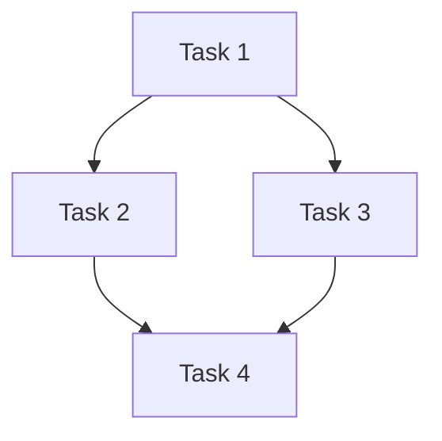

# tests — planner

This documentation covers the `planner` module, specifically focusing on the core components responsible for managing task dependencies and delegating tasks to appropriate subagents. These components are central to how the agent breaks down a high-level goal into actionable steps and orchestrates their execution.

The tests in `tests/planner/delegation-engine.test.ts` and `tests/planner/task-graph.test.ts` validate the functionality of the `DelegationEngine` and `TaskGraph` classes, respectively, which reside in `src/agent/planner/`.

## Module Overview

The `planner` module provides the foundational structures and logic for an autonomous agent to:
1.  **Represent a plan** as a directed acyclic graph (DAG) of tasks with dependencies.
2.  **Orchestrate task execution** in the correct order, handling parallel execution where possible.
3.  **Delegate tasks** to specialized subagents based on their description or explicit instructions.
4.  **Manage task execution robustness** through retries and shared context.

These capabilities enable the agent to tackle complex problems by breaking them down into smaller, manageable units and leveraging specialized tools or sub-agents for specific types of work.

## Core Components

### `TaskGraph`

The `TaskGraph` class (`src/agent/planner/task-graph.js`) is responsible for managing a collection of `PlannedTask` objects, their dependencies, and their execution status. It ensures tasks are processed in a valid order and provides mechanisms for tracking progress and handling failures.

#### Key Concepts

*   **`PlannedTask`**: Represents a single unit of work.
    *   `id`: Unique identifier.
    *   `description`: Human-readable description of the task.
    *   `dependencies`: An array of `id`s of tasks that must complete before this task can start.
    *   `status`: Current state of the task (e.g., `pending`, `running`, `complete`, `failed`, `skipped`).
    *   `delegateTo?`: Optional hint for the `DelegationEngine` to assign this task to a specific subagent.
*   **`TaskResult`**: The outcome of executing a `PlannedTask`.
    *   `success`: Boolean indicating if the task completed successfully.
    *   `output`: Any output generated by the task.
    *   `duration`: Time taken for execution.
    *   `error?`: Error message if the task failed.

#### Functionality

The `TaskGraph` provides methods for:

*   **Graph Construction and Manipulation**:
    *   `constructor(initialTasks?: PlannedTask[])`: Initializes the graph, optionally with a set of tasks.
    *   `addTask(task: PlannedTask)`: Adds a new task to the graph.
    *   `getTask(id: string)`: Retrieves a task by its ID.
    *   `getAllTasks()`: Returns all tasks in the graph.
*   **Dependency Management and Status Updates**:
    *   `getReady()`: Returns an array of `PlannedTask` objects that are `pending` and have all their dependencies `complete`. These tasks are ready for execution.
    *   `markComplete(id: string)`: Marks a task as `complete`. This can unblock its dependent tasks.
    *   `markFailed(id: string, error: string)`: Marks a task as `failed`. Crucially, this will recursively mark all its dependent tasks as `skipped` to prevent further execution of a broken chain.
*   **Graph Analysis**:
    *   `hasCycle()`: Detects if the graph contains any circular dependencies, which would prevent a valid execution order.
    *   `topologicalSort()`: Returns an array of tasks in a valid execution order (where dependencies always come before their dependents). Throws an error if a cycle is detected.
*   **Execution Orchestration**:
    *   `execute(executor: (task: PlannedTask) => Promise<TaskResult>)`: The primary method for running the tasks. It takes an `executor` function (which typically wraps the `DelegationEngine`) and processes tasks in dependency order, potentially executing independent tasks in parallel. It updates task statuses and handles failures.
*   **Progress Reporting**:
    *   `getProgress()`: Returns an object detailing the current state of the graph (total tasks, completed, pending, failed, skipped).

#### Example Task Graph

A simple task graph with dependencies:

In this graph:
*   `t1` is ready immediately.
*   `t2` and `t3` become ready once `t1` is complete.
*   `t4` becomes ready once both `t2` and `t3` are complete.

### `DelegationEngine`

The `DelegationEngine` class (`src/agent/planner/delegation-engine.js`) is responsible for deciding which specialized subagent should handle a given `PlannedTask` and for managing the robust execution of these tasks, including retries and shared context.

#### Key Concepts

*   **Subagent Matching**: The process of assigning a `PlannedTask` to a specific subagent (e.g., `debugger`, `code-reviewer`, `test-runner`).
*   **Retry Mechanism**: Handling transient failures by re-attempting task execution a configurable number of times with backoff.
*   **Shared Context**: A mechanism to store and retrieve information that might be relevant across different task executions or subagents.

#### Functionality

The `DelegationEngine` provides methods for:

*   **Subagent Matching Logic**:
    *   `matchSubagent(task: PlannedTask)`: Determines the appropriate subagent for a given task. The matching logic follows a hierarchy:
        1.  **Explicit `delegateTo`**: If `task.delegateTo` is specified, that subagent is chosen.
        2.  **Custom Mappings**: User-defined mappings (added via `addMapping`) can override or extend the default heuristics.
        3.  **Keyword Heuristics**: The task's `description` is analyzed for keywords (e.g., "debug" -> `debugger`, "review" -> `code-reviewer`).
        4.  **Default**: If no other match is found, the task defaults to the `main` agent.
    *   `addMapping({ taskType: string, subagent: string, priority?: number })`: Allows adding custom rules for subagent delegation. `taskType` is a keyword or pattern to match in the task description.
*   **Robust Task Execution**:
    *   `executeWithRetry(task: PlannedTask, executor: () => Promise<TaskResult>)`: Executes the provided `executor` function for a task. If the execution fails (`TaskResult.success` is `false`), it retries up to `maxRetries` times, with a configurable `retryDelayMs` and `backoffMultiplier`. It returns the final `TaskResult` and the number of retries attempted.
*   **Result Aggregation**:
    *   `aggregateResults(results: Array<{ taskId: string, subagent: string, result: TaskResult, retries: number }>)`: Takes an array of individual task execution outcomes and provides a summary, including overall success/failure, total retries, and a human-readable summary string.
*   **Shared Context Management**:
    *   `getSharedContext()`: Returns a `Map` that can be used to store and retrieve arbitrary data, allowing subagents or tasks to share information. The output of a successful task execution is automatically stored in this context using the task's ID as the key.

## Integration and Usage

The `TaskGraph` and `DelegationEngine` are designed to work in conjunction within the agent's planning and execution loop:

1.  An initial plan (a list of `PlannedTask` objects) is fed into a `TaskGraph`.
2.  The agent repeatedly queries the `TaskGraph` for `getReady()` tasks.
3.  For each ready task, the `DelegationEngine` is used to `matchSubagent()` and then `executeWithRetry()` the task. The `executor` function passed to `executeWithRetry` would typically involve invoking the identified subagent with the task details.
4.  Based on the `TaskResult` from `executeWithRetry`, the `TaskGraph` is updated using `markComplete()` or `markFailed()`.
5.  This loop continues until all tasks are either `complete`, `failed`, or `skipped`.

This modular design allows for flexible planning, robust execution, and the integration of diverse specialized subagents.

## Contributing to the Module

When contributing to the `planner` module:

*   **`TaskGraph`**:
    *   Ensure any changes to dependency logic or status transitions are thoroughly tested, especially edge cases like cycles, parallel paths, and recursive skipping on failure.
    *   Performance for large graphs should be considered for methods like `getReady()` and `topologicalSort()`.
*   **`DelegationEngine`**:
    *   When adding new keyword heuristics or custom mappings, ensure they are precise and do not inadvertently match tasks intended for other subagents.
    *   The retry mechanism's parameters (`maxRetries`, `retryDelayMs`, `backoffMultiplier`) are crucial for agent stability and responsiveness; consider their impact carefully.
    *   The shared context mechanism is a simple `Map`. For more complex state management or persistence, consider extending this functionality.
*   **General**:
    *   Maintain clear separation of concerns between graph management (`TaskGraph`) and task execution/delegation (`DelegationEngine`).
    *   The `PlannedTask` and `TaskResult` types are central; ensure any modifications are backward-compatible or handled with clear migration paths.
    *   Refer to the existing test files (`delegation-engine.test.ts`, `task-graph.test.ts`) for examples of how to test new features or bug fixes.