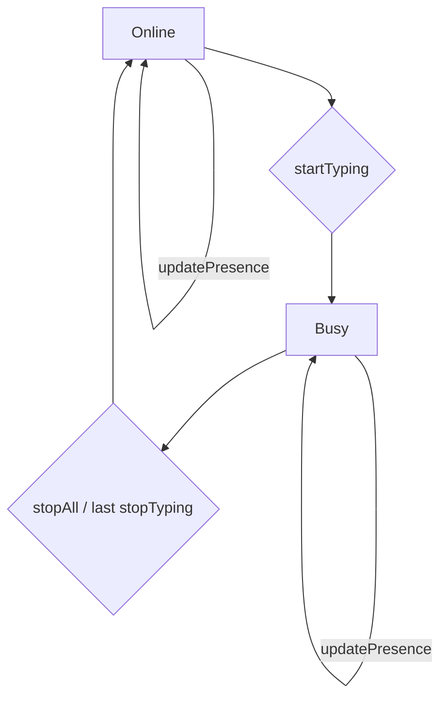

# tests — presence

This documentation describes the `TypingIndicatorManager` module, located at `src/presence/typing-indicator.ts`. While the provided source code is a test file (`tests/presence/typing-indicator.test.ts`), this document focuses on the functionality and API of the `TypingIndicatorManager` class itself, as inferred from its comprehensive test suite.

---

## Module: `TypingIndicatorManager`

The `TypingIndicatorManager` is responsible for managing and broadcasting user typing activity across different channels and chats, as well as maintaining a global presence status for the application or user. It provides a unified way to signal when a user starts or stops typing, and automatically updates the overall presence based on active typing sessions.

### Purpose

*   **Manage Typing Sessions:** Track multiple concurrent typing activities (e.g., typing in different chat rooms).
*   **Broadcast Typing Events:** Emit events when typing starts, stops, or continues periodically.
*   **Maintain Presence:** Automatically set the application's presence to `busy` when any typing is active, and revert to `online` when all typing ceases.
*   **Manual Presence Control:** Allow for explicit updates to the presence status and an associated task.

### Key Concepts

1.  **Typing Session:** Represents a single instance of a user typing in a specific `channel` and `chatId`. Each session is identified by a unique key (`channel:chatId`).
2.  **Typing Interval:** When a typing session starts, the manager periodically re-emits a "typing" event to signal continued activity. This interval is configurable.
3.  **Presence State:** The manager maintains a global presence state (`online` or `busy`) and an optional `currentTask` string. This state reflects whether the user is actively engaged in typing or other tasks.

### Usage Example

```typescript
import { TypingIndicatorManager } from '../../src/presence/typing-indicator.js';

// Initialize with a 4-second interval for repeated typing events
const typingManager = new TypingIndicatorManager(4000);

// Listen for typing events
typingManager.on('typing', (data) => {
  console.log(`Typing event: ${data.channel}:${data.chatId} - typing: ${data.typing}`);
});

// Listen for presence changes
typingManager.on('presence', (presence) => {
  console.log(`Presence updated: ${presence.status} - Task: ${presence.currentTask || 'None'}`);
});

// Start typing in a Telegram chat
const telegramKey = typingManager.startTyping('telegram', 'chat123');
// Output: Typing event: telegram:chat123 - typing: true
// Output: Presence updated: busy - Task: None (or whatever was set manually)

console.log('Active typing sessions:', typingManager.getActiveCount()); // 1
console.log('Current presence:', typingManager.getPresence()); // { status: 'busy' }

// Start typing in a Discord room
typingManager.startTyping('discord', 'room42');
// Output: Typing event: discord:room42 - typing: true

console.log('Active typing sessions:', typingManager.getActiveCount()); // 2

// Simulate time passing (e.g., after 4 seconds)
// typingManager will re-emit typing:true for both sessions

// Stop typing in Telegram
typingManager.stopTyping(telegramKey);
// Output: Typing event: telegram:chat123 - typing: false

console.log('Active typing sessions:', typingManager.getActiveCount()); // 1
console.log('Current presence:', typingManager.getPresence()); // { status: 'busy' } (still busy because Discord is active)

// Manually update presence
typingManager.updatePresence('busy', 'processing query');
// Output: Presence updated: busy - Task: processing query

// Stop all remaining typing sessions
typingManager.stopAll();
// Output: Typing event: discord:room42 - typing: false
// Output: Presence updated: online - Task: None (or previous manual task if not cleared)

console.log('Active typing sessions:', typingManager.getActiveCount()); // 0
console.log('Current presence:', typingManager.getPresence()); // { status: 'online' }

// Clean up resources
typingManager.dispose();
```

### API Reference

The `TypingIndicatorManager` extends `TypedEmitter`, allowing it to emit and listen for specific events.

#### `constructor(intervalMs: number)`

Initializes a new `TypingIndicatorManager` instance.

*   `intervalMs`: The interval in milliseconds at which `typing: true` events will be re-emitted for active sessions.

#### `startTyping(channel: string, chatId: string): string`

Initiates a typing session for a specific channel and chat.

*   `channel`: The identifier for the communication channel (e.g., 'telegram', 'discord').
*   `chatId`: The identifier for the specific chat within the channel.
*   **Returns:** A string representing the session key (`channel:chatId`).
*   **Behavior:**
    *   Immediately emits a `typing: true` event for the session.
    *   Starts an internal timer to repeatedly emit `typing: true` at the configured `intervalMs`.
    *   If a session for `channel:chatId` already exists, it returns the existing key and does not emit a duplicate immediate event.
    *   Sets the global presence status to `busy`.

#### `stopTyping(sessionKey: string): void`

Stops a specific typing session.

*   `sessionKey`: The key of the session to stop (obtained from `startTyping`).
*   **Behavior:**
    *   Emits a `typing: false` event for the session.
    *   Clears the internal timer associated with the session.
    *   If this was the last active typing session, the global presence status is set back to `online`.
    *   Handles invalid `sessionKey` gracefully without throwing an error.

#### `stopAll(): void`

Stops all active typing sessions managed by this instance.

*   **Behavior:**
    *   Iterates through all active sessions, calling `stopTyping` for each.
    *   Resets the active session count to zero.
    *   Sets the global presence status to `online`.

#### `getActiveCount(): number`

Returns the number of currently active typing sessions.

*   **Returns:** An integer representing the count of active sessions.

#### `getPresence(): { status: 'online' | 'busy', currentTask?: string }`

Retrieves the current global presence status and any associated task.

*   **Returns:** An object with `status` (`'online'` or `'busy'`) and an optional `currentTask` string.

#### `updatePresence(status: 'online' | 'busy', currentTask?: string): void`

Manually updates the global presence status and an optional task.

*   `status`: The desired presence status (`'online'` or `'busy'`).
*   `currentTask`: An optional string describing the current task (e.g., 'processing query').
*   **Behavior:**
    *   Updates the internal presence state.
    *   Emits a `presence` event with the new state.
    *   Note: `startTyping` and `stopTyping` can override the `status` component of presence.

#### `dispose(): void`

Cleans up all resources associated with the `TypingIndicatorManager`.

*   **Behavior:**
    *   Stops all active typing sessions.
    *   Removes all registered event listeners (`typing`, `presence`).
    *   Ensures no timers are left running.

### Events

The `TypingIndicatorManager` emits the following events:

#### `'typing'`

Emitted when a typing session starts, stops, or continues.

*   **Payload:** `{ channel: string, chatId: string, typing: boolean }`
    *   `channel`: The channel identifier.
    *   `chatId`: The chat identifier.
    *   `typing`: `true` if typing is active, `false` if typing has stopped.

#### `'presence'`

Emitted when the global presence status changes.

*   **Payload:** `{ status: 'online' | 'busy', currentTask?: string }`
    *   `status`: The new presence status.
    *   `currentTask`: The optional task associated with the presence.

### How It Works

The `TypingIndicatorManager` maintains an internal map of active typing sessions. Each entry in this map stores the `channel`, `chatId`, and a `setInterval` ID.

1.  **`startTyping`**:
    *   Checks if a session already exists for the given `channel:chatId`. If so, it reuses it.
    *   If new, it creates a unique session key, stores the session details, and sets up a `setInterval` timer. This timer is responsible for periodically emitting `typing: true` events.
    *   It immediately emits a `typing: true` event.
    *   It increments an internal counter for active sessions and, if the count becomes > 0, sets the global presence to `busy`.
2.  **`stopTyping`**:
    *   Locates the session by its key.
    *   Clears the associated `setInterval` timer.
    *   Removes the session from the internal map.
    *   Emits a `typing: false` event.
    *   Decrements the active session counter. If the counter reaches 0, it sets the global presence to `online`.
3.  **`stopAll`**: Iterates through all active sessions and calls `stopTyping` for each.
4.  **Presence Management**: The `status` component of the global presence is automatically managed by `startTyping` and `stopTyping` based on the number of active typing sessions. `updatePresence` allows for manual overrides or setting of the `currentTask`.

#### Presence State Flow



This diagram illustrates how the global presence state transitions. `startTyping` moves the state to `Busy`, and it remains `Busy` as long as any typing session is active. Only when all typing sessions are stopped (either individually or via `stopAll`) does the state revert to `Online`. `updatePresence` allows for modifying the `currentTask` or explicitly setting the `status` (though `startTyping`/`stopTyping` will still influence the `status` based on active sessions).