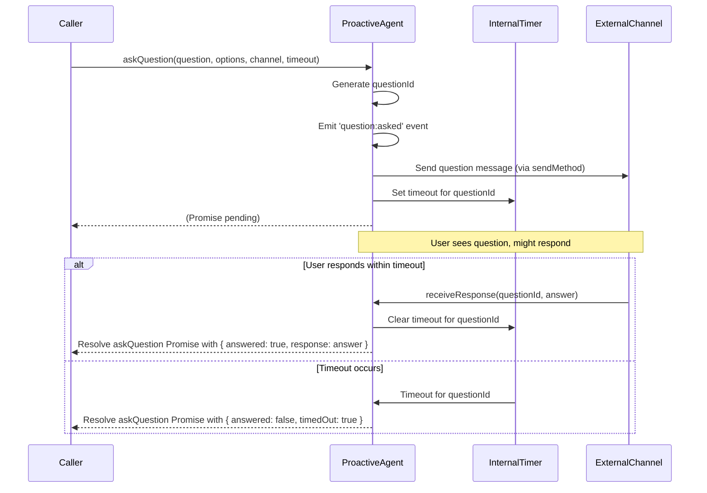

# tests — proactive

This document describes the `proactive` module, which is responsible for managing and orchestrating proactive communications from the system to external channels and users. It encompasses components for managing notification rules and history, as well as an agent for sending messages, asking questions, and handling responses.

## 1. Introduction

The `proactive` module provides the core functionality for the system to initiate communication with users or external systems. This includes sending informational messages, asking for user input, and notifying about task completions. It is designed to be flexible, allowing for various communication channels and custom delivery mechanisms, while also enforcing rules around notification frequency and user preferences.

The module is composed of two primary components:
*   **`NotificationManager`**: Handles the rules, preferences, and history for all proactive notifications.
*   **`ProactiveAgent`**: Acts as the central orchestrator for sending messages and managing interactive question-answer flows.

## 2. `NotificationManager`

The `NotificationManager` class is responsible for enforcing policies and tracking the history of proactive notifications. It ensures that messages are sent only when permitted by configured channels, rate limits, and quiet hours.

### 2.1. Purpose

Its primary purpose is to:
*   Determine if a notification *should* be sent based on current rules.
*   Record all notification attempts for auditing and statistics.
*   Manage user and system preferences related to notification delivery.
*   Provide insights into notification history and delivery rates.

### 2.2. Key Features

*   **Channel Management**: Configurable list of enabled channels (e.g., `cli`, `telegram`).
*   **Rate Limiting**: Prevents excessive notifications within a given timeframe (`maxPerHour`).
*   **Quiet Hours**: Allows defining periods when only high-priority messages are permitted.
*   **Notification History**: Stores a log of recent notification attempts.
*   **Delivery Statistics**: Tracks overall notification success rates.
*   **Dynamic Preferences**: Allows runtime updates to notification settings.

### 2.3. API Overview

#### Constructor

```typescript
new NotificationManager(options: { channels: string[]; maxPerHour: number; })
```
Initializes the manager with a list of enabled channels and a global rate limit.

#### `shouldSend`

```typescript
shouldSend(notification: { channelType: string; channelId: string; message: string; priority: 'low' | 'normal' | 'high' | 'urgent'; }): { allowed: boolean; reason?: string; }
```
Evaluates whether a given notification is allowed to be sent based on:
*   If the `channelType` is enabled.
*   If the `maxPerHour` rate limit has been reached.
*   If the current time falls within `quietHoursStart` and `quietHoursEnd`, and the `priority` meets `quietHoursMinPriority`.

Returns an object indicating `allowed` status and a `reason` if blocked.

#### `record`

```typescript
record(notification: { channelType: string; channelId: string; message: string; priority: 'low' | 'normal' | 'high' | 'urgent'; }, delivered: boolean): void
```
Records a notification attempt. This method should be called after an attempt to send a message, indicating whether it was `delivered` successfully. This data is used for rate limiting, history, and statistics.

#### `getStats`

```typescript
getStats(): { totalSent: number; deliveryRate: number; }
```
Returns aggregated statistics about notification delivery, including the total number of recorded attempts and the success rate.

#### `getHistory`

```typescript
getHistory(limit: number): Array<{ timestamp: Date; channelType: string; channelId: string; message: string; priority: string; delivered: boolean; }>
```
Retrieves a list of recent notification records, up to the specified `limit`.

#### `setPreferences` / `getPreferences`

```typescript
setPreferences(prefs: { quietHoursStart?: number; quietHoursEnd?: number; quietHoursMinPriority?: 'low' | 'normal' | 'high' | 'urgent'; maxPerHour?: number; }): void
getPreferences(): { quietHoursStart: number; quietHoursEnd: number; quietHoursMinPriority: 'low' | 'normal' | 'high' | 'urgent'; maxPerHour: number; }
```
Allows updating and retrieving the notification preferences at runtime. This includes quiet hour settings and the global rate limit.

## 3. `ProactiveAgent`

The `ProactiveAgent` class serves as the primary interface for the system to initiate proactive communications. It handles sending various types of messages, managing interactive question-answer flows, and notifying about task completions.

### 3.1. Purpose

Its main responsibilities include:
*   Providing a unified API for sending messages to different channels.
*   Orchestrating interactive question-answer sessions with users, including timeouts.
*   Allowing flexible integration with various message delivery mechanisms.
*   Emitting events for internal system consumption (e.g., local message delivery, questions asked).

### 3.2. Key Features

*   **Flexible Message Sending**: Supports a default "local fallback" mechanism and allows for custom message delivery implementations.
*   **Interactive Questions**: Manages the lifecycle of questions posed to users, including tracking pending questions and handling responses.
*   **Timeout Management**: Automatically resolves questions if no response is received within a specified duration.
*   **Event-Driven**: Extends `EventEmitter` to signal key events like local message delivery or questions being asked.
*   **Completion Notifications**: Dedicated method for informing about task outcomes.

### 3.3. API Overview

#### Constructor

```typescript
new ProactiveAgent()
```
Initializes the agent. It extends `EventEmitter`, allowing for event subscriptions.

#### `sendMessage`

```typescript
sendMessage(msg: { channelType: string; channelId: string; message: string; priority: 'low' | 'normal' | 'high' | 'urgent'; }): Promise<{ delivered: boolean; channelType: string; channelId: string; messageId?: string; timestamp?: Date; error?: string; }>
```
Sends a message to the specified `channelType` and `channelId`.
*   If a custom `sendMethod` is set, it will be used.
*   Otherwise, it defaults to a "local fallback" mechanism, emitting a `message:local` event.
Returns a promise that resolves with the delivery status, including `delivered`, `messageId` (if successful), and `error` (if failed).

#### `setSendMethod`

```typescript
setSendMethod(method: (msg: { channelType: string; channelId: string; message: string; priority: 'low' | 'normal' | 'high' | 'urgent'; }) => Promise<{ delivered: boolean; channelType: string; channelId: string; messageId?: string; timestamp?: Date; }>): void
```
Allows injecting a custom asynchronous function to handle the actual delivery of messages. This is the primary extension point for integrating with external messaging platforms (e.g., Telegram API, Discord webhooks).

#### `askQuestion`

```typescript
askQuestion(question: string, options: string[], channelType: string, channelId: string, timeoutMs: number): Promise<{ answered: boolean; response?: string; timedOut: boolean; }>
```
Sends a question with a list of `options` to a user on a specific channel.
*   It assigns a unique `questionId` internally.
*   It emits a `question:asked` event, allowing external systems to intercept and display the question.
*   It sets a timer for `timeoutMs`. If no response is received within this time, the promise resolves with `timedOut: true`.
Returns a promise that resolves when a response is received or the timeout occurs.

#### `receiveResponse`

```typescript
receiveResponse(questionId: string, response: string): void
```
Used to feed a user's `response` back to a pending question identified by `questionId`. This method is typically called by an external integration after receiving user input.

#### `getPendingQuestions`

```typescript
getPendingQuestions(): number
```
Returns the current count of questions that have been asked and are awaiting a response.

#### `notifyCompletion`

```typescript
notifyCompletion(taskId: string, result: { success: boolean; output: string; }, channelType: string, channelId: string): Promise<{ delivered: boolean; channelType: string; channelId: string; messageId?: string; timestamp?: Date; error?: string; }>
```
Sends a notification about the completion of a specific `taskId`, including its `success` status and `output`. This leverages the same underlying message sending mechanism as `sendMessage`.

### 3.4. Question-Answering Flow

The interactive question-answering process involves several steps, often spanning internal agent logic and external communication channels.



### 3.5. Eventing

`ProactiveAgent` extends `EventEmitter` and emits the following events:

*   **`message:local`**: Emitted when `sendMessage` is called and no custom `sendMethod` is configured. This allows local handling of messages (e.g., logging to console).
    *   Payload: `{ channelType: string; channelId: string; message: string; priority: string; }`
*   **`question:asked`**: Emitted when `askQuestion` is called, providing details about the question. This is crucial for external integrations to display the question to the user.
    *   Payload: `{ questionId: string; question: string; options: string[]; channelType: string; channelId: string; timeoutMs: number; }`

## 4. Integration Considerations

While the provided tests do not explicitly show `ProactiveAgent` directly using `NotificationManager`, in a production environment, it is highly recommended that the `ProactiveAgent` consults the `NotificationManager` before attempting to send any message.

A typical integration flow would be:
1.  `ProactiveAgent.sendMessage` (or `askQuestion`, `notifyCompletion`) is called.
2.  Inside `ProactiveAgent`, before attempting delivery, call `NotificationManager.shouldSend()` with the message details.
3.  If `shouldSend()` returns `allowed: false`, the `ProactiveAgent` should log the reason and return a `delivered: false` result without attempting actual delivery.
4.  If `shouldSend()` returns `allowed: true`, the `ProactiveAgent` proceeds with its `sendMethod`.
5.  After the `sendMethod` completes (successfully or with an error), the `ProactiveAgent` should call `NotificationManager.record()` with the message details and the actual delivery status.

This ensures that all proactive communications adhere to the configured rules and preferences, and their history is properly tracked.

## 5. Contributing and Extending

Developers looking to contribute to or extend the proactive communication capabilities should focus on:

*   **Implementing Custom `sendMethod`**: To integrate with new communication channels (e.g., Slack, email), provide a custom function to `ProactiveAgent.setSendMethod` that handles the actual API calls to the external service.
*   **Handling `ProactiveAgent` Events**: Subscribe to `message:local` and `question:asked` events to build custom UI or logging for local interactions, or to bridge questions to external user interfaces.
*   **Enhancing `NotificationManager` Rules**: Add new types of rules (e.g., per-channel rate limits, user-specific preferences) to `NotificationManager` by extending its internal logic and `shouldSend` method.
*   **Adding New Proactive Communication Types**: Introduce new methods to `ProactiveAgent` for specific communication patterns beyond simple messages or questions (e.g., sending rich media, initiating multi-turn conversations).