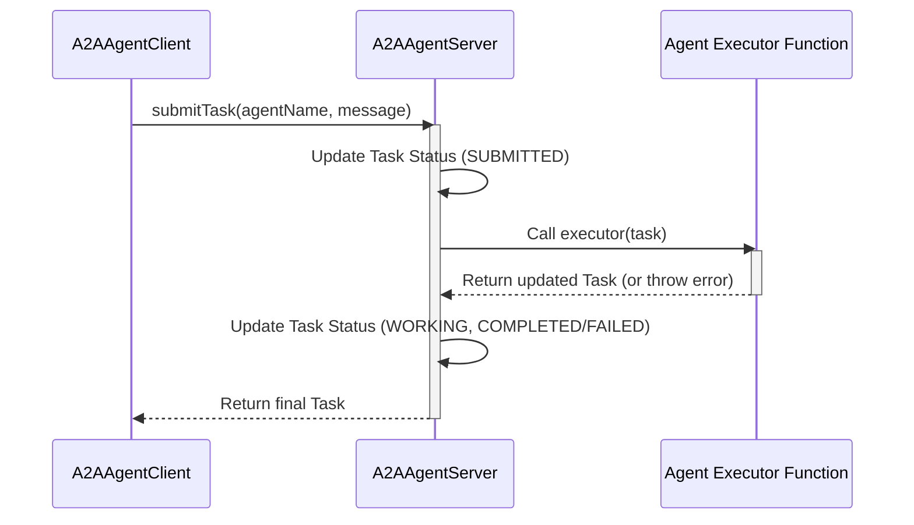

# tests — protocols

This document provides an overview of the Agent-to-Agent (A2A) Protocol, as implemented and validated by the `tests/protocols/a2a.test.ts` module. This module serves as a comprehensive test suite, demonstrating the functionality and expected behavior of the A2A communication layer.

The A2A Protocol enables structured communication and task execution between different software agents within a system. It defines how agents are discovered, how tasks are submitted, executed, and how their results and status are managed.

## 1. Core Concepts

The A2A Protocol revolves around a few fundamental concepts:

*   **AgentCard**: A metadata descriptor for an agent, detailing its name, description, and the skills it possesses.
*   **Task**: The primary unit of work submitted to an agent, encapsulating the request, its current status, history, and any generated artifacts.
*   **Agent Server (`A2AAgentServer`)**: The component that hosts an agent, receives tasks, executes them via a provided executor function, and manages task lifecycle.
*   **Agent Client (`A2AAgentClient`)**: The component that allows other parts of the system (or other agents) to discover agents, submit tasks, and retrieve results.

## 2. AgentCard: Describing an Agent

An `AgentCard` provides essential information about an agent, allowing clients to understand its capabilities without needing to interact with it directly.

*   **Creation**: `createAgentCard({ name, description, skills, ... })`
*   **Key Properties**:
    *   `name`: A unique identifier for the agent (e.g., "SWE Agent", "Browser Agent").
    *   `description`: A human-readable description of the agent's purpose.
    *   `skills`: An array of objects, each describing a specific capability of the agent. Each skill has an `id`, `name`, `description`, `inputModes`, and `outputModes` (e.g., `text/plain`).
    *   `version`: The protocol version supported by the agent (currently fixed at '1.0.0').
    *   `capabilities`: Additional features like `streaming`.

**Example (from `createTestCard`):**

```typescript
const card = createAgentCard({
  name: 'SWE Agent',
  description: 'Software engineering agent',
  skills: [
    { id: 'edit', name: 'Edit', description: 'Edit files', inputModes: ['text/plain'], outputModes: ['text/plain'] },
  ],
});
```

## 3. Task: The Unit of Work

A `Task` object represents a single request sent to an agent and its subsequent execution state. It's a rich data structure that evolves throughout its lifecycle.

*   **Key Properties**:
    *   `id`: A unique identifier for the task.
    *   `sessionId`: An identifier for the session this task belongs to.
    *   `message`: The initial input message for the task (e.g., `{ role: 'user', parts: [{ type: 'text', text: 'Do something' }] }`).
    *   `status`: An object containing the current `TaskStatus` (e.g., `COMPLETED`, `FAILED`), a `timestamp`, and an optional `message` (especially for failures).
    *   `artifacts`: An array of output artifacts generated by the agent (e.g., code, text results). Each artifact has a `name` and `parts`.
    *   `messages`: A history of messages exchanged during the task, including user input and agent replies.
    *   `history`: A chronological log of `TaskStatus` changes.

### Task Lifecycle and Status

Tasks progress through a defined set of statuses, tracked in the `Task.status` and `Task.history` properties:

*   **`TaskStatus.SUBMITTED`**: The task has been received by the server.
*   **`TaskStatus.WORKING`**: The agent's executor function is actively processing the task.
*   **`TaskStatus.COMPLETED`**: The agent's executor function finished successfully.
*   **`TaskStatus.FAILED`**: The agent's executor function encountered an error.
*   **`TaskStatus.CANCELLED`**: The task was explicitly cancelled by a client.

## 4. A2A Protocol Architecture

The A2A Protocol defines a client-server interaction model for agent communication.



### 4.1. `A2AAgentServer`: The Agent's Endpoint

The `A2AAgentServer` is responsible for hosting an individual agent. It exposes an interface for receiving tasks and managing their execution.

*   **Constructor**:
    ```typescript
    new A2AAgentServer(agentCard: AgentCard, executor: (task: Task) => Promise<Task>)
    ```
    *   `agentCard`: The `AgentCard` describing this agent.
    *   `executor`: An asynchronous function that defines the agent's core logic. It receives a `Task` object, performs work, updates the task (e.g., adds artifacts), and returns the modified `Task`. If the executor throws an error, the task status is set to `FAILED`.

*   **Key Methods**:
    *   `submitTask(taskInput: { id: string, message: Message }): Promise<Task>`: Receives a new task request, initializes the task, calls the `executor`, and updates the task status.
    *   `cancelTask(taskId: string): boolean`: Attempts to cancel a running task. Returns `true` if cancelled, `false` otherwise.
    *   `getTask(taskId: string): Task | undefined`: Retrieves the current state of a specific task.

*   **Events**: The server is an `EventEmitter` and emits events during the task lifecycle:
    *   `'task:submitted'`: When a task is first received.
    *   `'task:working'`: When the executor starts processing.
    *   `'task:completed'`: When the executor finishes successfully.
    *   `'task:failed'`: When the executor throws an error.
    *   `'task:cancelled'`: When a task is successfully cancelled.

### 4.2. `A2AAgentClient`: The Orchestrator's Interface

The `A2AAgentClient` acts as a central registry and communication hub for interacting with multiple `A2AAgentServer` instances. It allows other parts of the system to discover and utilize agents.

*   **Constructor**:
    ```typescript
    new A2AAgentClient()
    ```

*   **Key Methods**:
    *   `registerAgent(name: string, server: A2AAgentServer)`: Registers an `A2AAgentServer` instance under a given name. This makes the agent discoverable and callable.
    *   `listAgents(): string[]`: Returns an array of names of all registered agents.
    *   `getAgentCard(name: string): AgentCard | undefined`: Retrieves the `AgentCard` for a registered agent.
    *   `findAgentsWithSkill(skillId: string): string[]`: Discovers agents that possess a specific skill ID.
    *   `submitTask(agentName: string, message: string | Message): Promise<Task>`: Submits a new task to a registered agent. It constructs a `Task` object and delegates to the target `A2AAgentServer`. Throws an error if the agent is not found.

## 5. Utility Functions

The protocol also includes helper functions for common operations:

*   **`createAgentCard(options: AgentCardOptions): AgentCard`**: A factory function to easily create valid `AgentCard` objects.
*   **`getTaskResult(task: Task): string | undefined`**: A utility to extract the primary text result from a completed task. It first looks for artifacts named 'result' or 'out', then falls back to the text content of the last agent message in the task's `messages` history.

## 6. Integration and Usage Patterns

The `tests/protocols/a2a.test.ts` module demonstrates the intended usage and interaction patterns:

1.  **Agent Definition**: An agent is defined by its `AgentCard` and an `executor` function, which are then used to instantiate an `A2AAgentServer`.
2.  **Agent Registration**: `A2AAgentServer` instances are registered with an `A2AAgentClient` under a unique name.
3.  **Agent Discovery**: Clients can list all agents, retrieve their `AgentCard`s, or find agents based on specific skills.
4.  **Task Submission**: Clients submit tasks to registered agents via the `A2AAgentClient`, specifying the agent's name and the task message.
5.  **Task Execution**: The `A2AAgentServer` invokes the agent's `executor` function. The executor is responsible for performing the work, updating the `Task` object (e.g., adding artifacts, messages), and returning it.
6.  **Task Lifecycle Management**: The `A2AAgentServer` automatically updates the task's `status` and `history` throughout its execution (SUBMITTED -> WORKING -> COMPLETED/FAILED).
7.  **Error Handling**: If an agent's `executor` throws an error, the task's status is set to `FAILED`, and the error message is captured in `Task.status.message`.
8.  **Event-Driven Interactions**: `A2AAgentServer` emits events, allowing external systems to react to task state changes (e.g., logging, notifications).
9.  **Result Extraction**: The `getTaskResult` utility simplifies retrieving the primary output from a completed task.

This protocol provides a robust and extensible framework for building and orchestrating intelligent agents.