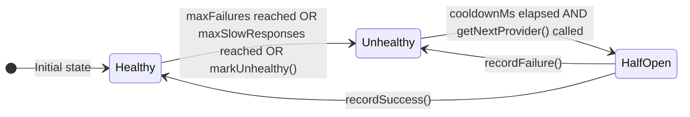
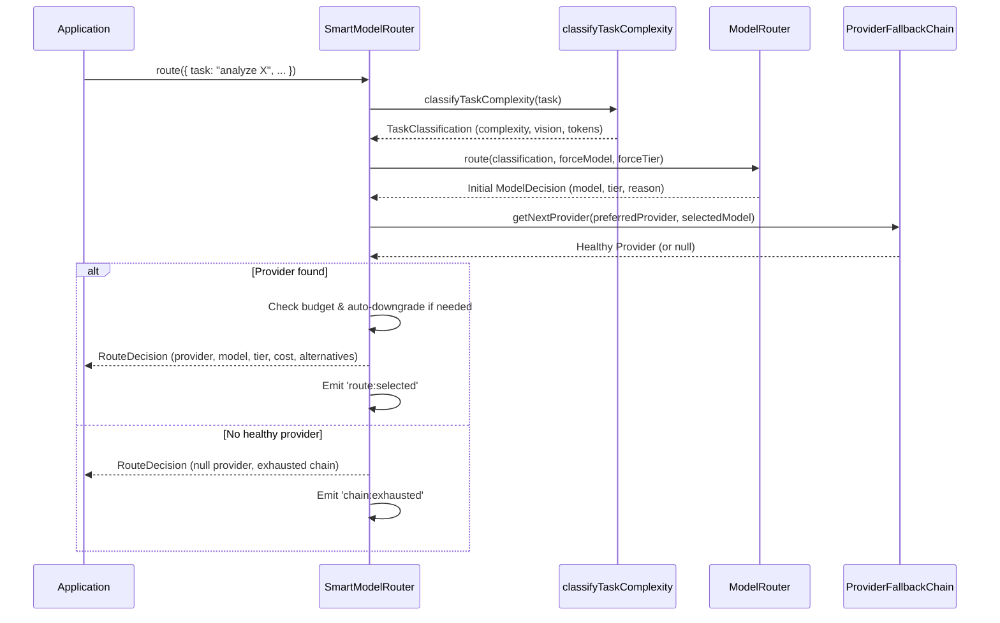

# tests — providers

This documentation covers the core modules responsible for managing and intelligently routing requests to Large Language Model (LLM) providers. These modules provide robust failover, health tracking, and cost-aware model selection, ensuring reliability and efficiency when interacting with various LLM APIs.

## Overview

The `providers` module group is central to how the system interacts with external LLM services. It addresses critical concerns such as:

*   **Reliability:** Automatically switching to alternative providers or models when a primary one fails or becomes unhealthy.
*   **Performance:** Tracking response times and proactively avoiding slow providers.
*   **Cost Optimization:** Selecting the most cost-effective model for a given task, and managing session budgets.
*   **Intelligent Routing:** Dynamically choosing the most appropriate model based on task complexity, user preferences, and available capabilities (e.g., vision).

At its heart, this system employs a **circuit breaker pattern** for provider health management and a **smart routing mechanism** to make informed decisions about which LLM to use for each request.

## Core Components

The `providers` module group consists of several interconnected components:

1.  **`ProviderFallbackChain`**: A sophisticated, circuit-breaker-based mechanism for managing the health and failover of multiple LLM providers.
2.  **`ModelFailoverChain`**: A simpler, retry-based failover mechanism, often used for specific model configurations.
3.  **`SmartModelRouter`**: The orchestrator that combines task classification, provider health, and cost considerations to make intelligent routing decisions.
4.  **Model Routing Utilities (`classifyTaskComplexity`, `ModelRouter`, `selectModel`, `calculateCost`)**: Functions and a class that handle task analysis, model selection logic, and cost estimation.

---

## 1. `ProviderFallbackChain`

**Source:** `src/providers/fallback-chain.ts`

The `ProviderFallbackChain` class implements a robust circuit breaker pattern to manage the health and availability of a list of LLM providers. It's designed to automatically detect and react to provider failures, slow responses, and rate limits, ensuring that requests are routed to healthy services whenever possible.

### Purpose

*   Maintain a prioritized list of LLM providers.
*   Track the health status of each provider (healthy, unhealthy, half-open).
*   Automatically open a circuit (mark unhealthy) for providers experiencing failures or excessive slow responses.
*   Attempt to recover (half-open state) providers after a configurable cooldown period.
*   Support automatic promotion of a healthy fallback provider to primary if the current primary fails.
*   Emit events for state changes (e.g., `provider:unhealthy`, `provider:recovered`, `chain:exhausted`).

### How it Works

Each provider in the chain maintains its own health state, including:
*   **Failure Count:** Number of recent failures within a `failureWindowMs`.
*   **Consecutive Slow Responses:** Count of responses exceeding `slowThresholdMs`.
*   **Last Failure/Success Timestamps:** Used for cooldown and recovery logic.

When `getNextProvider()` is called, the chain iterates through its configured providers:
1.  It checks if the current provider is healthy.
2.  If unhealthy, it checks if the `cooldownMs` has passed. If so, the provider enters a "half-open" state, allowing one test request.
3.  If a provider is healthy or in a half-open state, it's returned.
4.  If all providers are unhealthy and within their cooldowns, `null` is returned, and a `chain:exhausted` event is emitted.

Failures (via `recordFailure`) increment a provider's failure count. If `maxFailures` is reached within `failureWindowMs`, the provider is marked unhealthy. Successes (via `recordSuccess`) reset failure counts and can recover a provider from an unhealthy state.

### Key API

*   **`new ProviderFallbackChain(config)`**: Creates a new chain instance.
    *   `config`: `{ maxFailures: number, cooldownMs: number, failureWindowMs: number, slowThresholdMs: number, maxSlowResponses: number, autoPromote: boolean }`
*   **`setFallbackChain(providers: ProviderType[])`**: Sets the ordered list of providers.
*   **`getNextProvider(skipCurrent?: boolean)`**: Returns the next healthy provider in the chain. If `skipCurrent` is true, it will immediately try the next provider after the current primary.
*   **`recordSuccess(provider: ProviderType, responseTimeMs: number)`**: Records a successful response, potentially recovering the provider.
*   **`recordFailure(provider: ProviderType, error: string)`**: Records a failure, potentially marking the provider unhealthy.
*   **`markUnhealthy(provider: ProviderType, reason: string)`**: Immediately marks a provider as unhealthy.
*   **`resetProvider(provider: ProviderType)`**: Resets a specific provider's health metrics.
*   **`promoteProvider(provider: ProviderType)`**: Moves a provider to the primary (first) position in the chain.
*   **`isProviderHealthy(provider: ProviderType)`**: Checks the current health status of a provider.
*   **`getHealthStatus(provider: ProviderType)`**: Returns detailed health metrics for a provider.
*   **`getAllHealthStatus()`**: Returns health metrics for all providers in the chain.
*   **`updateConfig(newConfig: Partial<ProviderFallbackChainConfig>)`**: Updates the chain's configuration.
*   **`dispose()`**: Clears the chain, metrics, and event listeners.
*   **`getFallbackChain()`**: (Static/Singleton) Returns the global singleton instance of `ProviderFallbackChain`.
*   **`resetFallbackChain()`**: (Static/Singleton) Resets the global singleton instance.

### Provider Health State Diagram

---

## 2. `ModelFailoverChain`

**Source:** `src/agents/model-failover.ts`

The `ModelFailoverChain` provides a simpler, more direct failover mechanism compared to `ProviderFallbackChain`. It's designed to manage a list of specific model configurations (provider + model) and switch to the next available one upon failure.

### Purpose

*   Manage a list of specific LLM model configurations, each with its own provider and model name.
*   Provide basic health tracking (healthy/failed) for each configuration.
*   Implement a simple cooldown mechanism before retrying a failed model.
*   Offer a utility to initialize the chain from environment variables.

### How it Works

Each model configuration in the chain tracks its failure count and the timestamp of its last failure. When `getNextProvider()` is called, it iterates through the list, returning the first model that is currently healthy (not failed, or past its cooldown period).

### Key API

*   **`new ModelFailoverChain(providers?: ModelProviderConfig[], config?: ModelFailoverChainConfig)`**: Creates a new chain.
    *   `ModelProviderConfig`: `{ provider: ProviderType, model: string, apiKey?: string }`
    *   `ModelFailoverChainConfig`: `{ maxRetries: number, cooldownMs: number }`
*   **`addProvider(providerConfig: ModelProviderConfig)`**: Adds a new model configuration to the chain.
*   **`getNextProvider()`**: Returns the next healthy `ModelProviderConfig` or `null` if all are failed.
*   **`markFailed(provider: ProviderType, error: string)`**: Marks a specific provider/model as failed, incrementing its failure count.
*   **`markHealthy(provider: ProviderType)`**: Resets a specific provider/model to a healthy state.
*   **`resetAll()`**: Resets all providers in the chain to a healthy state.
*   **`getStatus()`**: Returns the health status for all model configurations in the chain.
*   **`static fromEnvironment()`**: Creates a `ModelFailoverChain` instance by detecting available API keys in environment variables (e.g., `GROK_API_KEY`, `ANTHROPIC_API_KEY`).

---

## 3. `SmartModelRouter`

**Source:** `src/providers/smart-router.ts`

The `SmartModelRouter` is the intelligent entry point for making LLM requests. It orchestrates the entire routing process, combining task classification, provider health, and cost considerations to select the optimal model and provider for each interaction.

### Purpose

*   **Intelligent Routing:** Dynamically select the best LLM model and provider based on the task's complexity, required capabilities (e.g., vision, reasoning), and configured preferences.
*   **Cost Management:** Track session costs, enforce budget limits, and automatically downgrade to cheaper models when budget pressure is high.
*   **Reliability:** Integrate with `ProviderFallbackChain` to ensure requests are only sent to healthy providers, and automatically fall back to alternatives upon failure.
*   **Observability:** Emit events for routing decisions, budget warnings, and tier downgrades, and provide detailed statistics.

### How it Works

When `route({ task, ...options })` is called:

1.  **Task Classification:** The input `task` is analyzed by `classifyTaskComplexity` to determine its complexity (simple, moderate, complex, reasoning_heavy), whether it requires vision, and an estimated token count.
2.  **Model Selection (Initial):** Based on the classification, `ModelRouter` (or `selectModel` directly) proposes an initial model and tier. User-forced models or tiers override this.
3.  **Provider Selection (Health-aware):** The `ProviderFallbackChain` is consulted to find a healthy provider that supports the selected model/tier. If the preferred provider is unhealthy, the chain will automatically find the next healthy alternative.
4.  **Cost Check:** If `autoDowngrade` is enabled and the current session cost approaches the `sessionBudget`, the router may downgrade the selected tier to a cheaper alternative.
5.  **Result:** A `RouteDecision` object is returned, containing the chosen provider, model, tier, estimated cost, and any available alternatives.

If a request to the chosen model/provider fails, `getFallbackRoute()` can be called with the previous `RouteDecision` to attempt routing to an alternative provider/model.

### Key API

*   **`new SmartModelRouter(config)`**: Creates a new router instance.
    *   `config`: `{ providers: ProviderType[], models: Record<ProviderType, string[]>, sessionBudget?: number, autoDowngrade?: boolean, ...ProviderFallbackChainConfig }`
*   **`route(options: RouteOptions)`**: The primary method for intelligent routing.
    *   `RouteOptions`: `{ task: string, forceModel?: string, forceTier?: ModelTier, preferredProvider?: ProviderType, estimatedTokens?: number, requiresVision?: boolean }`
    *   Returns a `RouteDecision` object.
*   **`getFallbackRoute(failedDecision: RouteDecision, failureReason: string)`**: Attempts to find an alternative route after a previous `RouteDecision` failed. Records the failure.
*   **`recordSuccess(decision: RouteDecision, responseTimeMs: number, actualCost: number)`**: Records a successful request, updates provider health, and adds to session cost.
*   **`recordFailure(decision: RouteDecision, error: string)`**: Records a failed request, updating provider health.
*   **`addCost(amount: number)`**: Manually adds to the session cost.
*   **`getCurrentCost()`**: Returns the current session cost.
*   **`resetCost()`**: Resets the session cost to zero.
*   **`getStats()`**: Returns detailed routing statistics for the session.
*   **`formatStats()`**: Returns a human-readable string of routing statistics.
*   **`isProviderHealthy(provider: ProviderType)`**: Checks the health of a specific provider via the underlying `ProviderFallbackChain`.
*   **`getAllHealth()`**: Returns health status for all configured providers.
*   **`configureChain(config: { providers?: ProviderType[], models?: Record<ProviderType, string[]> })`**: Updates the router's provider and model configurations.
*   **`dispose()`**: Clears resources and event listeners.
*   **Events:** Emits `route:selected`, `provider:fallback`, `provider:unhealthy`, `provider:recovered`, `provider:promoted`, `chain:exhausted`, `budget:warning`, `budget:exceeded`, `tier:downgraded`.

### SmartModelRouter Routing Flow

---

## 4. Model Routing Utilities

**Source:** `src/optimization/model-routing.ts`

This module provides the foundational logic for classifying tasks, selecting models based on those classifications, and estimating costs.

### 4.1. `classifyTaskComplexity`

**Purpose:** Analyzes a given text `task` to determine its inherent complexity and required capabilities.

**How it Works:** Uses keyword matching, message length, and specific patterns to infer:
*   `complexity`: `simple`, `moderate`, `complex`, `reasoning_heavy`.
*   `requiresVision`: If keywords like "screenshot", "diagram", "image" are present, or image file extensions.
*   `requiresReasoning`: If keywords like "analyze", "think", "evaluate" are present.
*   `estimatedTokens`: A rough estimate based on character count.
*   `confidence`: A score indicating how certain the classification is.

**API:**
*   **`classifyTaskComplexity(task: string)`**: Returns a `TaskClassification` object.

### 4.2. `ModelRouter`

**Purpose:** A configurable router that maps `TaskClassification` to specific LLM models, considering user preferences and cost sensitivity. It also tracks usage statistics.

**How it Works:**
1.  Takes a `TaskClassification` and optional user preferences (`preferredModel`).
2.  Based on the classification's complexity and capabilities (e.g., `requiresVision`), it selects a default model from a predefined mapping (e.g., `simple` -> `grok-3-mini`, `reasoning_heavy` -> `grok-3-reasoning`).
3.  If `costSensitivity` is high, it might prefer a cheaper model within the same tier.
4.  Tracks `recordUsage` for tokens and cost per model.

**API:**
*   **`new ModelRouter()`**: Creates a new router instance.
*   **`route(task: string, classification?: TaskClassification, preferredModel?: string)`**: Makes a routing decision. Returns a `ModelDecision` object.
*   **`recordUsage(model: string, tokens: number, cost: number)`**: Records usage for a specific model.
*   **`getTotalCost()`**: Returns the total recorded cost across all models.
*   **`getUsageStats()`**: Returns a `Map` of usage statistics per model.
*   **`getEstimatedSavings()`**: Calculates potential savings compared to using the most expensive model for all tasks.
*   **`updateConfig(config: Partial<ModelRouterConfig>)`**: Updates the router's configuration (e.g., `enabled`, `minConfidence`, `costSensitivity`).
*   **`getConfig()`**: Returns the current configuration.

### 4.3. `selectModel`

**Purpose:** A standalone utility function to select a model based on a `TaskClassification` and a list of available models.

**How it Works:** Similar to `ModelRouter`'s core logic, it maps classification tiers to models, prioritizing vision models if required, and falling back to general models if specific ones aren't available.

**API:**
*   **`selectModel(classification: TaskClassification, preferredModel?: string, availableModels?: string[])`**: Returns a `ModelDecision` object.

### 4.4. `calculateCost`

**Purpose:** Estimates the cost of an LLM interaction given the number of tokens and the model name.

**How it Works:** Uses a predefined mapping of models to their per-token pricing.

**API:**
*   **`calculateCost(tokens: number, model: string)`**: Returns the estimated cost in USD.

---

## Contribution Guide

### Adding a New LLM Provider

1.  **Update `ProviderType`**: Add the new provider to the `ProviderType` union type in `src/providers/types.ts`.
2.  **Update `SmartModelRouter` Configuration**:
    *   In `SmartModelRouter`'s constructor or `configureChain` method, ensure the new provider is included in the `providers` array.
    *   Add the models supported by the new provider to the `models` object, mapping the `ProviderType` to an array of model names.
3.  **Update `ModelRouter` Model Mappings**: If the new provider introduces new models that fit into existing tiers (mini, standard, reasoning, vision), update the `MODEL_TIERS` and `MODEL_PRICING` constants in `src/optimization/model-routing.ts` to include these models and their pricing.
4.  **Environment Variable Integration (Optional, for `ModelFailoverChain.fromEnvironment`)**: If you want the `ModelFailoverChain.fromEnvironment()` utility to automatically detect and include this provider, you'll need to extend its logic to check for a corresponding environment variable (e.g., `NEWPROVIDER_API_KEY`).

### Adjusting Routing Logic

*   **Task Classification**: Modify `classifyTaskComplexity` in `src/optimization/model-routing.ts` to refine how tasks are categorized. This involves adjusting keywords, length thresholds, or adding new detection patterns.
*   **Model Tiering**: Adjust the `MODEL_TIERS` constant in `src/optimization/model-routing.ts` to change which models are considered part of which tier (e.g., `mini`, `standard`, `reasoning`, `vision`).
*   **Cost Sensitivity**: The `ModelRouter`'s `costSensitivity` configuration can be adjusted to make it more or less aggressive in choosing cheaper models.
*   **Fallback Chain Configuration**: The `ProviderFallbackChain` (and thus `SmartModelRouter`) can be configured with different `maxFailures`, `cooldownMs`, `slowThresholdMs`, etc., to fine-tune how quickly providers are marked unhealthy or recovered.

### Adding New Models

1.  **Update `MODEL_PRICING`**: Add the new model and its input/output token pricing to the `MODEL_PRICING` constant in `src/optimization/model-routing.ts`.
2.  **Update `MODEL_TIERS`**: Assign the new model to an appropriate tier (e.g., `mini`, `standard`, `reasoning`, `vision`) in the `MODEL_TIERS` constant.
3.  **Update `SmartModelRouter` Configuration**: Ensure the new model is listed under its respective provider in the `models` configuration object passed to `SmartModelRouter`.

By understanding these core components and their interactions, developers can effectively leverage, configure, and extend the LLM provider management and routing capabilities of the system.