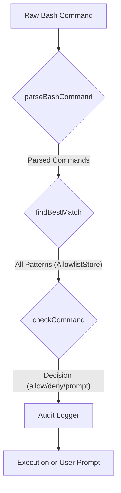

# tests — security

The `tests/security` module is a critical part of the codebase, providing comprehensive validation for the system's security mechanisms. It ensures that AI-generated code and commands operate within defined safety boundaries, protecting against potential vulnerabilities, malicious actions, and unintended side effects.

This documentation outlines the purpose and functionality of the core security components by describing how their corresponding tests validate their behavior.

## Core Security Principles

The security module is built around principles of:
*   **Defense-in-Depth**: Multiple layers of security checks are applied.
*   **Least Privilege**: Components are restricted to the minimum necessary permissions.
*   **Transparency & Auditability**: Security-relevant actions are logged and auditable.
*   **Configurability**: Security policies can be adapted to different operational environments.

## Key Security Components & Their Validation

The `tests/security` module validates the following key components:

### 1. Audit Logging (`src/security/audit-logger.ts`)

The `auditLogger` is responsible for recording all security-relevant events, decisions, and their context. This provides an immutable log for review and analysis, crucial for understanding system behavior and identifying potential breaches.

*   **Purpose**: To provide a centralized, persistent log of security events such as code validation decisions, command execution approvals, and confirmation events.
*   **Validation (`audit-logger.test.ts`)**:
    *   Verifies that `auditLogger.log`, `logCodeValidation`, `logCommandValidation`, and `logConfirmation` correctly store entries with appropriate metadata (action, decision, source, target).
    *   Ensures that `auditLogger.getEntries()` and `getEntriesByAction()` accurately retrieve logged data.
    *   Confirms that `auditLogger.getSummary()` and `formatSummary()` provide correct aggregate statistics (total, blocked, warnings).
    *   Tests the `auditLogger.clear()` functionality and the `maxEntries` limit to manage log size.

### 2. Bash Command Execution Control

This subsystem is designed to safely parse, evaluate, and control the execution of shell commands, a common vector for security risks in AI-driven systems.

#### 2.1. Bash Parser (`src/security/bash-parser.ts`)

The `bash-parser` module provides a robust way to break down complex shell commands into their constituent parts, enabling granular analysis.

*   **Purpose**: To parse raw bash command strings into a structured format, identifying individual commands, arguments, connectors (pipes, `&&`, `||`, `;`), subshells, and environment variable assignments. It supports both a Tree-sitter-based parser (if available) for high accuracy and a fallback parser.
*   **Validation (`bash-parser.test.ts`)**:
    *   Tests `parseBashCommand()` for correct parsing of simple commands, commands with arguments, quoted strings, escaped characters, pipe chains, `&&`/`||`/`;` chains, command substitutions (`$()`, `` ` ``), subshells (`()`), environment variable prefixes, and redirections (`>`, `<`, `2>`).
    *   Verifies `extractCommandNames()` correctly extracts base command names from various command structures.
    *   Ensures `containsCommand()` accurately identifies the presence of specific commands within a complex string.
    *   Tests `containsDangerousCommand()` to detect a predefined list of highly dangerous commands (e.g., `rm`, `dd`, `shutdown`, `kill`, `chmod`, `iptables`, `useradd`, `mount`) even when embedded in chains or subshells.

#### 2.2. Pattern Matcher (`src/security/bash-allowlist/pattern-matcher.ts`)

The `pattern-matcher` provides the core logic for comparing commands against defined patterns.

*   **Purpose**: To offer flexible matching capabilities for bash commands against various pattern types (exact, prefix, glob, regex), validate pattern syntax, and suggest appropriate patterns.
*   **Validation (`bash-allowlist/pattern-matcher.test.ts`)**:
    *   Tests `matchPattern()` for accurate matching across `exact`, `prefix`, `glob` (using `*`, `**`, `?`), and `regex` types.
    *   Verifies `matchApprovalPattern()` correctly considers pattern enablement and expiration dates.
    *   Ensures `findBestMatch()` prioritizes deny patterns over allow patterns, and more specific patterns over general ones.
    *   Tests `validatePattern()` for rejecting empty or overly broad patterns and validating regex syntax.
    *   Confirms `suggestPattern()` provides sensible defaults for common command types (e.g., `ls` -> exact, `npm install` -> glob).
    *   Validates `extractBaseCommand()` and `isPatternDangerous()` for identifying high-risk patterns.

#### 2.3. Allowlist Store (`src/security/bash-allowlist/allowlist-store.ts`)

The `AllowlistStore` manages the persistent collection of approved and denied bash command patterns.

*   **Purpose**: To store, retrieve, and manage a collection of `ApprovalPattern` objects that dictate whether a given bash command should be allowed, denied, or prompt for user confirmation. It includes system-defined safe and dangerous patterns, and allows for user customization.
*   **Validation (`bash-allowlist/allowlist-store.test.ts`)**:
    *   Tests `AllowlistStore` initialization, ensuring default system patterns are loaded.
    *   Verifies `addPattern()`, `removePattern()`, and `updatePattern()` correctly manage user-defined patterns, including disabling system patterns instead of removing them.
    *   Ensures `checkCommand()` accurately matches commands against patterns, applies the correct decision (allow, deny, prompt), and updates usage statistics (`useCount`, `lastUsedAt`).
    *   Validates `getStats()` and `resetStats()` for tracking total, allowed, and denied command checks.
    *   Confirms persistence of patterns to a file and correct loading on reinitialization.
    *   Tests `exportPatterns()` and `importPatterns()` for data portability.
    *   Ensures `clearUserPatterns()` removes only user-defined patterns while preserving system ones.

#### Bash Command Execution Flow

The interaction between these components for bash command validation can be visualized as:

### 3. Code Validation (`src/security/code-validator.ts`)

The `code-validator` module analyzes generated code for potentially unsafe constructs.

*   **Purpose**: To scan code snippets (e.g., JavaScript, TypeScript, Python, SQL) for known dangerous patterns (e.g., `eval()`, `child_process` usage, hardcoded secrets, SQL `DROP` statements) and report findings with severity levels.
*   **Validation (`code-validator.test.ts`)**:
    *   Tests `detectLanguage()` for correctly identifying programming languages based on file path or content heuristics.
    *   Verifies `validateGeneratedCode()` detects a wide range of vulnerabilities, including `eval()`, `innerHTML` assignments, hardcoded secrets, `child_process` imports/calls, prototype pollution, private keys, Python `os.system()`, and SQL `DROP` statements.
    *   Ensures findings are correctly categorized and counted by severity.
    *   Tests `formatValidationReport()` for generating human-readable summaries of findings.

### 4. Dangerous Patterns Registry (`src/security/dangerous-patterns.ts`)

This module centralizes the definitions of known dangerous commands and code patterns.

*   **Purpose**: To provide a single source of truth for regular expressions and command lists that represent security risks across different subsystems (bash, code, skills).
*   **Validation (`dangerous-patterns.test.ts`)**:
    *   Confirms `DANGEROUS_COMMANDS` contains expected high-risk shell commands (e.g., `rm`, `dd`, `sudo`).
    *   Verifies `isDangerousCommand()` correctly identifies these commands, case-insensitively.
    *   Tests `DANGEROUS_BASH_PATTERNS` for matching specific dangerous bash constructs (e.g., `rm -rf /`, `curl | sh`, fork bombs).
    *   Tests `DANGEROUS_CODE_PATTERNS` for matching dangerous code constructs (e.g., `eval()`, `innerHTML`, hardcoded secrets, private keys).
    *   Ensures `getPatternsFor()`, `getPatternsBySeverity()`, and `getPatternsByCategory()` correctly filter patterns.
    *   Validates `matchDangerousPattern()` and `matchAllDangerousPatterns()` for finding matching patterns in given content.

### 5. Docker Sandbox Manager (`src/security/docker-sandbox/manager.ts`)

The `DockerSandboxManager` provides isolated execution environments for untrusted operations.

*   **Purpose**: To manage Docker containers as secure, ephemeral sandboxes for executing commands or code. It enforces tool allowlists and network policies to restrict container capabilities.
*   **Validation (`docker-sandbox/manager.test.ts`)**:
    *   Tests `DockerSandboxManager` initialization and graceful shutdown.
    *   Verifies container lifecycle management: `createContainer()`, `getContainerForSession()`, `destroyContainer()`, `destroyContainerForSession()`.
    *   Ensures `executeInContainer()` and `executeInSession()` correctly run commands and return results (stdout, stderr, exit code, timeout).
    *   Validates `setToolAllowlist()`, `setToolDenylist()`, and `isToolAllowed()` for enforcing tool execution policies, including denylist prioritization.
    *   Tests `setNetworkPolicy()` for configuring allowed hosts and blocked ports.
    *   Checks `getMetrics()` and `getAllMetrics()` for retrieving container resource usage.
    *   Confirms `cleanupIdleContainers()` effectively removes inactive sandboxes.
    *   Verifies the manager emits relevant events (`container:created`, `container:destroyed`, `execution:complete`, `policy:violation`).
    *   Includes tests for `MockDockerClient` to ensure the mock behaves as expected for unit testing.

### 6. Environment Variable Blocklist (`src/security/env-blocklist.ts`)

This module sanitizes environment variables to prevent injection attacks.

*   **Purpose**: To remove potentially dangerous or exploitable environment variables (e.g., `LD_PRELOAD`, `GIT_SSH_COMMAND`, `NPM_CONFIG_REGISTRY`) from an environment object before passing it to child processes.
*   **Validation (`env-blocklist.test.ts`)**:
    *   Tests `sanitizeEnvVars()` for correctly identifying and removing specific blocked variables (e.g., `LD_PRELOAD`, `_JAVA_OPTIONS`, `DYLD_INSERT_LIBRARIES`, `GLIBC_TUNABLES`, `PYTHONBREAKPOINT`).
    *   Verifies that variables matching blocked prefixes (e.g., `GIT_`, `NPM_CONFIG_`, `GRADLE_OPTS`, `MAVEN_OPTS`, `SBT_OPTS`, `ANT_OPTS`, `DOTNET_`) are also removed.
    *   Ensures that safe and necessary environment variables (e.g., `PATH`, `HOME`, `NODE_ENV`) are preserved.

### 7. System-wide Security Auditor (`src/security/security-audit.ts`)

The `SecurityAuditor` performs a comprehensive scan of the system's security posture.

*   **Purpose**: To conduct a holistic security audit of the system's configuration, environment variables, file permissions, plugin installations, and channel settings, identifying potential vulnerabilities and providing recommendations. It can also attempt to auto-fix certain issues.
*   **Validation (`security-audit.test.ts`)**:
    *   Tests `SecurityAuditor.audit()` for generating a structured `AuditResult` with timestamp, duration, findings, and a summary.
    *   Verifies correct calculation of `summary` statistics (critical, high, medium, low, info) and the overall `passed` status.
    *   Checks for authentication-related findings: missing/weak `JWT_SECRET`, short/test API keys (Grok, OpenAI, Anthropic, ElevenLabs).
    *   Validates authorization-related findings: `YOLO_MODE=true`, `SECURITY_MODE=full-auto`, high `MAX_COST`.
    *   (On Unix-like systems) Tests credentials and file permission checks: insecure permissions for config, credentials, sessions, and plugins directories.
    *   Confirms configuration-related findings: `DEBUG` mode, `NODE_ENV=development`, verbose logging.
    *   Tests plugin-related findings: custom plugins installed, plugins missing `package.json`.
    *   Validates channel-related findings: `DM_POLICY=open`, configured bot tokens (Telegram, Discord, Slack).
    *   Checks browser-related findings: `CHROME_REMOTE_DEBUGGING_PORT`, remote `CDP_URL`.
    *   Ensures `SecurityAuditor.fix()` can correctly remediate fixable findings (e.g., file permissions) and reports errors for non-fixable ones.
    *   Tests `SecurityAuditor.formatResult()` for generating clear, sorted, human-readable audit reports.
    *   Verifies the singleton pattern for `getSecurityAuditor()` and `resetSecurityAuditor()`.

### 8. Skill Scanner (`src/security/skill-scanner.ts`)

The `skill-scanner` module specifically targets security risks within skill definition files.

*   **Purpose**: To scan skill files (e.g., Markdown, TypeScript) for dangerous patterns that could lead to code execution, filesystem manipulation, network access, or exposure of sensitive information.
*   **Validation (`skill-scanner.test.ts`)**:
    *   Tests `scanFile()`, `scanDirectory()`, and `scanAllSkills()` for detecting a wide array of dangerous patterns within skill content. This includes:
        *   **Code Execution**: `eval()`, `new Function()`, `child_process` imports/calls (`exec`, `execSync`, `execFile`, `spawn`).
        *   **Filesystem Operations**: `rm -rf`, `unlinkSync`, `writeFileSync`, `rmdirSync`.
        *   **Network Activity**: `fetch` with HTTP, `axios`, `require('http')`, `WebSocket`.
        *   **Dynamic Imports**: `require(variable)`, `import(variable)`.
        *   **Environment/Secrets**: Dynamic `process.env` access, references to common secret names (e.g., `API_KEY`, `SECRET`).
    *   Ensures findings are correctly assigned severity levels (critical, high, medium, low, info).
    *   Tests `formatScanReport()` for generating clear summaries of scan results.

### 9. Plugin Context Engine Trust (`src/plugins/plugin-manager.ts` interaction)

This test specifically validates a security gate within the `PluginManager` related to context engines.

*   **Purpose**: To ensure that only explicitly trusted plugins can register powerful context engines that "own compaction" (a capability that allows a plugin to fully control how context is managed, which could be a security risk if abused).
*   **Validation (`context-engine-trust.test.ts`)**:
    *   Verifies that an untrusted plugin attempting to register a context engine with `ownsCompaction: true` is blocked, and a `plugin:context-engine-denied` event is emitted.
    *   Confirms that a trusted plugin *is* allowed to register such an engine, emitting `plugin:context-engine-registered`.
    *   Ensures that *any* plugin (trusted or untrusted) can register a context engine if `ownsCompaction` is `false`, as this is considered a less privileged operation.

### Other Security-Related Modules (from Call Graph)

The call graph indicates interactions with other security-related modules, even if their test source wasn't provided:

*   **`src/security/trust-folders.ts`**: Manages a list of trusted folders from which code execution is permitted, preventing execution from untrusted locations. (Tested by `tests/security/trust-folders.test.ts`).
*   **`src/security/write-policy.ts`**: Implements a policy for controlling and gating write operations to the filesystem, ensuring that only authorized writes occur. (Tested by `tests/security/write-policy.test.ts`).
*   **`src/security/syntax-validator.ts`**: Provides functionality to validate the syntax of various code snippets, ensuring they are well-formed before further processing or execution. (Tested by `tests/security/syntax-validator.test.ts`).

## How to Contribute and Extend

When contributing to or extending the security module:

1.  **Understand the Threat Model**: Before adding new features or modifying existing ones, consider potential attack vectors and how your changes might introduce new risks or mitigate existing ones.
2.  **Add Comprehensive Tests**: Any new security feature or pattern detection *must* be accompanied by thorough tests in the `tests/security` directory.
    *   **Positive Tests**: Verify that safe operations pass without triggering security alerts.
    *   **Negative Tests**: Ensure that dangerous or malicious inputs are correctly identified and handled (blocked, warned, logged).
    *   **Edge Cases**: Test complex syntax, nested structures, and unusual inputs.
3.  **Update Dangerous Patterns**: If new types of dangerous commands or code patterns are identified, update `src/security/dangerous-patterns.ts` and add corresponding tests to `dangerous-patterns.test.ts`.
4.  **Integrate with Audit Logger**: Ensure all security-relevant decisions and events are logged via `auditLogger` for transparency and auditability.
5.  **Consider Performance**: Security checks can be computationally intensive. Optimize new checks to minimize impact on system responsiveness.
6.  **Review Existing Code**: Familiarize yourself with the existing security checks and patterns to maintain consistency and avoid duplication.