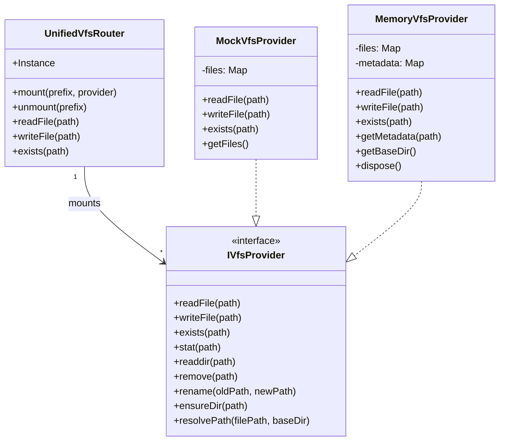

# tests — services

This document describes the `composite-routing.test.ts` module, which is a test suite for the Virtual File System (VFS) routing capabilities within the application's service layer.

## Module Overview

The `composite-routing.test.ts` module is responsible for verifying the correct behavior of the `UnifiedVfsRouter`. This router acts as a central dispatcher for VFS operations, allowing different VFS providers (e.g., in-memory, local disk, remote storage) to be mounted at specific path prefixes. The tests ensure that the router correctly delegates file system operations to the appropriate mounted provider based on the requested path.

### Purpose

The primary goals of this test module are to:
*   Validate the `UnifiedVfsRouter`'s ability to mount and unmount `IVfsProvider` implementations.
*   Confirm that VFS operations (`readFile`, `writeFile`, `exists`, etc.) are correctly routed to the longest matching mounted provider.
*   Test the specific functionality of the `MemoryVfsProvider`, including its configuration, file operations, and metadata tracking (e.g., TTL).

### Context: VFS Architecture

The VFS architecture is designed to abstract away the underlying storage mechanism. At its core, the `UnifiedVfsRouter` provides a unified interface for interacting with various file systems. It achieves this by allowing different `IVfsProvider` implementations to be registered ("mounted") at specific URL-like prefixes (e.g., `memory://`, `local://`). When a VFS operation is requested, the router determines which provider is responsible for the given path and delegates the call.

## Key Test Subjects

### `UnifiedVfsRouter`

The central component under test. `UnifiedVfsRouter` is a singleton (`UnifiedVfsRouter.Instance`) that manages a collection of `IVfsProvider` instances, each associated with a unique path prefix. It exposes methods like `readFile`, `writeFile`, `exists`, `mount`, and `unmount`. The tests extensively interact with this singleton to verify its routing logic.

### `MemoryVfsProvider`

A concrete implementation of `IVfsProvider` that stores files entirely in memory. This provider is tested for its ability to:
*   Handle basic file operations (`writeFile`, `readFile`).
*   Manage configuration options like `baseDir`, `autoCleanup`, and `defaultTtlMs`.
*   Track file metadata, including `createdAt`, `updatedAt`, and `ttlMs`.
*   Properly dispose of resources.

## Testing Utilities

### `MockVfsProvider`

To effectively test the `UnifiedVfsRouter`'s routing logic without relying on actual file system interactions, a `MockVfsProvider` class is defined within the test file. This mock implements the `IVfsProvider` interface and simulates an in-memory file system using a simple `Map<string, string>` to store file paths and their contents.

Key characteristics of `MockVfsProvider`:
*   **In-memory storage**: All file operations (`readFile`, `writeFile`, `exists`, `remove`, `rename`) manipulate an internal `Map`.
*   **Simplified `stat` and `readdir`**: Returns basic file stats and a list of all known files, suitable for routing tests.
*   **Direct access**: Includes a `getFiles()` method for test assertions to inspect the internal state of the mock.

This mock is crucial for isolating the `UnifiedVfsRouter`'s behavior and ensuring that it correctly interacts with *any* `IVfsProvider` implementation.

## Test Suites and Scenarios

The tests are organized into several `describe` blocks, each focusing on a specific aspect of the `UnifiedVfsRouter` or `MemoryVfsProvider`.

### `mount/unmount` Operations

This suite verifies the lifecycle management of VFS providers within the router:
*   **Mounting**: Ensures a provider can be successfully associated with a prefix and appears in `router.getMountedPrefixes()`.
*   **Unmounting**: Confirms that a mounted provider can be removed, and `router.unmount()` returns `true` for successful removal and `false` for non-existent prefixes.
*   **Replacement**: Tests that mounting a new provider at an existing prefix correctly replaces the old one.

### Core Routing Logic

This is the most critical suite, validating that `UnifiedVfsRouter` correctly delegates operations:
*   **`readFile` routing**: Verifies that `router.readFile()` retrieves content from the correct mounted `MockVfsProvider`.
*   **`writeFile` routing**: Ensures `router.writeFile()` writes content to the correct mounted `MockVfsProvider`.
*   **`exists` routing**: Checks that `router.exists()` correctly queries the appropriate provider.
*   **Longest prefix match**: A key routing feature, this test confirms that if multiple providers match a path (e.g., `a/` and `a/b/`), the router selects the provider with the longest matching prefix (`a/b/`).

### `MemoryVfsProvider` Functionality

This suite specifically tests the `MemoryVfsProvider` implementation:
*   **Default configuration**: Verifies that a `MemoryVfsProvider` can be instantiated with default or specified configurations (e.g., `baseDir`, `autoCleanup`).
*   **Read/Write operations**: Confirms basic `writeFile` and `readFile` functionality.
*   **Metadata tracking**: Tests that `MemoryVfsProvider` correctly stores and retrieves file metadata, including `ttlMs`, `createdAt`, and `updatedAt`, as configured.
*   **Resource disposal**: Implicitly tests `dispose()` by ensuring no leaks or errors occur.

## Testing Methodology

Each test in `composite-routing.test.ts` follows a consistent pattern:
1.  **Setup**: In the `beforeEach` hook, the `UnifiedVfsRouter.Instance` is accessed, and any previously mounted providers are unmounted to ensure a clean state for each test.
2.  **Instantiation**: `MockVfsProvider` instances are created as needed to simulate different VFS backends. `MemoryVfsProvider` instances are created for specific tests of that provider.
3.  **Action**: `UnifiedVfsRouter` methods (`mount`, `unmount`, `readFile`, `writeFile`, `exists`) are called with specific paths. For `MemoryVfsProvider` tests, its direct methods are called.
4.  **Assertion**: `expect` statements are used to verify the outcomes, such as:
    *   The content returned by `readFile`.
    *   The presence or absence of files in the underlying `MockVfsProvider` (via `mock.readFile()`).
    *   The list of mounted prefixes from `router.getMountedPrefixes()`.
    *   The metadata returned by `MemoryVfsProvider.getMetadata()`.

This approach ensures that the `UnifiedVfsRouter`'s routing logic is thoroughly tested in isolation from actual I/O, while also verifying the correct behavior of a concrete `IVfsProvider` implementation.