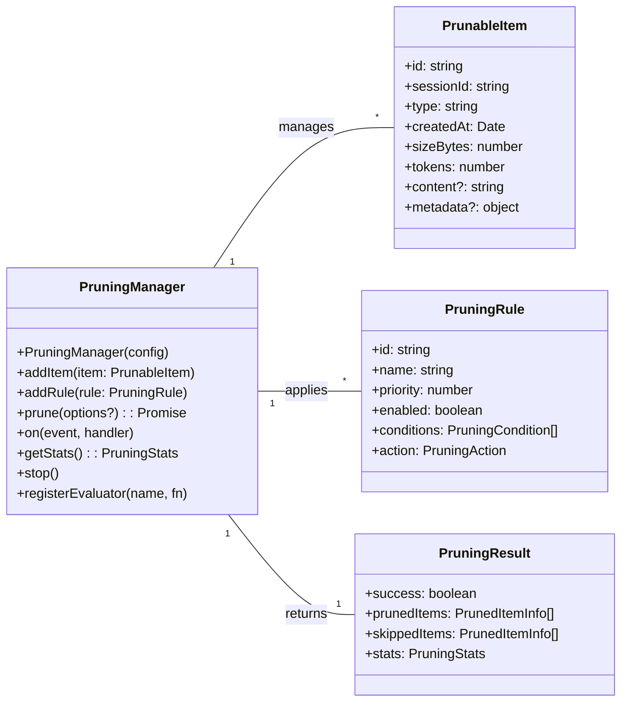

# tests — session-pruning

This document describes the **Session Pruning** module, located at `src/session-pruning/index.js` and `src/session-pruning/pruning-manager.ts`. This module provides a robust and configurable mechanism for automatically managing and reducing the size of session-related data based on defined rules.

The primary goal of this module is to prevent unbounded growth of session data, ensuring efficient resource usage and maintaining system performance by proactively identifying and acting upon items that meet specific criteria (e.g., age, size, type).

## Core Concepts

The session pruning module revolves around a few key concepts:

1.  **`PrunableItem`**: Any piece of data that can be subject to pruning. It must have an `id`, `sessionId`, `type`, `createdAt` timestamp, and metrics like `sizeBytes` and `tokens`.
2.  **`PruningRule`**: Defines the criteria for pruning and the action to take. Rules consist of `conditions` (what makes an item prunable) and an `action` (what to do with it). Rules have a `priority` to determine application order.
3.  **`PruningManager`**: The central class responsible for managing items, rules, configuration, and executing the pruning process. It can be configured globally or on a per-session basis.

## `PruningManager` Overview

The `PruningManager` is the orchestrator of the session pruning process. It maintains a collection of `PrunableItem`s and `PruningRule`s, and periodically (or on demand) evaluates items against these rules.

### Instantiation and Lifecycle

You can create a `PruningManager` instance directly or use the provided singleton accessors.

```typescript
import { PruningManager, getPruningManager, resetPruningManager } from '../../src/session-pruning/index.js';

// Direct instantiation
const manager = new PruningManager({
  enabled: true,
  rules: [],
  checkIntervalMs: 5000, // Check every 5 seconds
  minPruneIntervalMs: 1000, // Don't prune more often than every 1 second
  dryRun: false,
});

// Singleton access
const singletonManager = getPruningManager();

// Resetting the singleton (primarily for testing)
resetPruningManager();
```

The manager can be stopped to halt any background pruning checks:
```typescript
manager.stop();
```

### Architecture Diagram



## Configuration

The `PruningManager` supports both global and session-specific configurations.

### Global Configuration

The global configuration dictates the overall behavior of the pruning process.

```typescript
import { DEFAULT_PRUNING_CONFIG } from '../../src/session-pruning/index.js';

// Get current config
const config = manager.getConfig();

// Update config
manager.updateConfig({
  enabled: false, // Disable pruning globally
  dryRun: true,   // Perform dry runs only
});

// Default configuration is used if not provided
const defaultManager = new PruningManager();
expect(defaultManager.getConfig().enabled).toBe(DEFAULT_PRUNING_CONFIG.enabled);
```

### Session-Specific Configuration

Individual sessions can have their own pruning settings, such as being exempt from pruning.

```typescript
// Exempt 'session-1' from pruning
manager.setSessionConfig('session-1', { exempt: true });

// Remove session-specific config
manager.removeSessionConfig('session-1');
```

## Item Management

The `PruningManager` acts as a repository for `PrunableItem`s.

```typescript
import { type PrunableItem } from '../../src/session-pruning/index.js';

// Helper to create a test item
function createItem(overrides: Partial<PrunableItem> = {}): PrunableItem {
  return {
    id: `item-${Math.random().toString(36).slice(2)}`,
    sessionId: 'session-1',
    type: 'message',
    createdAt: new Date(),
    sizeBytes: 100,
    tokens: 50,
    ...overrides,
  };
}

const item1 = createItem({ sessionId: 'session-1' });
const item2 = createItem({ sessionId: 'session-2' });

// Add items
manager.addItem(item1);
manager.addItem(item2);

// Retrieve items
const retrievedItem = manager.getItem(item1.id);
const allItems = manager.getAllItems();
const session1Items = manager.getSessionItems('session-1');

// Remove items
manager.removeItem(item1.id); // Removes a specific item
manager.clearItems();        // Removes all items
```

Items that are `archive`d by a rule are moved to a separate collection:
```typescript
const archivedItems = manager.getArchivedItems();
```

## Pruning Rules

Pruning rules define *what* to prune and *how*. Each rule has an `id`, `name`, `priority`, `enabled` status, `conditions`, and an `action`.

```typescript
import { type PruningRule } from '../../src/session-pruning/index.js';

const myRule: PruningRule = {
  id: 'my-custom-rule',
  name: 'Delete old messages',
  priority: 100, // Higher priority rules are evaluated first
  enabled: true,
  conditions: [
    { type: 'age', maxAgeMs: 24 * 60 * 60 * 1000 }, // Older than 24 hours
    { type: 'type', messageTypes: ['message'], include: true }, // Only messages
  ],
  action: { type: 'delete' },
};

// Add a rule
manager.addRule(myRule);

// Update a rule (by ID)
manager.addRule({ ...myRule, priority: 200 });

// Enable/disable a rule
manager.setRuleEnabled('my-custom-rule', false);

// Remove a rule
manager.removeRule('my-custom-rule');
```

### Pruning Conditions

Conditions determine if an item should be pruned. Multiple conditions in a rule are typically combined with an `AND` logic.

*   **`age`**: Prunes items older than `maxAgeMs`.
    ```typescript
    { type: 'age', maxAgeMs: 1000 * 60 * 60 * 24 } // Older than 24 hours
    ```
*   **`size`**: Prunes items if their `sizeBytes` exceeds `maxBytes`.
    ```typescript
    { type: 'size', maxBytes: 1024 * 1024 } // Larger than 1MB
    ```
*   **`tokens`**: Prunes items if their `tokens` count exceeds `maxTokens`.
    ```typescript
    { type: 'tokens', maxTokens: 500 } // More than 500 tokens
    ```
*   **`type`**: Prunes items based on their `type` property.
    *   `include: true`: Prunes items whose `type` is in `messageTypes`.
    *   `include: false`: Prunes items whose `type` is *not* in `messageTypes`.
    ```typescript
    { type: 'type', messageTypes: ['checkpoint', 'system'], include: true }
    { type: 'type', messageTypes: ['user_message'], include: false }
    ```
*   **`custom`**: Allows registering and using custom evaluation functions.
    ```typescript
    // Register a custom evaluator
    manager.registerEvaluator('isImportant', (item: PrunableItem) => {
      return item.metadata?.important === true;
    });

    // Use it in a rule
    const customRule: PruningRule = {
      id: 'custom-important-rule',
      name: 'Prune important items',
      priority: 10,
      enabled: true,
      conditions: [{ type: 'custom', fn: 'isImportant' }],
      action: { type: 'delete' },
    };
    manager.addRule(customRule);
    ```

### Pruning Actions

Actions define what happens to an item once it meets a rule's conditions.

*   **`delete`**: Permanently removes the item from the manager.
    ```typescript
    { type: 'delete' }
    ```
*   **`archive`**: Removes the item from the active set and moves it to an internal archive. A `destination` can be specified for metadata.
    ```typescript
    { type: 'archive', destination: 'long-term-storage' }
    ```
*   **`summarize`**: Modifies the item's `content` to a shorter, summarized version, aiming for `targetTokens`. This action implies an external summarization service or logic.
    ```typescript
    { type: 'summarize', targetTokens: 50 }
    ```
*   **`compact`**: Reduces the item's `sizeBytes` and `tokens` by a `ratio`. This action implies an external compaction service or logic.
    ```typescript
    { type: 'compact', ratio: 0.5 } // Reduce size/tokens by 50%
    ```

### Rule Priority

Rules are applied in order of their `priority` (higher number first). If an item is pruned by a higher-priority rule, lower-priority rules for that item are skipped.

```typescript
const lowPriorityRule: PruningRule = { /* ... action: archive */ priority: 10 };
const highPriorityRule: PruningRule = { /* ... action: delete */ priority: 100 };

manager.addRule(lowPriorityRule);
manager.addRule(highPriorityRule);

// If an item matches both, the 'delete' action (high priority) will be applied.
```

## Executing Pruning

Pruning can be triggered manually or automatically by the manager's internal timer (if `checkIntervalMs` is set and `enabled` is true).

```typescript
import { type PruningResult } from '../../src/session-pruning/index.js';

// Trigger pruning manually
const result: PruningResult = await manager.prune();

if (result.success) {
  console.log(`Pruned ${result.prunedItems.length} items.`);
  console.log(`Freed ${result.stats.freedBytes} bytes and ${result.stats.freedTokens} tokens.`);
} else {
  console.error('Pruning failed:', result.error);
}
```

### Dry Run Mode

When `dryRun` is enabled in the configuration, the `prune()` method will identify items that *would* be pruned but will not modify the actual item store. The `PruningResult` will still contain `prunedItems` with a reason indicating it was a dry run.

```typescript
manager.updateConfig({ dryRun: true });
const result = await manager.prune();
// result.prunedItems will contain items, but manager.getAllItems() will be unchanged.
```

### Session Exemption

Sessions can be marked as `exempt` from pruning via `setSessionConfig`. Items belonging to exempt sessions will be skipped unless `prune()` is called with `force: true`.

```typescript
manager.setSessionConfig('session-1', { exempt: true });

// Items in 'session-1' will be skipped
await manager.prune();

// Items in 'session-1' will be pruned despite exemption
await manager.prune({ force: true });
```

## Events

The `PruningManager` extends `EventEmitter` and emits various events during the pruning process, allowing external components to react to its lifecycle.

```typescript
manager.on('start', () => {
  console.log('Pruning process started.');
});

manager.on('progress', (progress: { scanned: number; total: number }) => {
  console.log(`Pruning progress: ${progress.scanned}/${progress.total} items scanned.`);
});

manager.on('item-pruned', (itemInfo: PruningResult['prunedItems'][0]) => {
  console.log(`Item ${itemInfo.item.id} pruned by rule ${itemInfo.ruleId} with action ${itemInfo.action}.`);
});

manager.on('complete', (result: PruningResult) => {
  console.log('Pruning process complete.', result);
});
```

## Statistics

The manager provides real-time statistics about the items it manages and detailed statistics about each pruning run.

### Global Statistics

```typescript
const stats = manager.getStats();
console.log('Global Stats:', {
  totalItems: stats.globalStats.totalItems,
  totalBytes: stats.globalStats.totalBytes,
  totalTokens: stats.globalStats.totalTokens,
  totalSessions: stats.globalStats.totalSessions,
});
```

### Pruning Run Statistics

The `PruningResult` object returned by `prune()` includes statistics specific to that run.

```typescript
const result = await manager.prune();
console.log('Pruning Run Stats:', {
  scannedCount: result.stats.scannedCount,
  prunedCount: result.stats.prunedCount,
  skippedCount: result.stats.skippedCount,
  freedBytes: result.stats.freedBytes,
  freedTokens: result.stats.freedTokens,
  durationMs: result.stats.durationMs,
});
```