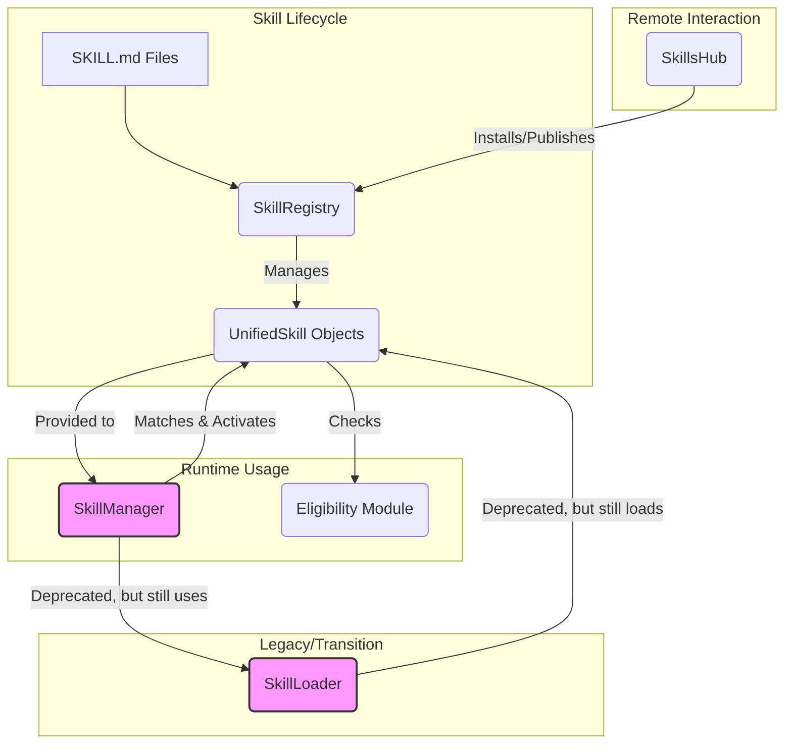

# tests — skills

This document provides a comprehensive overview of the `skills` module, which is central to how the application discovers, manages, and utilizes AI capabilities. It covers the core components, their interactions, and the lifecycle of a skill, with a focus on the current architecture and ongoing transitions.

## Module Overview

The `skills` module is responsible for defining, loading, validating, and managing AI skills. These skills empower the AI agent with specific knowledge, tools, and behaviors, allowing it to perform complex tasks by leveraging external resources or specialized prompts.

Skills are primarily defined as Markdown files (`SKILL.md`) with YAML frontmatter, allowing for human-readable definitions alongside structured metadata. The module handles:

*   **Discovery**: Finding `SKILL.md` files across various predefined directories.
*   **Validation**: Ensuring skills adhere to a defined structure and content quality.
*   **Loading**: Parsing skill files into an internal representation.
*   **Layering**: Resolving conflicts when skills with the same name exist in different sources.
*   **Eligibility**: Checking if a skill's prerequisites (binaries, environment variables, platform) are met.
*   **Matching & Activation**: Selecting the most relevant skill based on user input and injecting its context into the AI's prompt.
*   **Remote Management**: Interacting with a central "Skill Hub" for discovery, installation, and updates of skills.
*   **Deprecation Handling**: Managing the transition from older skill management systems to newer, more robust ones.

## Core Concepts

### Skill Definition (`SKILL.md`)

Skills are defined using Markdown files named `SKILL.md`. These files consist of:

*   **YAML Frontmatter**: Structured metadata at the beginning of the file, enclosed by `---` delimiters. This includes fields like `name`, `version`, `description`, `author`, `tags`, `triggers`, `priority`, `tools`, `env` (environment variable overrides), and `requires` (for eligibility checks).
*   **Markdown Body**: The main content of the skill, typically containing the system prompt, usage instructions, examples, and any other relevant information for the AI.

### Skill Tiers and Sources

Skills can originate from several sources, each with a defined priority for overriding duplicates:

*   **`bundled`**: Pre-packaged skills shipped with the application. These are read-only.
*   **`managed`**: Skills installed via the `SkillsHub`. These are managed by the application.
*   **`workspace`**: Skills defined within the current project's `.codebuddy/skills` directory.
*   **`global`**: Skills defined in a user's global `.codebuddy/skills` directory.
*   **`team`**: Skills defined in a shared team-specific directory (higher priority than project/global).
*   **`agent`**: Skills specifically registered for a particular AI agent.
*   **`legacy`**: Skills loaded from the older JSON-based format, converted to the unified format.

The loading order (and thus override priority) is generally: `agent` > `team` > `workspace` > `project` > `global` > `managed` > `bundled`.

### Unified vs. Legacy Skills

The skill system is undergoing a transition:

*   **Legacy Skills**: Older, JSON-based skill definitions. These are still supported for backward compatibility but are being phased out. Components like `SkillManager` and `SkillLoader` primarily dealt with these.
*   **Unified Skills (`UnifiedSkill`)**: The new, canonical internal representation of a skill, derived from `SKILL.md` files. All new development and core logic aim to use this format. Adapters exist to convert legacy skills to `UnifiedSkill` objects.

### Skill Eligibility

Skills can declare prerequisites in their frontmatter using the `requires` field. The `eligibility.js` module provides functions to check:

*   **`bins`**: Required binaries (e.g., `git`, `docker`).
*   **`env`**: Required environment variables.
*   **`configs`**: Required configuration files.
*   **`platform`**: Supported operating systems (e.g., `linux`, `darwin`, `win32`).
*   **`nodeVersion`**: Minimum Node.js version.

### Starter Packs

A special category of skills, identified by the `starter` or `scaffold` tag, designed to help users set up new projects or configurations. These often have aliases for easier discovery (e.g., "react" -> "typescript-react").

## Architecture & Components

The `skills` module is composed of several key components, some representing the evolving architecture.

### `SkillRegistry` (The Future)

The `SkillRegistry` (`src/skills/skill-registry.js`) is designed to be the central, unified manager for all skills. It handles the lifecycle of skills, from discovery to content retrieval.

*   **Purpose**: Provides a single source of truth for all available skills, regardless of their origin (bundled, managed, workspace). It's responsible for parsing `SKILL.md` files, storing their metadata, and providing access to their content.
*   **Key Features**:
    *   `parseFrontmatter(content: string)`: Extracts YAML frontmatter from `SKILL.md` content.
    *   `install(name: string, content: string)`: Installs a skill, typically into the `managed` directory, and updates its internal state.
    *   `uninstall(name: string)`: Removes a managed skill. Bundled skills cannot be uninstalled.
    *   `scan()`: Discovers and loads skills from all configured directories (`bundled`, `managed`, `workspace`).
    *   `list(source?: SkillSource)`: Returns a list of skills, optionally filtered by source.
    *   `get(name: string)`: Retrieves a skill's metadata by name.
    *   `setEnabled(name: string, enabled: boolean)`: Toggles a skill's enabled status.
    *   `getContent(name: string)`: Retrieves the full Markdown content of a skill.
    *   `getEnvOverrides(name: string)`: Returns environment variables defined in a skill's frontmatter.
    *   `refresh()`: Re-scans all skill directories to pick up changes.
*   **Relationship**: `SkillsHub` interacts directly with `SkillRegistry` for installing and publishing skills.

### `SkillLoader` (The Current Workhorse - Deprecated)

The `SkillLoader` (`src/skills/skill-loader.js`) is currently responsible for discovering and loading skills from local directories (global, project, team, agent-specific). It handles the layering logic, where skills from higher-priority sources override those from lower-priority ones.

*   **Purpose**: To load skills from the local filesystem into memory, applying layering rules.
*   **Key Features**:
    *   `loadFromDirectory(dir: string, source: SkillSource)`: Loads skills from a specific directory.
    *   `loadAll()`: Orchestrates loading from all configured global, project, team, and agent-specific directories.
    *   `getSkills()`: Returns all currently loaded skills.
    *   `getSkill(name: string)`: Retrieves a loaded skill by name.
    *   `getSkillsForAgent(agentId: string)`: Filters skills relevant to a specific agent.
    *   `filterSkillsByCapabilities(skills: LoadedSkill[], allowedTools: string[])`: Filters skills based on the tools they require and the tools available to the agent.
    *   `registerAgentSkillsDir(agentId: string, dir: string)` / `unregisterAgentSkillsDir(agentId: string)`: Manages agent-specific skill directories.
    *   `getStats()`: Provides statistics on loaded skills by source and agent.
*   **Deprecation**: `SkillLoader` is marked as deprecated (`deprecation-warnings.test.ts`). Its functionality is being absorbed by `SkillRegistry` and other components to streamline skill management.

### `SkillManager` (The Legacy Matcher - Deprecated)

The `SkillManager` (`src/skills/skill-manager.js`) is the runtime component responsible for matching user input to relevant skills and activating them. It also provides the prompt enhancement that gets injected into the AI's system prompt.

*   **Purpose**: To provide a mechanism for dynamically selecting and activating skills based on conversational context or explicit commands.
*   **Key Features**:
    *   `initialize()`: Loads predefined and custom skills.
    *   `getAvailableSkills()`: Returns a list of all skill names.
    *   `getSkill(name: string)`: Retrieves a skill by name.
    *   `matchSkills(inputText: string, topN?: number)`: Finds skills whose `triggers` match the input text, scoring them based on relevance and `priority`.
    *   `autoSelectSkill(inputText: string)`: Selects the single best-matching skill above a certain confidence threshold.
    *   `registerSkill(skill: Skill)`: Programmatically adds a skill.
    *   `activateSkill(name: string)`: Sets a skill as active, emitting a `skill:activated` event.
    *   `deactivateSkill()`: Clears the active skill, emitting a `skill:deactivated` event.
    *   `getActiveSkill()`: Returns the currently active skill.
    *   `getSkillPromptEnhancement()`: Generates a Markdown block containing the active skill's system prompt and other context, intended for injection into the AI's main system prompt.
*   **Deprecation**: `SkillManager` is also marked as deprecated (`deprecation-warnings.test.ts`). Its core matching and activation logic will likely be integrated into a more unified agent orchestration layer, leveraging `UnifiedSkill` objects from `SkillRegistry`.

### `SkillsHub` (The Remote Gateway)

The `SkillsHub` (`src/skills/hub.js`) manages interaction with a remote skill registry, allowing for discovery, installation, and updates of skills from a central repository.

*   **Purpose**: To provide a seamless way for users to find, install, and manage skills from a remote source, and for developers to publish their skills.
*   **Key Features**:
    *   `search(query: string, options?: SearchOptions)`: Queries the remote registry (or local cache if offline) for skills, supporting filtering by tags and pagination.
    *   `install(name: string)`: Downloads and installs a skill from the remote hub.
    *   `installFromContent(name: string, content: string)`: Installs a skill from provided content (e.g., for local development or testing).
    *   `uninstall(name: string)`: Removes an installed skill.
    *   `sync()`: Checks for orphaned skill files or checksum mismatches and updates the local lockfile.
    *   `list()`: Lists locally installed skills.
    *   `info(name: string)`: Provides detailed information about an installed skill, including an integrity check.
    *   `publish(skillPath: string)`: Prepares a local `SKILL.md` file for publishing to the remote hub, computing checksums and metadata.
    *   `update(skillName?: string)`: Checks for and installs newer versions of installed skills.
    *   `computeChecksum(content: string)`: Generates a SHA-256 checksum for skill content.
    *   `compareSemver(a: string, b: string)` / `parseSemver(version: string)`: Utilities for semantic version comparison.
*   **Relationship**: `SkillsHub` manages a local `lock.json` file to track installed skills and their versions/checksums. It interacts with `SkillRegistry` to perform the actual file system operations for installation and uninstallation.

### `Eligibility Module` (`src/skills/eligibility.js`)

This module provides a set of utility functions to check system prerequisites for skills.

*   **Purpose**: To determine if a skill can run on the current environment by verifying the presence of required binaries, environment variables, configuration files, and platform/Node.js version compatibility.
*   **Key Functions**:
    *   `isBinaryAvailable(binary: string)` / `getBinaryPath(binary: string)`: Checks for executable binaries.
    *   `isEnvSet(envVar: string)`: Checks if an environment variable is set and non-empty.
    *   `isConfigPresent(configPath: string)`: Checks for the existence of a file path (supports `~` expansion).
    *   `isPlatformSupported(platform: string | string[])`: Checks if the current OS matches the required platform(s).
    *   `isNodeVersionSufficient(requiredVersion: string)`: Compares current Node.js version against a minimum requirement.
    *   `checkEligibility(requirements: SkillRequirements)`: The main entry point, combining all checks and returning an `eligible` status with `reasons` for failure.
    *   `parseRequirements(input: string)`: Parses skill requirements from a string (JSON or simplified format).

### `Legacy Adapters` (`src/skills/adapters/legacy-skill-adapter.js`)

This module facilitates the conversion between the old JSON-based skill format and the new `UnifiedSkill` format.

*   **Purpose**: To ensure backward compatibility while transitioning to the `SKILL.md`-based system.
*   **Key Functions**:
    *   `legacyToUnified(legacySkill: LegacySkill)`: Converts a legacy JSON skill to a `UnifiedSkill`.
    *   `legacyLoadedToUnified(legacyLoadedSkill: LegacyLoadedSkill)`: Converts a loaded legacy skill (which includes source/path info) to a `UnifiedSkill`.
    *   `unifiedToLegacy(unifiedSkill: UnifiedSkill)`: Converts a `UnifiedSkill` back to a legacy format (primarily for components still expecting it).
    *   `skillMdToUnified(skill: Skill)`: Converts a parsed `SKILL.md` object to a `UnifiedSkill`.
    *   `unifiedToSkillMd(unifiedSkill: UnifiedSkill)`: Converts a `UnifiedSkill` back to a `SKILL.md` object.

### `Bundled Skills Validation` (`tests/skills/bundled-skills.test.ts`)

While a test file, it highlights a critical aspect of the skill system: the integrity of pre-packaged skills.

*   **Purpose**: To ensure that all `SKILL.md` files shipped with the application are correctly formatted, contain all required metadata, and have meaningful content.
*   **Checks**: Validates frontmatter fields, markdown body structure (headings, code blocks), and overall content quality.

### `Starter Packs Module` (`src/skills/starter-packs.js`)

This module provides helpers for working with "starter pack" skills.

*   **Purpose**: To identify, list, and find starter packs, often used for scaffolding new projects.
*   **Key Functions**:
    *   `isStarterPack(skill: UnifiedSkill)`: Checks if a skill is tagged as a starter pack.
    *   `getStarterPacks(language?: string)`: Lists all starter packs, optionally filtered by language.
    *   `findStarterPack(query: string)`: Searches for a starter pack by name or keyword, using a combination of BM25 search and keyword matching.
    *   `findStarterByKeyword(text: string)`: Specifically searches for starter packs based on keywords in the input text.
    *   `resolveStarterAlias(alias: string)`: Resolves common aliases (e.g., "react" to "typescript-react") to their canonical skill names.

## Skill Lifecycle Flow

1.  **Definition**: A skill is created as a `SKILL.md` file with YAML frontmatter and Markdown content.
2.  **Discovery**:
    *   `SkillRegistry` (or `SkillLoader` in the legacy flow) scans predefined local directories (`bundled`, `managed`, `workspace`, `global`, `project`, `team`, `agent-specific`).
    *   `SkillsHub` can search a remote registry for available skills.
3.  **Loading & Parsing**:
    *   Discovered `SKILL.md` files are parsed.
    *   Legacy JSON skills are converted to `UnifiedSkill` objects via `legacy-skill-adapter`.
    *   `SkillRegistry` stores these `UnifiedSkill` objects.
4.  **Layering**: If multiple skills with the same name are found across different sources, the one from the highest-priority source overrides others.
5.  **Eligibility Check**: Before a skill can be activated or recommended, the `Eligibility Module` can verify if its `requires` prerequisites are met on the current system.
6.  **Matching**: When a user provides input, `SkillManager` (or a future agent orchestration layer) uses the skill's `triggers` and `priority` to find the most relevant skills.
7.  **Activation**: The selected skill is activated (either manually or automatically).
8.  **Prompt Enhancement**: The active skill's `systemPrompt` and other context are formatted by `SkillManager.getSkillPromptEnhancement()` and injected into the AI's overall system prompt, guiding its behavior.
9.  **Tool Usage**: If the skill defines `tools`, these become available for the AI to invoke.

## Contributing to Skills

*   **Creating a New Skill**: Create a new directory under `.codebuddy/skills/workspace/<your-skill-name>` and add a `SKILL.md` file. Ensure it has valid YAML frontmatter with `name`, `description`, `version`, `author`, `tags`, and a meaningful Markdown body.
*   **Adding Requirements**: Use the `requires` field in the frontmatter to specify binaries, environment variables, or platform dependencies.
*   **Adding Triggers**: Define `triggers` in the frontmatter to help `SkillManager` (or future matching systems) identify when your skill is relevant.
*   **Publishing to Hub**: Use the `SkillsHub`'s `publish` functionality to make your skill available to others via the remote registry.
*   **Testing**: Add new tests to the `tests/skills` directory to validate any new functionality or skill types. Ensure `bundled-skills.test.ts` passes for any bundled skills.