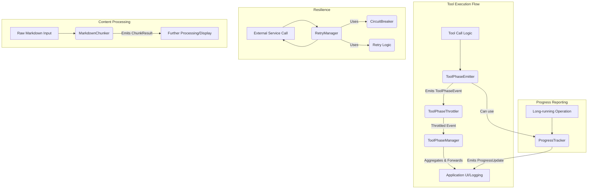

# tests — streaming

The `streaming` module provides a suite of utilities designed to manage and enhance asynchronous operations, particularly in contexts involving real-time data processing, long-running tasks, and interactions with external services. It focuses on providing robust solutions for chunking content, tracking progress, ensuring resilience, and standardizing event reporting for tool executions.

This documentation covers the core components within the `src/streaming` directory, drawing insights from their respective test files to accurately describe their functionality and API.

## Module Overview

The `streaming` module addresses several key concerns:

*   **Content Chunking:** Efficiently splitting large text (especially Markdown) into smaller, manageable chunks for processing or display.
*   **Progress Tracking:** Providing a standardized way to report and monitor the progress of multi-stage or iterative operations.
*   **Resilience:** Implementing retry mechanisms and circuit breakers to improve the reliability of interactions with potentially unstable services.
*   **Tool Execution Management:** Standardizing the lifecycle and event reporting for individual tool calls, including throttling event emissions.

## Core Components

The `streaming` module is composed of several distinct, yet often complementary, sub-modules:

### 1. Markdown Chunker (`markdown-chunker.js`)

This module provides utilities for intelligently splitting Markdown text into smaller chunks, respecting structural elements like paragraphs and code blocks. This is particularly useful for processing large language model outputs or user inputs where content needs to be broken down for further analysis or display without breaking semantic units.

**Key Components:**

*   **`MarkdownChunker` (Class):**
    *   A stateful chunker that processes Markdown text incrementally.
    *   Buffers incoming text and emits `ChunkResult` objects when natural breaks (e.g., paragraph endings) are found, or when `softMaxChars` or `hardMaxChars` limits are approached.
    *   **`write(text: string)`:** Appends text to the internal buffer and attempts to emit chunks.
    *   **`flush()`:** Emits any remaining buffered content as chunks, potentially forcing a split.
    *   **`reset()`:** Clears the internal buffer and resets the block state.
    *   **`on('chunk', (chunk: ChunkResult) => ...)`:** Emits events when a chunk is ready.
    *   **`options`**: Configurable `softMaxChars`, `hardMaxChars`, and `preserveCodeBlocks`.
*   **`chunkMarkdown(text: string, options?: ChunkerOptions)` (Function):**
    *   A convenience function for chunking a complete Markdown string in one go. It internally uses `MarkdownChunker`.
*   **`createStreamingChunker(callback: (chunk: ChunkResult) => void, options?: ChunkerOptions)` (Function):**
    *   Creates a `MarkdownChunker` instance and automatically registers a callback for `chunk` events, simplifying streaming usage.
*   **Internal State Management Functions:**
    *   `createBlockState()`: Initializes the state for tracking Markdown blocks (e.g., `inCodeBlock`, `fence`, `language`, `depth`).
    *   `updateBlockState(line: string, state: BlockState)`: Updates the block state based on the current line, primarily for detecting code fences.
    *   `detectFence(line: string, state: BlockState)`: Identifies opening and closing code fences.
    *   `hasUnclosedCodeBlock(text: string)`: Checks if a given string ends with an unclosed code block.
    *   `countCodeBlocks(text: string)`: Counts open and closed code blocks within a string.
    *   `fixUnclosedCodeBlocks(text: string)`: Appends closing fences to any unclosed code blocks at the end of a string.

**How it Works:**

The `MarkdownChunker` maintains an internal buffer and a `BlockState` to track whether it's currently inside a code block. It processes text line by line, prioritizing splitting at paragraph breaks (`\n\n`). If `preserveCodeBlocks` is enabled, it avoids splitting *within* a code block unless the `hardMaxChars` limit is severely exceeded, in which case it might force a split. The `softMaxChars` and `hardMaxChars` options guide the chunking behavior, with `softMaxChars` indicating a preferred maximum and `hardMaxChars` an absolute maximum before a forced split.

### 2. Progress Tracker (`progress-tracker.js`)

This module provides a flexible way to track and report progress for operations that may involve multiple stages or iterations. It supports weighted stages and emits events for real-time updates.

**Key Components:**

*   **`ProgressTracker` (Class):**
    *   Manages progress across multiple named stages, each with an optional weight.
    *   **`start()`:** Initializes the tracker and starts timing.
    *   **`updateProgress(progress: number, stageName?: string, message?: string)`:** Updates the progress for the current or a specified stage. Progress is a percentage (0-100).
    *   **`completeStage(stageName?: string)`:** Marks the current or specified stage as 100% complete and automatically advances to the next stage if available.
    *   **`failStage(stageName?: string, message?: string)`:** Marks the current or specified stage as failed.
    *   **`getUpdate()`:** Returns the current `ProgressUpdate` object, including total progress, current stage, stage progress, elapsed time, and estimated time remaining (if enabled).
    *   **`on('progress', (update: ProgressUpdate) => ...)`:** Emits events on progress updates.
    *   **`reset()`:** Resets the tracker to its initial state.
*   **`createSimpleTracker(callback: (progress: number, message?: string) => void)` (Function):**
    *   A lightweight utility for basic progress reporting without stages. It returns an object with `update()`, `complete()`, and `fail()` methods that call the provided callback.
*   **`calculateIterationProgress(current: number, total: number, startRange?: number, endRange?: number)` (Function):**
    *   Calculates a percentage progress for a given iteration within a total count, optionally mapping it to a custom progress range (e.g., 20-80%).

**How it Works:**

`ProgressTracker` calculates overall progress by considering the weights of each stage. When `updateProgress` is called, it updates the progress for the active stage, and then recalculates the total progress based on the completed stages and the current stage's progress and weight. It can also track elapsed time and provide estimates for time remaining.

### 3. Retry Policy (`retry-policy.js`)

This module provides robust mechanisms for handling transient failures in asynchronous operations, combining retry logic with a circuit breaker pattern to prevent cascading failures.

**Key Components:**

*   **`retry(operation: () => Promise<T>, config?: RetryConfig)` (Function):**
    *   Attempts to execute an asynchronous `operation` multiple times if it fails with a retryable error.
    *   Implements exponential backoff with optional jitter for delays between retries.
    *   Returns a `RetryResult` object indicating success/failure and details of each attempt.
*   **`retryOrThrow(operation: () => Promise<T>, config?: RetryConfig)` (Function):**
    *   Similar to `retry`, but throws the final error if all attempts fail, rather than returning a `RetryResult`. The error will include `retryAttempts` details.
*   **`CircuitBreaker` (Class):**
    *   Implements the Circuit Breaker pattern to protect against repeated failures to a specific service.
    *   Manages three states: `closed`, `open`, and `half-open`.
    *   **`execute(operation: () => Promise<T>)`:** Executes an operation. If the circuit is `open`, it immediately rejects with `CircuitOpenError`.
    *   **`getState()`:** Returns the current state of the circuit.
    *   **`getStats()`:** Returns statistics about requests (total, successful, failed, rejected).
    *   **`reset()`:** Resets the circuit to `closed` and clears statistics.
    *   **`trip()`:** Manually forces the circuit to the `open` state.
    *   **`on('state-change', (from, to) => ...)`:** Emits events when the circuit state changes.
*   **`RetryManager` (Class):**
    *   A central manager for creating and managing multiple `CircuitBreaker` instances, typically one per external service or API endpoint.
    *   Integrates retry logic with circuit breaking.
    *   **`execute(serviceId: string, operation: () => Promise<T>)`:** Executes an operation for a given `serviceId`, applying both retry and circuit breaker policies.
    *   **`executeOrThrow(serviceId: string, operation: () => Promise<T>)`:** Similar to `execute`, but throws on final failure.
    *   **`getCircuitState(serviceId: string)`:** Returns the state of a specific circuit.
    *   **`getCircuitStats(serviceId: string)`:** Returns statistics for a specific circuit.
    *   **`getAllStats()`:** Returns statistics for all managed circuits.
    *   **`resetCircuit(serviceId: string)`:** Resets a specific circuit.
    *   **`clearCircuit(serviceId: string)`:** Removes a specific circuit from the manager.
    *   **`on('circuit-state-change', (serviceId, from, to) => ...)`:** Emits events when any managed circuit's state changes.
*   **`getRetryManager()` (Function):**
    *   Provides a singleton instance of `RetryManager` for global access.
*   **`resetRetryManager()` (Function):**
    *   Resets the singleton `RetryManager` instance.
*   **Decorators:**
    *   **`@withRetry(config?: RetryConfig)`:** A decorator to apply retry logic to a method.
    *   **`@withCircuitBreaker(serviceId: string, config?: CircuitBreakerConfig)`:** A decorator to protect a method with a circuit breaker.
*   **Utility Functions:**
    *   `calculateDelay(attempt: number, config: RetryConfig)`: Calculates the backoff delay for a given attempt.
    *   `isRetryable(error: Error, config: RetryConfig)`: Determines if an error is considered retryable based on configured patterns.
    *   `sleep(ms: number)`: A promise-based sleep function.
    *   `withTimeout(promise: Promise<T>, timeoutMs: number)`: Wraps a promise with a timeout.

**How it Works:**

The `retry` function catches errors, checks if they are retryable, and if so, waits for a calculated delay before re-executing the operation. The `CircuitBreaker` monitors failures over a time window. If failures exceed a threshold, it "opens" to prevent further requests, allowing the service to recover. After a `resetTimeoutMs`, it transitions to `half-open`, allowing a limited number of "probe" requests to determine if the service has recovered. The `RetryManager` orchestrates these patterns, providing a unified interface for resilient service interactions.

### 4. Tool Phases (`tool-phases.js`)

This module provides a standardized way to track and report the lifecycle and progress of individual tool executions, which is crucial for providing real-time feedback in interactive systems.

**Key Components:**

*   **`ToolPhaseEmitter` (Class):**
    *   Emits events representing the different phases of a single tool call (start, update, result, error).
    *   **`start(message?: string)`:** Initiates the tool call phase, setting progress to 0.
    *   **`update(progress: number, message?: string)`:** Updates the progress of the tool call. Progress is clamped between 0 and 100.
    *   **`result(result: ToolResult)`:** Marks the completion of the tool call, indicating success or failure and providing output/error.
    *   **`error(error: Error)`:** Reports an error during tool execution, also marking the call as failed.
    *   **`getPhase()`:** Returns the current phase ('start', 'update', 'result').
    *   **`getProgress()`:** Returns the current progress percentage.
    *   **`getElapsedTime()`:** Returns the time elapsed since `start()` was called.
    *   **`on('phase', (event: ToolPhaseEvent) => ...)`:** Emits generic phase events.
    *   **`on('phase:start', (event: ToolPhaseEvent) => ...)`:** Emits specific start phase events.
*   **`ToolPhaseManager` (Class):**
    *   Manages multiple `ToolPhaseEmitter` instances, aggregating their events.
    *   **`createEmitter(toolCallId: string, toolName: string)`:** Creates and registers a new `ToolPhaseEmitter` for a specific tool call.
    *   **`getEmitter(toolCallId: string)`:** Retrieves an existing emitter.
    *   **`removeEmitter(toolCallId: string)`:** Removes an emitter.
    *   **`addPhaseListener(listener: (event: ToolPhaseEvent) => void)`:** Registers a global listener for all tool phase events.
    *   **`removePhaseListener(listener: (event: ToolPhaseEvent) => void)`:** Removes a global listener.
    *   **`getActiveToolCalls()`:** Returns a list of currently active tool calls (those not yet in 'result' phase).
    *   **`clear()`:** Removes all managed emitters.
    *   **`dispose()`:** Cleans up all listeners and emitters.
    *   **`on('phase', (event: ToolPhaseEvent) => ...)`:** Re-emits all events from managed emitters.
*   **`resetToolPhaseManager()` (Function):**
    *   Resets the singleton `ToolPhaseManager` instance.

**How it Works:**

A `ToolPhaseEmitter` is instantiated for each individual tool call. It tracks the state and timing of that specific call. The `ToolPhaseManager` acts as a central hub, allowing the application to listen to all tool phase events from a single point, regardless of how many tools are executing concurrently. This provides a unified stream of updates for UI or logging purposes.

### 5. Tool Throttle (`tool-throttle.js`)

This module provides a generic throttling utility and a specialized throttler for `ToolPhaseEvent`s, ensuring that event consumers are not overwhelmed by rapid updates.

**Key Components:**

*   **`throttle(fn: (...args: any[]) => void, options: { intervalMs: number })` (Function):**
    *   A higher-order function that returns a throttled version of the input function.
    *   The throttled function executes immediately on the first call, and then queues subsequent calls, executing only the *last* queued call after the `intervalMs` has passed.
    *   **`cancel()`:** Cancels any pending throttled execution.
    *   **`flush()`:** Immediately executes any pending throttled call.
*   **`ToolPhaseThrottler` (Class):**
    *   Specifically designed to throttle `ToolPhaseEvent`s.
    *   **`push(event: ToolPhaseEvent)`:** Processes an incoming tool phase event.
        *   `'start'` and `'result'` events are emitted immediately.
        *   `'update'` events are throttled per `toolCallId`, ensuring only the latest update for a given tool call is emitted within the `intervalMs`.
    *   **`setCallback(callback: (event: ToolPhaseEvent) => void)`:** Sets the callback function to be invoked when a throttled event is ready.
    *   **`flushAll()`:** Immediately emits all currently pending throttled update events.
    *   **`cancelAll()`:** Cancels all currently pending throttled update events.
    *   **`setInterval(intervalMs: number)`:** Changes the throttling interval.
    *   **`getInterval()`:** Returns the current throttling interval.
    *   **`dispose()`:** Cleans up internal timers and resources.
*   **`resetToolPhaseThrottler()` (Function):**
    *   Resets the singleton `ToolPhaseThrottler` instance.

**How it Works:**

The `throttle` utility is a classic debouncing/throttling pattern. `ToolPhaseThrottler` leverages this by maintaining a separate throttled function for each `toolCallId`. This allows independent throttling of update events for different concurrent tool calls, while ensuring that critical 'start' and 'result' events are always delivered immediately.

## Architectural Relationships

The `streaming` module components are designed to work together, particularly in the context of managing tool executions and their progress.

**Key Interactions:**

*   A `ToolPhaseEmitter` might internally use a `ProgressTracker` to manage its own progress updates, which are then wrapped into `ToolPhaseEvent`s.
*   `ToolPhaseEvent`s from multiple `ToolPhaseEmitter`s are fed into the `ToolPhaseThrottler` to control the rate of updates.
*   The `ToolPhaseThrottler` then forwards the (potentially throttled) events to the `ToolPhaseManager`, which acts as a central event bus for the application.
*   Any external service calls made within a tool's execution (or any other part of the application) can leverage the `RetryManager` and its underlying `CircuitBreaker` and retry logic for enhanced reliability.
*   `MarkdownChunker` provides a specialized streaming capability for text content, which could be used to process inputs or outputs of tools.

This modular design allows developers to pick and choose the specific streaming utilities they need, while also providing a clear path for integrating them into a cohesive system for managing complex asynchronous workflows.