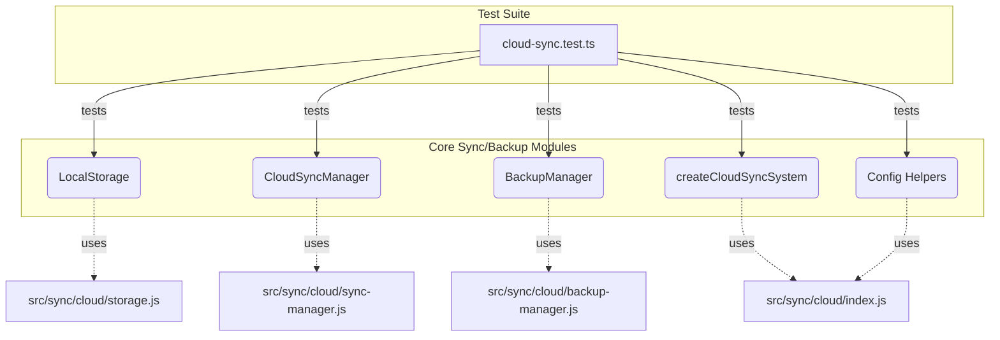

# tests — sync

This document describes the `tests/sync/cloud-sync.test.ts` module, which serves as the primary integration test suite for the cloud synchronization and backup features of the application.

## Introduction

The `cloud-sync.test.ts` module is a comprehensive Jest test suite designed to verify the functionality and integration of the core components responsible for cloud synchronization and backup. It directly imports and interacts with the production code from `src/sync/cloud/`, ensuring that these critical features behave as expected in a near-production environment.

## Purpose

The main purpose of this test module is to:

*   **Validate Core Functionality**: Ensure that `LocalStorage`, `CloudSyncManager`, `BackupManager`, and the `CloudSyncSystem` operate correctly.
*   **Verify Integration**: Confirm that different components of the cloud sync system work together seamlessly.
*   **Test Edge Cases**: Cover scenarios like empty files, large files, concurrent operations, and various configuration options (e.g., encryption, sync directions).
*   **Ensure Robustness**: Check error handling, state management, and event emission.

## Testing Scope

This module focuses on testing the following key components from `src/sync/cloud/`:

*   `LocalStorage` (and by extension, the `CloudStorage` interface)
*   `CloudSyncManager`
*   `BackupManager`
*   `createCloudSyncSystem` (the main factory for the integrated system)
*   Configuration helper functions (`createLocalConfig`, `createS3Config`, `createDefaultSyncItems`, `createDefaultBackupItems`)

## Testing Methodology

The tests employ a robust integration testing approach:

1.  **Direct Imports**: All components under test are imported directly from their source files (`../../src/sync/cloud/*.js`), without mocking, to simulate real-world usage.
2.  **Temporary Directories**: Each test suite (`describe` block) sets up isolated temporary directories using `os.tmpdir()` and `crypto.randomUUID()`. This ensures that tests do not interfere with each other or with the actual application data.
3.  **Setup and Teardown**: `beforeEach` and `afterEach` hooks are extensively used to create and clean up these temporary directories and dispose of manager instances, maintaining a clean state for every test.
4.  **Jest Framework**: The tests are written using Jest's `describe`, `it`, and `expect` functions, along with `jest.fn()` for event handler assertions.
5.  **Asynchronous Operations**: Given the I/O-heavy nature of cloud operations, all tests are `async`/`await` based, handling promises and ensuring proper sequencing of operations.

## Test Suites Overview

The `cloud-sync.test.ts` module is organized into several `describe` blocks, each focusing on a specific component or aspect of the cloud synchronization system.

### 1. Cloud Storage Tests (`describe('Cloud Storage', ...)`)

This suite primarily tests the `LocalStorage` implementation, which acts as a local file system backend for cloud storage operations, making it suitable for fast and isolated integration tests without requiring actual cloud credentials.

*   **`LocalStorage`**:
    *   Verifies basic file operations: `upload`, `download`, `delete`, `exists`, `list`.
    *   Tests metadata storage and retrieval (`getMetadata`).
    *   Handles various file scenarios: nested directories, empty files, large files.
*   **Encryption**:
    *   Tests data encryption and decryption using an `encryptionKey`.
    *   Ensures that encrypted data produces different ciphertexts for the same plaintext due to random IVs.
*   **`createCloudStorage` factory**:
    *   Confirms that the factory correctly instantiates `LocalStorage` for the 'local' provider and `CloudStorage` for 'gcs'/'azure' (though the latter are not fully tested here, only their instantiation).

### 2. CloudSyncManager Tests (`describe('CloudSyncManager', ...)`)

This suite focuses on the `CloudSyncManager`, which orchestrates the synchronization of local data with cloud storage.

*   **Initialization**: Checks if the manager is created correctly and its initial state (`idle`).
*   **Sync Operations**:
    *   Tests basic `sync()` functionality, pushing local files to the cloud.
    *   Verifies event emission (`onSyncEvent`, `sync_started`, `sync_completed`).
    *   Handles scenarios with empty sync items.
    *   Ensures prevention of concurrent sync operations.
    *   Monitors state updates and bytes transferred during sync.
*   **Sync Directions**: Tests `push` and `pull` only synchronization modes.
*   **Auto Sync**: Verifies the `startAutoSync()` and `stopAutoSync()` methods, including idempotency.
*   **Force Operations**: Tests `forcePush()` and `forcePull()` to override configured sync directions temporarily.
*   **Event Handling**: Confirms that event handlers can be added and removed.

### 3. BackupManager Tests (`describe('BackupManager', ...)`)

This suite validates the `BackupManager`, responsible for creating, managing, and restoring backups.

*   **Initialization**: Checks manager creation and event emitter capabilities.
*   **Backup Creation**:
    *   Tests `createBackup()`, including manifest generation, file inclusion, nested directories, checksum calculation, and data compression.
    *   Verifies event emission (`backup_created`).
    *   Ensures prevention of concurrent backup operations.
*   **Backup Listing**: Tests `listBackups()` and verifies sorting by date.
*   **Backup Manifest**: Tests `getBackupManifest()` for existing and non-existent backups.
*   **Backup Restoration**:
    *   Tests `restoreBackup()` for full and selective restoration.
    *   Verifies content integrity after restoration.
    *   Handles missing backups and `overwrite` options.
*   **Backup Deletion**: Tests `deleteBackup()` and verifies event emission (`backup_deleted`).
*   **Backup Verification**: Tests `verifyBackup()` for integrity checks and detection of missing backups.
*   **Backup Cleanup**: Verifies `cleanupOldBackups()` based on `maxBackups` configuration.
*   **Auto Backup**: Tests `startAutoBackup()` and `stopAutoBackup()`.
*   **Export/Import**: Tests `exportBackup()` to a local file, including manifest export.

### 4. Cloud Sync System Integration Tests (`describe('Cloud Sync System', ...)`)

This suite tests the `createCloudSyncSystem` factory, which integrates the `CloudSyncManager` and `BackupManager` into a single, cohesive system.

*   **System Creation**: Verifies that the system is created with both `sync` and `backup` components.
*   **Service Control**: Tests `startAll()` and `stopAll()` methods for managing both sync and backup auto-operations.
*   **Default Configurations**: Confirms that default sync and backup configurations are applied when not explicitly provided.

### 5. Configuration Helpers Tests (`describe('Configuration Helpers', ...)`)

This suite ensures that the utility functions for creating configuration objects work as expected.

*   **`createLocalConfig`**: Tests default and custom local paths.
*   **`createS3Config`**: Tests S3 configuration generation, including default regions and optional parameters.
*   **`createDefaultSyncItems`**: Verifies the structure and content of default synchronization items (sessions, memory, settings, checkpoints).
*   **`createDefaultBackupItems`**: Verifies the structure and content of default backup items.

### 6. Type Definitions Tests (`describe('Type Definitions', ...)`)

A simple test to ensure that the necessary types are exported from `src/sync/cloud/types.js`.

## Module Relationships

The `cloud-sync.test.ts` module acts as a client to the core cloud synchronization and backup modules. It directly imports and exercises their public APIs.

## Contribution Guidelines

When contributing to the cloud synchronization and backup features, it is crucial to:

*   **Run Existing Tests**: Always run `cloud-sync.test.ts` to ensure no regressions are introduced.
*   **Write New Tests**: For any new features or bug fixes, add corresponding tests to this module (or a new, dedicated test file if the scope is significantly different).
*   **Maintain Isolation**: Use temporary directories and proper setup/teardown for all new tests to prevent side effects.
*   **Consider Edge Cases**: Think about how your changes might affect empty files, large files, concurrent operations, or different configurations.
*   **Verify Events and State**: If your changes involve state transitions or event emissions, ensure these are correctly tested.