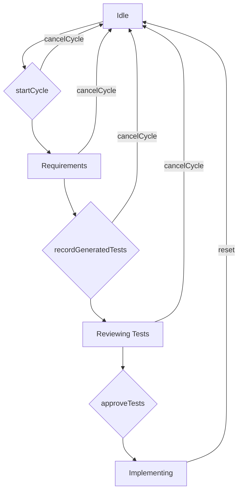

# tests — testing

The `src/testing` module provides a suite of intelligent, automated capabilities designed to enhance code quality, streamline testing workflows, and facilitate Test-Driven Development (TDD) for AI agents and developers. It integrates with various programming languages and testing/linting frameworks, offering a programmatic interface to manage and interact with these critical development processes.

This documentation focuses on the core functionalities exposed by the `src/testing` modules, which are validated by the provided test files.

---

## 1. Auto-Lint Module

The Auto-Lint module (`src/testing/auto-lint.ts`) is responsible for managing automatic code linting. It detects available linters in a project, applies configurations, executes linting processes, and provides structured results.

### Purpose

To provide a unified interface for integrating and managing various code linters (e.g., ESLint, Prettier, Ruff) within a project, allowing for automated code quality checks and potential auto-fixes.

### Key Components

*   **`AutoLintManager` Class:**
    The central class for orchestrating linting operations. It extends `EventEmitter` to provide a reactive interface.
    *   **Constructor:** `new AutoLintManager(projectRoot: string, config?: Partial<AutoLintConfig>)`
        Initializes the manager for a given `projectRoot`, optionally overriding default configurations.
    *   **Methods:**
        *   `getConfig(): AutoLintConfig`: Retrieves the current linting configuration.
        *   `updateConfig(newConfig: Partial<AutoLintConfig>): void`: Updates parts of the configuration, merging with existing settings.
        *   `getDetectedLinters(): LinterConfig[]`: Returns an array of `LinterConfig` objects for linters detected in the project.
        *   `formatResultsForLLM(results: LintResult[]): string`: Formats a list of `LintResult` objects into a human-readable string, optimized for consumption by Large Language Models (LLMs).
        *   `refresh(): void`: Re-detects linters and updates internal state.
        *   `emit(eventName: string, ...args: any[]): boolean`: Inherited from `EventEmitter`, used to emit custom events.
*   **`BUILTIN_LINTERS` Constant:**
    An object containing predefined configurations for common linters (e.g., `eslint`, `prettier`, `ruff`, `clippy`, `golangci`, `rubocop`). Each entry specifies the linter's `name`, supported file `extensions`, and common `configFiles` for detection.
*   **`DEFAULT_AUTOLINT_CONFIG` Constant:**
    The default configuration object for `AutoLintManager`, defining sensible defaults for properties like `enabled`, `autoFix`, `failOnError`, `maxErrors`, `timeout`, and the list of `linters` to use.
*   **`LintError` Type:**
    Defines the structure for a single linting issue, including `file`, `line`, `column`, `message`, `rule`, `severity` (`error`, `warning`, `info`), and `fixable` status.
*   **`LintResult` Type:**
    Defines the aggregated result of a linting run by a specific linter, including `success`, lists of `errors` and `warnings`, `fixedCount`, `duration`, and the `linter` name.
*   **Singleton Functions:**
    *   `getAutoLintManager(projectRoot: string): AutoLintManager`: Retrieves the singleton instance of `AutoLintManager` for the specified project root.
    *   `initializeAutoLint(projectRoot: string, config?: Partial<AutoLintConfig>): AutoLintManager`: Initializes (if not already) and returns the singleton `AutoLintManager` instance.

### Core Functionality

1.  **Configuration Management:** Allows dynamic adjustment of linting behavior through `getConfig()` and `updateConfig()`.
2.  **Linter Detection:** Automatically identifies which linters are configured and available in the project based on `BUILTIN_LINTERS` and project files.
3.  **Result Processing:** Collects and structures linting output into `LintResult` objects.
4.  **LLM Integration:** Provides a specialized `formatResultsForLLM()` method to present linting outcomes clearly and concisely to AI agents.
5.  **Eventing:** Emits `lint:start` (data: `{ file: string; linter: string }`) and `lint:complete` (data: `{ file: string; result: LintResult }`) events, enabling other modules to react to linting lifecycle events.

### Usage and Integration

The `AutoLintManager` is typically initialized once per project using `initializeAutoLint` or retrieved via `getAutoLintManager`. It serves as a programmatic interface for AI agents or other system components to trigger linting, retrieve results, and configure linting settings. The event system allows for real-time feedback and integration into broader development workflows.

---

## 2. Auto-Test Module

The Auto-Test module (`src/testing/auto-test.ts`) manages the execution and reporting of automated tests using various testing frameworks.

### Purpose

To provide a consistent way to detect, run, and interpret results from different testing frameworks (e.g., Jest, Vitest, pytest) within a project, supporting automated testing and coverage collection.

### Key Components

*   **`AutoTestManager` Class:**
    The central class for managing testing operations, also extending `EventEmitter`.
    *   **Constructor:** `new AutoTestManager(projectRoot: string, config?: Partial<AutoTestConfig>)`
        Initializes the manager for a given `projectRoot`, with optional custom configurations.
    *   **Methods:**
        *   `getConfig(): AutoTestConfig`: Retrieves the current testing configuration.
        *   `updateConfig(newConfig: Partial<AutoTestConfig>): void`: Updates parts of the configuration.
        *   `getDetectedFramework(): string | null`: Returns the name of the detected testing framework (e.g., "Jest") or `null` if none is found.
        *   `getLastResults(): TestResult | null`: Returns the results of the most recent test run, or `null` if no tests have been run.
        *   `formatResultsForLLM(result: TestResult): string`: Formats a `TestResult` object into a human-readable string for LLM consumption.
        *   `refresh(): void`: Re-detects the testing framework and updates internal state.
        *   `emit(eventName: string, ...args: any[]): boolean`: Inherited from `EventEmitter`.
*   **`BUILTIN_FRAMEWORKS` Constant:**
    An object containing predefined configurations for common testing frameworks (e.g., `jest`, `vitest`, `pytest`, `cargo`, `go`, `rspec`). Each entry specifies the framework's `name`, `command` (for execution), and common `configFiles` for detection.
*   **`DEFAULT_AUTOTEST_CONFIG` Constant:**
    The default configuration object for `AutoTestManager`, defining sensible defaults for properties like `enabled`, `runOnSave`, `runRelatedTests`, `collectCoverage`, `timeout`, `maxTestFiles`, and `watchMode`.
*   **`TestCase` Type:**
    Defines the structure for a single test case, including `name`, `suite`, `status` (`passed`, `failed`, `skipped`), `duration`, and optional `file`, `error`, and `stack` trace.
*   **`TestResult` Type:**
    Defines the aggregated result of a test run, including `success`, `passed`, `failed`, `skipped`, `total` test counts, `duration`, a list of individual `tests`, the `framework` used, and optional `coverage` data.
*   **Singleton Functions:**
    *   `getAutoTestManager(projectRoot: string): AutoTestManager`: Retrieves the singleton instance of `AutoTestManager`.
    *   `initializeAutoTest(projectRoot: string, config?: Partial<AutoTestConfig>): AutoTestManager`: Initializes (if not already) and returns the singleton `AutoTestManager` instance.

### Core Functionality

1.  **Configuration Management:** Allows dynamic adjustment of testing behavior.
2.  **Framework Detection:** Automatically identifies the testing framework used in the project.
3.  **Result Management:** Stores and retrieves the results of the last test run.
4.  **LLM Integration:** Provides `formatResultsForLLM()` to summarize test outcomes for AI agents.
5.  **Eventing:** Emits `test:start` (data: `{ type: string }`) and `test:complete` (data: `TestResult`) events, allowing for real-time monitoring and integration.

### Usage and Integration

Similar to `AutoLintManager`, the `AutoTestManager` is typically initialized once per project. It provides the means for AI agents or other system components to trigger test runs, retrieve detailed results, and configure testing parameters. The `formatResultsForLLM` method is particularly important for AI agents to understand test failures and guide remediation.

---

## 3. TDD Mode Module

The TDD Mode module (`src/testing/tdd-mode.ts`) implements a stateful manager to guide an AI agent through a structured Test-Driven Development (TDD) workflow.

### Purpose

To enforce and manage the TDD cycle (Red-Green-Refactor) for AI agents, ensuring that tests are written before implementation, and providing context-rich prompts at each stage.

### Key Components

*   **`TDDModeManager` Class:**
    The central class for managing the TDD workflow, also extending `EventEmitter`.
    *   **Constructor:** `new TDDModeManager(projectRoot: string, config?: Partial<TDDConfig>)`
        Initializes the manager for a given `projectRoot`, with optional custom configurations.
    *   **Methods:**
        *   `getState(): TDDState`: Returns the current state of the TDD cycle.
        *   `isActive(): boolean`: Indicates if a TDD cycle is currently active.
        *   `getConfig(): TDDConfig`: Retrieves the current TDD configuration.
        *   `updateConfig(newConfig: Partial<TDDConfig>): void`: Updates parts of the configuration.
        *   `startCycle(requirements: string): void`: Initiates a new TDD cycle with specified requirements, transitioning to the `requirements` state.
        *   `reset(): void`: Resets the manager to the `idle` state, clearing any active cycle.
        *   `cancelCycle(): void`: Cancels the current active TDD cycle, returning to `idle`.
        *   `generateTestPrompt(): string`: Generates a detailed prompt for an LLM to create tests based on the current requirements and configured language/framework. Throws if no active cycle.
        *   `recordGeneratedTests(tests: string[], files: string[]): void`: Records the tests generated by the LLM and transitions to `reviewing-tests`.
        *   `approveTests(): void`: Approves the generated tests, transitioning to `implementing`. Throws if not in `reviewing-tests` state.
        *   `formatStatus(): string`: Provides a human-readable summary of the current TDD mode status.
        *   `getCycleResult(): TDDCycleResult | null`: Returns the result of the completed TDD cycle, or `null` if no cycle is active or completed.
        *   `emit(eventName: string, ...args: any[]): boolean`: Inherited from `EventEmitter`.
*   **`TEST_TEMPLATES` Constant:**
    An object providing language-specific templates for generating tests, edge cases, and mocks (e.g., `typescript`, `python`, `go`, `rust`). Each template includes the target `framework` and the actual `template` strings.
*   **`DEFAULT_TDD_CONFIG` Constant:**
    The default configuration object for `TDDModeManager`, defining properties like `maxIterations`, `autoApproveTests`, `generateEdgeCases`, `generateMocks`, `testCoverage`, and `language`.
*   **`TDDState` Type:**
    A union type representing the possible states of the TDD workflow (e.g., `idle`, `requirements`, `reviewing-tests`, `implementing`, `testing`, `refactoring`, `completed`, `failed`).
*   **`TDDCycleResult` Type:**
    Defines the structure for the outcome of a TDD cycle.
*   **Singleton Functions:**
    *   `getTDDManager(projectRoot: string): TDDModeManager`: Retrieves the singleton instance of `TDDModeManager`.
    *   `initializeTDD(projectRoot: string, config?: Partial<TDDConfig>): TDDModeManager`: Initializes (if not already) and returns the singleton `TDDModeManager` instance.

### Core Functionality

1.  **State Machine:** Manages the TDD workflow through a defined sequence of states, ensuring adherence to the TDD process.
2.  **Configuration Management:** Allows dynamic adjustment of TDD parameters.
3.  **Prompt Generation:** `generateTestPrompt()` is a critical function for instructing an LLM to generate tests based on the current TDD context.
4.  **Workflow Control:** Methods like `startCycle()`, `cancelCycle()`, `reset()`, `recordGeneratedTests()`, and `approveTests()` drive the state transitions and manage the TDD session.
5.  **Eventing:** Emits `cycle:started` (data: `{ requirements: string }`), `cycle:cancelled`, and `tests:generated` (data: `{ tests: string[]; files: string[] }`) events.

### TDD Workflow (State Machine)

The `TDDModeManager` implements a state machine to guide the TDD process. The core transitions, as validated by tests, are:

*   **Idle:** The initial state, no TDD cycle is active.
*   **Requirements:** A cycle has started, and the AI is expected to understand the requirements.
*   **Reviewing Tests:** Tests have been generated by the AI and are awaiting approval.
*   **Implementing:** Tests have been approved, and the AI is now expected to write the code that makes these tests pass.
*   **Transitions:**
    *   `startCycle()` moves from `Idle` to `Requirements`.
    *   `recordGeneratedTests()` moves from `Requirements` to `Reviewing Tests`.
    *   `approveTests()` moves from `Reviewing Tests` to `Implementing`.
    *   `cancelCycle()` can return to `Idle` from any active state.
    *   `reset()` can return to `Idle` from any active state.

### Usage and Integration

The `TDDModeManager` is the primary interface for an AI agent to engage in a structured TDD process. It ensures that the AI follows the TDD principles, generating tests first, then implementing the code, and providing clear prompts and state tracking throughout. The `generateTestPrompt` method is crucial for instructing the AI at the test generation phase.

---

## 4. Common Patterns & Integration Points

The `src/testing` modules share several architectural patterns and integration points:

*   **Singleton Managers:** All three core managers (`AutoLintManager`, `AutoTestManager`, `TDDModeManager`) are designed as singletons per `projectRoot`. This ensures a consistent state and configuration across different parts of the application interacting with these functionalities. The `get...Manager` and `initialize...` functions manage these instances.
*   **Configuration Management:** Each manager provides `getConfig()` and `updateConfig()` methods, allowing for flexible and dynamic adjustment of their behavior. Default configurations are provided as constants, ensuring sensible starting points.
*   **Event-Driven Architecture:** By extending `EventEmitter`, all managers enable a loosely coupled, reactive system. Other modules can subscribe to events like `lint:start`, `test:complete`, or `cycle:started` to react to changes in the testing and linting lifecycle without direct dependencies.
*   **LLM Integration:** A key design aspect is the explicit support for Large Language Models. Methods like `formatResultsForLLM()` in `AutoLintManager` and `AutoTestManager` provide concise, actionable summaries of results, while `TDDModeManager.generateTestPrompt()` directly generates instructions for LLMs, facilitating AI-driven development workflows.
*   **Project Root Context:** All managers are initialized with a `projectRoot`, ensuring that operations are correctly scoped to the relevant codebase, supporting multi-project environments or dynamic context switching.