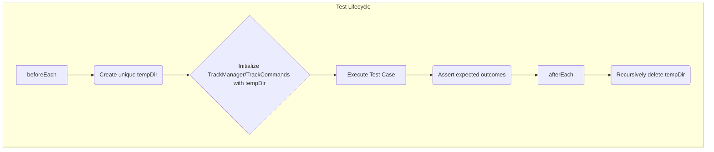

# tests — tracks

This document provides an overview of the `tests/tracks` module, specifically focusing on `track-manager.test.ts`. This module contains comprehensive unit and integration tests for the core functionalities of the `TrackManager` and `TrackCommands` classes, ensuring their reliability and correct behavior.

## Module Purpose

The `track-manager.test.ts` module serves as the primary validation suite for the `TrackManager` and `TrackCommands` classes located in `src/tracks/`. Its main goals are:

1.  **Verify `TrackManager` functionality**: Ensure that tracks can be initialized, created, retrieved, listed, and updated correctly, and that context files are managed as expected.
2.  **Validate `TrackCommands` execution**: Confirm that the command-line interface for track management processes various commands (`new`, `status`, `list`, `setup`) and handles invalid inputs gracefully.
3.  **Ensure data integrity**: Test that track metadata and associated files are created and managed persistently within the designated file system structure.
4.  **Isolate tests**: Utilize temporary directories to provide a clean, isolated environment for each test run, preventing side effects and ensuring reproducibility.

## Test Environment Setup

All tests within `track-manager.test.ts` are designed to run in an isolated environment to prevent interference with the actual file system or other test cases. This is achieved using `beforeEach` and `afterEach` hooks:

*   **`beforeEach`**:
    *   A unique temporary directory (`tempDir`) is created using `fs.mkdtempSync(path.join(os.tmpdir(), 'track-test-'))`.
    *   An instance of `TrackManager` or `TrackCommands` is initialized, pointing to this `tempDir` as its root.
*   **`afterEach`**:
    *   The `tempDir` and all its contents are recursively removed using `fs.rmSync(tempDir, { recursive: true, force: true })`, ensuring a clean slate for subsequent tests.

This setup guarantees that each test operates on a fresh, empty state, making tests reliable and easy to debug.

## `TrackManager` Tests

The `describe('TrackManager', ...)` block focuses on testing the core data management and file system interactions of the `TrackManager` class.

### `initialize`

Tests the `TrackManager.initialize()` method, which is responsible for setting up the necessary directory structure and default context files.

*   **`should create context files`**: Verifies that `.codebuddy/context/` is created and contains `product.md`, `tech-stack.md`, `guidelines.md`, and `workflow.md`.
*   **`should create tracks directory`**: Confirms that `.codebuddy/tracks/` is created.

### `createTrack`

Tests the `TrackManager.createTrack()` method for generating new tracks.

*   **`should create a new track with files`**: Asserts that a new track's metadata (name, type, status) is correctly set and that its dedicated directory within `.codebuddy/tracks/` contains `spec.md`, `plan.md`, and `metadata.json`.
*   **`should generate unique IDs`**: Ensures that consecutive calls to `createTrack` result in tracks with distinct `id` values.

### `getTrack`

Tests the `TrackManager.getTrack()` method for retrieving existing tracks.

*   **`should retrieve an existing track`**: Creates a track, then retrieves it by its ID, verifying that the retrieved track's metadata matches the original.
*   **`should return null for non-existent track`**: Confirms that `getTrack` returns `null` when an invalid ID is provided.

### `listTracks`

Tests the `TrackManager.listTracks()` method for querying tracks.

*   **`should list all tracks`**: Creates multiple tracks and verifies that `listTracks()` returns all of them.
*   **`should filter by status`**: Creates tracks, updates one's status, and then uses `listTracks({ status: '...' })` to confirm filtering works correctly.
*   **`should filter by type`**: Creates tracks of different types and uses `listTracks({ type: '...' })` to confirm type-based filtering.

### `updateTrackStatus`

Tests the `TrackManager.updateTrackStatus()` method.

*   **`should update track status`**: Creates a track, updates its status, and then retrieves it to verify the status change.
*   **`should throw for non-existent track`**: Asserts that calling `updateTrackStatus` with an invalid track ID throws an error.

### `getContextString`

Tests the `TrackManager.getContextString()` method.

*   **`should return empty string when no context files`**: Before `initialize()`, verifies that no context is returned.
*   **`should return context after initialization`**: After `initialize()`, verifies that the returned string contains content from the default context files (e.g., "Product Context", "Tech Stack").

## `TrackCommands` Tests

The `describe('TrackCommands', ...)` block focuses on testing the `TrackCommands` class, which acts as an interpreter for various track-related commands.

### `execute`

Tests the `TrackCommands.execute()` method, which is the main entry point for processing commands.

*   **`should handle unknown command`**: Verifies that an unknown command results in a `success: false` response and an appropriate error message.
*   **`should handle status with no tracks`**: Checks that the `status` command correctly reports "No tracks found" when no tracks exist.
*   **`should handle new without args`**: Confirms that the `new` command without arguments returns a `prompt` indicating that more input is needed.
*   **`should create track with name`**: Tests the `new "My Feature"` command, asserting that a track is successfully created.
*   **`should handle setup`**: Verifies that the `setup` command executes successfully and reports initialization.
*   **`should list tracks`**: Creates a track, then executes the `list` command, asserting that the created track is present in the results.

## How it Connects to the Codebase

This test module is crucial for the stability and correctness of the `src/tracks/track-manager.ts` and `src/tracks/track-commands.ts` modules. It directly calls and asserts the behavior of public methods like `TrackManager.initialize()`, `TrackManager.createTrack()`, `TrackManager.getTrack()`, `TrackManager.listTracks()`, `TrackManager.updateTrackStatus()`, `TrackManager.getContextString()`, and `TrackCommands.execute()`.

By thoroughly testing these components, `track-manager.test.ts` ensures that the core logic for managing development tracks and their associated context files functions as intended, providing confidence for further development and refactoring.