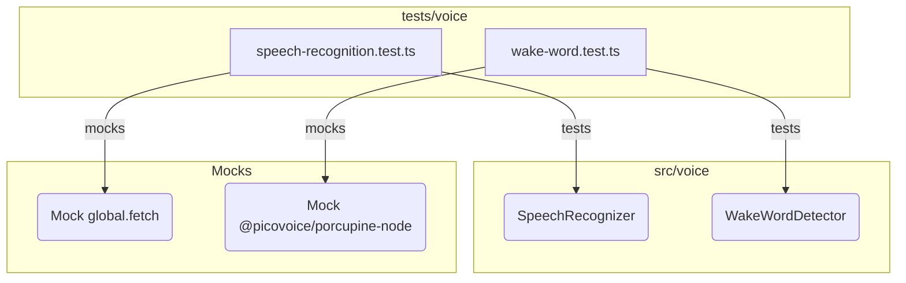

# tests — voice

This document provides an overview of the `tests/voice` module, which is responsible for ensuring the correct functionality of the voice-related components in the system. It covers the testing strategies, key test suites, and how external dependencies are handled through mocking.

## Module Overview

The `tests/voice` module contains unit and integration tests for the core voice functionalities: speech recognition and wake word detection. These tests are crucial for verifying that the `SpeechRecognizer` and `WakeWordDetector` classes, located in `src/voice`, behave as expected across various configurations, providers, and edge cases.

The module is structured into two primary test files:
*   `speech-recognition.test.ts`: Focuses on the `SpeechRecognizer` class.
*   `wake-word.test.ts`: Focuses on the `WakeWordDetector` class.

## Testing Principles

The tests in this module adhere to several key principles:

*   **Isolation**: Tests are designed to be as isolated as possible, primarily using `jest.fn()` to mock external dependencies like network requests (`fetch`) or third-party libraries (`@picovoice/porcupine-node`). This ensures that tests focus on the logic of the voice modules themselves, rather than the availability or correctness of external services.
*   **Comprehensive Coverage**: Each test file covers a wide range of scenarios, including:
    *   Constructor behavior with default and custom configurations.
    *   Lifecycle methods (start, stop, listen, process).
    *   Provider-specific logic and API interactions.
    *   Error handling and edge cases (e.g., missing API keys, no speech detected).
    *   Configuration updates and management of dynamic properties (vocabulary, wake words, sensitivity).
*   **Clear Structure**: Tests are organized using `describe` blocks for logical grouping of related functionalities and `it` blocks for individual test cases, making them easy to read and understand.
*   **Setup and Teardown**: `beforeEach` and `afterEach` hooks are used extensively to set up a clean state for each test and perform necessary cleanup, such as stopping detectors or restoring environment variables.

## Key Components and Test Suites

### `speech-recognition.test.ts`

This file tests the `SpeechRecognizer` class, which is responsible for converting spoken audio into text using various speech-to-text providers.

#### Dependencies and Mocks

The primary external dependency for `SpeechRecognizer` is network communication for API calls to transcription services. This is mocked using `jest.fn()` for `global.fetch`. This allows tests to simulate API responses (success, error, different data structures) without making actual network requests.

```typescript
// Mock fetch globally
const mockFetch = jest.fn();
global.fetch = mockFetch;
```

#### Test Suites

The `SpeechRecognizer` tests cover the following areas:

*   **Constructor**: Verifies that `SpeechRecognizer` can be initialized with default or custom configurations using `new SpeechRecognizer()` and `createSpeechRecognizer()`.
*   **Listening Lifecycle**: Tests the `startListening()`, `stopListening()`, and `isListening()` methods, ensuring correct state transitions and event emissions (`listening-started`, `listening-stopped`).
*   **Audio Processing**: Checks that `processAudio()` behaves correctly both when the recognizer is actively listening and when it is not.
*   **Transcription (`transcribe`)**: This is the most extensive suite, testing the `transcribe()` method across different speech recognition providers:
    *   **Whisper**: Tests successful transcription, handling API errors (e.g., 401 Unauthorized), and validation for the presence of an API key.
    *   **Google**: Verifies successful transcription, handling cases with no speech detected, and the correct parsing of word timings and confidence scores.
    *   **Deepgram**: Tests successful transcription and parsing of its specific response format.
    *   **Azure**: Checks successful transcription, confidence scores, word timings, and the requirement for the `AZURE_SPEECH_REGION` environment variable.
    *   **Local**: Ensures the local provider returns a finalized transcript result.
*   **Vocabulary Management**: Tests `addVocabulary()` and `clearVocabulary()` to ensure custom vocabulary words are correctly managed within the recognizer's configuration.
*   **Configuration Updates**: Verifies that `updateConfig()` and `setLanguage()` correctly modify the recognizer's runtime configuration.

### `wake-word.test.ts`

This file tests the `WakeWordDetector` class, which is responsible for detecting specific wake words in audio streams.

#### Dependencies and Mocks

The `WakeWordDetector` relies on the `@picovoice/porcupine-node` library for its primary wake word detection engine. This library is extensively mocked to control its behavior during tests:

```typescript
// Mock @picovoice/porcupine-node
const mockProcess = jest.fn().mockReturnValue(-1); // Default to no detection
const mockRelease = jest.fn();

jest.mock('@picovoice/porcupine-node', () => ({
  Porcupine: jest.fn().mockImplementation(function() { return {
    process: mockProcess,
    release: mockRelease,
    frameLength: 512,
    sampleRate: 16000,
  }; }),
  // ... other mocks for BuiltinKeyword, getBuiltinKeywordPath
}));
```
This mock allows tests to simulate wake word detection (`mockProcess.mockReturnValueOnce(0)`) or non-detection (`-1`), and to verify that resources are properly released (`mockRelease`).

#### Test Suites

The `WakeWordDetector` tests cover the following areas:

*   **Constructor**: Verifies initialization with default or custom configurations using `new WakeWordDetector()` and `createWakeWordDetector()`.
*   **Start/Stop Lifecycle**: Tests `start()`, `stop()`, and `isRunning()` methods, ensuring correct state management and event emissions (`started`, `stopped`). It also covers scenarios like attempting to start twice or stopping when not running.
*   **Porcupine Engine**:
    *   **Initialization**: Checks that the Porcupine engine is correctly initialized when an `accessKey` is provided (either directly or via `PICOVOICE_ACCESS_KEY` environment variable).
    *   **Detection**: Simulates wake word detection using `mockProcess.mockReturnValueOnce(0)` and verifies that the `detected` event is emitted with the correct result.
    *   **Non-detection**: Ensures `processFrame()` returns `null` when Porcupine does not detect a wake word.
    *   **Resource Management**: Verifies that `release()` is called on the Porcupine instance when the detector is stopped.
    *   **Cooldown**: Tests that subsequent detections within a cooldown period are suppressed.
    *   **Input Handling**: Confirms that `processFrame()` correctly handles `Buffer` input by converting it to `Int16Array`.
    *   **Custom Keywords**: Verifies that custom `keywordPaths` are passed correctly to the Porcupine constructor.
*   **Text-Match Fallback**:
    *   **Fallback Logic**: Tests that the detector defaults to a `text-match` engine when no Porcupine `accessKey` is provided, or when explicitly configured.
    *   **Text Detection**: Verifies `detectWakeWordText()` can identify wake words within a given text string, including confidence scores.
    *   **Cooldown**: Ensures the cooldown mechanism also applies to text-based detections.
    *   **Audio Frame Handling**: Confirms that `processFrame()` returns `null` when the detector is in `text-match` mode, as it's not designed for audio processing in this mode.
*   **`processFrame` when not running**: Ensures `processFrame()` returns `null` if the detector is not active.
*   **Wake Word Management**: Tests `addWakeWord()` and `removeWakeWord()`, including handling of duplicates and non-existent wake words.
*   **Sensitivity**: Verifies `setSensitivity()` correctly updates the configuration and clamps values to a valid range (0-1).
*   **Configuration Updates**: Checks that `updateConfig()` correctly modifies the detector's runtime configuration.

## Module Architecture Diagram

The following diagram illustrates the relationship between the test files, the core voice modules they test, and the external dependencies that are mocked.



This diagram highlights that each test file (`SRT`, `WWT`) directly interacts with and tests its corresponding core module (`SR`, `WWD`), while also relying on specific mocks (`MF`, `MP`) to control external behavior and isolate the unit under test.