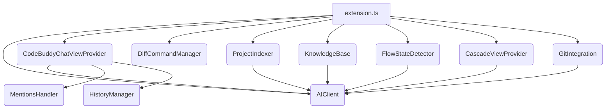

# vscode-extension — src

This document provides a comprehensive overview of the `vscode-extension/src` module, detailing its purpose, architecture, key components, and execution flows. This module forms the core of the Code Buddy VS Code extension, providing AI-powered assistance for developers.

## 1. Introduction

The `vscode-extension/src` module encapsulates the entire logic for the Code Buddy VS Code extension. Its primary goal is to integrate various AI capabilities directly into the developer's workflow, offering features like intelligent chat, code completion, refactoring, code review, project understanding, and agentic task execution.

Inspired by concepts like GitHub Copilot and Windsurf, the extension aims to be context-aware, leveraging project-specific knowledge and real-time user activity to provide highly relevant assistance.

## 2. Architectural Overview

The extension follows a modular design, with `extension.ts` acting as the central orchestrator during activation. It initializes and registers various providers and managers, each responsible for a specific aspect of the extension's functionality. The `AIClient` serves as a foundational component, abstracting interactions with different AI models.

The architecture can be broadly categorized into:
*   **Core AI Interaction:** The `AIClient` handles all communication with external AI providers.
*   **User Interface & Interaction:** Components like `CodeBuddyChatViewProvider`, `MentionsHandler`, and `HistoryManager` manage the user-facing chat interface and context gathering.
*   **Codebase Understanding & Automation:** `ProjectIndexer`, `KnowledgeBase`, `FlowStateDetector`, and `GitIntegration` work together to build a rich understanding of the project and automate development tasks.
*   **Change Visualization & Application:** `DiffCommandManager` facilitates reviewing and applying AI-generated code changes.
*   **Agentic Capabilities:** `CascadeViewProvider` enables multi-step autonomous AI agents.

### High-Level Component Interaction

The following diagram illustrates the primary components and their dependencies, with `extension.ts` as the entry point and `AIClient` as a common dependency for AI-powered features.

**Note on `AIClient` Usage:** It's important to note a discrepancy in the provided code snippets: while many components (e.g., `FlowStateDetector`, `GitIntegration`, `ProjectIndexer`, `CascadeViewProvider`, `CodeBuddyChatViewProvider`) are designed to use the `AIClient` class, the `extension.ts` file itself directly initializes and uses an `OpenAI` client for its core commands (`askQuestion`, `explainCode`, `refactorCode`, etc.). This suggests a potential refactoring opportunity to unify all AI interactions through the `AIClient` abstraction. For the purpose of this documentation, `AIClient` is described as the canonical AI interaction layer.

## 3. Key Components

### 3.1. `AIClient` (`ai-client.ts`)

The `AIClient` class provides a unified interface for interacting with various large language models (LLMs). It supports multiple providers (Grok, Claude, OpenAI, Ollama) and handles API key management, base URL configuration, and model selection.

**Key Features:**
*   **Multi-Provider Support:** Configurable to use different AI services by setting the `provider` in `AIClientConfig`.
*   **`chat(messages, options)`:** Sends a list of `AIMessage` objects to the configured LLM to get a completion. Supports both non-streaming and streaming responses via an `onChunk` callback.
*   **`chatStream(messages)`:** Returns an `AsyncGenerator` for streaming responses, allowing for real-time updates as the AI generates content.
*   **`getCompletion(prefix, suffix, language)`:** Specialized method for code completion, providing context around a cursor position.
*   **`reviewCode(code, language)`:** Sends code for AI-powered review, expecting a JSON array of issues (severity, line, message, suggestion).
*   **Configuration Management:** `updateConfig` allows dynamic changes to provider, API key, and model.

**Execution Flow (Simplified `chat`):**
1.  `AIClient` constructor receives `AIClientConfig`.
2.  `createClient` initializes an `OpenAI` instance, determining the `baseURL` based on the `provider`.
3.  `chat` or `chatStream` methods call `this.client.chat.completions.create` with the configured model and messages.
4.  Streaming requests iterate over the `stream` object, yielding or calling `onChunk` for each content delta.

### 3.2. `extension.ts`

This is the entry point for the VS Code extension. The `activate` function is called when the extension is enabled.

**Responsibilities:**
*   **Initialization:** Creates instances of `StatusBarManager`, `DiffCommandManager`, `ContextTreeProvider`, and an `OutputChannel`.
*   **Configuration:** Reads `apiKey` and `model` from VS Code settings and initializes the AI client (currently a direct `OpenAI` instance, not the `AIClient` class).
*   **Command Registration:** Registers all core commands accessible via the VS Code command palette (e.g., `codeBuddy.askQuestion`, `codeBuddy.refactorCode`, `codeBuddy.applyChanges`, `codeBuddy.switchModel`).
*   **Event Listeners:** Sets up listeners for document open events to track context.
*   **Disposal:** Manages disposables to ensure proper cleanup when the extension is deactivated.

**Key Commands:**
*   `codeBuddy.askQuestion`: Prompts the user for a question and sends it to the AI.
*   `codeBuddy.explainCode`: Explains the currently selected code.
*   `codeBuddy.refactorCode`: Refactors selected code based on user instructions, showing a diff.
*   `codeBuddy.fixError`: Attempts to fix errors at the cursor position, showing a diff.
*   `codeBuddy.generateTests`: Generates unit tests for selected code.
*   `codeBuddy.commitChanges`: Generates a Git commit message based on staged changes.
*   `codeBuddy.showDiff`, `codeBuddy.applyChanges`, `codeBuddy.rejectChanges`: Commands for interacting with the `DiffCommandManager`.
*   `codeBuddy.switchModel`: Allows the user to change the active AI model.

### 3.3. `CodeBuddyChatViewProvider` (`providers/chat-view-provider.ts`)

This class implements the main chat interface displayed in the VS Code sidebar. It manages the conversation flow, integrates slash commands and mentions, and persists history.

**Key Features:**
*   **Webview Integration:** Provides the HTML and JavaScript for the chat UI and handles messages between the webview and the extension backend.
*   **Message Handling:** Processes user messages, distinguishing between regular chat, slash commands, and messages containing `@mentions`.
*   **Streaming Responses:** Utilizes `AIClient.chatStream` to provide a real-time typing experience for AI responses.
*   **Code Actions:** Allows users to insert or apply AI-generated code directly into the active editor.
*   **History Management:** Integrates with `HistoryManager` to load, save, and switch between chat sessions.
*   **Contextual Input:** Leverages `MentionsHandler` to resolve `@mentions` in user input, injecting relevant code, terminal output, or Git status into the AI prompt.

**Execution Flow (General Chat):**
1.  User types a message in the webview and clicks "Send" or presses Enter.
2.  `sendMessage` event is received by `resolveWebviewView`'s `onDidReceiveMessage` handler, calling `handleUserMessage`.
3.  `handleUserMessage` uses `MentionsHandler.resolveMentions` to extract context and `SlashCommandHandler.parseMessage` to detect commands.
4.  If no command, `handleRegularChat` is called.
5.  `handleRegularChat` constructs a system prompt and user message (including resolved mentions) and calls `_aiClient.chatStream`.
6.  As chunks arrive, `updateWebviewWithPartial` sends updates to the webview for real-time display.
7.  Once complete, the full response is added to `_messages` and `HistoryManager`.

### 3.4. `MentionsHandler` (`mentions-handler.ts`)

The `MentionsHandler` is responsible for parsing and resolving `@mentions` within user messages, transforming them into concrete contextual information for the AI.

**Supported Mentions:**
*   `@file:path`: Includes the content of a specified file.
*   `@selection`: Includes the currently selected text in the active editor.
*   `@workspace`: Provides a summary of the workspace structure and key config files.
*   `@workspace:query`: Searches for files matching a query within the workspace.
*   `@terminal`: Captures recent terminal output (or prompts user to paste).
*   `@git`: Provides Git status (branch, staged/unstaged changes).
*   `@errors`: Lists current problems/diagnostics in the workspace.
*   `@codebase:query`: Searches the codebase for code snippets matching a query.
*   `@symbols`: Lists symbols (functions, classes, etc.) in the current file.

**Execution Flow (`resolveMentions`):**
1.  Receives a user message string.
2.  Uses regular expressions to find all `@mention` patterns.
3.  For each mention, calls a specific resolver method (e.g., `resolveFile`, `resolveSelection`, `resolveGit`).
4.  These resolver methods interact with VS Code APIs (e.g., `vscode.workspace.findFiles`, `vscode.window.activeTextEditor`, `vscode.extensions.getExtension('vscode.git')`, `vscode.languages.getDiagnostics`).
5.  Returns an object containing an array of `MentionResult` (type, content, label) and the `cleanedMessage` (with mentions removed).

### 3.5. `HistoryManager` (`history-manager.ts`)

The `HistoryManager` provides persistence for chat conversations and sessions across VS Code restarts. It uses `vscode.ExtensionContext.globalState` to store data.

**Key Features:**
*   **Session Management:** `createSession`, `getCurrentSession`, `getSessions`, `switchSession`, `deleteSession`.
*   **Message Storage:** `addMessage` appends new messages to the current session, trimming old messages to respect `maxMessagesPerSession`.
*   **Auto-Save:** Debounced saving of history to global state on changes and on VS Code shutdown.
*   **Export:** `exportSession` generates a markdown representation of a chat session.
*   **Search:** `search` allows finding messages across all sessions.
*   **Context Extraction:** `getRecentContext` extracts file mentions and code block languages from recent messages.

### 3.6. `KnowledgeBase` (`knowledge-base.ts`)

Inspired by Windsurf's persistent memory, the `KnowledgeBase` stores project-specific information to provide more intelligent and tailored AI assistance. It persists data per project in the extension's global storage.

**Key Concepts:**
*   **`Memory`:** Individual pieces of information (facts, preferences, patterns, decisions, context) with metadata like source, timestamp, use count, and relevance.
*   **`ProjectKnowledge`:** The overall structure holding memories, preferences, coding patterns, and detected tech stack for a specific project.

**Key Features:**
*   **Project-Specific Storage:** Loads and saves knowledge to a JSON file named after a base64-encoded project ID within `context.globalStorageUri`.
*   **`addMemory`:** Adds new memories, handling duplicates by updating `useCount` and `lastUsed`.
*   **`getRelevantMemories(query)`:** Retrieves memories most relevant to a given query, considering content, tags, recency, and usage.
*   **Preferences & Patterns:** `setPreference`, `getPreference`, `addPattern`, `getPatterns` manage project-specific coding styles and conventions.
*   **Tech Stack Detection:** `detectTechStack` automatically identifies technologies used in the project by scanning for common configuration files and dependencies (e.g., `package.json`, `tsconfig.json`, `requirements.txt`).
*   **Learning from Documents:** `learnFromDocument` analyzes saved files to extract import patterns and infer naming conventions.
*   **AI Context Formatting:** `formatForContext` generates a markdown string summarizing the project knowledge, suitable for inclusion in AI prompts.

**Execution Flow (Learning):**
1.  `KnowledgeBase` is initialized and `loadKnowledge` attempts to load existing project data. If none, a new `ProjectKnowledge` is created and `detectTechStack` is run.
2.  `setupListeners` registers `vscode.workspace.onDidSaveTextDocument`.
3.  When a document is saved, `learnFromDocument` is called.
4.  `learnFromDocument` analyzes the document content using regex to identify import patterns and naming conventions, then calls `addPattern` or `setPreference`.
5.  Any modification to `this.knowledge` triggers `_onKnowledgeUpdate`, which debounces a call to `saveKnowledge`.

### 3.7. `ProjectIndexer` (`project-indexer.ts`)

The `ProjectIndexer` creates a semantic map of the entire project, providing deep codebase understanding for AI features. It indexes files, extracts symbols, and identifies dependencies.

**Key Concepts:**
*   **`ProjectFile`:** Metadata and extracted information for a single source file (path, language, symbols, imports, exports, summary).
*   **`ProjectSymbol`:** Details about a code symbol (name, kind, signature, line, documentation).
*   **`ProjectIndex`:** The comprehensive index for the entire project, including all files, symbols, dependencies, scripts, and a project-level summary.

**Key Features:**
*   **Full Project Indexing:** `indexProject` scans the workspace, detects project type, and processes each source file.
*   **File-Level Indexing:** `indexFile` extracts symbols (using VS Code's `executeDocumentSymbolProvider` or regex fallback), imports, and exports.
*   **Package Info:** `getPackageInfo` extracts dependencies and scripts from `package.json` or `requirements.txt`.
*   **AI-Powered Summary:** `generateProjectSummary` uses `AIClient` to create a high-level description of the project based on its file list.
*   **Search & Navigation:** `searchSymbols` and `getRelatedFiles` allow querying the index for code elements.
*   **Status Bar Feedback:** Uses a `vscode.StatusBarItem` to show indexing progress.

**Execution Flow (`indexProject`):**
1.  `scheduleReindex` (triggered by file system events) or a direct call initiates `indexProject`.
2.  `detectProjectType` identifies the project's primary language/framework.
3.  `getAllSourceFiles` finds all relevant code files.
4.  Each file is processed by `indexFile`, which extracts symbols, imports, and exports.
5.  `getPackageInfo` gathers dependency and script information.
6.  `generateProjectSummary` uses `AIClient` to summarize the project.
7.  The complete `ProjectIndex` is stored, and `_onIndexUpdate` is fired.

### 3.8. `FlowStateDetector` (`flow-state.ts`)

The `FlowStateDetector` is a Windsurf-inspired feature that attempts to infer the user's current task or "flow" based on their recent activity (edits, file opens, terminal use). It then suggests relevant actions.

**Key Concepts:**
*   **`EditInfo`:** Records details about recent text document changes.
*   **`FlowContext`:** The detected state, including `currentTask`, `relevantFiles`, `recentEdits`, `suggestedActions`, and `confidence`.
*   **`FlowAction`:** A suggested action with a label, description, and associated VS Code command.

**Key Features:**
*   **Activity Tracking:** Listens to `onDidChangeTextDocument`, `onDidChangeActiveTextEditor`, `onDidSaveTextDocument`, and `onDidOpenTerminal` to track user actions.
*   **Debounced Flow Update:** `scheduleFlowUpdate` debounces calls to `updateFlow` to avoid excessive AI calls.
*   **AI-Powered Flow Detection:** `updateFlow` sends a summary of recent activity to `AIClient` to infer the current task and suggest actions.
*   **Contextual Actions:** `getSuggestedActions` combines AI-generated actions with default and language-specific contextual actions (e.g., "Install Dependencies" for Node.js/Python).

**Execution Flow (`updateFlow`):**
1.  User activity (e.g., typing, saving a file) triggers `trackEdit`, `trackFileOpen`, or `trackFileSave`.
2.  These methods call `scheduleFlowUpdate`, which debounces the `updateFlow` method.
3.  `updateFlow` gathers recent edits, the current file, and other context.
4.  It sends this context to `aiClient.chat` with a system prompt to analyze the developer's session.
5.  The AI's JSON response is parsed to populate `currentFlow`, and `_onFlowChange` is fired.

### 3.9. `DiffCommandManager` (`commands/diff-commands.ts`)

This manager provides commands for showing proposed code changes using VS Code's built-in diff editor and for applying or rejecting those changes.

**Key Features:**
*   **`ProposedContentProvider`:** A `vscode.TextDocumentContentProvider` that serves virtual documents with proposed content, allowing VS Code's diff editor to compare them against actual files.
*   **`showDiff(originalUri, proposedContent, title)`:** Opens a side-by-side diff editor, comparing the original file with the AI-generated `proposedContent`. It stores the proposed content and tracks the pending change.
*   **`applyChanges(uri?)`:** Replaces the content of the `originalUri` with the `newContent` from a pending change.
*   **`rejectChanges(uri?)`:** Discards a pending proposed change.
*   **Context Management:** Sets a `codeBuddy.proposedDiffVisible` context key to enable/disable relevant keybindings and menu items.

**Execution Flow (`refactorCode` in `extension.ts`):**
1.  `refactorCode` gets selected code and user instructions.
2.  It calls `openai.chat.completions.create` to get refactored code.
3.  It then calls `diffCommandManager.showDiff(editor.document.uri, newContent, title)`.
4.  `showDiff` creates a `proposedUri` (e.g., `codebuddy-proposed:path/to/file`), registers its content with `ProposedContentProvider`, and calls `vscode.commands.executeCommand('vscode.diff', originalUri, proposedUri, title)`.
5.  The user can then use `codeBuddy.applyChanges` or `codeBuddy.rejectChanges` to interact with the diff.

### 3.10. `DiffManager` (`diff-manager.ts`)

The `DiffManager` offers an alternative, more integrated inline diff visualization using VS Code text editor decorations and a status bar item.

**Key Features:**
*   **Inline Decorations:** Uses `deleteDecorationType` and `insertDecorationType` to highlight lines that will be removed or added.
*   **Status Bar Integration:** Displays a status bar item with "Accept" and "Reject" actions.
*   **`showDiff(document, selection, newContent)`:** Applies delete decorations to the original selection and shows the status bar. It also offers to open a side-by-side diff via `showSideBySideDiff`.
*   **`acceptCurrentDiff()`:** Applies the `newContent` to the editor by replacing the original selection.
*   **`rejectCurrentDiff()`:** Discards the proposed changes.

**Note:** As observed in `extension.ts`, the `DiffCommandManager` is currently used for core commands like `refactorCode` and `fixError`. `DiffManager` appears to be an alternative or potentially deprecated implementation for diff visualization.

### 3.11. `GitIntegration` (`git-integration.ts`)

This class provides AI-powered features for interacting with Git repositories.

**Key Features:**
*   **`generateCommitMessage()`:** Fetches staged changes from the active Git repository, generates a conventional commit message using `AIClient`, and populates the SCM input box.
*   **`generatePRDescription()`:** Fetches commit messages from the current branch (compared to a base branch like `main` or `master`), generates a structured PR description using `AIClient`.

**Execution Flow (`generateCommitMessage`):**
1.  `generateCommitMessage` retrieves the Git extension API.
2.  It gets staged changes from the repository.
3.  It generates diffs for these changes.
4.  It calls `aiClient.chat` with a system prompt for conventional commit messages and the diff content.
5.  The AI's response is then inserted into the Git SCM input box.

### 3.12. `CascadeViewProvider` (`providers/cascade-view-provider.ts`)

The `CascadeViewProvider` implements the "Cascade" agentic mode, allowing the AI to perform multi-step autonomous tasks within the VS Code environment. It uses a webview to display the agent's thought process and actions.

**Key Concepts:**
*   **`CascadeStep`:** Represents a single step in the agent's execution, including its type (thinking, action, result, error), content, and status.
*   **Autonomy Levels:** Supports different levels of user confirmation for actions (`full`, `confirm`).

**Key Features:**
*   **Webview UI:** Provides a dedicated webview for visualizing the cascade's progress, showing thinking steps, actions taken, and results.
*   **Autonomous Loop:** `startCascade` initiates a loop where the AI repeatedly:
    1.  Analyzes the task and current workspace context.
    2.  Generates a `thinking` step.
    3.  Proposes an `action` (e.g., `READ_FILE`, `WRITE_FILE`, `RUN_COMMAND`, `EDIT_FILE`, `SEARCH_FILES`, `SEARCH_CODE`, `COMPLETE`).
    4.  Executes the action via `executeAction`, potentially prompting the user for confirmation.
    5.  Records the `result` or `error`.
*   **Action Execution:** `executeAction` maps AI-proposed actions to VS Code API calls (e.g., `vscode.workspace.fs.readFile`, `vscode.workspace.fs.writeFile`, `vscode.window.createTerminal`).
*   **Workspace Context for AI:** `getWorkspaceContext` provides the AI with a summary of the project files.
*   **User Control:** `stopCascade` allows the user to interrupt the agent.

**Execution Flow (`startCascade`):**
1.  User provides a task in the Cascade webview.
2.  `startCascade` initializes steps and an `AbortController`.
3.  It enters a loop, calling `aiClient.chat` to get the next action (JSON format).
4.  The AI's `thinking` and `action` are displayed in the webview.
5.  `executeAction` performs the requested operation, interacting with VS Code APIs.
6.  Results or errors are displayed, and the loop continues until the task is `COMPLETE`, an error occurs, or `maxSteps` is reached.

## 4. Contribution & Extension

To contribute to or extend the Code Buddy extension:

*   **Adding New AI Commands:**
    1.  Register a new command in `extension.ts` using `vscode.commands.registerCommand`.
    2.  Implement the command's logic, typically involving:
        *   Getting context from the active editor or workspace.
        *   Calling `ensureClient()` (or ideally, an `AIClient` instance) to interact with the AI.
        *   Constructing appropriate `AIMessage` arrays for the `chat` or `chatStream` methods.
        *   Processing the AI's response and updating the editor or output channel.
    3.  Consider adding the command to `slash-commands.ts` (if provided) for chat integration.

*   **Extending Mentions:**
    1.  Add a new `@mention` pattern to `MentionsHandler.resolveMentions`.
    2.  Implement a new private `resolveXyz()` method in `MentionsHandler` to gather the relevant context using VS Code APIs.
    3.  Add the new mention to `getMentionSuggestions` for autocomplete.

*   **Enhancing Knowledge Base:**
    1.  Modify `learnFromDocument` in `KnowledgeBase` to extract new types of patterns or facts from code.
    2.  Add new `Memory` types or `Preference` keys as needed.

*   **New AI Providers:**
    1.  Modify `AIClient.getDefaultBaseUrl` to include the new provider's base URL.
    2.  If the new provider's API is not compatible with the `openai` package, you might need to extend `AIClient` to support different underlying client libraries or create an adapter.

*   **Refactoring `extension.ts` to use `AIClient`:**
    1.  Modify `initializeClient` in `extension.ts` to create an instance of `AIClient` instead of `OpenAI` directly.
    2.  Update `ensureClient` to return `AIClient`.
    3.  Adjust all command implementations (`askQuestion`, `explainCode`, etc.) to use the methods of the `AIClient` instance (e.g., `client.chat(...)`) instead of direct `OpenAI` calls. This would unify AI interaction and leverage the multi-provider and streaming capabilities of `AIClient`.