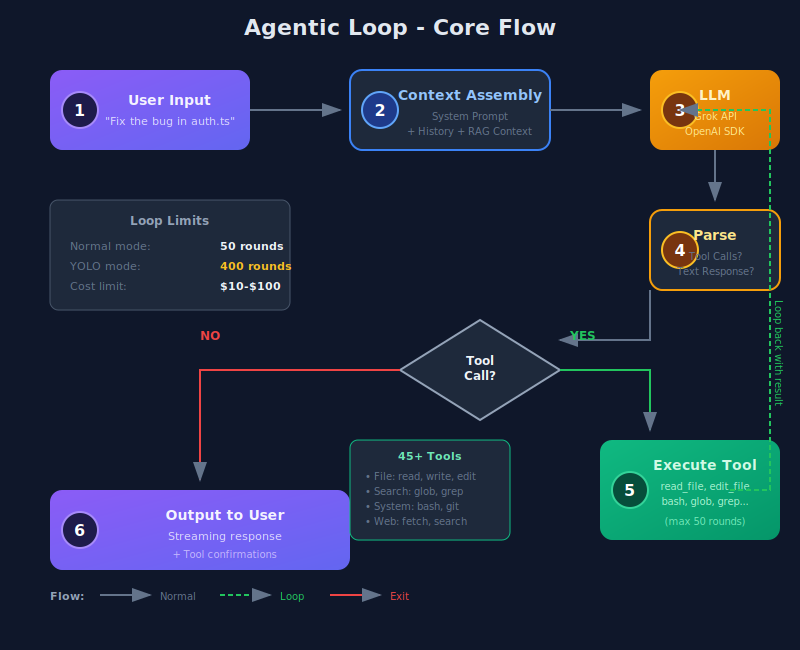
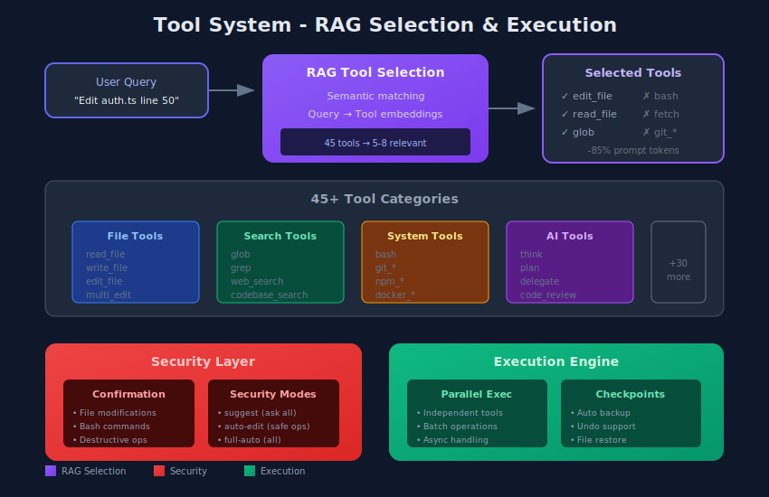

# Architecture Documentation

Cette documentation décrit l'architecture interne de Code Buddy, un agent CLI alimenté par IA.

## Diagrammes

### 1. Vue d'Ensemble de l'Architecture

L'architecture se compose de 6 couches principales :

| Couche | Description | Composants Clés |
|--------|-------------|-----------------|
| **Input** | Points d'entrée utilisateur | Terminal, VS Code, Neovim, HTTP, MCP/LSP |
| **Core** | Moteur de l'agent | CodeBuddyAgent, Boucle agentique |
| **Context** | Gestion du contexte | ContextManagerV2, Compression |
| **Tools** | Système d'outils | 45+ outils, Sélection RAG |
| **LLM** | Providers LLM | Grok, OpenAI, Anthropic, Ollama |
| **Storage** | Persistance | SQLite, HNSW, Checkpoints, Cache |

### 2. Boucle Agentique

Le flux principal de l'agent suit ces étapes :

1. **User Input** - L'utilisateur envoie une requête
2. **Context Assembly** - Assemblage du système prompt + historique + RAG
3. **LLM Call** - Appel au modèle via OpenAI SDK
4. **Response Parse** - Analyse de la réponse (texte ou tool calls)
5. **Tool Execution** - Exécution des outils (si nécessaire)
6. **Output** - Réponse streamée à l'utilisateur

**Limites de la boucle :**
- Mode normal : 50 rounds maximum
- Mode YOLO : 400 rounds maximum
- Limite de coût : $10-$100

### 3. Système d'Outils

Le système d'outils comprend :

- **RAG Tool Selection** - Sélection sémantique des outils pertinents
- **45+ Outils** répartis en catégories :
  - File: read, write, edit, multi_edit
  - Search: glob, grep, web_search
  - System: bash, git, npm, docker
  - AI: think, plan, delegate, code_review
- **Security Layer** - Confirmations et modes de sécurité
- **Execution Engine** - Exécution parallèle et checkpoints

## Principes Architecturaux

### 1. Lazy Loading
Les modules lourds sont chargés à la demande pour améliorer le temps de démarrage.

### 2. Singleton Pattern
Utilisé pour les services partagés comme `ConfirmationService`.

### 3. RAG-Based Tool Selection
Réduction de ~85% des tokens de prompt en sélectionnant uniquement les outils pertinents.

### 4. Defense in Depth
Plusieurs couches de sécurité : validation des entrées, confirmations, sandbox.

## Fichiers Sources Clés

| Fichier | Rôle |
|---------|------|
| `src/index.ts` | Point d'entrée CLI |
| `src/agent/codebuddy-agent.ts` | Orchestrateur principal |
| `src/codebuddy/client.ts` | Client API (OpenAI SDK) |
| `src/codebuddy/tools.ts` | Définitions et sélection des outils |
| `src/context/context-manager-v2.ts` | Gestion du contexte |
| `src/ui/components/chat-interface.tsx` | Interface Ink/React |

## Pour Aller Plus Loin

- [Chapitre 3: Anatomie d'un Agent](../livre/03-anatomie-agent.md)
- [Chapitre 10: Tool Use](../livre/10-tool-use.md)
- [Chapitre 15: Architecture Complète](../livre/15-architecture-complete.md)
