# Architecture Diagrams

This document contains Mermaid diagrams visualizing the Code Buddy architecture.

## System Overview

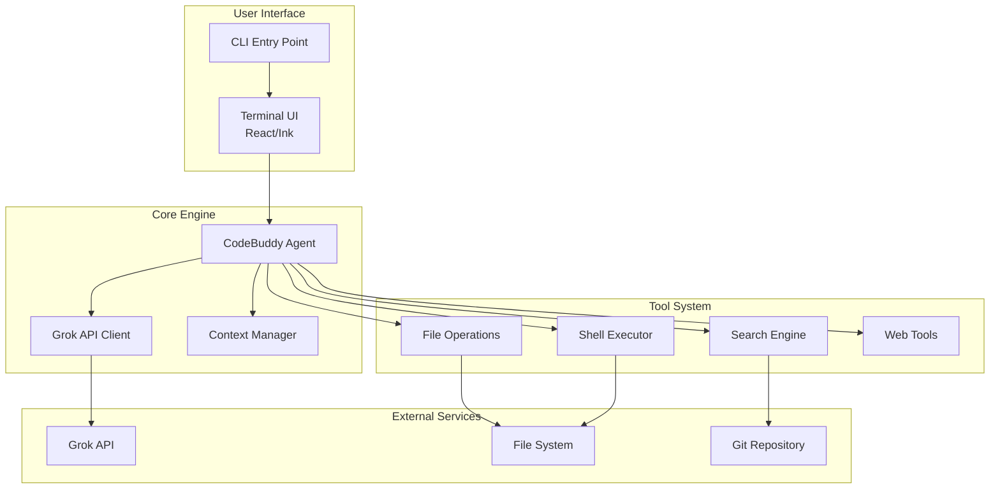

## Agentic Loop

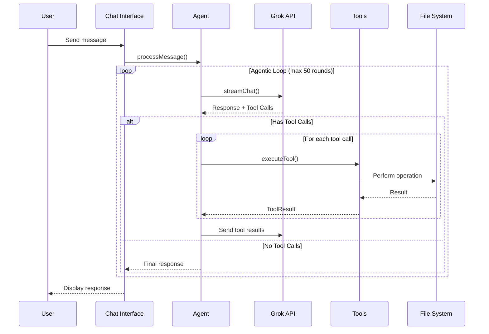

## Message Flow

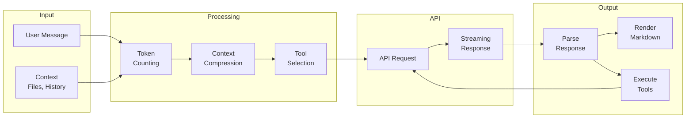

## Tool Execution Flow

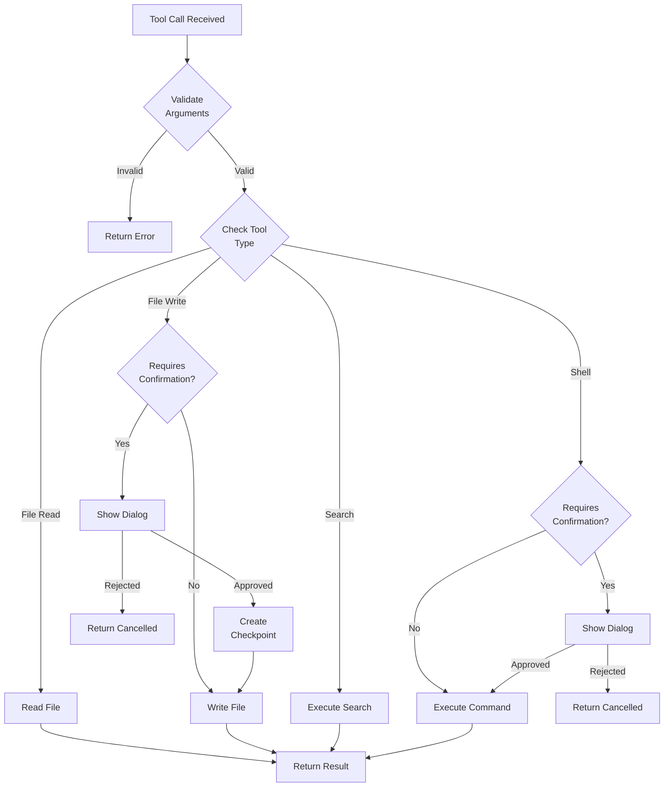

## Component Dependencies

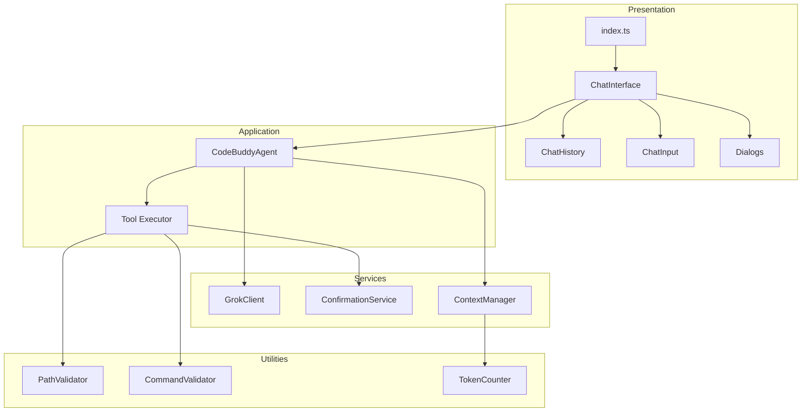

## Data Storage

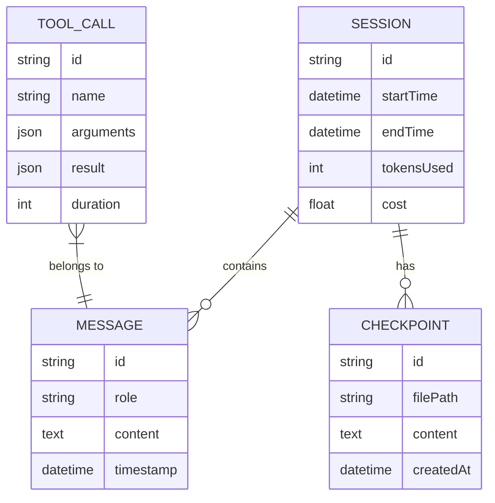

## Security Layers

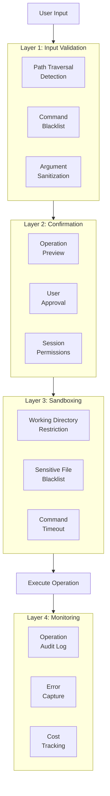

## Analytics Pipeline

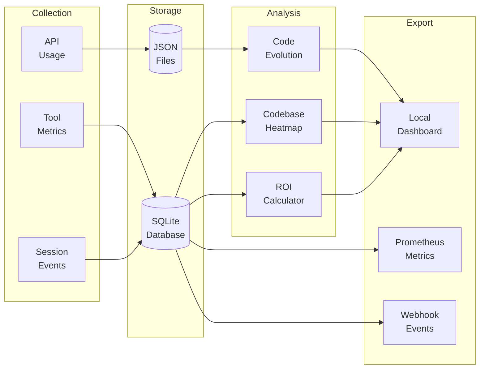

## Multi-Agent Coordination

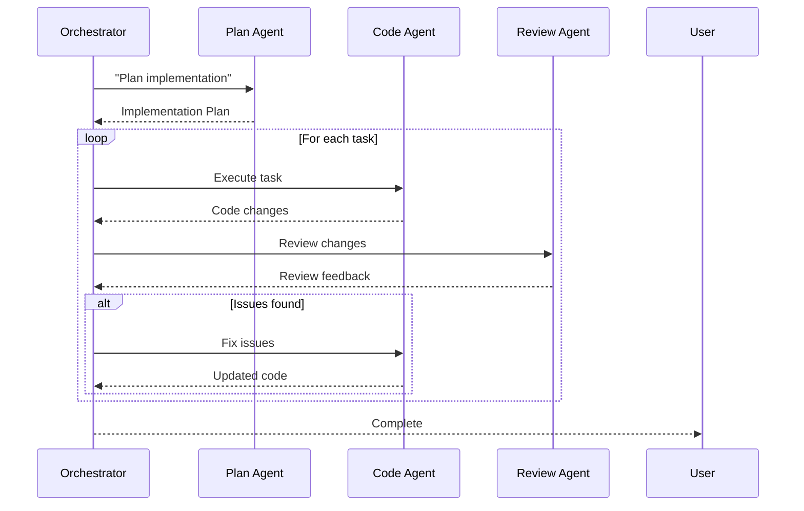

## Context Compression

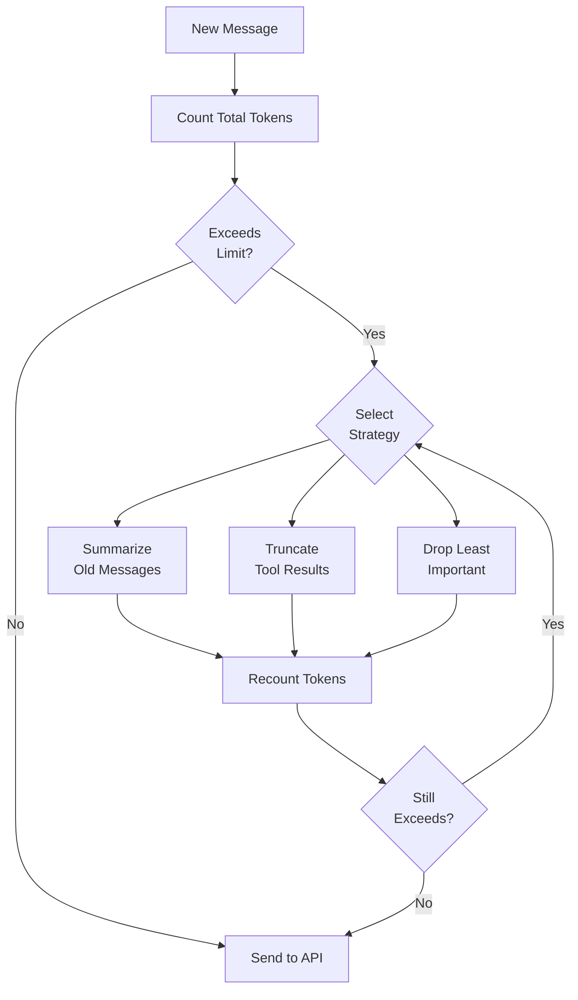

## State Machine: Session Lifecycle

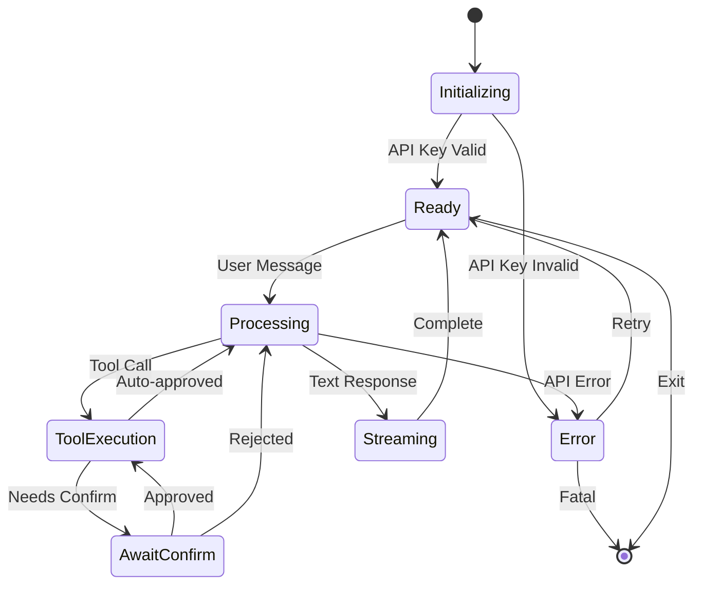

## Deployment Architecture

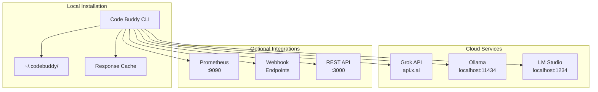

---

## Rendering Diagrams

These diagrams use [Mermaid](https://mermaid.js.org/) syntax and can be rendered:

1. **GitHub**: Automatically renders in markdown files
2. **VS Code**: Install "Markdown Preview Mermaid Support" extension
3. **CLI**: Use `mmdc` (mermaid-cli) to generate SVG/PNG
4. **Web**: Paste into [Mermaid Live Editor](https://mermaid.live/)

```bash
# Install mermaid-cli
npm install -g @mermaid-js/mermaid-cli

# Generate PNG from this file
mmdc -i docs/architecture/diagrams.md -o diagrams.png
```
