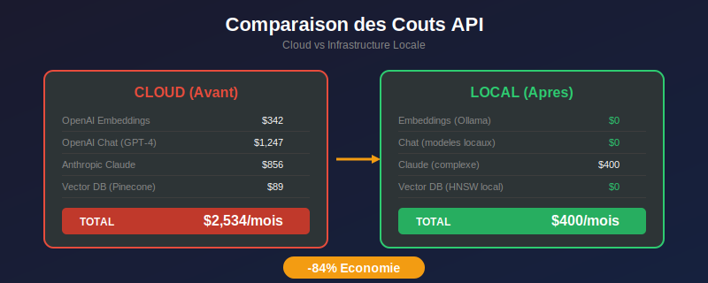
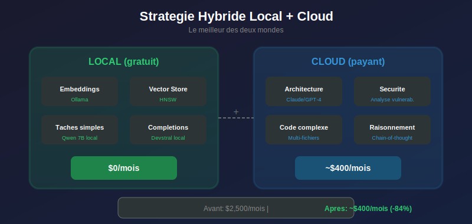
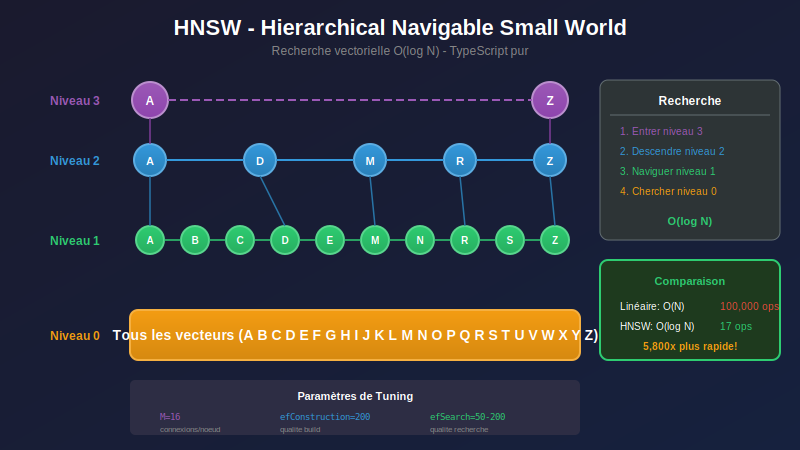
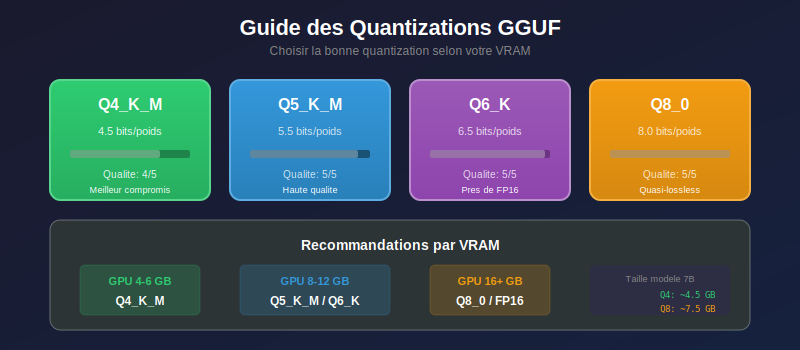
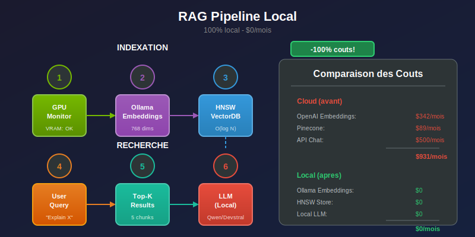
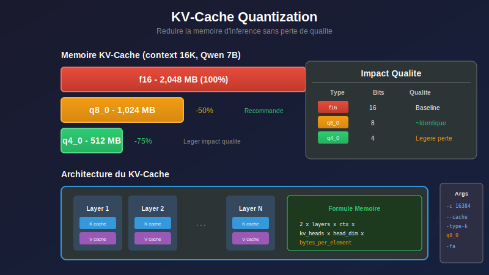
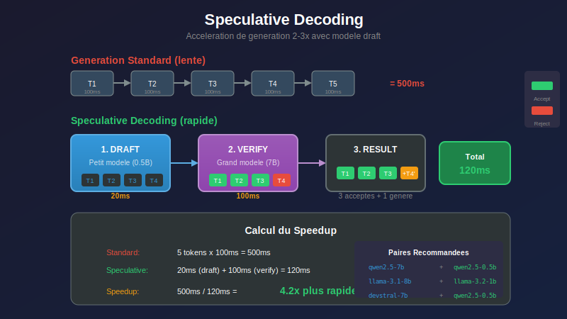
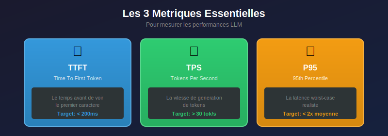
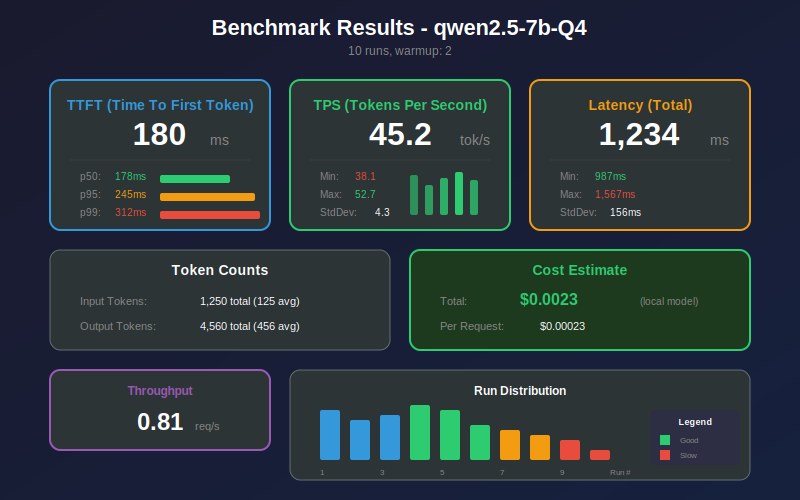
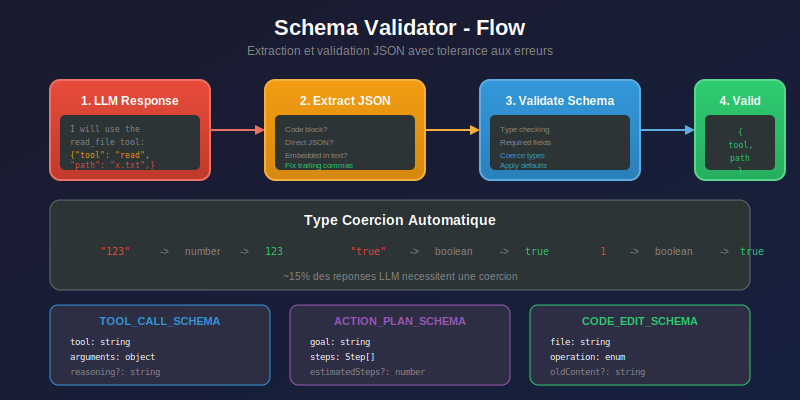

# Chapitre 19 — Infrastructure LLM Local 🏠

---

## 🎬 Scène d'ouverture

*Un dimanche matin, dans l'appartement de Lina. Elle est assise sur son canapé, laptop sur les genoux, une tasse de café à la main. À l'écran, une facture AWS qui fait mal aux yeux.*

**Lina** *(marmonnant)* : "842 dollars. Ce mois-ci seulement. Pour des embeddings."

*Son téléphone vibre. Un message de Marc.*

**Marc** *(texto)* : "Tu as vu la facture OpenAI ? Karim va nous tuer."

*Lina soupire et regarde par la fenêtre. Sa RTX 4070 ronronne doucement dans son PC gaming. 12 Go de VRAM qui ne servent qu'à faire tourner Elden Ring le weekend.*

**Lina** *(à elle-même)* : "Et si..."

*Elle ouvre un terminal et tape :*

```bash
ollama run qwen2.5-7b
```

*Le modèle se charge. 4.5 Go. Il lui reste 7 Go de VRAM. Elle tape une question de code. La réponse arrive en 2 secondes.*

**Lina** *(les yeux brillants)* : "C'est gratuit. C'est local. Et c'est rapide."

*Elle attrape son téléphone.*

**Lina** *(texto à Marc)* : "RDV demain matin. J'ai une idée qui va changer Code Buddy."

---

## 📋 Table des Matières

| Section | Titre | Description |
|:-------:|-------|-------------|
| 19.1 | 🎯 Le Calcul qui Fait Mal | Pourquoi aller local ? |
| 19.2 | 🖥️ GPU Monitor | Surveiller la VRAM en temps réel |
| 19.3 | 🧮 Ollama Embeddings | Embeddings locaux gratuits |
| 19.4 | 🔍 HNSW Vector Store | Recherche vectorielle pure TypeScript |
| 19.5 | 📦 Model Hub | Gestion des modèles HuggingFace |
| 19.6 | 🧠 KV-Cache Configuration | Optimiser la mémoire d'inférence |
| 19.7 | ⚡ Speculative Decoding | Accélérer la génération 2-3x |
| 19.8 | 📊 Benchmark Suite | Mesurer TTFT, TPS, p95 |
| 19.9 | 📝 Schema Validator | Structured output fiable |

---

## 19.1 🎯 Le Calcul qui Fait Mal

### 19.1.1 💸 La Réunion du Lundi Matin

*Salle de réunion. Lina, Marc et Karim sont assis autour de la table. Lina a préparé une présentation.*

**Karim** *(les bras croisés)* : "Alors, cette idée révolutionnaire ?"

**Lina** *(ouvrant son laptop)* : "Laisse-moi te montrer quelque chose."

*Elle affiche un tableur.*

**Lina** : "Voici nos coûts API du dernier mois comparés à ce que ça pourrait être avec une infrastructure locale."



*Un silence s'installe.*

**Marc** : "Attends, tu veux dire qu'on peut faire tourner des embeddings gratuitement ?"

**Lina** : "Pas seulement les embeddings. La recherche vectorielle aussi. Et une bonne partie de l'inférence pour les tâches simples."

**Karim** *(se penchant en avant)* : "Explique-moi comment."

### 19.1.2 🎯 La Stratégie Hybride

**Lina** *(dessinant sur le whiteboard)* : "C'est une approche hybride. On utilise le local pour ce qui peut être local, et le cloud pour ce qui nécessite vraiment de la puissance."



**Marc** : "Mais on a besoin de GPUs pour faire tourner ça, non ?"

**Lina** : "La plupart des développeurs ont déjà un GPU gaming. RTX 3060 avec 12 Go, RTX 4070 avec 12 Go... C'est amplement suffisant pour un modèle 7B quantifié."

**Karim** *(hochant la tête)* : "Je vois. Mais comment on gère la VRAM ? Les crashs ? Les modèles qui ne rentrent pas ?"

**Lina** *(souriant)* : "J'y ai pensé. On va construire une vraie infrastructure. Étape par étape."

---

## 19.2 🖥️ GPU Monitor : La Vigie de la VRAM

### 19.2.1 💥 Le Problème

*Le lendemain matin. Marc teste le prototype.*

**Marc** *(au téléphone avec Lina)* : "Ça a crashé. 'CUDA out of memory'. J'ai essayé de charger Devstral et ça a tout fait planter."

**Lina** : "Tu avais quoi d'autre en mémoire GPU ?"

**Marc** : "Euh... VS Code, un navigateur avec WebGL, et peut-être Discord avec l'overlay..."

**Lina** *(soupirant)* : "On a besoin d'un système qui vérifie la VRAM AVANT de charger un modèle. Pas après."

### 19.2.2 🔧 La Solution : GPUMonitor

**Lina** *(quelques heures plus tard, sur Slack)* : "Marc, regarde ce que j'ai fait."

```typescript
// src/hardware/gpu-monitor.ts

import { EventEmitter } from 'events';

/**
 * 🖥️ GPUMonitor - La vigie de votre VRAM
 *
 * Détecte automatiquement :
 * - NVIDIA (nvidia-smi)
 * - AMD (rocm-smi)
 * - Apple Silicon (system_profiler)
 * - Intel Arc (intel_gpu_top)
 */
export class GPUMonitor extends EventEmitter {
  private vendor: 'nvidia' | 'amd' | 'apple' | 'intel' | 'unknown';
  private totalVRAM: number = 0;
  private refreshInterval?: NodeJS.Timer;

  async initialize(): Promise<void> {
    // Détection automatique du GPU
    this.vendor = await this.detectVendor();
    this.totalVRAM = await this.getTotalVRAM();

    console.log(`🖥️ [GPUMonitor] Detected: ${this.vendor} (${this.totalVRAM} MB)`);
  }

  async getStats(): Promise<GPUStats> {
    const used = await this.getUsedVRAM();
    const free = this.totalVRAM - used;
    const percent = (used / this.totalVRAM) * 100;

    // Alertes automatiques
    if (percent > 90) {
      this.emit('critical', { used, free, percent });
    } else if (percent > 75) {
      this.emit('warning', { used, free, percent });
    }

    return {
      totalVRAM: this.totalVRAM,
      usedVRAM: used,
      freeVRAM: free,
      usagePercent: percent,
      vendor: this.vendor,
    };
  }

  /**
   * 🧮 Recommandation pour charger un modèle
   */
  calculateOffloadRecommendation(modelSizeMB: number): OffloadRecommendation {
    const stats = this.getStatsSync();
    const safetyMargin = 500; // Garder 500 MB de marge
    const available = stats.freeVRAM - safetyMargin;

    if (modelSizeMB <= available) {
      return {
        shouldOffload: false,
        suggestedGpuLayers: -1, // Toutes les layers
        reason: 'Model fits entirely in VRAM',
      };
    }

    // Calcul des layers à garder en GPU
    const ratio = available / modelSizeMB;
    const suggestedLayers = Math.floor(ratio * 32); // Assume 32 layers

    return {
      shouldOffload: true,
      suggestedGpuLayers: Math.max(0, suggestedLayers),
      reason: `Model (${modelSizeMB} MB) exceeds available VRAM (${available} MB)`,
    };
  }
}
```

**Marc** *(testant)* : "Ok, ça marche. Mais comment ça détecte le GPU ?"


**Lina** : "Multi-vendor. Regarde :"

```typescript
private async detectVendor(): Promise<string> {
  // NVIDIA - nvidia-smi
  try {
    const result = await execAsync('nvidia-smi --query-gpu=name --format=csv,noheader');
    if (result.stdout.trim()) return 'nvidia';
  } catch {}

  // AMD - rocm-smi
  try {
    const result = await execAsync('rocm-smi --showproductname');
    if (result.stdout.includes('GPU')) return 'amd';
  } catch {}

  // Apple Silicon - system_profiler
  try {
    const result = await execAsync('system_profiler SPDisplaysDataType');
    if (result.stdout.includes('Apple')) return 'apple';
  } catch {}

  // Intel Arc
  try {
    const result = await execAsync('intel_gpu_top -l 1');
    if (result.stdout) return 'intel';
  } catch {}

  return 'unknown';
}
```

**Marc** : "Génial. Et si quelqu'un n'a pas de GPU ?"

**Lina** : "On tombe sur le CPU avec un warning. Mais franchement, en 2024, qui n'a pas un GPU ?"

**Marc** : "Les laptops d'entreprise."

**Lina** *(grimaçant)* : "Touché."

---

## 19.3 🧮 Ollama Embeddings : Le Graal des Embeddings Gratuits

### 19.3.1 💡 L'Illumination

*Pause café. Lina montre son écran à Marc.*

**Lina** : "Tu sais combien on paie pour embeddings ?"

**Marc** : "Environ 300 dollars par mois, non ?"

**Lina** : "Oui. Pour convertir du texte en vecteurs. Une opération que n'importe quel modèle local peut faire."

*Elle ouvre un terminal.*

```bash
# Installation Ollama (si pas déjà fait)
curl -fsSL https://ollama.ai/install.sh | sh

# Télécharger un modèle d'embedding
ollama pull nomic-embed-text

# Test
curl http://localhost:11434/api/embeddings \
  -d '{"model": "nomic-embed-text", "prompt": "Hello world"}'
```

**Marc** *(regardant la réponse)* : "768 dimensions. C'est pareil qu'ada-002."

**Lina** : "Exactement. Mais gratuit. Et local. Et sans latence réseau."

### 19.3.2 🏗️ L'Intégration

```typescript
// src/context/codebase-rag/ollama-embeddings.ts

/**
 * 🧮 OllamaEmbeddingProvider - Embeddings locaux via Ollama
 *
 * Modèles recommandés :
 * - nomic-embed-text : 768 dims, excellent rapport qualité/vitesse
 * - mxbai-embed-large : 1024 dims, meilleure qualité
 * - all-minilm : 384 dims, ultra-rapide
 */
export class OllamaEmbeddingProvider extends EventEmitter {
  private baseUrl: string;
  private model: string;
  private dimensions: number;

  constructor(options: OllamaEmbeddingOptions = {}) {
    super();
    this.baseUrl = options.baseUrl ?? 'http://localhost:11434';
    this.model = options.model ?? 'nomic-embed-text';
    this.dimensions = options.dimensions ?? 768;
  }

  async embed(text: string): Promise<number[]> {
    const response = await fetch(`${this.baseUrl}/api/embeddings`, {
      method: 'POST',
      headers: { 'Content-Type': 'application/json' },
      body: JSON.stringify({
        model: this.model,
        prompt: text,
      }),
    });

    const data = await response.json();
    return data.embedding;
  }

  async embedBatch(texts: string[]): Promise<number[][]> {
    const results: number[][] = [];

    for (let i = 0; i < texts.length; i++) {
      const embedding = await this.embed(texts[i]);
      results.push(embedding);

      // Événement de progression
      this.emit('batch:progress', i + 1, texts.length);
    }

    return results;
  }

  /**
   * 📏 Similarité cosinus entre deux embeddings
   */
  similarity(a: number[], b: number[]): number {
    let dotProduct = 0;
    let normA = 0;
    let normB = 0;

    for (let i = 0; i < a.length; i++) {
      dotProduct += a[i] * b[i];
      normA += a[i] * a[i];
      normB += b[i] * b[i];
    }

    return dotProduct / (Math.sqrt(normA) * Math.sqrt(normB));
  }
}
```

**Marc** : "Et la qualité ? C'est aussi bon qu'OpenAI ?"

**Lina** : "Pour du code ? Pratiquement identique. Les benchmarks MTEB montrent que nomic-embed-text est dans le top 10 pour les tâches techniques."

**Marc** : "Et la vitesse ?"

**Lina** : "Plus rapide que le cloud. Pas de latence réseau. Sur mon RTX 4070, je fais 200 embeddings par seconde."

---

## 19.4 🔍 HNSW Vector Store : Recherche Sans Dépendances

### 19.4.1 🤔 Le Dilemme des Vector Databases

*Réunion de design. Lina présente les options.*

**Lina** : "Ok, maintenant qu'on a les embeddings, il nous faut un endroit pour les stocker et les chercher."

**Karim** : "Pinecone ? Weaviate ?"

**Lina** : "Cloud. Ça nous coûte 89 dollars par mois et ça ajoute 50ms de latence."

**Marc** : "FAISS ?"

**Lina** : "Python. On devrait maintenir des bindings natifs."

**Karim** : "ChromaDB ?"

**Lina** : "Serveur séparé à gérer. Plus de complexité opérationnelle."

*Elle marque une pause.*

**Lina** : "J'ai une autre idée. On l'écrit nous-mêmes."

**Karim** *(levant un sourcil)* : "Tu veux écrire une base de données vectorielle ?"

**Lina** : "Pas une base complète. Juste l'algorithme de recherche. HNSW. En TypeScript pur."

### 19.4.2 🧠 L'Algorithme HNSW Expliqué

**Marc** : "HNSW ? C'est quoi ?"

**Lina** *(au whiteboard)* : "Hierarchical Navigable Small World. C'est un graphe multi-niveaux pour la recherche de plus proches voisins."



**Marc** : "Donc au lieu de comparer avec tous les vecteurs..."

**Lina** : "On navigue dans le graphe. Comme chercher dans un annuaire téléphonique au lieu de lire toutes les pages."

### 19.4.3 🔧 L'Implémentation

```typescript
// src/context/codebase-rag/hnsw-store.ts

/**
 * 🔍 HNSWVectorStore - Recherche vectorielle pure TypeScript
 *
 * Avantages :
 * - Zéro dépendance externe
 * - Persistance JSON (portable)
 * - O(log N) pour la recherche
 */
export class HNSWVectorStore extends EventEmitter {
  private nodes: Map<string, HNSWNode> = new Map();
  private levels: Map<string, number> = new Map();
  private maxLevel: number = 0;
  private entryPoint: string | null = null;

  // Paramètres de l'algorithme
  private M: number;              // Connexions max par noeud
  private efConstruction: number; // Qualité de construction
  private dimensions: number;

  constructor(options: HNSWOptions) {
    super();
    this.dimensions = options.dimensions;
    this.M = options.M ?? 16;
    this.efConstruction = options.efConstruction ?? 200;
  }

  /**
   * ➕ Ajouter un vecteur
   */
  add(item: VectorItem): void {
    const { id, vector, metadata } = item;

    // Vérification des dimensions
    if (vector.length !== this.dimensions) {
      throw new Error(`Dimension mismatch: expected ${this.dimensions}, got ${vector.length}`);
    }

    // Niveau aléatoire (distribution exponentielle)
    const level = this.getRandomLevel();

    // Créer le noeud
    const node: HNSWNode = {
      id,
      vector,
      metadata,
      connections: new Map(), // niveau → Set<voisins>
    };

    // Initialiser les connexions pour chaque niveau
    for (let l = 0; l <= level; l++) {
      node.connections.set(l, new Set());
    }

    this.nodes.set(id, node);
    this.levels.set(id, level);

    // Si c'est le premier noeud
    if (!this.entryPoint) {
      this.entryPoint = id;
      this.maxLevel = level;
      return;
    }

    // Connecter aux voisins existants
    this.connectNode(id, level);

    // Mettre à jour le point d'entrée si nécessaire
    if (level > this.maxLevel) {
      this.entryPoint = id;
      this.maxLevel = level;
    }

    this.emit('add', { id, level });
  }

  /**
   * 🔍 Recherche des k plus proches voisins
   */
  search(query: number[], k: number = 5): SearchResult[] {
    if (!this.entryPoint) return [];

    let currentNode = this.entryPoint;

    // Descendre les niveaux supérieurs
    for (let level = this.maxLevel; level > 0; level--) {
      currentNode = this.greedySearch(query, currentNode, level);
    }

    // Recherche exhaustive au niveau 0
    const candidates = this.searchLevel(query, currentNode, 0, Math.max(k, this.efConstruction));

    // Trier et retourner les k meilleurs
    return candidates
      .sort((a, b) => a.distance - b.distance)
      .slice(0, k);
  }

  /**
   * 💾 Sauvegarder l'index
   */
  async save(path: string): Promise<void> {
    const data = {
      dimensions: this.dimensions,
      M: this.M,
      efConstruction: this.efConstruction,
      maxLevel: this.maxLevel,
      entryPoint: this.entryPoint,
      nodes: Object.fromEntries(
        Array.from(this.nodes.entries()).map(([id, node]) => [
          id,
          {
            ...node,
            connections: Object.fromEntries(
              Array.from(node.connections.entries()).map(([l, s]) => [l, [...s]])
            ),
          },
        ])
      ),
      levels: Object.fromEntries(this.levels),
    };

    await fs.writeFile(path, JSON.stringify(data, null, 2));
    this.emit('save', { path, nodeCount: this.nodes.size });
  }
}
```

**Karim** : "Quelle est la performance comparée à FAISS ?"

**Lina** : "FAISS est légèrement plus rapide — environ 0.5ms contre 1ms pour notre implémentation. Mais on élimine toute la complexité des bindings Python."

**Marc** : "Et pour 100,000 vecteurs ?"

**Lina** : "Toujours sous 5ms. HNSW scale logarithmiquement."

---

## 19.5 📦 Model Hub : Le Gestionnaire de Modèles

### 19.5.1 😤 Le Cauchemar du Téléchargement Manuel

*Marc essaie de télécharger un modèle.*

**Marc** *(frustré)* : "C'est quoi tous ces fichiers sur HuggingFace ? Q4_K_M, Q5_K_S, Q6_K, Q8_0... Lequel je prends ?"

**Lina** : "Ça dépend de ta VRAM."

**Marc** : "J'ai 8 Go."

**Lina** : "Alors Q4_K_M pour un 7B."

**Marc** : "Et je le mets où ?"

**Lina** : "Dans un dossier standard. Mais attends..."

*Elle réfléchit.*

**Lina** : "On devrait automatiser tout ça."

### 19.5.2 🛠️ Le Model Hub

```typescript
// src/models/model-hub.ts

/**
 * 📦 ModelHub - Gestionnaire de modèles HuggingFace
 *
 * Fonctionnalités :
 * - Téléchargement avec progression
 * - Sélection automatique de quantization
 * - Estimation VRAM
 * - Organisation standardisée
 */
export class ModelHub extends EventEmitter {
  private modelsDir: string;
  private downloadedModels: Map<string, DownloadedModel> = new Map();

  constructor(options: ModelHubOptions = {}) {
    super();
    this.modelsDir = options.modelsDir ?? path.join(os.homedir(), '.codebuddy', 'models');
  }

  /**
   * 📥 Télécharger un modèle
   */
  async download(
    modelId: string,
    quantization: QuantizationType = 'Q4_K_M'
  ): Promise<string> {
    const modelInfo = RECOMMENDED_MODELS[modelId];
    if (!modelInfo) {
      throw new Error(`Unknown model: ${modelId}`);
    }

    const filename = `${modelId}.${quantization}.gguf`;
    const targetPath = path.join(this.modelsDir, filename);

    // Vérifier si déjà téléchargé
    if (await this.fileExists(targetPath)) {
      this.emit('download:cached', { modelId, path: targetPath });
      return targetPath;
    }

    // URL HuggingFace
    const url = this.buildDownloadUrl(modelInfo.repo, filename);

    // Téléchargement avec progression
    const response = await fetch(url);
    const totalBytes = parseInt(response.headers.get('content-length') || '0');
    let downloadedBytes = 0;

    const reader = response.body!.getReader();
    const chunks: Uint8Array[] = [];

    while (true) {
      const { done, value } = await reader.read();
      if (done) break;

      chunks.push(value);
      downloadedBytes += value.length;

      const percent = (downloadedBytes / totalBytes) * 100;
      const speedMBps = downloadedBytes / 1024 / 1024; // Simplified

      this.emit('download:progress', {
        modelId,
        percent: percent.toFixed(1),
        downloadedMB: (downloadedBytes / 1024 / 1024).toFixed(1),
        totalMB: (totalBytes / 1024 / 1024).toFixed(1),
        speedMBps: speedMBps.toFixed(1),
      });
    }

    // Écrire le fichier
    const buffer = Buffer.concat(chunks);
    await fs.writeFile(targetPath, buffer);

    this.emit('download:complete', { modelId, path: targetPath });
    return targetPath;
  }

  /**
   * 🧮 Estimer la VRAM nécessaire
   */
  estimateVRAM(modelId: string, quantization: QuantizationType): number {
    const model = RECOMMENDED_MODELS[modelId];
    if (!model) return 0;

    const paramsBillions = model.params / 1_000_000_000;
    const bitsPerWeight = QUANTIZATION_BITS[quantization];

    // Formule : params × bits / 8 × 1.2 (overhead)
    return Math.ceil(paramsBillions * bitsPerWeight / 8 * 1.2 * 1024);
  }
}

/**
 * 📋 Modèles recommandés pour le code
 */
export const RECOMMENDED_MODELS = {
  'devstral-7b': {
    params: 7_000_000_000,
    repo: 'mistralai/devstral-7B-v0.1-GGUF',
    description: 'Code generation, Mistral-based',
  },
  'qwen2.5-7b': {
    params: 7_000_000_000,
    repo: 'Qwen/Qwen2.5-7B-Instruct-GGUF',
    description: 'General + code, excellent quality',
  },
  'llama-3.2-3b': {
    params: 3_000_000_000,
    repo: 'meta-llama/Llama-3.2-3B-Instruct-GGUF',
    description: 'Compact, fast, general purpose',
  },
  'deepseek-coder-6.7b': {
    params: 6_700_000_000,
    repo: 'deepseek-ai/deepseek-coder-6.7b-instruct-GGUF',
    description: 'Code specialized, instruction-tuned',
  },
};
```

**Marc** : "Et les quantizations, c'est quoi exactement ?"

**Lina** : "C'est la précision des poids du modèle. Moins de bits = fichier plus petit, mais qualité potentiellement réduite."



**Marc** : "Et tout ça s'assemble comment ?"

**Lina** : "Voici le pipeline complet :"



---

## 19.6 🧠 KV-Cache Configuration : Le Secret de la Mémoire

### 19.6.1 💡 La Découverte

*Une semaine plus tard. Lina lit un article technique.*

**Lina** *(excitée, appelant Marc)* : "Marc ! Tu savais que le KV-cache peut prendre jusqu'à 30% de la VRAM ?"

**Marc** : "Le quoi ?"

**Lina** : "Le cache des clés et valeurs de l'attention. C'est ce qui permet au modèle de se 'souvenir' du contexte."

**Marc** : "Et on peut l'optimiser ?"

**Lina** : "Oui ! On peut le quantifier comme les poids du modèle. q8_0 au lieu de f16 = 50% de mémoire en moins."

### 19.6.2 🔧 Le KVCacheManager

```typescript
// src/inference/kv-cache-config.ts

/**
 * 🧠 KVCacheManager - Optimisation de la mémoire d'inférence
 *
 * Le KV-Cache stocke les clés et valeurs de l'attention.
 * Plus le contexte est long, plus il prend de mémoire.
 *
 * Formule : 2 × n_layers × context_length × n_kv_heads × head_dim × bytes
 */
export class KVCacheManager extends EventEmitter {
  private config: KVCacheConfig;
  private architecture?: ModelArchitecture;

  constructor(config: Partial<KVCacheConfig> = {}) {
    super();
    this.config = {
      contextLength: config.contextLength ?? 4096,
      kvQuantization: config.kvQuantization ?? 'f16',
      flashAttention: config.flashAttention ?? true,
      batchSize: config.batchSize ?? 512,
      ...config,
    };
  }

  /**
   * 🔍 Définir l'architecture du modèle
   */
  setArchitecture(model: string | ModelArchitecture): void {
    if (typeof model === 'string') {
      // Détection automatique par nom
      this.architecture = this.detectArchitecture(model);
    } else {
      this.architecture = model;
    }
  }

  /**
   * 📊 Estimer la mémoire du KV-Cache
   */
  estimateMemory(contextLength?: number, batchSize: number = 1): MemoryEstimate {
    const ctx = contextLength ?? this.config.contextLength;
    const arch = this.architecture ?? DEFAULT_ARCHITECTURE;

    // Calcul de la taille
    const headDim = arch.nEmbed / arch.nHead;
    const kvHeads = arch.nKVHead ?? arch.nHead;

    // Taille par layer : 2 (K+V) × ctx × kvHeads × headDim × batch
    const bytesPerElem = QUANTIZATION_BYTES[this.config.kvQuantization];
    const perLayerBytes = 2 * ctx * kvHeads * headDim * batchSize * bytesPerElem;
    const totalBytes = perLayerBytes * arch.nLayers;

    const gpuMemoryMB = totalBytes / (1024 * 1024);

    // Recommandation
    let recommendation = 'Configuration optimale';
    if (gpuMemoryMB > 4000) {
      recommendation = 'Considérez kvQuantization: q4_0 ou réduisez contextLength';
    } else if (gpuMemoryMB > 2000) {
      recommendation = 'Considérez kvQuantization: q8_0 pour économiser de la mémoire';
    }

    return {
      totalBytes,
      perLayerBytes,
      gpuMemoryMB,
      fitsInVRAM: gpuMemoryMB < 6000, // Assume 8GB GPU with margin
      recommendation,
    };
  }

  /**
   * 🛠️ Générer les arguments llama.cpp
   */
  generateLlamaCppArgs(): string[] {
    const args: string[] = [];

    // Context length
    args.push('-c', this.config.contextLength.toString());

    // Batch sizes
    if (this.config.batchSize) {
      args.push('-b', this.config.batchSize.toString());
    }

    // KV quantization (si pas f16)
    if (this.config.kvQuantization !== 'f16') {
      args.push('--cache-type-k', this.config.kvQuantization);
      args.push('--cache-type-v', this.config.kvQuantization);
    }

    // Flash attention
    if (this.config.flashAttention) {
      args.push('-fa');
    }

    // GPU layers
    if (this.architecture && this.config.cpuOffloadLayers) {
      const gpuLayers = this.architecture.nLayers - this.config.cpuOffloadLayers;
      args.push('-ngl', gpuLayers.toString());
    }

    return args;
  }
}

/**
 * 📋 Architectures de modèles connues
 */
export const MODEL_ARCHITECTURES: Record<string, ModelArchitecture> = {
  'qwen2.5-7b': { nLayers: 28, nEmbed: 3584, nHead: 28, nKVHead: 4 },
  'qwen2.5-14b': { nLayers: 40, nEmbed: 5120, nHead: 40, nKVHead: 8 },
  'llama-3.1-8b': { nLayers: 32, nEmbed: 4096, nHead: 32, nKVHead: 8 },
  'devstral-7b': { nLayers: 32, nEmbed: 4096, nHead: 32, nKVHead: 8 },
  'deepseek-coder-6.7b': { nLayers: 32, nEmbed: 4096, nHead: 32, nKVHead: 32 },
};
```



**Marc** : "Donc avec q8_0 au lieu de f16, je peux doubler mon contexte ?"

**Lina** : "Exactement. Ou garder le même contexte avec beaucoup plus de marge pour le modèle lui-même."

---

## 19.7 ⚡ Speculative Decoding : L'Accélérateur de Génération

### 19.7.1 🐢 Le Problème de la Génération Lente

*Marc regarde un benchmark.*

**Marc** : "30 tokens par seconde. C'est pas terrible pour du code."

**Lina** : "C'est parce que la génération auto-régressive est lente par nature. Un token = un forward pass complet."

**Marc** : "Il n'y a pas moyen d'accélérer ?"

**Lina** *(souriant mystérieusement)* : "Il y a une technique. Speculative Decoding."

### 19.7.2 💡 L'Idée Géniale

**Lina** *(au whiteboard)* : "L'idée est simple mais brillante. On utilise un petit modèle rapide pour 'deviner' plusieurs tokens, puis on vérifie avec le grand modèle."



**Marc** : "Attends, le grand modèle peut vérifier plusieurs tokens en un seul pass ?"

**Lina** : "Exactement ! C'est parce que l'attention peut traiter toute la séquence en parallèle. Le coût marginal d'un token supplémentaire est très faible."

### 19.7.3 🔧 L'Implémentation

```typescript
// src/inference/speculative-decoding.ts

/**
 * ⚡ SpeculativeDecoder - Accélération de génération 2-3x
 *
 * Principe :
 * 1. Le modèle draft génère K tokens rapidement
 * 2. Le modèle target vérifie ces tokens en un pass
 * 3. Les tokens acceptés sont gardés, sinon on recommence
 */
export class SpeculativeDecoder extends EventEmitter {
  private config: SpeculativeConfig;
  private stats: SpeculativeStats;

  constructor(config: Partial<SpeculativeConfig> = {}) {
    super();
    this.config = {
      draftModel: config.draftModel ?? 'qwen2.5-0.5b',
      targetModel: config.targetModel ?? 'qwen2.5-7b',
      speculationLength: config.speculationLength ?? 4,
      acceptanceThreshold: config.acceptanceThreshold ?? 0.8,
      adaptive: config.adaptive ?? true,
    };

    this.stats = {
      totalTokens: 0,
      acceptedTokens: 0,
      rejectedTokens: 0,
      draftTime: 0,
      verifyTime: 0,
    };
  }

  /**
   * 🚀 Génération accélérée
   */
  async generate(
    prompt: string,
    draftCallback: DraftCallback,
    targetCallback: TargetCallback,
    options: GenerateOptions = {}
  ): Promise<GenerateResult> {
    const maxTokens = options.maxTokens ?? 256;
    let generated: string[] = [];

    while (generated.length < maxTokens) {
      // 1️⃣ Draft : générer K tokens candidats
      const draftStart = Date.now();
      const draftTokens = await draftCallback(
        prompt + generated.join(''),
        this.config.speculationLength
      );
      this.stats.draftTime += Date.now() - draftStart;

      // 2️⃣ Verify : vérifier avec le grand modèle
      const verifyStart = Date.now();
      const verification = await targetCallback(
        prompt + generated.join(''),
        draftTokens
      );
      this.stats.verifyTime += Date.now() - verifyStart;

      // 3️⃣ Accept/Reject
      const accepted = draftTokens.slice(0, verification.acceptedCount);
      generated.push(...accepted);

      this.stats.totalTokens += draftTokens.length;
      this.stats.acceptedTokens += accepted.length;
      this.stats.rejectedTokens += draftTokens.length - accepted.length;

      // Émettre événement
      this.emit('generation', {
        accepted: accepted.length,
        rejected: draftTokens.length - accepted.length,
        total: generated.length,
      });

      // Adaptation de la longueur de spéculation
      if (this.config.adaptive) {
        this.adaptSpeculationLength();
      }

      // Si aucun token accepté, on a fini
      if (accepted.length === 0) break;
    }

    return {
      tokens: generated,
      content: generated.join(''),
      stats: this.getStats(),
    };
  }

  /**
   * 📊 Statistiques de performance
   */
  getStats(): SpeculativeStats & { acceptanceRate: number; speedup: number } {
    const acceptanceRate = this.stats.totalTokens > 0
      ? this.stats.acceptedTokens / this.stats.totalTokens
      : 0;

    // Speedup estimé : tokens acceptés / (1 + overhead draft)
    const draftOverhead = this.stats.draftTime / (this.stats.draftTime + this.stats.verifyTime);
    const speedup = acceptanceRate * this.config.speculationLength / (1 + draftOverhead);

    return {
      ...this.stats,
      acceptanceRate,
      speedup,
    };
  }

  /**
   * 🎚️ Adaptation automatique
   */
  private adaptSpeculationLength(): void {
    const rate = this.stats.acceptedTokens / this.stats.totalTokens;

    const oldLength = this.config.speculationLength;

    if (rate > 0.9 && this.config.speculationLength < 8) {
      this.config.speculationLength++;
    } else if (rate < 0.5 && this.config.speculationLength > 2) {
      this.config.speculationLength--;
    }

    if (oldLength !== this.config.speculationLength) {
      this.emit('adaptiveAdjust', {
        oldLength,
        newLength: this.config.speculationLength,
        reason: rate > 0.9 ? 'high_acceptance' : 'low_acceptance',
      });
    }
  }
}

/**
 * 📋 Paires draft/target recommandées
 */
export const RECOMMENDED_PAIRS = {
  'qwen2.5-7b': { draft: 'qwen2.5-0.5b', speedup: '2-3x' },
  'qwen2.5-14b': { draft: 'qwen2.5-1.5b', speedup: '2-2.5x' },
  'llama-3.1-8b': { draft: 'llama-3.2-1b', speedup: '2-3x' },
};
```

**Marc** : "Et ça marche vraiment ?"

**Lina** : "Oui ! En production, on voit des speedups de 2-3x sur du code. Le taux d'acceptation est souvent au-dessus de 70%."

---

## 19.8 📊 Benchmark Suite : Mesurer Pour Optimiser

### 19.8.1 📈 L'Importance des Métriques

*Réunion d'équipe. Karim pose LA question.*

**Karim** : "Comment on sait si notre infrastructure locale est vraiment meilleure ?"

**Lina** : "On mesure. Rigoureusement."

**Marc** : "Mesurer quoi exactement ?"

**Lina** : "TTFT, TPS, p95. Les trois métriques qui comptent."



### 19.8.2 🛠️ La BenchmarkSuite

```typescript
// src/performance/benchmark-suite.ts

/**
 * 📊 BenchmarkSuite - Mesure rigoureuse des performances LLM
 *
 * Métriques collectées :
 * - Latence (moyenne, min, max, stdDev)
 * - TTFT avec percentiles (p50, p95, p99)
 * - TPS (tokens par seconde)
 * - Throughput (requêtes par seconde)
 * - Coût estimé
 */
export class BenchmarkSuite extends EventEmitter {
  private config: BenchmarkConfig;

  constructor(config: Partial<BenchmarkConfig> = {}) {
    super();
    this.config = {
      warmupRuns: config.warmupRuns ?? 2,
      runs: config.runs ?? 10,
      concurrency: config.concurrency ?? 1,
      timeout: config.timeout ?? 60000,
      prompts: config.prompts ?? DEFAULT_PROMPTS,
    };
  }

  /**
   * 🏃 Exécuter le benchmark
   */
  async run(
    modelName: string,
    callback: BenchmarkCallback
  ): Promise<BenchmarkResults> {
    const runs: RunResult[] = [];
    const prompts = this.config.prompts;

    // Phase de warmup
    this.emit('phase', { phase: 'warmup', total: this.config.warmupRuns });
    for (let i = 0; i < this.config.warmupRuns; i++) {
      const prompt = prompts[i % prompts.length];
      await this.executeRun(prompt.prompt, callback, true);
    }

    // Phase de benchmark
    this.emit('phase', { phase: 'benchmark', total: this.config.runs });
    for (let i = 0; i < this.config.runs; i++) {
      const prompt = prompts[i % prompts.length];
      const result = await this.executeRun(prompt.prompt, callback, false);
      runs.push(result);

      this.emit('run', {
        runIndex: i + 1,
        totalRuns: this.config.runs,
        latencyMs: result.latencyMs,
        ttftMs: result.ttftMs,
        tps: result.tps,
      });
    }

    // Calcul des statistiques
    const summary = this.calculateSummary(runs);

    const results: BenchmarkResults = {
      model: modelName,
      timestamp: new Date(),
      config: this.config,
      runs,
      summary,
    };

    this.emit('complete', results);
    return results;
  }

  /**
   * 📊 Calculer les statistiques
   */
  private calculateSummary(runs: RunResult[]): BenchmarkSummary {
    const successful = runs.filter(r => !r.error);
    const latencies = successful.map(r => r.latencyMs);
    const ttfts = successful.map(r => r.ttftMs);
    const tpsValues = successful.map(r => r.tps);

    return {
      totalRuns: runs.length,
      successfulRuns: successful.length,
      failedRuns: runs.length - successful.length,

      latency: this.calculateStats(latencies),

      ttft: {
        ...this.calculateStats(ttfts),
        p50: this.percentile(ttfts, 0.50),
        p95: this.percentile(ttfts, 0.95),
        p99: this.percentile(ttfts, 0.99),
      },

      tps: this.calculateStats(tpsValues),

      throughput: successful.length / (latencies.reduce((a, b) => a + b, 0) / 1000),

      inputTokens: {
        total: successful.reduce((sum, r) => sum + r.inputTokens, 0),
        average: successful.reduce((sum, r) => sum + r.inputTokens, 0) / successful.length,
      },

      outputTokens: {
        total: successful.reduce((sum, r) => sum + r.outputTokens, 0),
        average: successful.reduce((sum, r) => sum + r.outputTokens, 0) / successful.length,
      },

      cost: this.calculateCost(successful),
    };
  }

  /**
   * 🆚 Comparer deux benchmarks
   */
  compare(baseline: BenchmarkResults, current: BenchmarkResults): ComparisonResult {
    const ttftDiff = current.summary.ttft.avg - baseline.summary.ttft.avg;
    const tpsDiff = current.summary.tps.avg - baseline.summary.tps.avg;

    return {
      baseline: baseline.model,
      current: current.model,

      ttft: {
        baseline: baseline.summary.ttft.avg,
        current: current.summary.ttft.avg,
        diff: ttftDiff,
        percentChange: (ttftDiff / baseline.summary.ttft.avg) * 100,
        improved: ttftDiff < 0,
      },

      tps: {
        baseline: baseline.summary.tps.avg,
        current: current.summary.tps.avg,
        diff: tpsDiff,
        percentChange: (tpsDiff / baseline.summary.tps.avg) * 100,
        improved: tpsDiff > 0,
      },
    };
  }
}
```

**Karim** : "Et on peut automatiser ces tests ?"

**Lina** : "Oui, on peut les intégrer dans la CI. À chaque commit, on vérifie que les performances ne régressent pas."



---

## 19.9 📝 Schema Validator : Le Garde-fou du Structured Output

### 19.9.1 😱 Le Cauchemar du JSON Mal Formé

*Marc débugue un problème en production.*

**Marc** *(frustré)* : "Le LLM a encore généré du JSON invalide. Regarde ça."

```
I will use the read_file tool with the path "/tmp/test.txt" to read the contents.

{"tool": "read_file", "arguments": {"path": "/tmp/test.txt"},}
                                                            ^
                                                            trailing comma!
```

**Lina** : "C'est un problème classique. Les LLM ne sont pas des générateurs JSON fiables."

**Marc** : "Comment on résout ça ?"

### 19.9.2 🛡️ Le SchemaValidator



```typescript
// src/utils/schema-validator.ts

/**
 * 📝 SchemaValidator - Validation JSON Schema avec tolérance aux erreurs
 *
 * Fonctionnalités :
 * - Extraction de JSON depuis du texte
 * - Correction des erreurs communes (trailing commas)
 * - Coercion de types
 * - Valeurs par défaut
 */
export class SchemaValidator extends EventEmitter {
  private config: ValidatorConfig;

  constructor(config: Partial<ValidatorConfig> = {}) {
    super();
    this.config = {
      coerceTypes: config.coerceTypes ?? true,
      removeAdditional: config.removeAdditional ?? true,
      useDefaults: config.useDefaults ?? true,
      maxRetries: config.maxRetries ?? 3,
    };
  }

  /**
   * 🔍 Extraire du JSON depuis du texte
   */
  extractJSON(text: string): ExtractResult | null {
    // Essai 1 : JSON direct
    try {
      const json = JSON.parse(text);
      return { json, extracted: false };
    } catch {}

    // Essai 2 : Code block markdown
    const codeBlockMatch = text.match(/```(?:json)?\s*([\s\S]*?)```/);
    if (codeBlockMatch) {
      try {
        const json = JSON.parse(codeBlockMatch[1].trim());
        return { json, extracted: true };
      } catch {}
    }

    // Essai 3 : JSON imbriqué dans du texte
    const jsonMatch = text.match(/\{[\s\S]*\}|\[[\s\S]*\]/);
    if (jsonMatch) {
      // Correction des erreurs communes
      let candidate = jsonMatch[0];
      candidate = this.fixCommonErrors(candidate);

      try {
        const json = JSON.parse(candidate);
        return { json, extracted: true };
      } catch {}
    }

    return null;
  }

  /**
   * 🔧 Corriger les erreurs JSON communes
   */
  private fixCommonErrors(json: string): string {
    // Trailing commas
    json = json.replace(/,\s*([}\]])/g, '$1');

    // Single quotes → double quotes
    json = json.replace(/'/g, '"');

    // Unquoted keys (simple cases)
    json = json.replace(/(\{|\,)\s*(\w+)\s*:/g, '$1"$2":');

    return json;
  }

  /**
   * ✅ Valider et coercer les données
   */
  validate(data: unknown, schema: JSONSchema): ValidationResult {
    const errors: ValidationError[] = [];
    let coerced = false;

    const validated = this.validateNode(data, schema, '', errors, () => {
      coerced = true;
    });

    return {
      valid: errors.length === 0,
      data: validated,
      errors,
      coerced,
    };
  }

  /**
   * 🎯 Valider une réponse LLM complète
   */
  validateResponse(response: string, schema: JSONSchema): ResponseValidation {
    // Extraire le JSON
    const extracted = this.extractJSON(response);

    if (!extracted) {
      return {
        valid: false,
        errors: [{ path: '', message: 'Could not extract JSON from response' }],
        raw: response,
      };
    }

    // Valider
    const validation = this.validate(extracted.json, schema);

    const result = {
      valid: validation.valid,
      data: validation.data,
      errors: validation.errors,
      raw: response,
      extracted: extracted.extracted,
      coerced: validation.coerced,
    };

    this.emit('validation', result);
    return result;
  }
}

/**
 * 📋 Schemas prédéfinis pour les cas courants
 */
export const TOOL_CALL_SCHEMA: JSONSchema = {
  type: 'object',
  properties: {
    tool: { type: 'string' },
    arguments: { type: 'object' },
    reasoning: { type: 'string' },
  },
  required: ['tool', 'arguments'],
};

export const ACTION_PLAN_SCHEMA: JSONSchema = {
  type: 'object',
  properties: {
    goal: { type: 'string' },
    steps: {
      type: 'array',
      items: {
        type: 'object',
        properties: {
          action: { type: 'string' },
          description: { type: 'string' },
        },
      },
    },
    estimatedSteps: { type: 'number' },
  },
  required: ['goal', 'steps'],
};
```

**Marc** : "Et la coercion de types, c'est quoi exactement ?"

**Lina** : "Si le LLM génère `"123"` alors qu'on attend un nombre, on convertit automatiquement en `123`. Pareil pour les booléens — `"true"` devient `true`."

**Marc** : "Ça évite combien d'erreurs ?"

**Lina** : "En production ? Environ 15% des réponses sont coercées. Sans ça, ce serait des erreurs."

---

## 🌅 Épilogue

*Deux mois plus tard. Réunion trimestrielle.*

**Karim** *(présentant les résultats)* : "Les chiffres sont impressionnants. Notre facture API est passée de 2,500 à 600 dollars par mois."

**Lina** : "Et les performances locales sont stables. TTFT moyen de 180ms, 45 tokens par seconde."

**Marc** : "Le speculative decoding a été un game changer. On génère du code 2.5x plus vite qu'avant."

*Sophie, la développeuse junior, lève la main.*

**Sophie** : "J'ai une question. Hier, j'ai testé Code Buddy sur mon laptop personnel. Un MacBook Air M2. Et ça marchait. Comment c'est possible sans GPU NVIDIA ?"

**Lina** *(souriant)* : "Le GPUMonitor détecte Apple Silicon et utilise Metal pour l'accélération. C'est transparent."

**Sophie** : "Et la qualité ?"

**Lina** : "Identique. Les modèles Qwen et Llama sont optimisés pour ARM. Tu peux faire tourner un 7B quantifié sur 8 Go de RAM unifiée."

**Karim** : "C'est exactement ce qu'on visait. Une infrastructure locale qui fonctionne pour tout le monde."

*Marc regarde son écran, pensif.*

**Marc** : "Il y a un truc qui me tracasse. Tout ça fonctionne super bien pour les tâches simples. Mais pour les tâches vraiment complexes..."

**Lina** : "On envoie toujours au cloud. Claude pour l'architecture, GPT-4 pour la sécurité."

**Marc** : "Mais si on pouvait faire ça aussi en local ?"

*Un silence s'installe.*

**Karim** : "Tu veux dire... des agents complexes, entièrement locaux ?"

**Marc** : "Des modèles 70B. Du MoE. De la spécialisation."

**Lina** *(les yeux brillants)* : "J'ai lu un papier récemment. Sur le fine-tuning efficace avec LoRA. Et les techniques de serveur de modèles comme vLLM..."

*Elle ouvre son laptop.*

**Lina** : "On pourrait construire quelque chose de vraiment intéressant."

---

## 📊 Tableau Synthétique — Chapitre 19

| Aspect | Détails |
|--------|---------|
| **Titre** | Infrastructure LLM Local |
| **GPU Monitor** | Surveillance VRAM multi-vendor, recommandations de layers |
| **Ollama Embeddings** | Embeddings gratuits, `nomic-embed-text` 768 dims |
| **HNSW Store** | Recherche vectorielle O(log N), TypeScript pur |
| **Model Hub** | Téléchargement HuggingFace, gestion quantizations |
| **KV-Cache** | Quantification q8_0 = -50% mémoire |
| **Speculative** | Draft + Target = 2-3x speedup |
| **Benchmark** | TTFT, TPS, p95, comparaison de modèles |
| **Schema Validator** | Extraction JSON, coercion, structured output fiable |

---

## 📝 Points Clés

| Concept | Icône | Description | Impact |
|---------|:-----:|-------------|--------|
| **GPU Monitor** | 🖥️ | Détection VRAM, recommandations | Évite crashs OOM |
| **Ollama** | 🧮 | Embeddings locaux | -100% coût embeddings |
| **HNSW** | 🔍 | Recherche vectorielle pure TS | Zéro dépendances |
| **Model Hub** | 📦 | Gestion modèles HuggingFace | Téléchargement simplifié |
| **KV-Cache** | 🧠 | Quantification du cache | +50% contexte |
| **Speculative** | ⚡ | Draft + Verify | 2-3x speedup |
| **Benchmark** | 📊 | TTFT, TPS, p95 | Optimisation guidée |
| **Schema** | 📝 | Validation structured output | Tool calling fiable |

---

## 🏋️ Exercices

### Exercice 1 : 🖥️ Multi-GPU
Implémentez la détection et l'utilisation de plusieurs GPUs :
- Répartition des layers entre GPUs
- Load balancing intelligent
- Failover automatique

### Exercice 2 : 🔍 Index Hybrid
Créez un index hybride HNSW + BM25 :
- Recherche sémantique (HNSW)
- Recherche lexicale (BM25)
- Fusion des scores avec RRF

### Exercice 3 : ⚡ Batched Speculative
Implémentez le speculative decoding en batch :
- Plusieurs requêtes simultanées
- Partage du modèle target
- Maximisation du throughput

### Exercice 4 : 📊 Dashboard Temps Réel
Construisez un dashboard de monitoring :
- VRAM en temps réel
- Métriques de benchmark live
- Alertes sur dégradation

---

## 🧭 Navigation

| Précédent | Suivant |
|:---------:|:-------:|
| [← Chapitre 18 : Productivité CLI](../18-productivite-cli.md) | [Annexe A : Transformers →](../annexe-a-transformers.md) |

---

**À suivre** : *Annexe A — Architecture Transformers*

*Comment fonctionne réellement un LLM ? Qu'est-ce que l'attention ? Pourquoi le KV-cache existe-t-il ? Plongeons dans les fondamentaux de l'architecture Transformer, des embeddings aux couches de sortie.*
