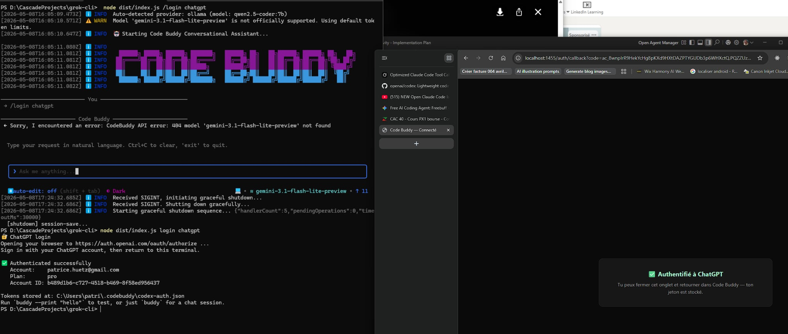
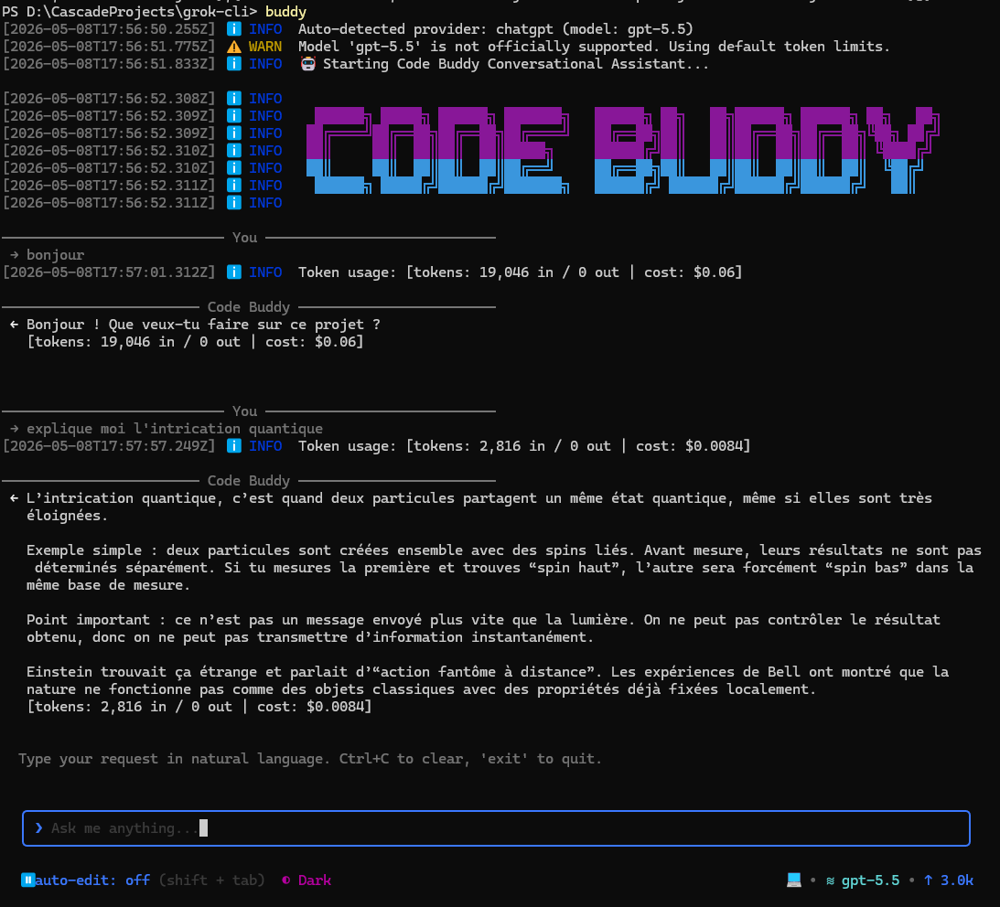
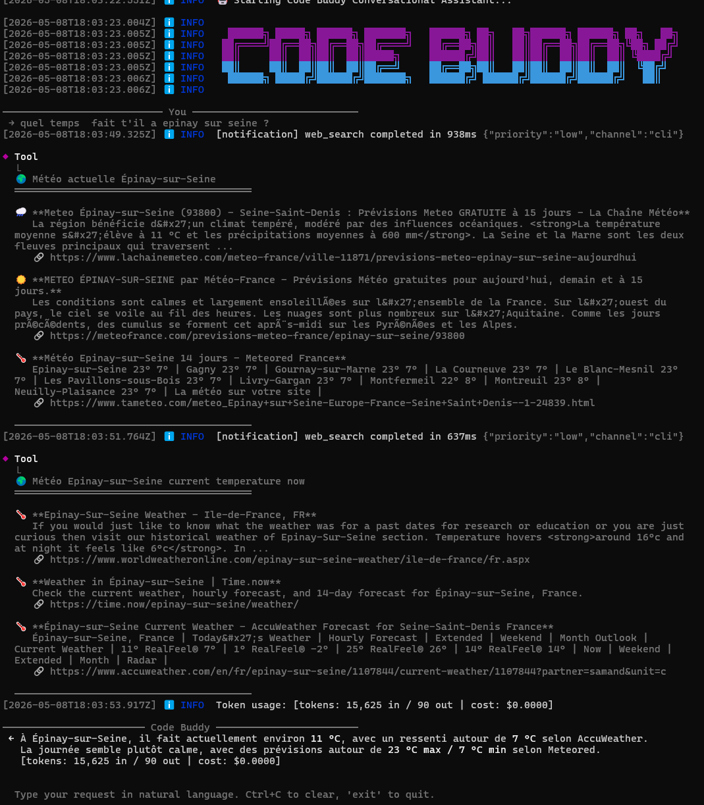
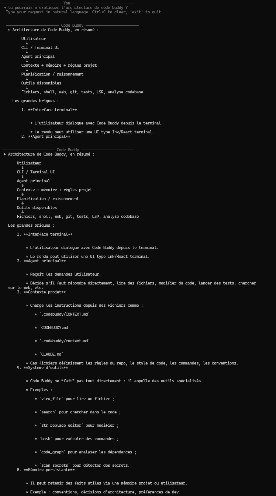
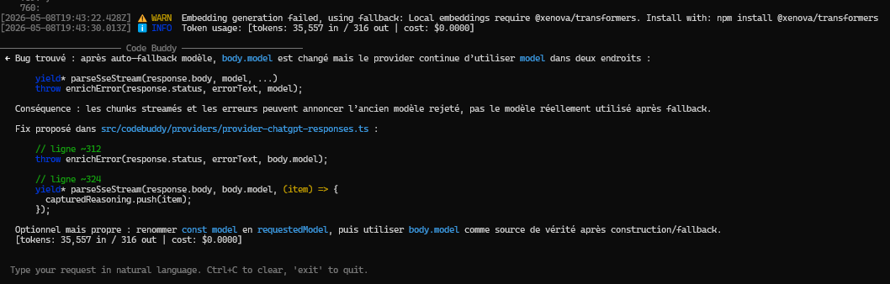
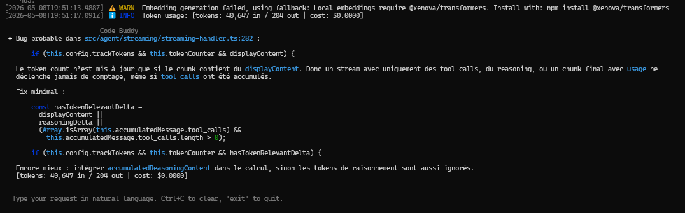

# ChatGPT Codex integration — visual showcase

These screenshots document the **end-to-end ChatGPT Codex OAuth integration**
(Phase d.23 → d.25, May 2026). All captures taken on a real ChatGPT Pro
account in conditions of use, no staging.

The integration lets Code Buddy log into ChatGPT directly (no OpenAI API
key needed), route requests via `chatgpt.com/backend-api/codex/responses`,
and use the user's flat-fee Plus/Pro plan (cost reported as `$0.0000`).

## 1. OAuth login flow

Run `buddy login` (or `buddy login chatgpt`). The browser opens
`auth.openai.com/oauth/authorize`, the user signs in with their ChatGPT
account, and the callback returns to `localhost:1455` with PKCE + state
verification. Tokens persist to `~/.codebuddy/codex-auth.json`.



## 2. Interactive TUI with `gpt-5.5`

`buddy` (no args) drops into the interactive Ink/React TUI. Footer shows
the active model. Auto-detect picks up the OAuth credentials and routes
to ChatGPT Codex backend.



## 3. Tool calling — `web_search` parallel

`gpt-5.5` invokes multiple tools in parallel via the Codex Responses API
(`parallel_tool_calls: true`). Here it fired two `web_search` calls for
weather data, ingested 6 sources, and synthesised the answer. Cost
remains `$0.0000` because the user's plan is flat-fee.



## 4. Markdown output quality

`gpt-5.5` reads project context (`CODEBUDDY.md`, `CLAUDE.md`,
`.codebuddy/CONTEXT.md`) and produces structured markdown explanations
with code references, ASCII diagrams, and proper heading hierarchy.



## 5. Self-audit — Code Buddy reads its own provider code (and finds bugs)

We asked `gpt-5.5` to find a bug in
`src/codebuddy/providers/provider-chatgpt-responses.ts` — the file that
implements its own integration. It identified that after the
auto-fallback branch mutates `body.model`, two downstream call sites
(`parseSseStream` label and `enrichError` reporting) keep using the
stale local `model` variable.



Second audit on `src/agent/streaming/streaming-handler.ts`: token count
was only computed when `displayContent` was non-empty, missing turns
that emit only `tool_calls` or only reasoning chunks.



Both bugs were confirmed real and fixed in commits `7485e4f` and
`3e576d0` on PR #36.

---

## How to reproduce

```bash
# Install Code Buddy globally
npm install -g @phuetz/code-buddy

# OAuth login (opens browser)
buddy login

# Verify
buddy whoami
# → ChatGPT: ✅ connected · your.email@example.com · Plan: pro

# Use it
buddy
# (or one-shot)
buddy --print "Hello"
```

Default model is `gpt-5.5`. Override with `--model gpt-5.1-codex` or
`buddy /switch <model>` in the TUI.
